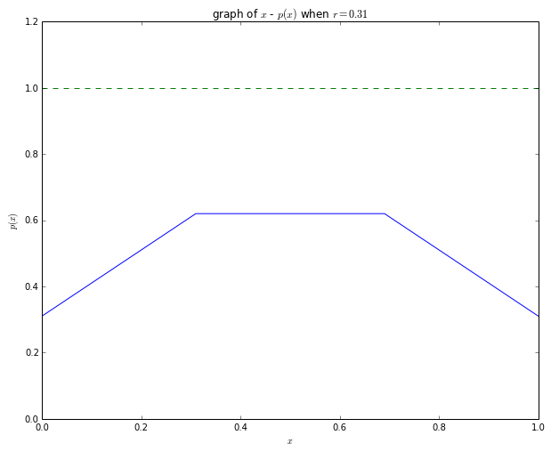
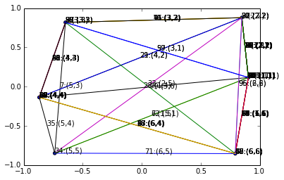
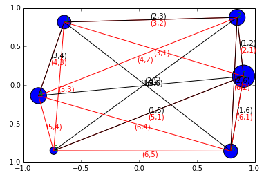
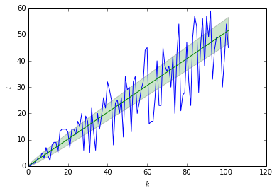
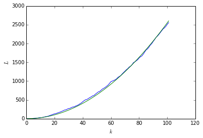
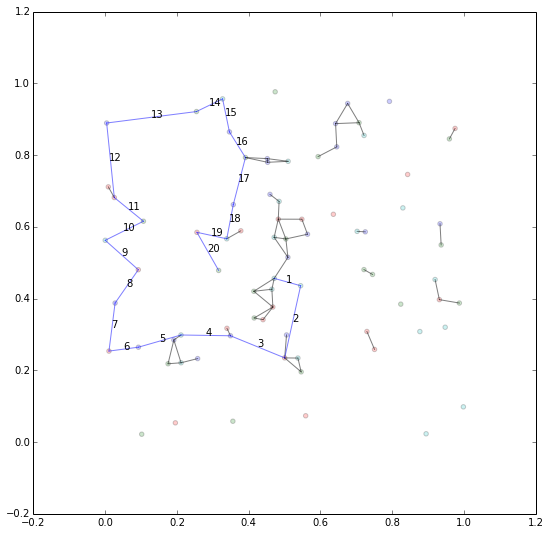

効率とシステムサイズの関係に関する確率モデルによる考察
======================================================

早稲田大学先進理工学部物理学科 山崎研究室 藤本將太郎
~~~~~~~~~~~~~~~~~~~~~~~~~~~~~~~~~~~~~~~~~~~~~~~~~~~~

1. 導入
-------

私達は普段の身近な生活の中で、サイズが変わるとその中の質や状態が変わってしまうと感じるものを見つけることが出来る。
それは会話とその人数の間の関係にもあるかもしれないし、共同作業を行うときのチームメンバーの人数かもしれない。企業の大きさとその中の人間の従事度も異なるかもしれない。会議にやたら多くの人が参加していても、ほとんどの人はその会議を無意味なものだと見なすことになるだろう。世の中のおよそほとんどのスポーツやゲームなどは、参加する人数が予め決められていることが多い。よく練られたものであれば、この決められた人数より多くても少なくても、本来の楽しみを得ることはできないだろう。麻雀は4人でするから楽しめるのであり、会議は100人ではなかなか進まないものである。

このような現象はこれまで見てきたように大変身近で、私達にとって実感をもって受け入れられることなので、ほとんどの場合不文律にこの法則は受け入れられていると言って良いだろう。

また、相乗効果という点に着目すれば、一人で何かするよりも、多くの人を交えて行ったほうが効率が上がるといったものも多く存在していることだろう。しかしながら、そこでも多すぎはまた別の問題を産むなどして、多すぎることも効率を下げる要因になることもあるのである。

こういったことを私達は無自覚の内に理解しているので、何かを大人数で共同して行うときには、それをさらにいくつかのグループ、班、部署、そういったより小さい単位に分割する必要を感じる。もちろん、このような現象はよく知られたことであるので、どれほどのシステムサイズであれば最大の効率が導き出せるか、ということは、昔から考えるべきことであったため、最適人数に関する研究や、学術的な研究にはならずとも各分野でその情報は蓄積されている。例えば教育の分野などではグループ学習や少人数授業の有効性が議論されることも多い。

さて、これまでに述べたような系のシステムサイズとその効率の間の関係は、何も人間を要素とした系でなくとも考えることが出来る。例えば、動物の体重と代謝率の間の関係も、同じ現象であるとみなすことができるかもしれない。動物学の分野で知られている法則として、体重とその他の量の間の関係としてアロメトリー則と呼ばれるものがある。その一つが体重と代謝率の間の関係であり、特にこの関係のことをKleiber則と呼ぶ。これは様々なスケールの対象について調べられていて、代謝率\ :math:`E`\ と体重\ :math:`M`\ の間の関係は\ :math:`E\sim M^{b}`\ のようにスケールされる。この指数については、データの取り方などによって異なるため、いくつか説があるか、大きく分けて\ :math:`2/3`\ とする意見と\ :math:`3/4`\ とする意見とがある。ここで重要なのは、指数の大きさがどちらか、ということではなく、その指数は1よりも小さい値をとる、ということである。これまで考えてきたシステムサイズと効率の関係について同じ議論であることが分かる。

この指数が生物種や成長過程における細胞組成の変化が本質的ではなく、その時点でのシステムのサイズが影響していることの一つの例として、「自己組織化現象ハンドブック」の中で本川達雄先生が書かれているように、ホヤの群体サイズと代謝率の間にも同様に1乗より小さい指数でスケールされることが確かめられている。このホヤは無性生殖によって自分と全く同じ固体を増やして個体を構成する。したがってDNAの上では全く同じ要素を集めたものとなり、他の動物のように様々な組織によって階層的に成り立っているわけでないので、よりいま考えている状況に沿った設定となっていると考えても良いだろう。また、群体同士のつながりはネットワーク上に張り巡らされた血管のつながりである。これまでのKleiber則の説明としては、体温の維持と表面積との関係から2/3を導くものや、血管構造が心臓から毛細血管に至るまでがフラクタル的であることに着目し、血液の流速と代謝率の間の関係を仮定して3/4を導くものがあった。しかしはじめの理論では変温動物や単細胞においてもこの関係が成り立つことの説明ができない。また、二つ目の理論についても、物理的な描像なため説得力はあるが、この場合、血管構造、特に血管の太さや長さに関して自己相似的と言えないので、この理論では説明することはできない。したがって、その記事の中では一つの仮説として以下のようなものが提唱されている。

    『べき乗のサイズ効果は個体同士の局所的な相互作用によって生じ、takeover中には個体間の連絡が切れるため、サイズ効果が見られなくなる。同じユニットが局所的な相互作用をもつ系は、自己組織化臨界状態にある可能性があり、臨界状態とは相互作用に効果がべき関数で記載されるものである。ホヤを含め、動物は自己組織化臨界状態にあるのではないか。』

ここまで述べて来たように、人間の作るシステムの中での最適人数の議論や、生物のアロメトリー則などは、統一した一つの理論として書ける可能性がある。このとき、それまでその要因とされてきたものは、その中で何かしらの量に対応させることによってどのモデルでも同じように書けるかもしれない。こうした理由によってより抽象的にこの問題を考えることには何かしらの意味があるはずだという思いを抱くようになった。

この論文では、以上の問題について、具体的なイメージとして会議を思い浮かべながら、その確率モデルを作成しその解析を行ったので、その結果をまとめることとする。

2. モデルの説明
---------------

まずはじめに、作成した確率モデルに関しての説明と、その際追加で説明が必要と思われた場合にはその背景についても述べていくことにする。

会議について考える点で、システムサイズとなるのは会議に参加する人の人数であるとする。したがって、これから考えていくべき関係はこの人数と会議の"質"、成果との間の関係である。しかしながら、実際にはこの"質"がどういった量として測れるかは現段階で不明であるため、モデルを立てた際に得られる一般的な物理量から質にあたるものを予測していく、というアプローチを取ることにする。

一口に会議と言っても様々な種類の会議が存在している。会社やグループの中で行われる会議の中には、すべての部署が一同に会し、その中でそれぞれの進捗状況などの情報を共有するための報告会議や、企画のためのアイデア出しなど、何か与えられた議題に沿ってそれぞれが自由に発言するタイプの会議もある。また、既に決まっている内容に関して、それに関連のありそうな人を集めて一度に口頭で説明するタイプの報告会も、一般には会議と呼ばれている。また、会議の進行の仕方にも方法はいくつかあり、会話と同じようにそれぞれの人が思い思いに発言する場合や、ファシリテーターと呼ばれる進行係が質問によってそれぞれの人の意見を引き出したり、意見をまとめたりして、会議の流れをコントロールする場合もある。このモデルで扱うのは、アイデア出しのようにそれぞれの意見がつながることによって、よりよい案を得ることができる、というものであり、ファシリテーターのように全体の流れを左右できる独立した存在はいないものとする。

以上のような設定を考えた上で、これを確率論として扱うために、いくつかの要素を定義することにする。まず、「意見」とはまだ発言されていない、それぞれの人がもつ考えのようなものをあらわすこととする。すべての意見が\ :math:`a`\ 個の異なる要素に分解でき、それぞれの要素として1つの実数値をもっていると考えることにすると、ある一つの意見\ :math:`x`\ というのは、\ :math:`\Omega \subset \mathbb{R}^{a}`\ 上の一つの元

.. math:: x = \{x_{1}, x_{2}, \cdots x_{a}\}

とすることが出来る。

また、この意見間の距離を定義すればこれらの点を元とする距離空間を定義することができる。距離の入れ方としてはユークリッド距離

.. math:: d(x, y) = \sqrt{(x_{1} - y_{1})^{2} + \cdots + (x_{a} - y_{a})^{2}}

を考えることとする。

次に、「参加者」について考える。参加者は会議の中で自分の中にある意見を発言していくのであるから、参加者それ自体は意見の集まりである。すなわち意見空間\ :math:`\Omega`\ 上の部分空間\ :math:`X_{i}`\ が参加者\ :math:`i`\ を表す。\ :math:`x_{ik}`\ が人\ :math:`i`\ のラベル\ :math:`k`\ の意見であるとすると、全部で\ :math:`s_{i}`\ 個の意見を持っているとき、

.. math:: X_{i} = \{x_{i0}, x_{i1}, \cdots , x_{is_{i}}\}.

一般に

.. math:: X_{i}\cap X_{j} = \emptyset\ (i \neq j)

である必然性はないが、このモデルでは上式を採用することとする。したがってモデルの中で扱う意見空間\ :math:`\Omega_{0}`\ は、参加者が\ :math:`N`\ 人集まったとき、\ :math:`X_{i}`\ の直和集合

.. math::

   \begin{align}\Omega_{0} &= \bigcup_{i = 1}^{N} X_{i}\\
   &= \sum_{i=1}^{N} X_{i} \end{align}

となる。

会議の進行に関して、いくつかの仮定をおいて考えていくことにする。これらの仮定が本質的であるような場合を考える場合にはまた別のモデル化を考える必要があるかもしれないが、ひとまず以下の仮定を考えて、その上でモデルを作成することにしよう。

仮定:

-  一度に発言できる人は一人まで
-  一人当たりの発言時間は参加人数に依らない
-  結論が出るまでにかかる時間が長いほど評価が下がる

意見の選び方としては、

1. 参加者を選び、その中から意見を選ぶ方法
2. 意見空間から意見を選び、その意見からどの参加者が発言したかを選ぶ方法

の二つがある。

それぞれの場合について、意見と発言者を選ぶ確率が互いに独立な場合と、そうでない場合にさらに分けて考えることが出来る。

したがって、考えるべきは

-  参加者の選び方
-  意見の選び方
-  参加者が選ばれたときの意見の選び方
-  意見が選ばれたときの参加者の選び方

の4つである。

これらの組み合わせによるいくつかのパターンに分けて考えることにする。

1. 参加者から一人選ばれ、その中から意見(\ :math:`x\in [0, 1]`)が一様に選ばれる

   1. 参加者を選ぶ確率: 等しい
   2. 参加者を選ぶ確率: 参加者間の距離に依存

2. 過去の意見を参照して次の意見が選ばれる

   1. 影響なし
   2. 一つの意見を参照

      1. 議題(given)
      2. 一つ前

   3. 二つの意見を参照

      1. 議題+一つ前
      2. 二つ前まで

3. 近距離の排除効果を考慮した場合

3. 各モデルの結果と考察
-----------------------

この章では、2で考えたパターンのそれぞれについて、そのモデルの詳細の説明とその解析を行っていくことにする。

1. 参加者から一人選ばれ、その中から意見(\ :math:`x\in [0, 1]`)が一様に選ばれる

   1. 参加者を選ぶ確率: 等しい
   2. 参加者を選ぶ確率: 参加者間の距離に依存

2. 過去の意見を参照して次の意見が選ばれる

   1. 影響なし
   2. 一つの意見を参照

      1. 議題(given)
      2. 一つ前

   3. 二つの意見を参照

      1. 議題+一つ前
      2. 二つ前まで

3. 近距離の排除効果を考慮した場合

1-A. 参加者を等確率で選び、その中から意見が一様に選ばれる場合
~~~~~~~~~~~~~~~~~~~~~~~~~~~~~~~~~~~~~~~~~~~~~~~~~~~~~~~~~~~~~

この場合、発言者の数が変わってもその意見を選ぶ確率は等しいことから、発言者の数に関して情報を含まず、本来の趣旨には合わないモデルとなっていることが分かる。しかしながら、選ばれた意見と会議の質の間の関係を考察するにはよい練習となる。

人\ :math:`i`\ が\ :math:`k`\ 番目に発言したあと人\ :math:`j`\ が\ :math:`k+1`\ 番目に発言する確率が、発言者の人数を\ :math:`N`\ 人として

.. math:: p_{i}(k,j) = p(N) = \frac{1}{N}

のように、直前の履歴に依存せず誰が発言する確率も等しい場合を考える。

意見の要素数は有限でなく、\ :math:`[0,1]`\ の間の値を一様な確率で取るとする。このとき、そうして得られた確率変数\ :math:`x`\ に関して、
確率密度関数\ :math:`f(x)`\ は

.. math:: f(x) = 1\ \ \ (0\le x \le 1)\ \ \ \text{otherwise}\ \ 0

であり、累積分布関数\ :math:`F(x)`\ は

.. math:: F(x) = x\ \ \ (0\le x \le 1)

である。

時間発展によって意見が選ばれていくごとに、その意見と距離\ :math:`r`\ より近い位置にある意見との間にすべてエッジを張っていくことにする。このモデルのアイデアは、発言数が増えていくごとに一回の発言で張られるエッジの数が増えていくため、その発言が全体の意見を集約したものと見なせるようになる、ということに基づいている。すなわち、ある時刻\ :math:`k`\ に発言された意見が、ある閾値を超えるエッジをもつようになるときに会議が終了するとすれば、会議の終了に必要な時間と\ :math:`r`\ の間の関係を考えればよい。はじめのモデルの仮定でも述べたように、会議の時間と会議の質の間には逆の関係が成り立っているので、この関係を見れば、一様に選ばれる意見と会議の質の間の関係を見ることができる。

すなわち、発言が一様な確率で\ :math:`[0,1]`\ の間の値を取っていくとすると、この問題はある閾値\ :math:`r(0<r\le1)`\ を定めた時に、領域\ :math:`[x^{k}-r, x^{k}+r]`\ の中に入るそれまでに出た点の数と、その個数がある値を超えるときまでに必要なステップ数はいくつか、という問題に帰着される。

図にすると以下のような場面を考えていることになる。

一様な確率で\ :math:`[0,1]`\ の間の数が選ばれるとき、その確率変数が\ :math:`[\max(0,x-r), \min(x+r,1)]`\ の範囲に入っている確率は、確率密度関数を用いて、

.. raw:: latex

   \begin{align}
   p(\max(0, x-r), \min(x+r, 1)) &= \int ^{\min(x+r,1)}_{\max(0, x-r)} 1 dx \\
   &= \left[ x\right]^{\min(x+r,1)}_{\max(0, x-r)}\\
   \end{align}

よって

.. math::

   p(x,r)= \left\{ \begin{array}{ll}x+r & 0\le x< \min(r,1-r) \\
   p(r) = \min(2r, 1) & \min(r, 1-r)\le x \le \max(1-r, r) \\
   1 - x+r & \max(1-r, r) < x \le 1
   \end{array}\right.

を得る。

これはグラフにすると、

.. code:: python

    %matplotlib inline
    import matplotlib.pyplot as plt
    from IPython.html.widgets import interactive
    from IPython.display import display
    import numpy as np
    
    def plot_p(r=0.1):
        plt.figure(figsize=(10,8))
        x = np.array([0, min(r, 1-r), max(1-r,r), 1])
        y = np.array([r, min(2*r, 1), min(2*r, 1), r])
        plt.plot(x,y)
        _x = [-0.1,1.1]
        _y = [1,1]
        plt.plot(_x, _y, '--d')
        plt.xlabel(r'$x$')
        plt.ylabel(r'$p(x)$')
        plt.title(r'graph of $x$ - $p(x)$ when $r=%1.2f$' % r)
        plt.xlim(0,1)
        plt.ylim(0, 1.2)
        plt.show()
    
    w = interactive(plot_p, r=(0.01, 1., 0.01))
    display(w)

:math:`k+1`\ 番目の発言\ :math:`x_{k+1}`\ がなされた時、\ :math:`k`\ 番目までの発言のうち\ :math:`y`\ 個の発言が領域\ :math:`[\max(0,x-r), \min(x+r,1)]`\ の中に存在する確率は、

.. math:: _{k}C_{y}p(r)^{y}p(r)^{k-y}

で表せる。ここで注意すべき点は、\ :math:`p(x_{k}, r)`\ は\ :math:`x_{k}`\ によって変わるものであったから、\ :math:`x`\ に対して期待値を取ったものを考えなければならないことである。\ :math:`p(r)`\ はそのようにして得られた期待値であることを意味している。

すなわち\ :math:`p(r)`\ は、

:math:`0<r\le0.5`\ のとき

.. math::

   \begin{align}p(r) = E(p(x, r)) &= \int^{r}_{0}x+r\mathrm{d}x + \int^{1-r}_{r}2r \mathrm{d}x + \int^{1}_{1-r} 1-x+r \mathrm{d}x\\
   &= \left[\frac{x^{2}}{2} + rx \right]^{r}_{0} + \left[ 2rx\right]^{1-r}_{r}+ \left[ x-\frac{x^{2}}{2} + rx\right]^{1}_{1-r}\\
   &= -r^{2} + 2r \end{align}

:math:`0.5<r\le1`\ のときも同様にして

.. math:: p(r) = E(p(x,r)) = -r^{2} + 2r

である。

また、式()は

.. math:: P[X=y] =\ _{k}C_{y}p(r)^{y}(1-p(r))^{k-y}

のように書けば明らかなように、確率変数\ :math:`X`\ に対するパラメータ\ :math:`k,p`\ の二項分布\ :math:`B(k,p)`\ を表している。

この時、確率変数\ :math:`X`\ に対する期待値と分散は、

.. math:: E(X) = kp(r)

.. math:: V(X) = kp(r)(1-p(r))

である。

時刻\ :math:`k`\ が大きい時、具体的には

.. math:: kp(r) > 5,

.. math:: kp(r)(1-p(r)) > 5

をみたす\ :math:`k`\ のとき、二項分布は正規分布に近似できるので、期待値は中央値とほぼ等しくなる。すなわち、\ :math:`y=kp(r)`\ より多くの点を見出す確率\ :math:`P[X\le y]`\ は、どんな時刻\ :math:`k`\ においても\ :math:`1/2`\ となる。

すなわち、時刻の依存性はないため、\ :math:`x_{k+1}`\ のまわりの領域に\ :math:`y`\ 個以上の他の点が存在する場合を1、存在しない場合を0とすれば、これらの起こる確率は、それぞれ\ :math:`1/2`\ であり、\ :math:`k`\ 回目に\ :math:`y`\ 個以上のエッジが張られて試行が終了する確率は、\ :math:`p=1/2`\ の\ `幾何分布 <http://ja.wikipedia.org/wiki/%E5%B9%BE%E4%BD%95%E5%88%86%E5%B8%83>`__\ に従う:

.. math:: P[X=k] = \left( \frac{1}{2} \right)^{k}

このときの期待値と分散は

.. math:: E(X) = \frac{1}{p} = 2

.. math:: V(X) = \frac{1-p}{p^{2}} = 2

すなわち、これまでのような場合を考えたとすると、平均として2回で試行が終了し、ほとんどの試行は1~3回で終了することになる。しかし、これは先程述べたような二項分布の正規分布への近似ができない領域であることに注意が必要である。したがって、実際には\ :math:`y`\ の選び方をうまく選ぶことによって(たとえば試行が終了する回数の期待値が、二項分布を正規分布に近似できるような\ :math:`k`\ となるように\ :math:`p`\ を決めるような\ :math:`y`)、実際に\ :math:`k`\ の期待値はこの確率分布のものと等しくなるだろう。

1-B. 参加者を距離で決まる確率で選び、その中から意見が一様に選ばれる場合
~~~~~~~~~~~~~~~~~~~~~~~~~~~~~~~~~~~~~~~~~~~~~~~~~~~~~~~~~~~~~~~~~~~~~~~

次に考えるのは、自然な例として、発言者間の距離が定義されているようなものを考える。ここで言う"距離"とは、実際の発言者間の物理的な距離だけでなく、それぞれの間の関係性や声の大きさなどの概念を内包したものと考えることもできるだろう。実際には、そのように距離の計算に用いるパラメータが\ :math:`b`\ 個あるとして、そのパラメータを要素とする元とそれからなる空間に対して距離を考える。

簡単な例として\ :math:`b`\ 次元ユークリッド距離を取ることを考える。すなわち\ :math:`b`\ 個のパラメータを要素とする元からなる空間\ :math:`X`\ があった時、

距離関数\ :math:`d: X \times X \rightarrow \mathbb{R}`\ が

.. math:: d(x, y) = \sqrt{\sum_{i=1}^{b}(x_{i}-y_{i})^{2}}\ \ ,\ x,y\in X

と書けることを意味する。実際の場合には、各データ同士の相関を考慮に入れたマハラノビス距離などのほうが適当な場合もあるかもしれないが、まずはイメージしやすいということでユークリッド距離を考えた。

以下では、記述の簡単にするため、人\ :math:`i`\ と人\ :math:`j`\ の間の距離を\ :math:`d_{ij}`\ と書くことにする。

時刻\ :math:`k`\ に\ :math:`i`\ が発言を行い、その後時刻\ :math:`k+1`\ に\ :math:`j`\ が発言\ :math:`x_{k+1}^{j}`\ を行う確率\ :math:`p_{k}(i,j)`\ は、距離\ :math:`d_{ij}`\ の関数として、次のようにできる。

.. math:: p_{k}(i,j) = \frac{g_{k}(d_{ij})}{\sum_{j} g_{k}(d_{ij})}

この\ :math:`g`\ の選び方によって、距離の大きさがどのように確率に重みを持たせるかということが決定される。一般に\ :math:`g`\ は時刻\ :math:`k`\ によって変化してもいいので、添字\ :math:`k`\ をつけて時刻\ :math:`k`\ における関数であることを表した。

単純な例として\ :math:`g_{k}(d) = const.,\ ^{\forall}k, d\in \mathbb{R}^{1}`\ とすると、距離に依らず発言者が選ばれるわけなので、1-Aの発言者の選び方と同じである。

:math:`g(d)`\ は\ :math:`[0, +\infty]`\ で定義される非負の実関数であればよい。

ex)

.. math:: g(d) = \frac{1}{d+1}

.. math:: g(d) = e^{-d}

.. math::

   g(d) = \left\{ \begin{array}{ll} c & (0\le d \le 1/c) \\
   1/d & (d>1/c) \\
   \end{array}\right., \ \ c>0

しかし、ここで注意すべき点として、どの発言者が発言するにしても、1-Aで考えたように、どの発言者も\ :math:`[0,1]`\ の一様乱数を取るなら、結局、意見について見たときの試行は同様のことをしており、誰が発言したかは本質的な問題にはならないことが分かる。

これまでの設定を用いて数値シミュレーションを行った結果を以下に示す。シミュレーションでは、確率を決める距離の関数\ :math:`g(d)`\ として

.. math:: g(d) = e^{-d}

を採用し、意見の次元\ :math:`a=2`\ 、参加者の数\ :math:`N=6`\ と設定する。

プログラムを実行すると、GUIのウィンドウが表示され、その中の青い丸が人の位置を表している。位置をドラッグして変更した後にプログラムを開始すると、はじめに人1が発言をした場合の、会議の進行がシミュレートされる。それぞれの人が発言する確率は先の関数\ :math:`g`\ にしたがい、その確率で選ばれた人が、一様な確率で\ :math:`[0,1]`\ の中から意見を出す。以後この繰り返しで会議が進行し、意見の数が100を超えるたときシミュレーションを終了する。シミュレーションの結果得られるのは、時刻\ :math:`k`\ において、「誰が発言したか」、「誰から誰にエッジが張られたか」、「いくつのエッジが張られたか」、の値を記録したものと、終了時までの人ごとの発現頻度、エッジの数の累積などである。

以下に作成したプログラムを示す。

.. code:: python

    %matplotlib inline
    
    from Tkinter import *
    import matplotlib.pyplot as plt
    import numpy as np
    import collections
    import operator
    
    def accumulate(iterable, func=operator.add):
        'Return running totals'
        # accumulate([1,2,3,4,5]) --> 1 3 6 10 15
        # accumulate([1,2,3,4,5], operator.mul) --> 1 2 6 24 120
        it = iter(iterable)
        total = next(it)
        yield total
        for element in it:
            total = func(total, element)
            yield total
    
    
    class Person(object):
    
        def __init__(self, ideas_num=10, place=(0., 0.), **kwargs):
            # 意見は0~1の間の値を一様に取りうる
            self.ideas = list(np.random.random(ideas_num))
            # 発言者の実際の位置が2次元の座標として表せる
            self.place = place
            # その他の特徴量
            for (k, v) in kwargs.items():
                setattr(self, k, v)
    
        def distance(self, p):
            # 人pと自分との間の距離(ユークリッド距離)
            d = np.sqrt((self.place[0]-p.place[0])**2 + (self.place[1]-p.place[1])**2)
            return d
    
    
    class meeting(object):
    
        def __init__(self, N):
            # 会議の参加人数
            self.N = N
            # 意見の時系列
            self.ideas = []
            # 発言者の時系列
            self.speaker = []
            # 時刻
            self.k = 0
            self.K = 100
            # 張られたリンク(時刻, 時刻)のタプルで表現する
            self.links = []
            # リンクの数(各時刻)
            self.l = [0]
            # リンクの数(累計)
            self.L = [0]
    
        def g(self, x):
            # 発言者の物理的距離に対する関数
            return np.exp(-x)
    
        def p(self, i):
    
            # 参加者の中で話せる人のみを対象に
            _N = []
            for k in range(1, self.N+1):
                if len(self.members[k].ideas):
                    _N.append(k)
    
            # それらの人たちに対し、関数gによる重み付けの確率を付与
            w = []
            for n in _N:
                d = self.members[n].distance(i)
                w.append(self.g(d))
            w = np.array(w)
            sum_ = np.sum(w)
            _p = list(w/sum_)
            p = list(accumulate(_p))
            rn = np.random.rand()
            nm = 0
            while True:
                if p[nm] > rn:
                    break
                else:
                    nm += 1
            # その確率で選ばれた人の名前を返す
            j = _N[nm]
            return j
    
        def q(self, j):
            # 発言者jが選ばれた時、持っている意見から等確率で意見を取り出す
            x_j = self.members[j]
            return np.random.rand()  #x_j.ideas.pop()
    
        def distance(self, x, y):
            # 意見の近さを絶対値で表現
            d = np.abs(x - y)
            if d == 0:
                return self.radius + 1
            else:
                return d
    
        def connect(self):
            l = 0
            for i, v in enumerate(self.ideas[:-1]):
                # k番目の意見と意見が近い時、それらノードの間にリンクを形成する
                if self.distance(v, self.ideas[self.k]) < self.radius:
                    self.links.append((i, self.k))
                    l += 1
            return l
    
        def check_agreement(self):
            # 合意チェック 参加人数Nによる関数
            def L(N):
                return N**2
            #if self.l[-1] > L(self.N):
            if self.k > self.K:
                return True
            else:
                return False
    
        def check_ideas(self):
            for k in range(1, self.N+1):
                if len(self.members[k].ideas):
                    return True
            return False
    
        def f_L(self):
            # リンクから会議の評価
            # 単純に会議終了時に得られたリンクの数を返す
            return self.L[-1]
    
        def f_T(self):
            # 会議に必要な時間の評価
            # 単純に必要な時間kを返す
            return self.k
    
        def f(self):
            # f_Lとf_Tを使った評価関数f
            return self.f_L() - self.f_T()
    
        def end(self):
            # 会議の通常終了、各定義量の計算や受け渡しなどはここで
            plt.ioff()
            plt.show()
    
            # ネットワーク図を描画
            link_s = [(a, b) for a, b in zip(self.speaker[:-1], self.speaker[1:])]
            counter_links = collections.Counter(link_s)
            for link, lw in counter_links.items():
                ix = self.members[link[0]].place[0]
                iy = self.members[link[0]].place[1]
                jx = self.members[link[1]].place[0]
                jy = self.members[link[1]].place[1]
                _x, _y = ((ix+jx)/2, (iy+jy)/2)
                if link[0] == link[1]:
                    continue
                elif link[0] < link[1]:
                    color = 'black'
                    va = 'bottom'
                else:
                    color = 'red'
                    va = 'top'
    
                plt.plot([ix, jx], [iy, jy], color=color, lw=lw*4/self.k+1)
                plt.text(_x, _y, '(%d,%d)' % (link[0], link[1]),
                         color=color, va=va)
    
            counter = collections.Counter(self.speaker)
    
            for key, i in self.members.items():
                x = i.place[0]
                y = i.place[1]
                size = counter[key] * 30
                plt.scatter(x, y, s=size)
                plt.text(x, y, str(key), color='green')
            plt.show()
    
            # 各時刻に追加されたリンク数のグラフ
            r = self.radius
            k = np.arange(self.k + 1)
            y = (-r**2 + 2*r)*k
            delta = np.sqrt((-r**4 + 4*r**3 - 5*r**2 + 2*r)*k)
            y1 = y + delta
            y2 = y - delta
            plt.fill_between(k, y1, y2, facecolor='green', alpha=0.2)
            plt.plot(k, self.l)
            plt.plot(k, y)
            plt.xlabel(r"$k$")
            plt.ylabel(r"$l$")
            plt.show()
    
            # リンク数の累積グラフ
            plt.plot(k, self.L)
            plt.plot(k, (-self.radius**2 + 2*self.radius)*k**2/2.)
            plt.xlabel(r"$k$")
            plt.ylabel(r"$L$")
            plt.show()
    
            # 時系列で発言者の表示
            # print 'self.speaker:', self.speaker
            
            # 評価関数を通した結果
            # print 'self.f', self.f()
    
        def end2(self):
            # 会議の異常終了(発言者が発言できなくなる)
            pass
    
        def init(self):
            x = [i.place[0] for i in self.members.values()]
            y = [i.place[1] for i in self.members.values()]
            plt.scatter(x, y)
            plt.ion()
            plt.draw()
    
        def callback(self):
            # print 'speaker:', self.speaker[-1]
            # print 'link:', self.l[-1]
            ix = self.members[self.speaker[-2]].place[0]
            iy = self.members[self.speaker[-2]].place[1]
            jx = self.members[self.speaker[-1]].place[0]
            jy = self.members[self.speaker[-1]].place[1]
            plt.plot([ix, jx], [iy, jy])
            plt.text((ix+jx)/2, (iy+jy)/2, '%d:(%d,%d)'
                     % (self.k, self.speaker[-2], self.speaker[-1]))
            plt.draw()
    
        def progress(self):
            self.init()
            # はじめに1が発言するとする
            self.ideas.append(self.q(1))
            self.speaker.append(1)
            while True:
                j = self.p(self.members[self.speaker[-1]])
                self.ideas.append(self.q(j))
                self.speaker.append(j)
                self.k += 1
                self.l.append(self.connect())
                self.L.append(len(self.links))
                self.callback()
                if self.check_agreement():
                    print "\nnormal end"
                    self.end()
                    break
                if not self.check_ideas():
                    print "\nno one can speak"
                    self.end2()
                    break
    
                    
    class Main:
    
        def __init__(self, radius=0.3):
            N = 6
            self.app = meeting(N)
            self.app.radius = radius
            window = Window(N, main=self.app)
            window.display()
    
    class Window(object):
    
        def __init__(self, N, main):
            self.root = Tk()
            self.main = main
            self.width = 640
            self.height = 480
            self.canvas = Canvas(self.root, width=self.width, height=self.height)
            self.var = StringVar()
            self.oval(self.canvas, N)
            self.canvas.bind('<Motion>', self.pointer)
            self.canvas.pack()
            label = Label(self.root, textvariable=self.var, font='Ubuntu 9')
            label.pack(side='left')
            b1 = Button(self.root, text='start', command=self.b1_clicked)
            b1.pack(side='right')
            b2 = Button(self.root, text='save', command=self.b2_clicked)
            b2.pack(side='right')
    
        def oval(self, canvas, N=6):
            self.members = dict()
            deg = np.linspace(0., 360., N, endpoint=False)
            radius = 20
            self.r = int((min(self.height, self.width)/2-radius)*0.9)
            self.centerx = int(self.width/2)
            self.centery = int(self.height/2)
            for n in range(1, N+1):
                rad = np.radians(deg[n-1])
                self.members[n] = Oval(canvas, n,
                                       self.centerx+self.r*np.cos(rad),
                                       self.centery+self.r*np.sin(rad),
                                       radius, self.var)
    
        def pointer(self, event):
            self.var.set("(%d,%d)" % (event.x, event.y))
    
        def b1_clicked(self):
            self.main.members = dict()
            for n in range(1, self.main.N+1):
                x = (self.members[n].x-self.centerx)/float(self.r)
                y = (self.members[n].y-self.centery)/float(self.r)
                self.main.members[n] = Person(place=(x, y))
            self.main.progress()
            self.root.destroy()
            
        def b2_clicked(self):
            import tkFileDialog
            import os
    
            fTyp = [('eps file', '*.eps'), ('all files', '*')]
            filename = tkFileDialog.asksaveasfilename(filetypes=fTyp,
                                                      initialdir=os.getcwd(),
                                                      initialfile='figure_1.eps')
    
            if filename is None:
                return
            try:
                self.canvas.postscript(file=filename)
            except TclError:
                print """
                TclError: Cannot save the figure.
                Canvas Window must be alive for save."""
                return 1
            
        def display(self):
            self.root.mainloop()
    
    
    class Oval:
    
        def __init__(self, canvas, id, x, y, r, var):
            self.c = canvas
            self.x = x
            self.y = y
            self.var = var
            self.tag = str(id)
            self.c.create_oval(x-r, y-r, x+r, y+r, outline='', fill='#069', tags=self.tag)
    
            self.c.tag_bind(self.tag, '<Button-1>', self.pressed)
            self.c.tag_bind(self.tag, '<Button1-Motion>', self.dragging)
    
        def pressed(self, event):
            self.x = event.x
            self.y = event.y
    
        def dragging(self, event):
            self.c.move(self.tag, event.x - self.x, event.y - self.y)
            self.x = event.x
            self.y = event.y
.. code:: python

    main = Main(radius=0.3)

.. parsed-literal::

    
    normal end

.. raw:: html

   

図1. 発言者の発現頻度とエッジのグラフ

.. raw:: html

   

.. raw:: html

   

図2. 時刻\ :math:`k`\ に選ばれた点から張られたエッジの数

.. raw:: html

   

.. raw:: html

   

図3．時刻\ :math:`k`\ までのエッジの数の総和

.. raw:: html

   

これらのグラフからも確かめられることだが、1-Aで考えたとおり、意見の近さに関する閾値\ :math:`r`\ を定めて、その範囲に既になされた発言が存在するときにエッジを張るようにすると、時刻\ :math:`k`\ にある点が選ばれたときに張られるエッジの数は、二項分布\ :math:`B(k, p)`\ にしたがっていたので、その期待値は試行回数\ :math:`k`\ に比例する(\ :math:`E(X) = kp(r)`)。

このときの傾きは、\ :math:`p(x, r)`\ の\ :math:`x`\ に関する期待値\ :math:`p(r)=-r^{2}+2r`\ であるから、\ :math:`r`\ に関してプロットすると以下のようになる。

.. raw:: html

   

図4．図2の緑の直線の傾きと\ :math:`r`\ の間の関係

.. raw:: html

   

上図の場合、\ :math:`r`\ に対応する値として\ ``self.radius=1/.3``\ としているので、傾きの平均値は\ :math:`-1/3(1/3-2) = 5/9`\ である(緑の線)。また、累積のリンク数についても、同じように曲線でフィットすることができている。

2. 過去の意見を参照にして次の意見を決める場合
~~~~~~~~~~~~~~~~~~~~~~~~~~~~~~~~~~~~~~~~~~~~~

1の場合には、人を選ぶ確率とそのうえで意見が選ばれる確率は独立であるというものであった。しかし、これまで考えたように、単にそのようなモデルを考えただけだと人数の効果をうまく反映できないように思える。したがって、次に考えるモデルは、人がそれぞれ意見をもっており、前の発言に関して意見が近い、または反対意見を持っている時にはその意見をもつ人が発言する確率が高い、というようなものを考える。

アルゴリズムとしては、はじめに参加者たち\ :math:`P=\{i\ |\ i = 0, 1, 2,\cdots , n-1\}`\ はそれぞれに独自の\ :math:`s_{i}`\ 個の意見を持っているとする。このときの意見\ :math:`X`\ は状態空間\ :math:`S`\ 上のある一点を指しており、ベクトルで記述されるようなものである。意見すべての集合は互いに重なりあうことはなく(全く同じ点に異なる人の意見が存在することはない。)、それぞれが異なる分布を持っていてもよい。はじめに議題、すなわち時刻\ :math:`0`\ における意見が作られ、次に時刻1では、それぞれの参加者の意見のうちから、一番その意見によって発言されやすいものをそれぞれ一つずつ選ぶ。これを大きい順に並べ替えて、一番発言しやすい人から順に発言の機会が与えられる。それぞれの人には発言力\ :math:`P_{i}`\ が割り当てられており、その値によって確率的に発言するかどうかが決まる。すなわち、意見の近さが試行の順番を決め、自分の番が回ってきたときに発言するかどうかの確率は一定であるという場面を考えている。

別の方法としては、この発言力と意見のしやすさを合わせた指標で発言するかどうかを決めるという方法があるが、まずは簡単のために、はじめにそれぞれが自分の中で一番近い意見を持ち寄り、その順番に発言の権利が与えられていくような場面を考えることにする。また、最終的に誰も発言できない場合もあるので、そのときには沈黙があったとして時間は1進めて同じ意見について先ほどまでと同じ試行を繰り返すこととする。

2-A. 過去の意見の影響を受けない場合
~~~~~~~~~~~~~~~~~~~~~~~~~~~~~~~~~~~

全部で\ :math:`n`\ 人のなかで人\ :math:`i`\ が\ :math:`r+1`\ (:math:`r = 1, 2, \cdots , n-1`)番目に発言する権利を得たとき、自分まで発言権が回ってくる確率は、

.. math:: p_{r+1}(i) = \frac{\sum_{J = <j_{0}, \cdots ,j_{r-1}>_{r}}\prod_{j\in J}(1-P_{j})}{_{n-1}C_{r}}

ここで\ :math:`J = <j_{0}, j_{1}, \cdots ,j_{r-1}>_{r}`\ は、\ :math:`i`\ を除く\ :math:`n-1`\ 個の要素から\ :math:`r`\ 個取り出す組み合わせのうちの1揃いをあらわすことにす
る。

また、1番目に発言する権利を得たときは、発言権が回ってくる確率は当然

.. math:: p_{0}(i) = 1

である。

具体例として以下のようなものを考える。

:math:`N=\{0,1,2,3,4\}, n = 5, i = 1, r = 2`\ とすると、人1までに2人いるはずであり、その2人についての組み合わせは\ :math:`(0,2), (0,3), (0,4), (2,3), (2,4), (3,4)`\ の6つの組み合わせがある。上の式では\ :math:`J`\ の一つは\ :math:`(0, 2)`\ であり、このとき\ :math:`j_{0} = 0, j_{1} = 2`\ である。この\ :math:`J`\ に関して和をとり、組み合わせの数\ :math:`\ _{4}C_{2} = 6`\ で割って期待値を求めている。

.. math::

   \begin{align}
   p_{r+1}(1) &= \left[(1-P_{0})(1-P_{2}) + (1-P_{0})(1-P_{3}) + (1-P_{0})(1-P_{4}) \right.\\
   &\ \left. + (1-P_{2})(1-P_{3}) + (1-P_{2})(1-P_{4}) + (1-P_{3})(1-P_{4}) \right]/6
   \end{align}

人\ :math:`i`\ が発言権の順番で\ :math:`r`\ 番目になる確率は等しいので、\ :math:`r`\ に関する平均をとり、\ :math:`P_{i}`\ をかければ、これは人\ :math:`i`\ が発言する確率の期待値となる。

.. math:: p(i) = \frac{\sum_{r=0}^{n}p_{r}(i)P_{i}}{n}.

このとき得られた確率は人\ :math:`i`\ によって異なり、期待値としては毎時刻ごとにそれぞれの人がその確率で発言することになり、単純な確率過程に帰着できる。

2-B. 1つ前の意見を参照する場合
~~~~~~~~~~~~~~~~~~~~~~~~~~~~~~

それぞれの人が同じ確率\ :math:`p`\ で自分の番が来たときに発言するとしたとき、議題、すなわちはじめに与えられた意見のみを参照する場合と、一つ前の意見のみを参照する場合の二つの場合に関してシミュレーションを行った。このシミュレーションでは、先に述べたように各参加者の意見のうち、参照する意見に一番近いものを選び、その意見の近さの順に確率\ :math:`p`\ でその意見を選ぶかどうかを決めている。このときに得られた意見のネットワークを実際の2次元の意見空間上に表したものを以下に示す。

作成したプログラムを以下に示す。

.. code:: python

    %matplotlib inline
    import numpy as np
    from scipy.spatial.distance import euclidean as euc
    import matplotlib.pyplot as plt
    import mpld3
    from mpld3 import plugins
    from mpld3.utils import get_id
    
    
    class Person:
    
        def __init__(self, S, a, p=0.5):
            self.S = S
            self.a = a
            self.p = p
    
        def gather(self):
            """make person to participate the meeting.
            """
            self.ideas = self.has_idea()
    
        def has_idea(self):
            """a person has self.S ideas with self.a dimension.
            """
            return list(np.random.rand(self.S, self.a))
    
        def chose_idea(self, idea, idea2=None):
            alpha = 2.5
            beta = 1.
            if len(self.ideas) == 0:
                return False
            # return min(d) and its idea_id
            if idea2 == None:
                return min([(euc(vec, idea), idea_id) for idea_id, vec in enumerate(self.ideas)])
            else:
                return min([(alpha*euc(vec, idea) + beta*euc(vec, idea2), idea_id)
                            for idea_id, vec in enumerate(self.ideas)])
    
    class Meeting:
    
        """Simulate a meeting with "simple3" situation.
    
        Give keyword arguments:
    
            K = 20 # Time limit
            N = 6 # a number of participants
            S = 10 # a number of ideas for each participants
            a = 2 # the dimension of an idea
            p = 0.5 # probability that a person speak
            draw = True # draw image or don't
    
        Output:
    
            self.minutes: list of
                          ( idea(which is vector with a dimension)
                          , who(person_id in the list "self.membes"))
            self.k: stopped time (=len(self.minutes))
        """
    
        def __init__(self, K=20, N=6, S=10, a=2, p=0.5, draw=True, case=2):
            self.K = K
            self.N = N
            self.S = S
            self.a = a
            self.p = p
            self.draw = draw
            self.case = case  # case in the above cell: 2, 3, 4 or 5
            if not self.case in [2, 3, 4, 5]:
                raise ValueError
            self.members = []
            self.minutes = []  # list of (idea, who)
            self.k = 0
    
        def gather_people(self):
            """gather people for the meeting.
    
            You can edit what ideas they have in here.
            """
            for n in range(self.N):
                person = Person(self.S, self.a, self.p)
                # person.has_idea = some_function()
                # some_function: return list of self.S arrays with dim self.a.
                person.gather()
                self.members.append(person)
    
        def progress(self):
            """meeting progress
            """
            self.init()
            preidea = self.subject
            prepreidea = None
            self.k = 1
                
            while self.k < self.K + 1:
                # l: (distance, speaker, idea_id) list for who can speak
                l = []
                for person_id, person in enumerate(self.members):
                    # chosed: (distance, idea_id)
                    chosed = person.chose_idea(preidea, prepreidea)
                    if chosed:
                        l.append((chosed[0], person_id, chosed[1]))
                # if no one can speak: meeting ends.
                if len(l) == 0:
                    print "no one can speak."
                    break
                i = [(person_id, idea_id)
                     for distance, person_id, idea_id in sorted(l)]
    
                for person_id, idea_id in i:
                    rn = np.random.rand()
                    if rn < self.members[person_id].p:
                        idea = self.members[person_id].ideas.pop(idea_id)
                        self.minutes.append((idea, person_id))
                        if self.case == 3:
                            preidea = idea
                        elif self.case == 4:
                            prepreidea = idea
                        elif self.case == 5:
                            prepreidea = preidea
                            preidea = idea
                        self.callback()
                        self.k += 1
                        break
                else:
                    self.minutes.append((self.subject, self.N))
                    self.callback()
                    self.k += 1
    
            self.after()
    
        def init(self):
            self.gather_people()
            self.subject = np.random.rand(self.a)
            self.minutes.append((self.subject, self.N))
            if self.draw:
                self.fig = plt.figure(figsize=(9, 9))
                self.ax = self.fig.add_subplot(1, 1, 1)
                self.labels = ['subject']
                self.s1 = [self.ax.scatter(self.subject[0], self.subject[1],
                                           c=next(self.ax._get_lines.color_cycle))]
                self.ax.text(
                    self.subject[0], self.subject[1], '0', fontsize=5)
                for i, member in enumerate(self.members):
                    x = [vec[0] for vec in member.ideas]
                    y = [vec[1] for vec in member.ideas]
                    s = self.ax.scatter(
                        x, y, c=next(self.ax._get_lines.color_cycle), alpha=0.2)
                    self.labels.append(str(i))
                    self.s1.append(s)
    
        def callback(self):
            if self.draw:
                if self.minutes[-1][1] == self.N or self.minutes[-2][1] == self.N:
                    alpha = 0.2
                else:
                    alpha = 1.0
                ix = self.minutes[-2][0][0]
                iy = self.minutes[-2][0][1]
                jx = self.minutes[-1][0][0]
                jy = self.minutes[-1][0][1]
                l1 = self.ax.plot([ix, jx], [iy, jy], color='black', alpha=alpha)
                self.ax.text(jx, jy, '%d' % self.k, color='blue', fontsize=12)
            else:
                pass
    
        def after(self):
            if self.draw:
                plugins.connect(
                    self.fig, plugins.InteractiveLegendPlugin(
                        self.s1, self.labels, ax=self.ax))
                mpld3.enable_notebook()
            else:
                pass
.. code:: python

    meeting = Meeting(K=30, N=6, S=50, a=2, p=0.6, case=2)
    meeting.progress()

.. raw:: html

    
    
    
    
    

    <script>
    function mpld3_load_lib(url, callback){
      var s = document.createElement('script');
      s.src = url;
      s.async = true;
      s.onreadystatechange = s.onload = callback;
      s.onerror = function(){console.warn("failed to load library " + url);};
      document.getElementsByTagName("head")[0].appendChild(s);
    }
    
    if(typeof(mpld3) !== "undefined" && mpld3._mpld3IsLoaded){
       // already loaded: just create the figure
       !function(mpld3){
           
        mpld3.register_plugin("interactive_legend", InteractiveLegend);
        InteractiveLegend.prototype = Object.create(mpld3.Plugin.prototype);
        InteractiveLegend.prototype.constructor = InteractiveLegend;
        InteractiveLegend.prototype.requiredProps = ["element_ids", "labels"];
        InteractiveLegend.prototype.defaultProps = {"ax":null,
                                                    "alpha_sel":1.0,
                                                    "alpha_unsel":0}
        function InteractiveLegend(fig, props){
            mpld3.Plugin.call(this, fig, props);
        };
    
        InteractiveLegend.prototype.draw = function(){
            var alpha_sel = this.props.alpha_sel;
            var alpha_unsel = this.props.alpha_unsel;
    
            var legendItems = new Array();
            for(var i=0; i<this.props.labels.length; i++){
                var obj = {};
                obj.label = this.props.labels[i];
    
                var element_id = this.props.element_ids[i];
                mpld3_elements = [];
                for(var j=0; j<element_id.length; j++){
                    var mpld3_element = mpld3.get_element(element_id[j], this.fig);
    
                    // mpld3_element might be null in case of Line2D instances
                    // for we pass the id for both the line and the markers. Either
                    // one might not exist on the D3 side
                    if(mpld3_element){
                        mpld3_elements.push(mpld3_element);
                    }
                }
    
                obj.mpld3_elements = mpld3_elements;
                obj.visible = false; // should become be setable from python side
                legendItems.push(obj);
            }
    
            // determine the axes with which this legend is associated
            var ax = this.props.ax
            if(!ax){
                ax = this.fig.axes[0];
            } else{
                ax = mpld3.get_element(ax, this.fig);
            }
    
            // add a legend group to the canvas of the figure
            var legend = this.fig.canvas.append("svg:g")
                                   .attr("class", "legend");
    
            // add the rectangles
            legend.selectAll("rect")
                    .data(legendItems)
                 .enter().append("rect")
                    .attr("height",10)
                    .attr("width", 25)
                    .attr("x",ax.width+10+ax.position[0])
                    .attr("y",function(d,i) {
                                return ax.position[1]+ i * 25 - 10;})
                    .attr("stroke", get_color)
                    .attr("class", "legend-box")
                    .style("fill", function(d, i) {
                                return d.visible ? get_color(d) : "white";})
                    .on("click", click);
    
            // add the labels
            legend.selectAll("text")
                    .data(legendItems)
                .enter().append("text")
                  .attr("x", function (d) {
                                return ax.width+10+ax.position[0] + 40;})
                  .attr("y", function(d,i) {
                                return ax.position[1]+ i * 25;})
                  .text(function(d) { return d.label });
    
            // specify the action on click
            function click(d,i){
                d.visible = !d.visible;
                d3.select(this)
                  .style("fill",function(d, i) {
                    return d.visible ? get_color(d) : "white";
                  })
    
                for(var i=0; i<d.mpld3_elements.length; i++){
                    var type = d.mpld3_elements[i].constructor.name;
                    if(type =="mpld3_Line"){
                        d3.select(d.mpld3_elements[i].path[0][0])
                            .style("stroke-opacity",
                                    d.visible ? alpha_sel : alpha_unsel);
                    } else if((type=="mpld3_PathCollection")||
                             (type=="mpld3_Markers")){
                        d3.selectAll(d.mpld3_elements[i].pathsobj[0])
                            .style("stroke-opacity",
                                    d.visible ? alpha_sel : alpha_unsel)
                            .style("fill-opacity",
                                    d.visible ? alpha_sel : alpha_unsel);
                    } else{
                        console.log(type + " not yet supported");
                    }
                }
            };
    
            // helper function for determining the color of the rectangles
            function get_color(d){
                var type = d.mpld3_elements[0].constructor.name;
                var color = "black";
                if(type =="mpld3_Line"){
                    color = d.mpld3_elements[0].props.edgecolor;
                } else if((type=="mpld3_PathCollection")||
                          (type=="mpld3_Markers")){
                    color = d.mpld3_elements[0].props.facecolors[0];
                } else{
                    console.log(type + " not yet supported");
                }
                return color;
            };
        };
        
           mpld3.draw_figure("fig_el81161398122557346084384413523", {"axes": [{"xlim": [-0.20000000000000001, 1.2000000000000002], "yscale": "linear", "axesbg": "#FFFFFF", "texts": [{"v_baseline": "auto", "h_anchor": "start", "color": "#000000", "text": "0", "coordinates": "data", "zorder": 3, "alpha": 1, "fontsize": 5.0, "position": [0.5920780554007495, 0.5497180819351493], "rotation": -0.0, "id": "el8116139812255374096"}, {"v_baseline": "auto", "h_anchor": "start", "color": "#0000FF", "text": "1", "coordinates": "data", "zorder": 3, "alpha": 1, "fontsize": 12.0, "position": [0.574085490382197, 0.5381639207724225], "rotation": -0.0, "id": "el8116139812255053712"}, {"v_baseline": "auto", "h_anchor": "start", "color": "#0000FF", "text": "2", "coordinates": "data", "zorder": 3, "alpha": 1, "fontsize": 12.0, "position": [0.552721744351011, 0.590500845015857], "rotation": -0.0, "id": "el8116139812255010768"}, {"v_baseline": "auto", "h_anchor": "start", "color": "#0000FF", "text": "3", "coordinates": "data", "zorder": 3, "alpha": 1, "fontsize": 12.0, "position": [0.6612865226439639, 0.5014440088673104], "rotation": -0.0, "id": "el8116139812255593296"}, {"v_baseline": "auto", "h_anchor": "start", "color": "#0000FF", "text": "4", "coordinates": "data", "zorder": 3, "alpha": 1, "fontsize": 12.0, "position": [0.6169247402912638, 0.4861391292569426], "rotation": -0.0, "id": "el8116139812255444304"}, {"v_baseline": "auto", "h_anchor": "start", "color": "#0000FF", "text": "5", "coordinates": "data", "zorder": 3, "alpha": 1, "fontsize": 12.0, "position": [0.684965223440255, 0.4916799885571076], "rotation": -0.0, "id": "el8116139812255124304"}, {"v_baseline": "auto", "h_anchor": "start", "color": "#0000FF", "text": "6", "coordinates": "data", "zorder": 3, "alpha": 1, "fontsize": 12.0, "position": [0.6188012027932345, 0.6298220049231804], "rotation": -0.0, "id": "el8116139812254651920"}, {"v_baseline": "auto", "h_anchor": "start", "color": "#0000FF", "text": "7", "coordinates": "data", "zorder": 3, "alpha": 1, "fontsize": 12.0, "position": [0.636342476734553, 0.44319700364003434], "rotation": -0.0, "id": "el8116139812254683344"}, {"v_baseline": "auto", "h_anchor": "start", "color": "#0000FF", "text": "8", "coordinates": "data", "zorder": 3, "alpha": 1, "fontsize": 12.0, "position": [0.7021298804323394, 0.5521278131698508], "rotation": -0.0, "id": "el8116139812254686032"}, {"v_baseline": "auto", "h_anchor": "start", "color": "#0000FF", "text": "9", "coordinates": "data", "zorder": 3, "alpha": 1, "fontsize": 12.0, "position": [0.7369848569550931, 0.5656774784281383], "rotation": -0.0, "id": "el8116139812254742032"}, {"v_baseline": "auto", "h_anchor": "start", "color": "#0000FF", "text": "10", "coordinates": "data", "zorder": 3, "alpha": 1, "fontsize": 12.0, "position": [0.6652382073241931, 0.6638955553282928], "rotation": -0.0, "id": "el8116139812254781648"}, {"v_baseline": "auto", "h_anchor": "start", "color": "#0000FF", "text": "11", "coordinates": "data", "zorder": 3, "alpha": 1, "fontsize": 12.0, "position": [0.6202426089938187, 0.6720175381557676], "rotation": -0.0, "id": "el8116139812254784336"}, {"v_baseline": "auto", "h_anchor": "start", "color": "#0000FF", "text": "12", "coordinates": "data", "zorder": 3, "alpha": 1, "fontsize": 12.0, "position": [0.6024639842514965, 0.4349579503587008], "rotation": -0.0, "id": "el8116139812254832144"}, {"v_baseline": "auto", "h_anchor": "start", "color": "#0000FF", "text": "13", "coordinates": "data", "zorder": 3, "alpha": 1, "fontsize": 12.0, "position": [0.70809846003704, 0.4723438097899614], "rotation": -0.0, "id": "el8116139812254879952"}, {"v_baseline": "auto", "h_anchor": "start", "color": "#0000FF", "text": "14", "coordinates": "data", "zorder": 3, "alpha": 1, "fontsize": 12.0, "position": [0.5426372338571466, 0.6812601540852142], "rotation": -0.0, "id": "el8116139812254882640"}, {"v_baseline": "auto", "h_anchor": "start", "color": "#0000FF", "text": "15", "coordinates": "data", "zorder": 3, "alpha": 1, "fontsize": 12.0, "position": [0.5195049770253072, 0.6821574588670654], "rotation": -0.0, "id": "el8116139812254397968"}, {"v_baseline": "auto", "h_anchor": "start", "color": "#0000FF", "text": "16", "coordinates": "data", "zorder": 3, "alpha": 1, "fontsize": 12.0, "position": [0.44016308554624795, 0.5252325670386437], "rotation": -0.0, "id": "el8116139812254441680"}, {"v_baseline": "auto", "h_anchor": "start", "color": "#0000FF", "text": "17", "coordinates": "data", "zorder": 3, "alpha": 1, "fontsize": 12.0, "position": [0.5087231731987869, 0.6830960461163211], "rotation": -0.0, "id": "el8116139812254444368"}, {"v_baseline": "auto", "h_anchor": "start", "color": "#0000FF", "text": "18", "coordinates": "data", "zorder": 3, "alpha": 1, "fontsize": 12.0, "position": [0.7405935669204556, 0.5667904703438105], "rotation": -0.0, "id": "el8116139812254492176"}, {"v_baseline": "auto", "h_anchor": "start", "color": "#0000FF", "text": "19", "coordinates": "data", "zorder": 3, "alpha": 1, "fontsize": 12.0, "position": [0.5444181724136595, 0.7045008825520113], "rotation": -0.0, "id": "el8116139812254531792"}, {"v_baseline": "auto", "h_anchor": "start", "color": "#0000FF", "text": "20", "coordinates": "data", "zorder": 3, "alpha": 1, "fontsize": 12.0, "position": [0.5435880930032329, 0.39351966787837034], "rotation": -0.0, "id": "el8116139812254534480"}, {"v_baseline": "auto", "h_anchor": "start", "color": "#0000FF", "text": "21", "coordinates": "data", "zorder": 3, "alpha": 1, "fontsize": 12.0, "position": [0.7550316457130222, 0.5270322497126678], "rotation": -0.0, "id": "el8116139812254578192"}, {"v_baseline": "auto", "h_anchor": "start", "color": "#0000FF", "text": "22", "coordinates": "data", "zorder": 3, "alpha": 1, "fontsize": 12.0, "position": [0.7363491030726445, 0.6318663433258078], "rotation": -0.0, "id": "el8116139812254621904"}, {"v_baseline": "auto", "h_anchor": "start", "color": "#0000FF", "text": "23", "coordinates": "data", "zorder": 3, "alpha": 1, "fontsize": 12.0, "position": [0.3953116647120579, 0.5056344001738018], "rotation": -0.0, "id": "el8116139812254624592"}, {"v_baseline": "auto", "h_anchor": "start", "color": "#0000FF", "text": "24", "coordinates": "data", "zorder": 3, "alpha": 1, "fontsize": 12.0, "position": [0.5728144459966985, 0.3827857986712305], "rotation": -0.0, "id": "el8116139812254148112"}, {"v_baseline": "auto", "h_anchor": "start", "color": "#0000FF", "text": "25", "coordinates": "data", "zorder": 3, "alpha": 1, "fontsize": 12.0, "position": [0.6870241889373635, 0.6977235754368584], "rotation": -0.0, "id": "el8116139812254191824"}, {"v_baseline": "auto", "h_anchor": "start", "color": "#0000FF", "text": "26", "coordinates": "data", "zorder": 3, "alpha": 1, "fontsize": 12.0, "position": [0.49293643452202895, 0.6897200165569037], "rotation": -0.0, "id": "el8116139812254194512"}, {"v_baseline": "auto", "h_anchor": "start", "color": "#0000FF", "text": "27", "coordinates": "data", "zorder": 3, "alpha": 1, "fontsize": 12.0, "position": [0.6541656768117136, 0.3815781560855709], "rotation": -0.0, "id": "el8116139812254246416"}, {"v_baseline": "auto", "h_anchor": "start", "color": "#0000FF", "text": "28", "coordinates": "data", "zorder": 3, "alpha": 1, "fontsize": 12.0, "position": [0.727517822371471, 0.6442079474234759], "rotation": -0.0, "id": "el8116139812254281936"}, {"v_baseline": "auto", "h_anchor": "start", "color": "#0000FF", "text": "29", "coordinates": "data", "zorder": 3, "alpha": 1, "fontsize": 12.0, "position": [0.48559542124230115, 0.6818951084895614], "rotation": -0.0, "id": "el8116139812254284624"}, {"v_baseline": "auto", "h_anchor": "start", "color": "#0000FF", "text": "30", "coordinates": "data", "zorder": 3, "alpha": 1, "fontsize": 12.0, "position": [0.7626167960163922, 0.5377023188050023], "rotation": -0.0, "id": "el8116139812254332432"}], "zoomable": true, "images": [], "xdomain": [-0.20000000000000001, 1.2000000000000002], "ylim": [-0.20000000000000001, 1.2000000000000002], "paths": [], "sharey": [], "sharex": [], "axesbgalpha": null, "axes": [{"scale": "linear", "tickformat": null, "grid": {"gridOn": false}, "fontsize": 10.0, "position": "bottom", "nticks": 9, "tickvalues": null}, {"scale": "linear", "tickformat": null, "grid": {"gridOn": false}, "fontsize": 10.0, "position": "left", "nticks": 9, "tickvalues": null}], "lines": [{"color": "#000000", "yindex": 1, "coordinates": "data", "dasharray": "none", "zorder": 2, "alpha": 0.2, "xindex": 0, "linewidth": 1.0, "data": "data01", "id": "el8116139812255373904"}, {"color": "#000000", "yindex": 1, "coordinates": "data", "dasharray": "none", "zorder": 2, "alpha": 1.0, "xindex": 0, "linewidth": 1.0, "data": "data02", "id": "el8116139812255054928"}, {"color": "#000000", "yindex": 1, "coordinates": "data", "dasharray": "none", "zorder": 2, "alpha": 1.0, "xindex": 0, "linewidth": 1.0, "data": "data03", "id": "el8116139812255010256"}, {"color": "#000000", "yindex": 1, "coordinates": "data", "dasharray": "none", "zorder": 2, "alpha": 1.0, "xindex": 0, "linewidth": 1.0, "data": "data04", "id": "el8116139812255539600"}, {"color": "#000000", "yindex": 1, "coordinates": "data", "dasharray": "none", "zorder": 2, "alpha": 1.0, "xindex": 0, "linewidth": 1.0, "data": "data05", "id": "el8116139812255894544"}, {"color": "#000000", "yindex": 1, "coordinates": "data", "dasharray": "none", "zorder": 2, "alpha": 1.0, "xindex": 0, "linewidth": 1.0, "data": "data06", "id": "el8116139812255125456"}, {"color": "#000000", "yindex": 1, "coordinates": "data", "dasharray": "none", "zorder": 2, "alpha": 1.0, "xindex": 0, "linewidth": 1.0, "data": "data07", "id": "el8116139812254653072"}, {"color": "#000000", "yindex": 1, "coordinates": "data", "dasharray": "none", "zorder": 2, "alpha": 1.0, "xindex": 0, "linewidth": 1.0, "data": "data08", "id": "el8116139812254684496"}, {"color": "#000000", "yindex": 1, "coordinates": "data", "dasharray": "none", "zorder": 2, "alpha": 1.0, "xindex": 0, "linewidth": 1.0, "data": "data09", "id": "el8116139812254687184"}, {"color": "#000000", "yindex": 1, "coordinates": "data", "dasharray": "none", "zorder": 2, "alpha": 1.0, "xindex": 0, "linewidth": 1.0, "data": "data10", "id": "el8116139812254743184"}, {"color": "#000000", "yindex": 1, "coordinates": "data", "dasharray": "none", "zorder": 2, "alpha": 1.0, "xindex": 0, "linewidth": 1.0, "data": "data11", "id": "el8116139812254782800"}, {"color": "#000000", "yindex": 1, "coordinates": "data", "dasharray": "none", "zorder": 2, "alpha": 1.0, "xindex": 0, "linewidth": 1.0, "data": "data12", "id": "el8116139812254785488"}, {"color": "#000000", "yindex": 1, "coordinates": "data", "dasharray": "none", "zorder": 2, "alpha": 1.0, "xindex": 0, "linewidth": 1.0, "data": "data13", "id": "el8116139812254833296"}, {"color": "#000000", "yindex": 1, "coordinates": "data", "dasharray": "none", "zorder": 2, "alpha": 1.0, "xindex": 0, "linewidth": 1.0, "data": "data14", "id": "el8116139812254881104"}, {"color": "#000000", "yindex": 1, "coordinates": "data", "dasharray": "none", "zorder": 2, "alpha": 1.0, "xindex": 0, "linewidth": 1.0, "data": "data15", "id": "el8116139812254883792"}, {"color": "#000000", "yindex": 1, "coordinates": "data", "dasharray": "none", "zorder": 2, "alpha": 1.0, "xindex": 0, "linewidth": 1.0, "data": "data16", "id": "el8116139812254399120"}, {"color": "#000000", "yindex": 1, "coordinates": "data", "dasharray": "none", "zorder": 2, "alpha": 1.0, "xindex": 0, "linewidth": 1.0, "data": "data17", "id": "el8116139812254442832"}, {"color": "#000000", "yindex": 1, "coordinates": "data", "dasharray": "none", "zorder": 2, "alpha": 1.0, "xindex": 0, "linewidth": 1.0, "data": "data18", "id": "el8116139812254445520"}, {"color": "#000000", "yindex": 1, "coordinates": "data", "dasharray": "none", "zorder": 2, "alpha": 1.0, "xindex": 0, "linewidth": 1.0, "data": "data19", "id": "el8116139812254493328"}, {"color": "#000000", "yindex": 1, "coordinates": "data", "dasharray": "none", "zorder": 2, "alpha": 1.0, "xindex": 0, "linewidth": 1.0, "data": "data20", "id": "el8116139812254532944"}, {"color": "#000000", "yindex": 1, "coordinates": "data", "dasharray": "none", "zorder": 2, "alpha": 1.0, "xindex": 0, "linewidth": 1.0, "data": "data21", "id": "el8116139812254535632"}, {"color": "#000000", "yindex": 1, "coordinates": "data", "dasharray": "none", "zorder": 2, "alpha": 1.0, "xindex": 0, "linewidth": 1.0, "data": "data22", "id": "el8116139812254579344"}, {"color": "#000000", "yindex": 1, "coordinates": "data", "dasharray": "none", "zorder": 2, "alpha": 1.0, "xindex": 0, "linewidth": 1.0, "data": "data23", "id": "el8116139812254623056"}, {"color": "#000000", "yindex": 1, "coordinates": "data", "dasharray": "none", "zorder": 2, "alpha": 1.0, "xindex": 0, "linewidth": 1.0, "data": "data24", "id": "el8116139812254625744"}, {"color": "#000000", "yindex": 1, "coordinates": "data", "dasharray": "none", "zorder": 2, "alpha": 1.0, "xindex": 0, "linewidth": 1.0, "data": "data25", "id": "el8116139812254149264"}, {"color": "#000000", "yindex": 1, "coordinates": "data", "dasharray": "none", "zorder": 2, "alpha": 1.0, "xindex": 0, "linewidth": 1.0, "data": "data26", "id": "el8116139812254192976"}, {"color": "#000000", "yindex": 1, "coordinates": "data", "dasharray": "none", "zorder": 2, "alpha": 1.0, "xindex": 0, "linewidth": 1.0, "data": "data27", "id": "el8116139812254195664"}, {"color": "#000000", "yindex": 1, "coordinates": "data", "dasharray": "none", "zorder": 2, "alpha": 1.0, "xindex": 0, "linewidth": 1.0, "data": "data28", "id": "el8116139812254247568"}, {"color": "#000000", "yindex": 1, "coordinates": "data", "dasharray": "none", "zorder": 2, "alpha": 1.0, "xindex": 0, "linewidth": 1.0, "data": "data29", "id": "el8116139812254283088"}, {"color": "#000000", "yindex": 1, "coordinates": "data", "dasharray": "none", "zorder": 2, "alpha": 1.0, "xindex": 0, "linewidth": 1.0, "data": "data30", "id": "el8116139812254285776"}], "markers": [], "id": "el8116139812255814096", "ydomain": [-0.20000000000000001, 1.2000000000000002], "collections": [{"paths": [[[[0.0, -0.5], [0.13260155, -0.5], [0.25978993539242673, -0.44731684579412084], [0.3535533905932738, -0.3535533905932738], [0.44731684579412084, -0.25978993539242673], [0.5, -0.13260155], [0.5, 0.0], [0.5, 0.13260155], [0.44731684579412084, 0.25978993539242673], [0.3535533905932738, 0.3535533905932738], [0.25978993539242673, 0.44731684579412084], [0.13260155, 0.5], [0.0, 0.5], [-0.13260155, 0.5], [-0.25978993539242673, 0.44731684579412084], [-0.3535533905932738, 0.3535533905932738], [-0.44731684579412084, 0.25978993539242673], [-0.5, 0.13260155], [-0.5, 0.0], [-0.5, -0.13260155], [-0.44731684579412084, -0.25978993539242673], [-0.3535533905932738, -0.3535533905932738], [-0.25978993539242673, -0.44731684579412084], [-0.13260155, -0.5], [0.0, -0.5]], ["M", "C", "C", "C", "C", "C", "C", "C", "C", "Z"]]], "edgecolors": ["#000000"], "edgewidths": [1.0], "offsets": "data31", "yindex": 1, "id": "el8116139812255371856", "pathtransforms": [[4.969039949999533, 0.0, 0.0, 4.969039949999533, 0.0, 0.0]], "pathcoordinates": "display", "offsetcoordinates": "data", "zorder": 1, "xindex": 0, "alphas": [null], "facecolors": ["#0000FF"]}, {"paths": [[[[0.0, -0.5], [0.13260155, -0.5], [0.25978993539242673, -0.44731684579412084], [0.3535533905932738, -0.3535533905932738], [0.44731684579412084, -0.25978993539242673], [0.5, -0.13260155], [0.5, 0.0], [0.5, 0.13260155], [0.44731684579412084, 0.25978993539242673], [0.3535533905932738, 0.3535533905932738], [0.25978993539242673, 0.44731684579412084], [0.13260155, 0.5], [0.0, 0.5], [-0.13260155, 0.5], [-0.25978993539242673, 0.44731684579412084], [-0.3535533905932738, 0.3535533905932738], [-0.44731684579412084, 0.25978993539242673], [-0.5, 0.13260155], [-0.5, 0.0], [-0.5, -0.13260155], [-0.44731684579412084, -0.25978993539242673], [-0.3535533905932738, -0.3535533905932738], [-0.25978993539242673, -0.44731684579412084], [-0.13260155, -0.5], [0.0, -0.5]], ["M", "C", "C", "C", "C", "C", "C", "C", "C", "Z"]]], "edgecolors": ["#000000"], "edgewidths": [1.0], "offsets": "data32", "yindex": 1, "id": "el8116139812255375248", "pathtransforms": [[4.969039949999533, 0.0, 0.0, 4.969039949999533, 0.0, 0.0]], "pathcoordinates": "display", "offsetcoordinates": "data", "zorder": 1, "xindex": 0, "alphas": [0.2], "facecolors": ["#007F00"]}, {"paths": [[[[0.0, -0.5], [0.13260155, -0.5], [0.25978993539242673, -0.44731684579412084], [0.3535533905932738, -0.3535533905932738], [0.44731684579412084, -0.25978993539242673], [0.5, -0.13260155], [0.5, 0.0], [0.5, 0.13260155], [0.44731684579412084, 0.25978993539242673], [0.3535533905932738, 0.3535533905932738], [0.25978993539242673, 0.44731684579412084], [0.13260155, 0.5], [0.0, 0.5], [-0.13260155, 0.5], [-0.25978993539242673, 0.44731684579412084], [-0.3535533905932738, 0.3535533905932738], [-0.44731684579412084, 0.25978993539242673], [-0.5, 0.13260155], [-0.5, 0.0], [-0.5, -0.13260155], [-0.44731684579412084, -0.25978993539242673], [-0.3535533905932738, -0.3535533905932738], [-0.25978993539242673, -0.44731684579412084], [-0.13260155, -0.5], [0.0, -0.5]], ["M", "C", "C", "C", "C", "C", "C", "C", "C", "Z"]]], "edgecolors": ["#000000"], "edgewidths": [1.0], "offsets": "data33", "yindex": 1, "id": "el8116139812254959376", "pathtransforms": [[4.969039949999533, 0.0, 0.0, 4.969039949999533, 0.0, 0.0]], "pathcoordinates": "display", "offsetcoordinates": "data", "zorder": 1, "xindex": 0, "alphas": [0.2], "facecolors": ["#FF0000"]}, {"paths": [[[[0.0, -0.5], [0.13260155, -0.5], [0.25978993539242673, -0.44731684579412084], [0.3535533905932738, -0.3535533905932738], [0.44731684579412084, -0.25978993539242673], [0.5, -0.13260155], [0.5, 0.0], [0.5, 0.13260155], [0.44731684579412084, 0.25978993539242673], [0.3535533905932738, 0.3535533905932738], [0.25978993539242673, 0.44731684579412084], [0.13260155, 0.5], [0.0, 0.5], [-0.13260155, 0.5], [-0.25978993539242673, 0.44731684579412084], [-0.3535533905932738, 0.3535533905932738], [-0.44731684579412084, 0.25978993539242673], [-0.5, 0.13260155], [-0.5, 0.0], [-0.5, -0.13260155], [-0.44731684579412084, -0.25978993539242673], [-0.3535533905932738, -0.3535533905932738], [-0.25978993539242673, -0.44731684579412084], [-0.13260155, -0.5], [0.0, -0.5]], ["M", "C", "C", "C", "C", "C", "C", "C", "C", "Z"]]], "edgecolors": ["#000000"], "edgewidths": [1.0], "offsets": "data34", "yindex": 1, "id": "el8116139812254960976", "pathtransforms": [[4.969039949999533, 0.0, 0.0, 4.969039949999533, 0.0, 0.0]], "pathcoordinates": "display", "offsetcoordinates": "data", "zorder": 1, "xindex": 0, "alphas": [0.2], "facecolors": ["#00BFBF"]}, {"paths": [[[[0.0, -0.5], [0.13260155, -0.5], [0.25978993539242673, -0.44731684579412084], [0.3535533905932738, -0.3535533905932738], [0.44731684579412084, -0.25978993539242673], [0.5, -0.13260155], [0.5, 0.0], [0.5, 0.13260155], [0.44731684579412084, 0.25978993539242673], [0.3535533905932738, 0.3535533905932738], [0.25978993539242673, 0.44731684579412084], [0.13260155, 0.5], [0.0, 0.5], [-0.13260155, 0.5], [-0.25978993539242673, 0.44731684579412084], [-0.3535533905932738, 0.3535533905932738], [-0.44731684579412084, 0.25978993539242673], [-0.5, 0.13260155], [-0.5, 0.0], [-0.5, -0.13260155], [-0.44731684579412084, -0.25978993539242673], [-0.3535533905932738, -0.3535533905932738], [-0.25978993539242673, -0.44731684579412084], [-0.13260155, -0.5], [0.0, -0.5]], ["M", "C", "C", "C", "C", "C", "C", "C", "C", "Z"]]], "edgecolors": ["#000000"], "edgewidths": [1.0], "offsets": "data35", "yindex": 1, "id": "el8116139812254959312", "pathtransforms": [[4.969039949999533, 0.0, 0.0, 4.969039949999533, 0.0, 0.0]], "pathcoordinates": "display", "offsetcoordinates": "data", "zorder": 1, "xindex": 0, "alphas": [0.2], "facecolors": ["#BF00BF"]}, {"paths": [[[[0.0, -0.5], [0.13260155, -0.5], [0.25978993539242673, -0.44731684579412084], [0.3535533905932738, -0.3535533905932738], [0.44731684579412084, -0.25978993539242673], [0.5, -0.13260155], [0.5, 0.0], [0.5, 0.13260155], [0.44731684579412084, 0.25978993539242673], [0.3535533905932738, 0.3535533905932738], [0.25978993539242673, 0.44731684579412084], [0.13260155, 0.5], [0.0, 0.5], [-0.13260155, 0.5], [-0.25978993539242673, 0.44731684579412084], [-0.3535533905932738, 0.3535533905932738], [-0.44731684579412084, 0.25978993539242673], [-0.5, 0.13260155], [-0.5, 0.0], [-0.5, -0.13260155], [-0.44731684579412084, -0.25978993539242673], [-0.3535533905932738, -0.3535533905932738], [-0.25978993539242673, -0.44731684579412084], [-0.13260155, -0.5], [0.0, -0.5]], ["M", "C", "C", "C", "C", "C", "C", "C", "C", "Z"]]], "edgecolors": ["#000000"], "edgewidths": [1.0], "offsets": "data36", "yindex": 1, "id": "el8116139812255009104", "pathtransforms": [[4.969039949999533, 0.0, 0.0, 4.969039949999533, 0.0, 0.0]], "pathcoordinates": "display", "offsetcoordinates": "data", "zorder": 1, "xindex": 0, "alphas": [0.2], "facecolors": ["#BFBF00"]}, {"paths": [[[[0.0, -0.5], [0.13260155, -0.5], [0.25978993539242673, -0.44731684579412084], [0.3535533905932738, -0.3535533905932738], [0.44731684579412084, -0.25978993539242673], [0.5, -0.13260155], [0.5, 0.0], [0.5, 0.13260155], [0.44731684579412084, 0.25978993539242673], [0.3535533905932738, 0.3535533905932738], [0.25978993539242673, 0.44731684579412084], [0.13260155, 0.5], [0.0, 0.5], [-0.13260155, 0.5], [-0.25978993539242673, 0.44731684579412084], [-0.3535533905932738, 0.3535533905932738], [-0.44731684579412084, 0.25978993539242673], [-0.5, 0.13260155], [-0.5, 0.0], [-0.5, -0.13260155], [-0.44731684579412084, -0.25978993539242673], [-0.3535533905932738, -0.3535533905932738], [-0.25978993539242673, -0.44731684579412084], [-0.13260155, -0.5], [0.0, -0.5]], ["M", "C", "C", "C", "C", "C", "C", "C", "C", "Z"]]], "edgecolors": ["#000000"], "edgewidths": [1.0], "offsets": "data37", "yindex": 1, "id": "el8116139812255010704", "pathtransforms": [[4.969039949999533, 0.0, 0.0, 4.969039949999533, 0.0, 0.0]], "pathcoordinates": "display", "offsetcoordinates": "data", "zorder": 1, "xindex": 0, "alphas": [0.2], "facecolors": ["#000000"]}], "xscale": "linear", "bbox": [0.125, 0.125, 0.77500000000000002, 0.77500000000000002]}], "height": 720.0, "width": 720.0, "plugins": [{"type": "reset"}, {"enabled": false, "button": true, "type": "zoom"}, {"enabled": false, "button": true, "type": "boxzoom"}, {"element_ids": [["el8116139812255371856"], ["el8116139812255375248"], ["el8116139812254959376"], ["el8116139812254960976"], ["el8116139812254959312"], ["el8116139812255009104"], ["el8116139812255010704"]], "type": "interactive_legend", "labels": ["subject", "0", "1", "2", "3", "4", "5"], "alpha_unsel": 0.2, "ax": "el8116139812255814096", "alpha_sel": 1}], "data": {"data28": [[0.6541656768117136, 0.3815781560855709], [0.727517822371471, 0.6442079474234759]], "data06": [[0.684965223440255, 0.4916799885571076], [0.6188012027932345, 0.6298220049231804]], "data08": [[0.636342476734553, 0.44319700364003434], [0.7021298804323394, 0.5521278131698508]], "data09": [[0.7021298804323394, 0.5521278131698508], [0.7369848569550931, 0.5656774784281383]], "data20": [[0.5444181724136595, 0.7045008825520113], [0.5435880930032329, 0.39351966787837034]], "data21": [[0.5435880930032329, 0.39351966787837034], [0.7550316457130222, 0.5270322497126678]], "data22": [[0.7550316457130222, 0.5270322497126678], [0.7363491030726445, 0.6318663433258078]], "data05": [[0.6169247402912638, 0.4861391292569426], [0.684965223440255, 0.4916799885571076]], "data02": [[0.574085490382197, 0.5381639207724225], [0.552721744351011, 0.590500845015857]], "data04": [[0.6612865226439639, 0.5014440088673104], [0.6169247402912638, 0.4861391292569426]], "data26": [[0.6870241889373635, 0.6977235754368584], [0.49293643452202895, 0.6897200165569037]], "data01": [[0.5920780554007495, 0.5497180819351493], [0.574085490382197, 0.5381639207724225]], "data23": [[0.7363491030726445, 0.6318663433258078], [0.3953116647120579, 0.5056344001738018]], "data24": [[0.3953116647120579, 0.5056344001738018], [0.5728144459966985, 0.3827857986712305]], "data03": [[0.552721744351011, 0.590500845015857], [0.6612865226439639, 0.5014440088673104]], "data27": [[0.49293643452202895, 0.6897200165569037], [0.6541656768117136, 0.3815781560855709]], "data07": [[0.6188012027932345, 0.6298220049231804], [0.636342476734553, 0.44319700364003434]], "data37": [[0.9252857773955828, 0.15974375111507355], [0.5350829604185143, 0.9388635715030783], [0.7980410563355527, 0.03806118378302226], [0.6909114449198226, 0.06696229286142663], [0.5395590128525323, 0.36821414248587103], [0.16414456857295012, 0.7794168054867631], [0.4368202715513513, 0.9651214368240115], [0.6556305711880519, 0.8892773470913624], [0.18794250674234947, 0.9579430988237955], [0.8900785135904423, 0.2800685230092076], [0.8999011473094051, 0.14024805403741836], [0.47646462644144016, 0.22597781489888735], [0.06105879306485229, 0.8287226561979859], [0.3867429494960478, 0.741847666401934], [0.28991399570840637, 0.011998486131051478], [0.9959688714538371, 0.7927531150970379], [0.5843660499056633, 0.2405965353541396], [0.354498904533858, 0.04557812225248503], [0.7626167960163922, 0.5377023188050023], [0.21603138436393665, 0.5690822876980955], [0.03885771789525372, 0.14120548259205734], [0.8634516702534295, 0.6874831426646025], [0.8581564940592752, 0.1892126053948059], [0.42974938079516534, 0.2303532150445332], [0.20249700932261905, 0.1359343130335583], [0.2804284948379212, 0.2850767674743728], [0.255248789560814, 0.7469028612831469], [0.7444051083683214, 0.09292674186927108], [0.8375636892981307, 0.5660331131828441], [0.3206794214291495, 0.01375051369383351], [0.44306786826544897, 0.3663209443286157], [0.6952851486910563, 0.7616094241046507], [0.7520824148171253, 0.7699547798788781], [0.9404995268422581, 0.7364310388674468], [0.6075037315661601, 0.29079870672162733], [0.9408823352642394, 0.39082096807134437], [0.3744076988775661, 0.8386754980506166], [0.3386111286106348, 0.8886070851392838], [0.19271410462358707, 0.46035633108001905], [0.47804300112979203, 0.2971011780912066], [0.4747610027958671, 0.7764040233631271], [0.6612865226439639, 0.5014440088673104], [0.395612785918227, 0.9598037856143496], [0.11911541317905094, 0.4426608234714603], [0.7405935669204556, 0.5667904703438105], [0.48559542124230115, 0.6818951084895614], [0.3918428152065744, 0.5163015857886826], [0.16112172537605374, 0.4183433348804476], [0.8406267588511342, 0.1774119339738366], [0.7387196900179831, 0.778075345855943]], "data36": [[0.12079442307309685, 0.8018081171142388], [0.5128897752071002, 0.05299053491517358], [0.4446388279328559, 0.19634036992889592], [0.32919780006752974, 0.9483308704932564], [0.43810112464005657, 0.6579640958027285], [0.3762806380358166, 0.9929373104525396], [0.2340902931778266, 0.9494746177297954], [0.9531088857362043, 0.36231527804900665], [0.4399670217667362, 0.08398546503392279], [0.7128758993787815, 0.9559284642388469], [0.7214083880459291, 0.3217491384222767], [0.14747871170714577, 0.5786112244346654], [0.9557602437831042, 0.8662268564979597], [0.5435880930032329, 0.39351966787837034], [0.2951726871914757, 0.7796034363554118], [0.5444757993935027, 0.9105511609605129], [0.03991589378354199, 0.4808932715486044], [0.17141950483324353, 0.19282986339828823], [0.306795015563612, 0.6363968744379123], [0.896703960591762, 0.18977364898596638], [0.3572919327428802, 0.11743547853856817], [0.3917724257338897, 0.5803125226296079], [0.6992515776766361, 0.09402473736251027], [0.5306121727309042, 0.7248159591160998], [0.908814494546551, 0.9353617704581736], [0.35038972910035693, 0.5016773747301336], [0.4554110014851518, 0.8590331525066609], [0.44472501323321134, 0.7402203935552814], [0.8737755825012118, 0.5310440432706355], [0.8732702805703108, 0.5248473816260693], [0.8400768795416027, 0.17096022827739177], [0.648726640403833, 0.2752101523151287], [0.636342476734553, 0.44319700364003434], [0.027804322615973986, 0.7465037120513724], [0.06112829682954035, 0.9625821469853106], [0.7550316457130222, 0.5270322497126678], [0.7652211112799888, 0.172163451012037], [0.2879339606237429, 0.6530820210164073], [0.5973744267574473, 0.7264710936952519], [0.26728997218841966, 0.17478661818124186], [0.6945823719089512, 0.8012322083067257], [0.6619857488961378, 0.3901922273718721], [0.9440983340229554, 0.12998193228074395], [0.06615579245163794, 0.44077072579369525], [0.1405117875663936, 0.464090402194378], [0.8424675610357565, 0.6156933996106344], [0.6188012027932345, 0.6298220049231804], [0.49293643452202895, 0.6897200165569037], [0.8148347065286451, 0.8005348788407332], [0.8387887877314215, 0.7893368420345638]], "data35": [[0.34809860091300937, 0.7938073606008431], [0.3953116647120579, 0.5056344001738018], [0.7402886218517307, 0.25708326213975596], [0.19007032077850916, 0.1449967268122404], [0.6273940110041133, 0.8790526894994435], [0.32556361647864773, 0.9986303204011366], [0.07595701101901364, 0.42602721726174353], [0.029658714290497823, 0.4178297669477149], [0.8457490123789442, 0.1968959366835411], [0.47291974980069873, 0.8727272422230937], [0.9895342961564343, 0.3147690502699506], [0.6123636360719353, 0.96117522190756], [0.09144489983112836, 0.6924598873178973], [0.25764309062460544, 0.7322198862726629], [0.754273995095565, 0.05626882496089758], [0.9833593782820009, 0.8655251348333], [0.7915795063707756, 0.20848774530455338], [0.6152805062007253, 0.22764689837318264], [0.9771026265173514, 0.4123248479914249], [0.09905309856975308, 0.9438405566625268], [0.806565020648928, 0.6183976798616682], [0.43002036965567547, 0.7829477707889039], [0.403495034014859, 0.14426436685818267], [0.0573490293780915, 0.3916681615088915], [0.7363491030726445, 0.6318663433258078], [0.2660594448911746, 0.0759785475651319], [0.331193391064467, 0.37255674017129126], [0.3839522154460061, 0.6089316823069756], [0.22909933659494797, 0.6330716887230456], [0.16739339386702767, 0.1841021515532294], [0.7068142683931953, 0.7312292725194713], [0.11035345133205621, 0.7158155554897409], [0.004698082906142487, 0.2794540458701469], [0.2597425539998236, 0.24413851966362154], [0.3475754723685339, 0.4324900696726107], [0.669561814029595, 0.3195621439927875], [0.21522934471950794, 0.4416504373429565], [0.44782694168308423, 0.7765616065413714], [0.2839581335526914, 0.2385243320782533], [0.7323919840659838, 0.17797010079834408], [0.6202426089938187, 0.6720175381557676], [0.7120412606848601, 0.8697544588852512], [0.34873353445903965, 0.16762176773084092], [0.19314784674021768, 0.17402268337977733], [0.311518787860944, 0.4222847486812993], [0.042061945700227366, 0.5921963626417769], [0.43121284817933236, 0.9713977203396199], [0.05986196789868736, 0.08627947370743161], [0.8965192070454818, 0.6430625092371584], [0.6170710721837382, 0.2243594489055939]], "data34": [[0.2852606000512432, 0.007611309248295117], [0.9438300359740877, 0.041456540526642605], [0.2593091453956118, 0.2717725733344384], [0.32994769015621384, 0.7567224560281408], [0.6640823617161656, 0.0317644261634078], [0.77015157105921, 0.18828088896423667], [0.552721744351011, 0.590500845015857], [0.8344165531961362, 0.25585980180697676], [0.8493379195285629, 0.6278891633695082], [0.14638438190618697, 0.2732156401349327], [0.7337534450455281, 0.13356088294426371], [0.7833371928297078, 0.0355428531852815], [0.5542166829540154, 0.21291820814620666], [0.97441584015012, 0.41552113587281625], [0.520376456766731, 0.2944761504483717], [0.713652602763516, 0.1533782404072065], [0.4662743897580881, 0.19684575053601205], [0.727517822371471, 0.6442079474234759], [0.9370593713893098, 0.036291741552102574], [0.9319810690935826, 0.4586811755849498], [0.70809846003704, 0.4723438097899614], [0.4547266495724047, 0.27067915233057405], [0.26027083255073835, 0.7823592622370735], [0.7773921354373635, 0.5802782215938411], [0.5378848912369723, 0.9505074088946072], [0.5294271591378921, 0.8615551964780918], [0.9153040380857712, 0.6858655209600927], [0.5014217318983795, 0.7373297683524761], [0.9851133313556583, 0.9484842965853151], [0.5426372338571466, 0.6812601540852142], [0.3348218846857628, 0.6542922496831541], [0.7021298804323394, 0.5521278131698508], [0.34960795282878887, 0.08351456609027241], [0.947870102127801, 0.27816955247486286], [0.7679026265238853, 0.8235841353574643], [0.10607101011870024, 0.5781765391172187], [0.738346449394686, 0.6728671092419536], [0.7929573454614174, 0.48372488785806667], [0.8780179240758478, 0.6466958893274115], [0.7734380190251172, 0.4254995987649478], [0.6375008328842172, 0.0680144921077599], [0.1458045398376313, 0.4139363797571748], [0.4862403790171138, 0.27246798824312546], [0.7627427093053314, 0.1553958863160092], [0.6995191847405182, 0.938326553893791], [0.7647416703018501, 0.6959611905176489], [0.6024639842514965, 0.4349579503587008], [0.3949157495021498, 0.5678674461873832], [0.35549428197836597, 0.786761770718676], [0.8953997682958436, 0.5455237493249004]], "data25": [[0.5728144459966985, 0.3827857986712305], [0.6870241889373635, 0.6977235754368584]], "data32": [[0.9310348062145919, 0.8968793794303838], [0.8641495455294377, 0.646754741737515], [0.2137305235011251, 0.575137732367594], [0.03997853593347356, 0.968001909870223], [0.7369848569550931, 0.5656774784281383], [0.017137455381535105, 0.23816294965589457], [0.060684207752799924, 0.4460576640711721], [0.7407630832786987, 0.9889165124931456], [0.6990967797745111, 0.11002962419600404], [0.6537575446605023, 0.3129700783163287], [0.7133917641013495, 0.9131041943968491], [0.5635262630274898, 0.35732559526653485], [0.90817093270659, 0.3200000710763343], [0.1720525102097149, 0.3806499912794151], [0.9158475439009196, 0.9983433302967535], [0.991513396050102, 0.9484276610590336], [0.9221413114692951, 0.49217614564042533], [0.3960390833758859, 0.12327525413488316], [0.33825635832127277, 0.18483350836507828], [0.7884412784290794, 0.2085868194058389], [0.6539004317539822, 0.29807658685590943], [0.8682226300765561, 0.04647873330971464], [0.3012539304513413, 0.10747196000270742], [0.2614196595481131, 0.6389582764914252], [0.17131954383726467, 0.12118736462113666], [0.371363384894004, 0.8508771446537421], [0.3900457741755329, 0.9395094518334887], [0.3626540622194554, 0.7368165636797782], [0.32403275059360304, 0.4990491491021035], [0.846675561590354, 0.7560479260621199], [0.32130588593652043, 0.15741275754070294], [0.49179908303953956, 0.28457988727779393], [0.7441545896447745, 0.7463536578443554], [0.9877824306058433, 0.972826469987545], [0.3654459888626934, 0.8672575403492871], [0.009408070815322467, 0.38911172586078446], [0.010249686156026172, 0.14416898853142746], [0.026992476782964347, 0.1418929630551723], [0.6169247402912638, 0.4861391292569426], [0.1823232169625959, 0.3744382289908861], [0.03440322885171154, 0.20579279426573327], [0.6966601031114966, 0.10011751972830207], [0.03657133501435761, 0.17163902211010607], [0.15092955954867937, 0.35354563743993483], [0.15869678535122, 0.40572439479096833], [0.5195049770253072, 0.6821574588670654], [0.4168698557484377, 0.3937457585359345], [0.6870241889373635, 0.6977235754368584], [0.8512881014056157, 0.40027886100504406], [0.8405304878621688, 0.18854951762016792]], "data31": [[0.5920780554007495, 0.5497180819351493]], "data30": [[0.48559542124230115, 0.6818951084895614], [0.7626167960163922, 0.5377023188050023]], "data19": [[0.7405935669204556, 0.5667904703438105], [0.5444181724136595, 0.7045008825520113]], "data18": [[0.5087231731987869, 0.6830960461163211], [0.7405935669204556, 0.5667904703438105]], "data15": [[0.5426372338571466, 0.6812601540852142], [0.5195049770253072, 0.6821574588670654]], "data14": [[0.70809846003704, 0.4723438097899614], [0.5426372338571466, 0.6812601540852142]], "data17": [[0.44016308554624795, 0.5252325670386437], [0.5087231731987869, 0.6830960461163211]], "data16": [[0.5195049770253072, 0.6821574588670654], [0.44016308554624795, 0.5252325670386437]], "data11": [[0.6652382073241931, 0.6638955553282928], [0.6202426089938187, 0.6720175381557676]], "data10": [[0.7369848569550931, 0.5656774784281383], [0.6652382073241931, 0.6638955553282928]], "data13": [[0.6024639842514965, 0.4349579503587008], [0.70809846003704, 0.4723438097899614]], "data12": [[0.6202426089938187, 0.6720175381557676], [0.6024639842514965, 0.4349579503587008]], "data29": [[0.727517822371471, 0.6442079474234759], [0.48559542124230115, 0.6818951084895614]], "data33": [[0.9005972306315907, 0.45067421044596334], [0.574085490382197, 0.5381639207724225], [0.9768803823784005, 0.34895828610265367], [0.6883260869657989, 0.0219108979657181], [0.7239207956915913, 0.34914386738373127], [0.23944132302884502, 0.0025941271682307088], [0.34567024199056606, 0.7127833220707909], [0.6541656768117136, 0.3815781560855709], [0.5087231731987869, 0.6830960461163211], [0.8032989889949549, 0.36623613164308755], [0.6070735675864333, 0.3192841187762542], [0.20481966630690063, 0.9120650483870733], [0.9123671822910611, 0.0858739120323897], [0.1791590322462121, 0.3080388404270652], [0.6112579970744998, 0.08455090601535797], [0.19376857309192674, 0.7187668029978104], [0.08072079567638701, 0.9452559591858948], [0.48249127048941887, 0.2757625649813005], [0.44016308554624795, 0.5252325670386437], [0.7541291293388721, 0.8193065514689847], [0.6607414644493851, 0.32876979693574404], [0.27076033621121676, 0.5737886033764525], [0.7516480112341627, 0.730369313759908], [0.0478557567637784, 0.42925811894967625], [0.11803704495781919, 0.3556811374076486], [0.24810011867180148, 0.2088953508398358], [0.791395319579048, 0.24611971532193888], [0.7861345890648254, 0.47563831694793657], [0.9021506395957447, 0.3359205927546578], [0.7675511263718247, 0.6785032758127187], [0.9512034134223747, 0.3827681552214257], [0.5444181724136595, 0.7045008825520113], [0.8538064371042294, 0.9143595301856208], [0.9633714433105239, 0.6536189282949333], [0.6652382073241931, 0.6638955553282928], [0.3505552894197753, 0.28901956529947415], [0.5548852929663393, 0.831476250266315], [0.9254082951883047, 0.2415579363688568], [0.07938111988332808, 0.5581969898220956], [0.5766221579524583, 0.8749103432332662], [0.11760646911637573, 0.44941887811015524], [0.5484432084766885, 0.27513364813288677], [0.684965223440255, 0.4916799885571076], [0.36394860358121406, 0.9477642198959889], [0.8984956721435687, 0.155551712702253], [0.8817093966226435, 0.43866545668552337], [0.03945543897665671, 0.6692602011749291], [0.8580228977698443, 0.23693303712572267], [0.5728144459966985, 0.3827857986712305], [0.7641518947890626, 0.860288636404042]]}, "id": "el8116139812255734608"});
       }(mpld3);
    }else if(typeof define === "function" && define.amd){
       // require.js is available: use it to load d3/mpld3
       require.config({paths: {d3: "https://mpld3.github.io/js/d3.v3.min"}});
       require(["d3"], function(d3){
          window.d3 = d3;
          mpld3_load_lib("https://mpld3.github.io/js/mpld3.v0.3git.js", function(){
             
        mpld3.register_plugin("interactive_legend", InteractiveLegend);
        InteractiveLegend.prototype = Object.create(mpld3.Plugin.prototype);
        InteractiveLegend.prototype.constructor = InteractiveLegend;
        InteractiveLegend.prototype.requiredProps = ["element_ids", "labels"];
        InteractiveLegend.prototype.defaultProps = {"ax":null,
                                                    "alpha_sel":1.0,
                                                    "alpha_unsel":0}
        function InteractiveLegend(fig, props){
            mpld3.Plugin.call(this, fig, props);
        };
    
        InteractiveLegend.prototype.draw = function(){
            var alpha_sel = this.props.alpha_sel;
            var alpha_unsel = this.props.alpha_unsel;
    
            var legendItems = new Array();
            for(var i=0; i<this.props.labels.length; i++){
                var obj = {};
                obj.label = this.props.labels[i];
    
                var element_id = this.props.element_ids[i];
                mpld3_elements = [];
                for(var j=0; j<element_id.length; j++){
                    var mpld3_element = mpld3.get_element(element_id[j], this.fig);
    
                    // mpld3_element might be null in case of Line2D instances
                    // for we pass the id for both the line and the markers. Either
                    // one might not exist on the D3 side
                    if(mpld3_element){
                        mpld3_elements.push(mpld3_element);
                    }
                }
    
                obj.mpld3_elements = mpld3_elements;
                obj.visible = false; // should become be setable from python side
                legendItems.push(obj);
            }
    
            // determine the axes with which this legend is associated
            var ax = this.props.ax
            if(!ax){
                ax = this.fig.axes[0];
            } else{
                ax = mpld3.get_element(ax, this.fig);
            }
    
            // add a legend group to the canvas of the figure
            var legend = this.fig.canvas.append("svg:g")
                                   .attr("class", "legend");
    
            // add the rectangles
            legend.selectAll("rect")
                    .data(legendItems)
                 .enter().append("rect")
                    .attr("height",10)
                    .attr("width", 25)
                    .attr("x",ax.width+10+ax.position[0])
                    .attr("y",function(d,i) {
                                return ax.position[1]+ i * 25 - 10;})
                    .attr("stroke", get_color)
                    .attr("class", "legend-box")
                    .style("fill", function(d, i) {
                                return d.visible ? get_color(d) : "white";})
                    .on("click", click);
    
            // add the labels
            legend.selectAll("text")
                    .data(legendItems)
                .enter().append("text")
                  .attr("x", function (d) {
                                return ax.width+10+ax.position[0] + 40;})
                  .attr("y", function(d,i) {
                                return ax.position[1]+ i * 25;})
                  .text(function(d) { return d.label });
    
            // specify the action on click
            function click(d,i){
                d.visible = !d.visible;
                d3.select(this)
                  .style("fill",function(d, i) {
                    return d.visible ? get_color(d) : "white";
                  })
    
                for(var i=0; i<d.mpld3_elements.length; i++){
                    var type = d.mpld3_elements[i].constructor.name;
                    if(type =="mpld3_Line"){
                        d3.select(d.mpld3_elements[i].path[0][0])
                            .style("stroke-opacity",
                                    d.visible ? alpha_sel : alpha_unsel);
                    } else if((type=="mpld3_PathCollection")||
                             (type=="mpld3_Markers")){
                        d3.selectAll(d.mpld3_elements[i].pathsobj[0])
                            .style("stroke-opacity",
                                    d.visible ? alpha_sel : alpha_unsel)
                            .style("fill-opacity",
                                    d.visible ? alpha_sel : alpha_unsel);
                    } else{
                        console.log(type + " not yet supported");
                    }
                }
            };
    
            // helper function for determining the color of the rectangles
            function get_color(d){
                var type = d.mpld3_elements[0].constructor.name;
                var color = "black";
                if(type =="mpld3_Line"){
                    color = d.mpld3_elements[0].props.edgecolor;
                } else if((type=="mpld3_PathCollection")||
                          (type=="mpld3_Markers")){
                    color = d.mpld3_elements[0].props.facecolors[0];
                } else{
                    console.log(type + " not yet supported");
                }
                return color;
            };
        };
        
             mpld3.draw_figure("fig_el81161398122557346084384413523", {"axes": [{"xlim": [-0.20000000000000001, 1.2000000000000002], "yscale": "linear", "axesbg": "#FFFFFF", "texts": [{"v_baseline": "auto", "h_anchor": "start", "color": "#000000", "text": "0", "coordinates": "data", "zorder": 3, "alpha": 1, "fontsize": 5.0, "position": [0.5920780554007495, 0.5497180819351493], "rotation": -0.0, "id": "el8116139812255374096"}, {"v_baseline": "auto", "h_anchor": "start", "color": "#0000FF", "text": "1", "coordinates": "data", "zorder": 3, "alpha": 1, "fontsize": 12.0, "position": [0.574085490382197, 0.5381639207724225], "rotation": -0.0, "id": "el8116139812255053712"}, {"v_baseline": "auto", "h_anchor": "start", "color": "#0000FF", "text": "2", "coordinates": "data", "zorder": 3, "alpha": 1, "fontsize": 12.0, "position": [0.552721744351011, 0.590500845015857], "rotation": -0.0, "id": "el8116139812255010768"}, {"v_baseline": "auto", "h_anchor": "start", "color": "#0000FF", "text": "3", "coordinates": "data", "zorder": 3, "alpha": 1, "fontsize": 12.0, "position": [0.6612865226439639, 0.5014440088673104], "rotation": -0.0, "id": "el8116139812255593296"}, {"v_baseline": "auto", "h_anchor": "start", "color": "#0000FF", "text": "4", "coordinates": "data", "zorder": 3, "alpha": 1, "fontsize": 12.0, "position": [0.6169247402912638, 0.4861391292569426], "rotation": -0.0, "id": "el8116139812255444304"}, {"v_baseline": "auto", "h_anchor": "start", "color": "#0000FF", "text": "5", "coordinates": "data", "zorder": 3, "alpha": 1, "fontsize": 12.0, "position": [0.684965223440255, 0.4916799885571076], "rotation": -0.0, "id": "el8116139812255124304"}, {"v_baseline": "auto", "h_anchor": "start", "color": "#0000FF", "text": "6", "coordinates": "data", "zorder": 3, "alpha": 1, "fontsize": 12.0, "position": [0.6188012027932345, 0.6298220049231804], "rotation": -0.0, "id": "el8116139812254651920"}, {"v_baseline": "auto", "h_anchor": "start", "color": "#0000FF", "text": "7", "coordinates": "data", "zorder": 3, "alpha": 1, "fontsize": 12.0, "position": [0.636342476734553, 0.44319700364003434], "rotation": -0.0, "id": "el8116139812254683344"}, {"v_baseline": "auto", "h_anchor": "start", "color": "#0000FF", "text": "8", "coordinates": "data", "zorder": 3, "alpha": 1, "fontsize": 12.0, "position": [0.7021298804323394, 0.5521278131698508], "rotation": -0.0, "id": "el8116139812254686032"}, {"v_baseline": "auto", "h_anchor": "start", "color": "#0000FF", "text": "9", "coordinates": "data", "zorder": 3, "alpha": 1, "fontsize": 12.0, "position": [0.7369848569550931, 0.5656774784281383], "rotation": -0.0, "id": "el8116139812254742032"}, {"v_baseline": "auto", "h_anchor": "start", "color": "#0000FF", "text": "10", "coordinates": "data", "zorder": 3, "alpha": 1, "fontsize": 12.0, "position": [0.6652382073241931, 0.6638955553282928], "rotation": -0.0, "id": "el8116139812254781648"}, {"v_baseline": "auto", "h_anchor": "start", "color": "#0000FF", "text": "11", "coordinates": "data", "zorder": 3, "alpha": 1, "fontsize": 12.0, "position": [0.6202426089938187, 0.6720175381557676], "rotation": -0.0, "id": "el8116139812254784336"}, {"v_baseline": "auto", "h_anchor": "start", "color": "#0000FF", "text": "12", "coordinates": "data", "zorder": 3, "alpha": 1, "fontsize": 12.0, "position": [0.6024639842514965, 0.4349579503587008], "rotation": -0.0, "id": "el8116139812254832144"}, {"v_baseline": "auto", "h_anchor": "start", "color": "#0000FF", "text": "13", "coordinates": "data", "zorder": 3, "alpha": 1, "fontsize": 12.0, "position": [0.70809846003704, 0.4723438097899614], "rotation": -0.0, "id": "el8116139812254879952"}, {"v_baseline": "auto", "h_anchor": "start", "color": "#0000FF", "text": "14", "coordinates": "data", "zorder": 3, "alpha": 1, "fontsize": 12.0, "position": [0.5426372338571466, 0.6812601540852142], "rotation": -0.0, "id": "el8116139812254882640"}, {"v_baseline": "auto", "h_anchor": "start", "color": "#0000FF", "text": "15", "coordinates": "data", "zorder": 3, "alpha": 1, "fontsize": 12.0, "position": [0.5195049770253072, 0.6821574588670654], "rotation": -0.0, "id": "el8116139812254397968"}, {"v_baseline": "auto", "h_anchor": "start", "color": "#0000FF", "text": "16", "coordinates": "data", "zorder": 3, "alpha": 1, "fontsize": 12.0, "position": [0.44016308554624795, 0.5252325670386437], "rotation": -0.0, "id": "el8116139812254441680"}, {"v_baseline": "auto", "h_anchor": "start", "color": "#0000FF", "text": "17", "coordinates": "data", "zorder": 3, "alpha": 1, "fontsize": 12.0, "position": [0.5087231731987869, 0.6830960461163211], "rotation": -0.0, "id": "el8116139812254444368"}, {"v_baseline": "auto", "h_anchor": "start", "color": "#0000FF", "text": "18", "coordinates": "data", "zorder": 3, "alpha": 1, "fontsize": 12.0, "position": [0.7405935669204556, 0.5667904703438105], "rotation": -0.0, "id": "el8116139812254492176"}, {"v_baseline": "auto", "h_anchor": "start", "color": "#0000FF", "text": "19", "coordinates": "data", "zorder": 3, "alpha": 1, "fontsize": 12.0, "position": [0.5444181724136595, 0.7045008825520113], "rotation": -0.0, "id": "el8116139812254531792"}, {"v_baseline": "auto", "h_anchor": "start", "color": "#0000FF", "text": "20", "coordinates": "data", "zorder": 3, "alpha": 1, "fontsize": 12.0, "position": [0.5435880930032329, 0.39351966787837034], "rotation": -0.0, "id": "el8116139812254534480"}, {"v_baseline": "auto", "h_anchor": "start", "color": "#0000FF", "text": "21", "coordinates": "data", "zorder": 3, "alpha": 1, "fontsize": 12.0, "position": [0.7550316457130222, 0.5270322497126678], "rotation": -0.0, "id": "el8116139812254578192"}, {"v_baseline": "auto", "h_anchor": "start", "color": "#0000FF", "text": "22", "coordinates": "data", "zorder": 3, "alpha": 1, "fontsize": 12.0, "position": [0.7363491030726445, 0.6318663433258078], "rotation": -0.0, "id": "el8116139812254621904"}, {"v_baseline": "auto", "h_anchor": "start", "color": "#0000FF", "text": "23", "coordinates": "data", "zorder": 3, "alpha": 1, "fontsize": 12.0, "position": [0.3953116647120579, 0.5056344001738018], "rotation": -0.0, "id": "el8116139812254624592"}, {"v_baseline": "auto", "h_anchor": "start", "color": "#0000FF", "text": "24", "coordinates": "data", "zorder": 3, "alpha": 1, "fontsize": 12.0, "position": [0.5728144459966985, 0.3827857986712305], "rotation": -0.0, "id": "el8116139812254148112"}, {"v_baseline": "auto", "h_anchor": "start", "color": "#0000FF", "text": "25", "coordinates": "data", "zorder": 3, "alpha": 1, "fontsize": 12.0, "position": [0.6870241889373635, 0.6977235754368584], "rotation": -0.0, "id": "el8116139812254191824"}, {"v_baseline": "auto", "h_anchor": "start", "color": "#0000FF", "text": "26", "coordinates": "data", "zorder": 3, "alpha": 1, "fontsize": 12.0, "position": [0.49293643452202895, 0.6897200165569037], "rotation": -0.0, "id": "el8116139812254194512"}, {"v_baseline": "auto", "h_anchor": "start", "color": "#0000FF", "text": "27", "coordinates": "data", "zorder": 3, "alpha": 1, "fontsize": 12.0, "position": [0.6541656768117136, 0.3815781560855709], "rotation": -0.0, "id": "el8116139812254246416"}, {"v_baseline": "auto", "h_anchor": "start", "color": "#0000FF", "text": "28", "coordinates": "data", "zorder": 3, "alpha": 1, "fontsize": 12.0, "position": [0.727517822371471, 0.6442079474234759], "rotation": -0.0, "id": "el8116139812254281936"}, {"v_baseline": "auto", "h_anchor": "start", "color": "#0000FF", "text": "29", "coordinates": "data", "zorder": 3, "alpha": 1, "fontsize": 12.0, "position": [0.48559542124230115, 0.6818951084895614], "rotation": -0.0, "id": "el8116139812254284624"}, {"v_baseline": "auto", "h_anchor": "start", "color": "#0000FF", "text": "30", "coordinates": "data", "zorder": 3, "alpha": 1, "fontsize": 12.0, "position": [0.7626167960163922, 0.5377023188050023], "rotation": -0.0, "id": "el8116139812254332432"}], "zoomable": true, "images": [], "xdomain": [-0.20000000000000001, 1.2000000000000002], "ylim": [-0.20000000000000001, 1.2000000000000002], "paths": [], "sharey": [], "sharex": [], "axesbgalpha": null, "axes": [{"scale": "linear", "tickformat": null, "grid": {"gridOn": false}, "fontsize": 10.0, "position": "bottom", "nticks": 9, "tickvalues": null}, {"scale": "linear", "tickformat": null, "grid": {"gridOn": false}, "fontsize": 10.0, "position": "left", "nticks": 9, "tickvalues": null}], "lines": [{"color": "#000000", "yindex": 1, "coordinates": "data", "dasharray": "none", "zorder": 2, "alpha": 0.2, "xindex": 0, "linewidth": 1.0, "data": "data01", "id": "el8116139812255373904"}, {"color": "#000000", "yindex": 1, "coordinates": "data", "dasharray": "none", "zorder": 2, "alpha": 1.0, "xindex": 0, "linewidth": 1.0, "data": "data02", "id": "el8116139812255054928"}, {"color": "#000000", "yindex": 1, "coordinates": "data", "dasharray": "none", "zorder": 2, "alpha": 1.0, "xindex": 0, "linewidth": 1.0, "data": "data03", "id": "el8116139812255010256"}, {"color": "#000000", "yindex": 1, "coordinates": "data", "dasharray": "none", "zorder": 2, "alpha": 1.0, "xindex": 0, "linewidth": 1.0, "data": "data04", "id": "el8116139812255539600"}, {"color": "#000000", "yindex": 1, "coordinates": "data", "dasharray": "none", "zorder": 2, "alpha": 1.0, "xindex": 0, "linewidth": 1.0, "data": "data05", "id": "el8116139812255894544"}, {"color": "#000000", "yindex": 1, "coordinates": "data", "dasharray": "none", "zorder": 2, "alpha": 1.0, "xindex": 0, "linewidth": 1.0, "data": "data06", "id": "el8116139812255125456"}, {"color": "#000000", "yindex": 1, "coordinates": "data", "dasharray": "none", "zorder": 2, "alpha": 1.0, "xindex": 0, "linewidth": 1.0, "data": "data07", "id": "el8116139812254653072"}, {"color": "#000000", "yindex": 1, "coordinates": "data", "dasharray": "none", "zorder": 2, "alpha": 1.0, "xindex": 0, "linewidth": 1.0, "data": "data08", "id": "el8116139812254684496"}, {"color": "#000000", "yindex": 1, "coordinates": "data", "dasharray": "none", "zorder": 2, "alpha": 1.0, "xindex": 0, "linewidth": 1.0, "data": "data09", "id": "el8116139812254687184"}, {"color": "#000000", "yindex": 1, "coordinates": "data", "dasharray": "none", "zorder": 2, "alpha": 1.0, "xindex": 0, "linewidth": 1.0, "data": "data10", "id": "el8116139812254743184"}, {"color": "#000000", "yindex": 1, "coordinates": "data", "dasharray": "none", "zorder": 2, "alpha": 1.0, "xindex": 0, "linewidth": 1.0, "data": "data11", "id": "el8116139812254782800"}, {"color": "#000000", "yindex": 1, "coordinates": "data", "dasharray": "none", "zorder": 2, "alpha": 1.0, "xindex": 0, "linewidth": 1.0, "data": "data12", "id": "el8116139812254785488"}, {"color": "#000000", "yindex": 1, "coordinates": "data", "dasharray": "none", "zorder": 2, "alpha": 1.0, "xindex": 0, "linewidth": 1.0, "data": "data13", "id": "el8116139812254833296"}, {"color": "#000000", "yindex": 1, "coordinates": "data", "dasharray": "none", "zorder": 2, "alpha": 1.0, "xindex": 0, "linewidth": 1.0, "data": "data14", "id": "el8116139812254881104"}, {"color": "#000000", "yindex": 1, "coordinates": "data", "dasharray": "none", "zorder": 2, "alpha": 1.0, "xindex": 0, "linewidth": 1.0, "data": "data15", "id": "el8116139812254883792"}, {"color": "#000000", "yindex": 1, "coordinates": "data", "dasharray": "none", "zorder": 2, "alpha": 1.0, "xindex": 0, "linewidth": 1.0, "data": "data16", "id": "el8116139812254399120"}, {"color": "#000000", "yindex": 1, "coordinates": "data", "dasharray": "none", "zorder": 2, "alpha": 1.0, "xindex": 0, "linewidth": 1.0, "data": "data17", "id": "el8116139812254442832"}, {"color": "#000000", "yindex": 1, "coordinates": "data", "dasharray": "none", "zorder": 2, "alpha": 1.0, "xindex": 0, "linewidth": 1.0, "data": "data18", "id": "el8116139812254445520"}, {"color": "#000000", "yindex": 1, "coordinates": "data", "dasharray": "none", "zorder": 2, "alpha": 1.0, "xindex": 0, "linewidth": 1.0, "data": "data19", "id": "el8116139812254493328"}, {"color": "#000000", "yindex": 1, "coordinates": "data", "dasharray": "none", "zorder": 2, "alpha": 1.0, "xindex": 0, "linewidth": 1.0, "data": "data20", "id": "el8116139812254532944"}, {"color": "#000000", "yindex": 1, "coordinates": "data", "dasharray": "none", "zorder": 2, "alpha": 1.0, "xindex": 0, "linewidth": 1.0, "data": "data21", "id": "el8116139812254535632"}, {"color": "#000000", "yindex": 1, "coordinates": "data", "dasharray": "none", "zorder": 2, "alpha": 1.0, "xindex": 0, "linewidth": 1.0, "data": "data22", "id": "el8116139812254579344"}, {"color": "#000000", "yindex": 1, "coordinates": "data", "dasharray": "none", "zorder": 2, "alpha": 1.0, "xindex": 0, "linewidth": 1.0, "data": "data23", "id": "el8116139812254623056"}, {"color": "#000000", "yindex": 1, "coordinates": "data", "dasharray": "none", "zorder": 2, "alpha": 1.0, "xindex": 0, "linewidth": 1.0, "data": "data24", "id": "el8116139812254625744"}, {"color": "#000000", "yindex": 1, "coordinates": "data", "dasharray": "none", "zorder": 2, "alpha": 1.0, "xindex": 0, "linewidth": 1.0, "data": "data25", "id": "el8116139812254149264"}, {"color": "#000000", "yindex": 1, "coordinates": "data", "dasharray": "none", "zorder": 2, "alpha": 1.0, "xindex": 0, "linewidth": 1.0, "data": "data26", "id": "el8116139812254192976"}, {"color": "#000000", "yindex": 1, "coordinates": "data", "dasharray": "none", "zorder": 2, "alpha": 1.0, "xindex": 0, "linewidth": 1.0, "data": "data27", "id": "el8116139812254195664"}, {"color": "#000000", "yindex": 1, "coordinates": "data", "dasharray": "none", "zorder": 2, "alpha": 1.0, "xindex": 0, "linewidth": 1.0, "data": "data28", "id": "el8116139812254247568"}, {"color": "#000000", "yindex": 1, "coordinates": "data", "dasharray": "none", "zorder": 2, "alpha": 1.0, "xindex": 0, "linewidth": 1.0, "data": "data29", "id": "el8116139812254283088"}, {"color": "#000000", "yindex": 1, "coordinates": "data", "dasharray": "none", "zorder": 2, "alpha": 1.0, "xindex": 0, "linewidth": 1.0, "data": "data30", "id": "el8116139812254285776"}], "markers": [], "id": "el8116139812255814096", "ydomain": [-0.20000000000000001, 1.2000000000000002], "collections": [{"paths": [[[[0.0, -0.5], [0.13260155, -0.5], [0.25978993539242673, -0.44731684579412084], [0.3535533905932738, -0.3535533905932738], [0.44731684579412084, -0.25978993539242673], [0.5, -0.13260155], [0.5, 0.0], [0.5, 0.13260155], [0.44731684579412084, 0.25978993539242673], [0.3535533905932738, 0.3535533905932738], [0.25978993539242673, 0.44731684579412084], [0.13260155, 0.5], [0.0, 0.5], [-0.13260155, 0.5], [-0.25978993539242673, 0.44731684579412084], [-0.3535533905932738, 0.3535533905932738], [-0.44731684579412084, 0.25978993539242673], [-0.5, 0.13260155], [-0.5, 0.0], [-0.5, -0.13260155], [-0.44731684579412084, -0.25978993539242673], [-0.3535533905932738, -0.3535533905932738], [-0.25978993539242673, -0.44731684579412084], [-0.13260155, -0.5], [0.0, -0.5]], ["M", "C", "C", "C", "C", "C", "C", "C", "C", "Z"]]], "edgecolors": ["#000000"], "edgewidths": [1.0], "offsets": "data31", "yindex": 1, "id": "el8116139812255371856", "pathtransforms": [[4.969039949999533, 0.0, 0.0, 4.969039949999533, 0.0, 0.0]], "pathcoordinates": "display", "offsetcoordinates": "data", "zorder": 1, "xindex": 0, "alphas": [null], "facecolors": ["#0000FF"]}, {"paths": [[[[0.0, -0.5], [0.13260155, -0.5], [0.25978993539242673, -0.44731684579412084], [0.3535533905932738, -0.3535533905932738], [0.44731684579412084, -0.25978993539242673], [0.5, -0.13260155], [0.5, 0.0], [0.5, 0.13260155], [0.44731684579412084, 0.25978993539242673], [0.3535533905932738, 0.3535533905932738], [0.25978993539242673, 0.44731684579412084], [0.13260155, 0.5], [0.0, 0.5], [-0.13260155, 0.5], [-0.25978993539242673, 0.44731684579412084], [-0.3535533905932738, 0.3535533905932738], [-0.44731684579412084, 0.25978993539242673], [-0.5, 0.13260155], [-0.5, 0.0], [-0.5, -0.13260155], [-0.44731684579412084, -0.25978993539242673], [-0.3535533905932738, -0.3535533905932738], [-0.25978993539242673, -0.44731684579412084], [-0.13260155, -0.5], [0.0, -0.5]], ["M", "C", "C", "C", "C", "C", "C", "C", "C", "Z"]]], "edgecolors": ["#000000"], "edgewidths": [1.0], "offsets": "data32", "yindex": 1, "id": "el8116139812255375248", "pathtransforms": [[4.969039949999533, 0.0, 0.0, 4.969039949999533, 0.0, 0.0]], "pathcoordinates": "display", "offsetcoordinates": "data", "zorder": 1, "xindex": 0, "alphas": [0.2], "facecolors": ["#007F00"]}, {"paths": [[[[0.0, -0.5], [0.13260155, -0.5], [0.25978993539242673, -0.44731684579412084], [0.3535533905932738, -0.3535533905932738], [0.44731684579412084, -0.25978993539242673], [0.5, -0.13260155], [0.5, 0.0], [0.5, 0.13260155], [0.44731684579412084, 0.25978993539242673], [0.3535533905932738, 0.3535533905932738], [0.25978993539242673, 0.44731684579412084], [0.13260155, 0.5], [0.0, 0.5], [-0.13260155, 0.5], [-0.25978993539242673, 0.44731684579412084], [-0.3535533905932738, 0.3535533905932738], [-0.44731684579412084, 0.25978993539242673], [-0.5, 0.13260155], [-0.5, 0.0], [-0.5, -0.13260155], [-0.44731684579412084, -0.25978993539242673], [-0.3535533905932738, -0.3535533905932738], [-0.25978993539242673, -0.44731684579412084], [-0.13260155, -0.5], [0.0, -0.5]], ["M", "C", "C", "C", "C", "C", "C", "C", "C", "Z"]]], "edgecolors": ["#000000"], "edgewidths": [1.0], "offsets": "data33", "yindex": 1, "id": "el8116139812254959376", "pathtransforms": [[4.969039949999533, 0.0, 0.0, 4.969039949999533, 0.0, 0.0]], "pathcoordinates": "display", "offsetcoordinates": "data", "zorder": 1, "xindex": 0, "alphas": [0.2], "facecolors": ["#FF0000"]}, {"paths": [[[[0.0, -0.5], [0.13260155, -0.5], [0.25978993539242673, -0.44731684579412084], [0.3535533905932738, -0.3535533905932738], [0.44731684579412084, -0.25978993539242673], [0.5, -0.13260155], [0.5, 0.0], [0.5, 0.13260155], [0.44731684579412084, 0.25978993539242673], [0.3535533905932738, 0.3535533905932738], [0.25978993539242673, 0.44731684579412084], [0.13260155, 0.5], [0.0, 0.5], [-0.13260155, 0.5], [-0.25978993539242673, 0.44731684579412084], [-0.3535533905932738, 0.3535533905932738], [-0.44731684579412084, 0.25978993539242673], [-0.5, 0.13260155], [-0.5, 0.0], [-0.5, -0.13260155], [-0.44731684579412084, -0.25978993539242673], [-0.3535533905932738, -0.3535533905932738], [-0.25978993539242673, -0.44731684579412084], [-0.13260155, -0.5], [0.0, -0.5]], ["M", "C", "C", "C", "C", "C", "C", "C", "C", "Z"]]], "edgecolors": ["#000000"], "edgewidths": [1.0], "offsets": "data34", "yindex": 1, "id": "el8116139812254960976", "pathtransforms": [[4.969039949999533, 0.0, 0.0, 4.969039949999533, 0.0, 0.0]], "pathcoordinates": "display", "offsetcoordinates": "data", "zorder": 1, "xindex": 0, "alphas": [0.2], "facecolors": ["#00BFBF"]}, {"paths": [[[[0.0, -0.5], [0.13260155, -0.5], [0.25978993539242673, -0.44731684579412084], [0.3535533905932738, -0.3535533905932738], [0.44731684579412084, -0.25978993539242673], [0.5, -0.13260155], [0.5, 0.0], [0.5, 0.13260155], [0.44731684579412084, 0.25978993539242673], [0.3535533905932738, 0.3535533905932738], [0.25978993539242673, 0.44731684579412084], [0.13260155, 0.5], [0.0, 0.5], [-0.13260155, 0.5], [-0.25978993539242673, 0.44731684579412084], [-0.3535533905932738, 0.3535533905932738], [-0.44731684579412084, 0.25978993539242673], [-0.5, 0.13260155], [-0.5, 0.0], [-0.5, -0.13260155], [-0.44731684579412084, -0.25978993539242673], [-0.3535533905932738, -0.3535533905932738], [-0.25978993539242673, -0.44731684579412084], [-0.13260155, -0.5], [0.0, -0.5]], ["M", "C", "C", "C", "C", "C", "C", "C", "C", "Z"]]], "edgecolors": ["#000000"], "edgewidths": [1.0], "offsets": "data35", "yindex": 1, "id": "el8116139812254959312", "pathtransforms": [[4.969039949999533, 0.0, 0.0, 4.969039949999533, 0.0, 0.0]], "pathcoordinates": "display", "offsetcoordinates": "data", "zorder": 1, "xindex": 0, "alphas": [0.2], "facecolors": ["#BF00BF"]}, {"paths": [[[[0.0, -0.5], [0.13260155, -0.5], [0.25978993539242673, -0.44731684579412084], [0.3535533905932738, -0.3535533905932738], [0.44731684579412084, -0.25978993539242673], [0.5, -0.13260155], [0.5, 0.0], [0.5, 0.13260155], [0.44731684579412084, 0.25978993539242673], [0.3535533905932738, 0.3535533905932738], [0.25978993539242673, 0.44731684579412084], [0.13260155, 0.5], [0.0, 0.5], [-0.13260155, 0.5], [-0.25978993539242673, 0.44731684579412084], [-0.3535533905932738, 0.3535533905932738], [-0.44731684579412084, 0.25978993539242673], [-0.5, 0.13260155], [-0.5, 0.0], [-0.5, -0.13260155], [-0.44731684579412084, -0.25978993539242673], [-0.3535533905932738, -0.3535533905932738], [-0.25978993539242673, -0.44731684579412084], [-0.13260155, -0.5], [0.0, -0.5]], ["M", "C", "C", "C", "C", "C", "C", "C", "C", "Z"]]], "edgecolors": ["#000000"], "edgewidths": [1.0], "offsets": "data36", "yindex": 1, "id": "el8116139812255009104", "pathtransforms": [[4.969039949999533, 0.0, 0.0, 4.969039949999533, 0.0, 0.0]], "pathcoordinates": "display", "offsetcoordinates": "data", "zorder": 1, "xindex": 0, "alphas": [0.2], "facecolors": ["#BFBF00"]}, {"paths": [[[[0.0, -0.5], [0.13260155, -0.5], [0.25978993539242673, -0.44731684579412084], [0.3535533905932738, -0.3535533905932738], [0.44731684579412084, -0.25978993539242673], [0.5, -0.13260155], [0.5, 0.0], [0.5, 0.13260155], [0.44731684579412084, 0.25978993539242673], [0.3535533905932738, 0.3535533905932738], [0.25978993539242673, 0.44731684579412084], [0.13260155, 0.5], [0.0, 0.5], [-0.13260155, 0.5], [-0.25978993539242673, 0.44731684579412084], [-0.3535533905932738, 0.3535533905932738], [-0.44731684579412084, 0.25978993539242673], [-0.5, 0.13260155], [-0.5, 0.0], [-0.5, -0.13260155], [-0.44731684579412084, -0.25978993539242673], [-0.3535533905932738, -0.3535533905932738], [-0.25978993539242673, -0.44731684579412084], [-0.13260155, -0.5], [0.0, -0.5]], ["M", "C", "C", "C", "C", "C", "C", "C", "C", "Z"]]], "edgecolors": ["#000000"], "edgewidths": [1.0], "offsets": "data37", "yindex": 1, "id": "el8116139812255010704", "pathtransforms": [[4.969039949999533, 0.0, 0.0, 4.969039949999533, 0.0, 0.0]], "pathcoordinates": "display", "offsetcoordinates": "data", "zorder": 1, "xindex": 0, "alphas": [0.2], "facecolors": ["#000000"]}], "xscale": "linear", "bbox": [0.125, 0.125, 0.77500000000000002, 0.77500000000000002]}], "height": 720.0, "width": 720.0, "plugins": [{"type": "reset"}, {"enabled": false, "button": true, "type": "zoom"}, {"enabled": false, "button": true, "type": "boxzoom"}, {"element_ids": [["el8116139812255371856"], ["el8116139812255375248"], ["el8116139812254959376"], ["el8116139812254960976"], ["el8116139812254959312"], ["el8116139812255009104"], ["el8116139812255010704"]], "type": "interactive_legend", "labels": ["subject", "0", "1", "2", "3", "4", "5"], "alpha_unsel": 0.2, "ax": "el8116139812255814096", "alpha_sel": 1}], "data": {"data28": [[0.6541656768117136, 0.3815781560855709], [0.727517822371471, 0.6442079474234759]], "data06": [[0.684965223440255, 0.4916799885571076], [0.6188012027932345, 0.6298220049231804]], "data08": [[0.636342476734553, 0.44319700364003434], [0.7021298804323394, 0.5521278131698508]], "data09": [[0.7021298804323394, 0.5521278131698508], [0.7369848569550931, 0.5656774784281383]], "data20": [[0.5444181724136595, 0.7045008825520113], [0.5435880930032329, 0.39351966787837034]], "data21": [[0.5435880930032329, 0.39351966787837034], [0.7550316457130222, 0.5270322497126678]], "data22": [[0.7550316457130222, 0.5270322497126678], [0.7363491030726445, 0.6318663433258078]], "data05": [[0.6169247402912638, 0.4861391292569426], [0.684965223440255, 0.4916799885571076]], "data02": [[0.574085490382197, 0.5381639207724225], [0.552721744351011, 0.590500845015857]], "data04": [[0.6612865226439639, 0.5014440088673104], [0.6169247402912638, 0.4861391292569426]], "data26": [[0.6870241889373635, 0.6977235754368584], [0.49293643452202895, 0.6897200165569037]], "data01": [[0.5920780554007495, 0.5497180819351493], [0.574085490382197, 0.5381639207724225]], "data23": [[0.7363491030726445, 0.6318663433258078], [0.3953116647120579, 0.5056344001738018]], "data24": [[0.3953116647120579, 0.5056344001738018], [0.5728144459966985, 0.3827857986712305]], "data03": [[0.552721744351011, 0.590500845015857], [0.6612865226439639, 0.5014440088673104]], "data27": [[0.49293643452202895, 0.6897200165569037], [0.6541656768117136, 0.3815781560855709]], "data07": [[0.6188012027932345, 0.6298220049231804], [0.636342476734553, 0.44319700364003434]], "data37": [[0.9252857773955828, 0.15974375111507355], [0.5350829604185143, 0.9388635715030783], [0.7980410563355527, 0.03806118378302226], [0.6909114449198226, 0.06696229286142663], [0.5395590128525323, 0.36821414248587103], [0.16414456857295012, 0.7794168054867631], [0.4368202715513513, 0.9651214368240115], [0.6556305711880519, 0.8892773470913624], [0.18794250674234947, 0.9579430988237955], [0.8900785135904423, 0.2800685230092076], [0.8999011473094051, 0.14024805403741836], [0.47646462644144016, 0.22597781489888735], [0.06105879306485229, 0.8287226561979859], [0.3867429494960478, 0.741847666401934], [0.28991399570840637, 0.011998486131051478], [0.9959688714538371, 0.7927531150970379], [0.5843660499056633, 0.2405965353541396], [0.354498904533858, 0.04557812225248503], [0.7626167960163922, 0.5377023188050023], [0.21603138436393665, 0.5690822876980955], [0.03885771789525372, 0.14120548259205734], [0.8634516702534295, 0.6874831426646025], [0.8581564940592752, 0.1892126053948059], [0.42974938079516534, 0.2303532150445332], [0.20249700932261905, 0.1359343130335583], [0.2804284948379212, 0.2850767674743728], [0.255248789560814, 0.7469028612831469], [0.7444051083683214, 0.09292674186927108], [0.8375636892981307, 0.5660331131828441], [0.3206794214291495, 0.01375051369383351], [0.44306786826544897, 0.3663209443286157], [0.6952851486910563, 0.7616094241046507], [0.7520824148171253, 0.7699547798788781], [0.9404995268422581, 0.7364310388674468], [0.6075037315661601, 0.29079870672162733], [0.9408823352642394, 0.39082096807134437], [0.3744076988775661, 0.8386754980506166], [0.3386111286106348, 0.8886070851392838], [0.19271410462358707, 0.46035633108001905], [0.47804300112979203, 0.2971011780912066], [0.4747610027958671, 0.7764040233631271], [0.6612865226439639, 0.5014440088673104], [0.395612785918227, 0.9598037856143496], [0.11911541317905094, 0.4426608234714603], [0.7405935669204556, 0.5667904703438105], [0.48559542124230115, 0.6818951084895614], [0.3918428152065744, 0.5163015857886826], [0.16112172537605374, 0.4183433348804476], [0.8406267588511342, 0.1774119339738366], [0.7387196900179831, 0.778075345855943]], "data36": [[0.12079442307309685, 0.8018081171142388], [0.5128897752071002, 0.05299053491517358], [0.4446388279328559, 0.19634036992889592], [0.32919780006752974, 0.9483308704932564], [0.43810112464005657, 0.6579640958027285], [0.3762806380358166, 0.9929373104525396], [0.2340902931778266, 0.9494746177297954], [0.9531088857362043, 0.36231527804900665], [0.4399670217667362, 0.08398546503392279], [0.7128758993787815, 0.9559284642388469], [0.7214083880459291, 0.3217491384222767], [0.14747871170714577, 0.5786112244346654], [0.9557602437831042, 0.8662268564979597], [0.5435880930032329, 0.39351966787837034], [0.2951726871914757, 0.7796034363554118], [0.5444757993935027, 0.9105511609605129], [0.03991589378354199, 0.4808932715486044], [0.17141950483324353, 0.19282986339828823], [0.306795015563612, 0.6363968744379123], [0.896703960591762, 0.18977364898596638], [0.3572919327428802, 0.11743547853856817], [0.3917724257338897, 0.5803125226296079], [0.6992515776766361, 0.09402473736251027], [0.5306121727309042, 0.7248159591160998], [0.908814494546551, 0.9353617704581736], [0.35038972910035693, 0.5016773747301336], [0.4554110014851518, 0.8590331525066609], [0.44472501323321134, 0.7402203935552814], [0.8737755825012118, 0.5310440432706355], [0.8732702805703108, 0.5248473816260693], [0.8400768795416027, 0.17096022827739177], [0.648726640403833, 0.2752101523151287], [0.636342476734553, 0.44319700364003434], [0.027804322615973986, 0.7465037120513724], [0.06112829682954035, 0.9625821469853106], [0.7550316457130222, 0.5270322497126678], [0.7652211112799888, 0.172163451012037], [0.2879339606237429, 0.6530820210164073], [0.5973744267574473, 0.7264710936952519], [0.26728997218841966, 0.17478661818124186], [0.6945823719089512, 0.8012322083067257], [0.6619857488961378, 0.3901922273718721], [0.9440983340229554, 0.12998193228074395], [0.06615579245163794, 0.44077072579369525], [0.1405117875663936, 0.464090402194378], [0.8424675610357565, 0.6156933996106344], [0.6188012027932345, 0.6298220049231804], [0.49293643452202895, 0.6897200165569037], [0.8148347065286451, 0.8005348788407332], [0.8387887877314215, 0.7893368420345638]], "data35": [[0.34809860091300937, 0.7938073606008431], [0.3953116647120579, 0.5056344001738018], [0.7402886218517307, 0.25708326213975596], [0.19007032077850916, 0.1449967268122404], [0.6273940110041133, 0.8790526894994435], [0.32556361647864773, 0.9986303204011366], [0.07595701101901364, 0.42602721726174353], [0.029658714290497823, 0.4178297669477149], [0.8457490123789442, 0.1968959366835411], [0.47291974980069873, 0.8727272422230937], [0.9895342961564343, 0.3147690502699506], [0.6123636360719353, 0.96117522190756], [0.09144489983112836, 0.6924598873178973], [0.25764309062460544, 0.7322198862726629], [0.754273995095565, 0.05626882496089758], [0.9833593782820009, 0.8655251348333], [0.7915795063707756, 0.20848774530455338], [0.6152805062007253, 0.22764689837318264], [0.9771026265173514, 0.4123248479914249], [0.09905309856975308, 0.9438405566625268], [0.806565020648928, 0.6183976798616682], [0.43002036965567547, 0.7829477707889039], [0.403495034014859, 0.14426436685818267], [0.0573490293780915, 0.3916681615088915], [0.7363491030726445, 0.6318663433258078], [0.2660594448911746, 0.0759785475651319], [0.331193391064467, 0.37255674017129126], [0.3839522154460061, 0.6089316823069756], [0.22909933659494797, 0.6330716887230456], [0.16739339386702767, 0.1841021515532294], [0.7068142683931953, 0.7312292725194713], [0.11035345133205621, 0.7158155554897409], [0.004698082906142487, 0.2794540458701469], [0.2597425539998236, 0.24413851966362154], [0.3475754723685339, 0.4324900696726107], [0.669561814029595, 0.3195621439927875], [0.21522934471950794, 0.4416504373429565], [0.44782694168308423, 0.7765616065413714], [0.2839581335526914, 0.2385243320782533], [0.7323919840659838, 0.17797010079834408], [0.6202426089938187, 0.6720175381557676], [0.7120412606848601, 0.8697544588852512], [0.34873353445903965, 0.16762176773084092], [0.19314784674021768, 0.17402268337977733], [0.311518787860944, 0.4222847486812993], [0.042061945700227366, 0.5921963626417769], [0.43121284817933236, 0.9713977203396199], [0.05986196789868736, 0.08627947370743161], [0.8965192070454818, 0.6430625092371584], [0.6170710721837382, 0.2243594489055939]], "data34": [[0.2852606000512432, 0.007611309248295117], [0.9438300359740877, 0.041456540526642605], [0.2593091453956118, 0.2717725733344384], [0.32994769015621384, 0.7567224560281408], [0.6640823617161656, 0.0317644261634078], [0.77015157105921, 0.18828088896423667], [0.552721744351011, 0.590500845015857], [0.8344165531961362, 0.25585980180697676], [0.8493379195285629, 0.6278891633695082], [0.14638438190618697, 0.2732156401349327], [0.7337534450455281, 0.13356088294426371], [0.7833371928297078, 0.0355428531852815], [0.5542166829540154, 0.21291820814620666], [0.97441584015012, 0.41552113587281625], [0.520376456766731, 0.2944761504483717], [0.713652602763516, 0.1533782404072065], [0.4662743897580881, 0.19684575053601205], [0.727517822371471, 0.6442079474234759], [0.9370593713893098, 0.036291741552102574], [0.9319810690935826, 0.4586811755849498], [0.70809846003704, 0.4723438097899614], [0.4547266495724047, 0.27067915233057405], [0.26027083255073835, 0.7823592622370735], [0.7773921354373635, 0.5802782215938411], [0.5378848912369723, 0.9505074088946072], [0.5294271591378921, 0.8615551964780918], [0.9153040380857712, 0.6858655209600927], [0.5014217318983795, 0.7373297683524761], [0.9851133313556583, 0.9484842965853151], [0.5426372338571466, 0.6812601540852142], [0.3348218846857628, 0.6542922496831541], [0.7021298804323394, 0.5521278131698508], [0.34960795282878887, 0.08351456609027241], [0.947870102127801, 0.27816955247486286], [0.7679026265238853, 0.8235841353574643], [0.10607101011870024, 0.5781765391172187], [0.738346449394686, 0.6728671092419536], [0.7929573454614174, 0.48372488785806667], [0.8780179240758478, 0.6466958893274115], [0.7734380190251172, 0.4254995987649478], [0.6375008328842172, 0.0680144921077599], [0.1458045398376313, 0.4139363797571748], [0.4862403790171138, 0.27246798824312546], [0.7627427093053314, 0.1553958863160092], [0.6995191847405182, 0.938326553893791], [0.7647416703018501, 0.6959611905176489], [0.6024639842514965, 0.4349579503587008], [0.3949157495021498, 0.5678674461873832], [0.35549428197836597, 0.786761770718676], [0.8953997682958436, 0.5455237493249004]], "data25": [[0.5728144459966985, 0.3827857986712305], [0.6870241889373635, 0.6977235754368584]], "data32": [[0.9310348062145919, 0.8968793794303838], [0.8641495455294377, 0.646754741737515], [0.2137305235011251, 0.575137732367594], [0.03997853593347356, 0.968001909870223], [0.7369848569550931, 0.5656774784281383], [0.017137455381535105, 0.23816294965589457], [0.060684207752799924, 0.4460576640711721], [0.7407630832786987, 0.9889165124931456], [0.6990967797745111, 0.11002962419600404], [0.6537575446605023, 0.3129700783163287], [0.7133917641013495, 0.9131041943968491], [0.5635262630274898, 0.35732559526653485], [0.90817093270659, 0.3200000710763343], [0.1720525102097149, 0.3806499912794151], [0.9158475439009196, 0.9983433302967535], [0.991513396050102, 0.9484276610590336], [0.9221413114692951, 0.49217614564042533], [0.3960390833758859, 0.12327525413488316], [0.33825635832127277, 0.18483350836507828], [0.7884412784290794, 0.2085868194058389], [0.6539004317539822, 0.29807658685590943], [0.8682226300765561, 0.04647873330971464], [0.3012539304513413, 0.10747196000270742], [0.2614196595481131, 0.6389582764914252], [0.17131954383726467, 0.12118736462113666], [0.371363384894004, 0.8508771446537421], [0.3900457741755329, 0.9395094518334887], [0.3626540622194554, 0.7368165636797782], [0.32403275059360304, 0.4990491491021035], [0.846675561590354, 0.7560479260621199], [0.32130588593652043, 0.15741275754070294], [0.49179908303953956, 0.28457988727779393], [0.7441545896447745, 0.7463536578443554], [0.9877824306058433, 0.972826469987545], [0.3654459888626934, 0.8672575403492871], [0.009408070815322467, 0.38911172586078446], [0.010249686156026172, 0.14416898853142746], [0.026992476782964347, 0.1418929630551723], [0.6169247402912638, 0.4861391292569426], [0.1823232169625959, 0.3744382289908861], [0.03440322885171154, 0.20579279426573327], [0.6966601031114966, 0.10011751972830207], [0.03657133501435761, 0.17163902211010607], [0.15092955954867937, 0.35354563743993483], [0.15869678535122, 0.40572439479096833], [0.5195049770253072, 0.6821574588670654], [0.4168698557484377, 0.3937457585359345], [0.6870241889373635, 0.6977235754368584], [0.8512881014056157, 0.40027886100504406], [0.8405304878621688, 0.18854951762016792]], "data31": [[0.5920780554007495, 0.5497180819351493]], "data30": [[0.48559542124230115, 0.6818951084895614], [0.7626167960163922, 0.5377023188050023]], "data19": [[0.7405935669204556, 0.5667904703438105], [0.5444181724136595, 0.7045008825520113]], "data18": [[0.5087231731987869, 0.6830960461163211], [0.7405935669204556, 0.5667904703438105]], "data15": [[0.5426372338571466, 0.6812601540852142], [0.5195049770253072, 0.6821574588670654]], "data14": [[0.70809846003704, 0.4723438097899614], [0.5426372338571466, 0.6812601540852142]], "data17": [[0.44016308554624795, 0.5252325670386437], [0.5087231731987869, 0.6830960461163211]], "data16": [[0.5195049770253072, 0.6821574588670654], [0.44016308554624795, 0.5252325670386437]], "data11": [[0.6652382073241931, 0.6638955553282928], [0.6202426089938187, 0.6720175381557676]], "data10": [[0.7369848569550931, 0.5656774784281383], [0.6652382073241931, 0.6638955553282928]], "data13": [[0.6024639842514965, 0.4349579503587008], [0.70809846003704, 0.4723438097899614]], "data12": [[0.6202426089938187, 0.6720175381557676], [0.6024639842514965, 0.4349579503587008]], "data29": [[0.727517822371471, 0.6442079474234759], [0.48559542124230115, 0.6818951084895614]], "data33": [[0.9005972306315907, 0.45067421044596334], [0.574085490382197, 0.5381639207724225], [0.9768803823784005, 0.34895828610265367], [0.6883260869657989, 0.0219108979657181], [0.7239207956915913, 0.34914386738373127], [0.23944132302884502, 0.0025941271682307088], [0.34567024199056606, 0.7127833220707909], [0.6541656768117136, 0.3815781560855709], [0.5087231731987869, 0.6830960461163211], [0.8032989889949549, 0.36623613164308755], [0.6070735675864333, 0.3192841187762542], [0.20481966630690063, 0.9120650483870733], [0.9123671822910611, 0.0858739120323897], [0.1791590322462121, 0.3080388404270652], [0.6112579970744998, 0.08455090601535797], [0.19376857309192674, 0.7187668029978104], [0.08072079567638701, 0.9452559591858948], [0.48249127048941887, 0.2757625649813005], [0.44016308554624795, 0.5252325670386437], [0.7541291293388721, 0.8193065514689847], [0.6607414644493851, 0.32876979693574404], [0.27076033621121676, 0.5737886033764525], [0.7516480112341627, 0.730369313759908], [0.0478557567637784, 0.42925811894967625], [0.11803704495781919, 0.3556811374076486], [0.24810011867180148, 0.2088953508398358], [0.791395319579048, 0.24611971532193888], [0.7861345890648254, 0.47563831694793657], [0.9021506395957447, 0.3359205927546578], [0.7675511263718247, 0.6785032758127187], [0.9512034134223747, 0.3827681552214257], [0.5444181724136595, 0.7045008825520113], [0.8538064371042294, 0.9143595301856208], [0.9633714433105239, 0.6536189282949333], [0.6652382073241931, 0.6638955553282928], [0.3505552894197753, 0.28901956529947415], [0.5548852929663393, 0.831476250266315], [0.9254082951883047, 0.2415579363688568], [0.07938111988332808, 0.5581969898220956], [0.5766221579524583, 0.8749103432332662], [0.11760646911637573, 0.44941887811015524], [0.5484432084766885, 0.27513364813288677], [0.684965223440255, 0.4916799885571076], [0.36394860358121406, 0.9477642198959889], [0.8984956721435687, 0.155551712702253], [0.8817093966226435, 0.43866545668552337], [0.03945543897665671, 0.6692602011749291], [0.8580228977698443, 0.23693303712572267], [0.5728144459966985, 0.3827857986712305], [0.7641518947890626, 0.860288636404042]]}, "id": "el8116139812255734608"});
          });
        });
    }else{
        // require.js not available: dynamically load d3 & mpld3
        mpld3_load_lib("https://mpld3.github.io/js/d3.v3.min.js", function(){
             mpld3_load_lib("https://mpld3.github.io/js/mpld3.v0.3git.js", function(){
                     
        mpld3.register_plugin("interactive_legend", InteractiveLegend);
        InteractiveLegend.prototype = Object.create(mpld3.Plugin.prototype);
        InteractiveLegend.prototype.constructor = InteractiveLegend;
        InteractiveLegend.prototype.requiredProps = ["element_ids", "labels"];
        InteractiveLegend.prototype.defaultProps = {"ax":null,
                                                    "alpha_sel":1.0,
                                                    "alpha_unsel":0}
        function InteractiveLegend(fig, props){
            mpld3.Plugin.call(this, fig, props);
        };
    
        InteractiveLegend.prototype.draw = function(){
            var alpha_sel = this.props.alpha_sel;
            var alpha_unsel = this.props.alpha_unsel;
    
            var legendItems = new Array();
            for(var i=0; i<this.props.labels.length; i++){
                var obj = {};
                obj.label = this.props.labels[i];
    
                var element_id = this.props.element_ids[i];
                mpld3_elements = [];
                for(var j=0; j<element_id.length; j++){
                    var mpld3_element = mpld3.get_element(element_id[j], this.fig);
    
                    // mpld3_element might be null in case of Line2D instances
                    // for we pass the id for both the line and the markers. Either
                    // one might not exist on the D3 side
                    if(mpld3_element){
                        mpld3_elements.push(mpld3_element);
                    }
                }
    
                obj.mpld3_elements = mpld3_elements;
                obj.visible = false; // should become be setable from python side
                legendItems.push(obj);
            }
    
            // determine the axes with which this legend is associated
            var ax = this.props.ax
            if(!ax){
                ax = this.fig.axes[0];
            } else{
                ax = mpld3.get_element(ax, this.fig);
            }
    
            // add a legend group to the canvas of the figure
            var legend = this.fig.canvas.append("svg:g")
                                   .attr("class", "legend");
    
            // add the rectangles
            legend.selectAll("rect")
                    .data(legendItems)
                 .enter().append("rect")
                    .attr("height",10)
                    .attr("width", 25)
                    .attr("x",ax.width+10+ax.position[0])
                    .attr("y",function(d,i) {
                                return ax.position[1]+ i * 25 - 10;})
                    .attr("stroke", get_color)
                    .attr("class", "legend-box")
                    .style("fill", function(d, i) {
                                return d.visible ? get_color(d) : "white";})
                    .on("click", click);
    
            // add the labels
            legend.selectAll("text")
                    .data(legendItems)
                .enter().append("text")
                  .attr("x", function (d) {
                                return ax.width+10+ax.position[0] + 40;})
                  .attr("y", function(d,i) {
                                return ax.position[1]+ i * 25;})
                  .text(function(d) { return d.label });
    
            // specify the action on click
            function click(d,i){
                d.visible = !d.visible;
                d3.select(this)
                  .style("fill",function(d, i) {
                    return d.visible ? get_color(d) : "white";
                  })
    
                for(var i=0; i<d.mpld3_elements.length; i++){
                    var type = d.mpld3_elements[i].constructor.name;
                    if(type =="mpld3_Line"){
                        d3.select(d.mpld3_elements[i].path[0][0])
                            .style("stroke-opacity",
                                    d.visible ? alpha_sel : alpha_unsel);
                    } else if((type=="mpld3_PathCollection")||
                             (type=="mpld3_Markers")){
                        d3.selectAll(d.mpld3_elements[i].pathsobj[0])
                            .style("stroke-opacity",
                                    d.visible ? alpha_sel : alpha_unsel)
                            .style("fill-opacity",
                                    d.visible ? alpha_sel : alpha_unsel);
                    } else{
                        console.log(type + " not yet supported");
                    }
                }
            };
    
            // helper function for determining the color of the rectangles
            function get_color(d){
                var type = d.mpld3_elements[0].constructor.name;
                var color = "black";
                if(type =="mpld3_Line"){
                    color = d.mpld3_elements[0].props.edgecolor;
                } else if((type=="mpld3_PathCollection")||
                          (type=="mpld3_Markers")){
                    color = d.mpld3_elements[0].props.facecolors[0];
                } else{
                    console.log(type + " not yet supported");
                }
                return color;
            };
        };
        
                     mpld3.draw_figure("fig_el81161398122557346084384413523", {"axes": [{"xlim": [-0.20000000000000001, 1.2000000000000002], "yscale": "linear", "axesbg": "#FFFFFF", "texts": [{"v_baseline": "auto", "h_anchor": "start", "color": "#000000", "text": "0", "coordinates": "data", "zorder": 3, "alpha": 1, "fontsize": 5.0, "position": [0.5920780554007495, 0.5497180819351493], "rotation": -0.0, "id": "el8116139812255374096"}, {"v_baseline": "auto", "h_anchor": "start", "color": "#0000FF", "text": "1", "coordinates": "data", "zorder": 3, "alpha": 1, "fontsize": 12.0, "position": [0.574085490382197, 0.5381639207724225], "rotation": -0.0, "id": "el8116139812255053712"}, {"v_baseline": "auto", "h_anchor": "start", "color": "#0000FF", "text": "2", "coordinates": "data", "zorder": 3, "alpha": 1, "fontsize": 12.0, "position": [0.552721744351011, 0.590500845015857], "rotation": -0.0, "id": "el8116139812255010768"}, {"v_baseline": "auto", "h_anchor": "start", "color": "#0000FF", "text": "3", "coordinates": "data", "zorder": 3, "alpha": 1, "fontsize": 12.0, "position": [0.6612865226439639, 0.5014440088673104], "rotation": -0.0, "id": "el8116139812255593296"}, {"v_baseline": "auto", "h_anchor": "start", "color": "#0000FF", "text": "4", "coordinates": "data", "zorder": 3, "alpha": 1, "fontsize": 12.0, "position": [0.6169247402912638, 0.4861391292569426], "rotation": -0.0, "id": "el8116139812255444304"}, {"v_baseline": "auto", "h_anchor": "start", "color": "#0000FF", "text": "5", "coordinates": "data", "zorder": 3, "alpha": 1, "fontsize": 12.0, "position": [0.684965223440255, 0.4916799885571076], "rotation": -0.0, "id": "el8116139812255124304"}, {"v_baseline": "auto", "h_anchor": "start", "color": "#0000FF", "text": "6", "coordinates": "data", "zorder": 3, "alpha": 1, "fontsize": 12.0, "position": [0.6188012027932345, 0.6298220049231804], "rotation": -0.0, "id": "el8116139812254651920"}, {"v_baseline": "auto", "h_anchor": "start", "color": "#0000FF", "text": "7", "coordinates": "data", "zorder": 3, "alpha": 1, "fontsize": 12.0, "position": [0.636342476734553, 0.44319700364003434], "rotation": -0.0, "id": "el8116139812254683344"}, {"v_baseline": "auto", "h_anchor": "start", "color": "#0000FF", "text": "8", "coordinates": "data", "zorder": 3, "alpha": 1, "fontsize": 12.0, "position": [0.7021298804323394, 0.5521278131698508], "rotation": -0.0, "id": "el8116139812254686032"}, {"v_baseline": "auto", "h_anchor": "start", "color": "#0000FF", "text": "9", "coordinates": "data", "zorder": 3, "alpha": 1, "fontsize": 12.0, "position": [0.7369848569550931, 0.5656774784281383], "rotation": -0.0, "id": "el8116139812254742032"}, {"v_baseline": "auto", "h_anchor": "start", "color": "#0000FF", "text": "10", "coordinates": "data", "zorder": 3, "alpha": 1, "fontsize": 12.0, "position": [0.6652382073241931, 0.6638955553282928], "rotation": -0.0, "id": "el8116139812254781648"}, {"v_baseline": "auto", "h_anchor": "start", "color": "#0000FF", "text": "11", "coordinates": "data", "zorder": 3, "alpha": 1, "fontsize": 12.0, "position": [0.6202426089938187, 0.6720175381557676], "rotation": -0.0, "id": "el8116139812254784336"}, {"v_baseline": "auto", "h_anchor": "start", "color": "#0000FF", "text": "12", "coordinates": "data", "zorder": 3, "alpha": 1, "fontsize": 12.0, "position": [0.6024639842514965, 0.4349579503587008], "rotation": -0.0, "id": "el8116139812254832144"}, {"v_baseline": "auto", "h_anchor": "start", "color": "#0000FF", "text": "13", "coordinates": "data", "zorder": 3, "alpha": 1, "fontsize": 12.0, "position": [0.70809846003704, 0.4723438097899614], "rotation": -0.0, "id": "el8116139812254879952"}, {"v_baseline": "auto", "h_anchor": "start", "color": "#0000FF", "text": "14", "coordinates": "data", "zorder": 3, "alpha": 1, "fontsize": 12.0, "position": [0.5426372338571466, 0.6812601540852142], "rotation": -0.0, "id": "el8116139812254882640"}, {"v_baseline": "auto", "h_anchor": "start", "color": "#0000FF", "text": "15", "coordinates": "data", "zorder": 3, "alpha": 1, "fontsize": 12.0, "position": [0.5195049770253072, 0.6821574588670654], "rotation": -0.0, "id": "el8116139812254397968"}, {"v_baseline": "auto", "h_anchor": "start", "color": "#0000FF", "text": "16", "coordinates": "data", "zorder": 3, "alpha": 1, "fontsize": 12.0, "position": [0.44016308554624795, 0.5252325670386437], "rotation": -0.0, "id": "el8116139812254441680"}, {"v_baseline": "auto", "h_anchor": "start", "color": "#0000FF", "text": "17", "coordinates": "data", "zorder": 3, "alpha": 1, "fontsize": 12.0, "position": [0.5087231731987869, 0.6830960461163211], "rotation": -0.0, "id": "el8116139812254444368"}, {"v_baseline": "auto", "h_anchor": "start", "color": "#0000FF", "text": "18", "coordinates": "data", "zorder": 3, "alpha": 1, "fontsize": 12.0, "position": [0.7405935669204556, 0.5667904703438105], "rotation": -0.0, "id": "el8116139812254492176"}, {"v_baseline": "auto", "h_anchor": "start", "color": "#0000FF", "text": "19", "coordinates": "data", "zorder": 3, "alpha": 1, "fontsize": 12.0, "position": [0.5444181724136595, 0.7045008825520113], "rotation": -0.0, "id": "el8116139812254531792"}, {"v_baseline": "auto", "h_anchor": "start", "color": "#0000FF", "text": "20", "coordinates": "data", "zorder": 3, "alpha": 1, "fontsize": 12.0, "position": [0.5435880930032329, 0.39351966787837034], "rotation": -0.0, "id": "el8116139812254534480"}, {"v_baseline": "auto", "h_anchor": "start", "color": "#0000FF", "text": "21", "coordinates": "data", "zorder": 3, "alpha": 1, "fontsize": 12.0, "position": [0.7550316457130222, 0.5270322497126678], "rotation": -0.0, "id": "el8116139812254578192"}, {"v_baseline": "auto", "h_anchor": "start", "color": "#0000FF", "text": "22", "coordinates": "data", "zorder": 3, "alpha": 1, "fontsize": 12.0, "position": [0.7363491030726445, 0.6318663433258078], "rotation": -0.0, "id": "el8116139812254621904"}, {"v_baseline": "auto", "h_anchor": "start", "color": "#0000FF", "text": "23", "coordinates": "data", "zorder": 3, "alpha": 1, "fontsize": 12.0, "position": [0.3953116647120579, 0.5056344001738018], "rotation": -0.0, "id": "el8116139812254624592"}, {"v_baseline": "auto", "h_anchor": "start", "color": "#0000FF", "text": "24", "coordinates": "data", "zorder": 3, "alpha": 1, "fontsize": 12.0, "position": [0.5728144459966985, 0.3827857986712305], "rotation": -0.0, "id": "el8116139812254148112"}, {"v_baseline": "auto", "h_anchor": "start", "color": "#0000FF", "text": "25", "coordinates": "data", "zorder": 3, "alpha": 1, "fontsize": 12.0, "position": [0.6870241889373635, 0.6977235754368584], "rotation": -0.0, "id": "el8116139812254191824"}, {"v_baseline": "auto", "h_anchor": "start", "color": "#0000FF", "text": "26", "coordinates": "data", "zorder": 3, "alpha": 1, "fontsize": 12.0, "position": [0.49293643452202895, 0.6897200165569037], "rotation": -0.0, "id": "el8116139812254194512"}, {"v_baseline": "auto", "h_anchor": "start", "color": "#0000FF", "text": "27", "coordinates": "data", "zorder": 3, "alpha": 1, "fontsize": 12.0, "position": [0.6541656768117136, 0.3815781560855709], "rotation": -0.0, "id": "el8116139812254246416"}, {"v_baseline": "auto", "h_anchor": "start", "color": "#0000FF", "text": "28", "coordinates": "data", "zorder": 3, "alpha": 1, "fontsize": 12.0, "position": [0.727517822371471, 0.6442079474234759], "rotation": -0.0, "id": "el8116139812254281936"}, {"v_baseline": "auto", "h_anchor": "start", "color": "#0000FF", "text": "29", "coordinates": "data", "zorder": 3, "alpha": 1, "fontsize": 12.0, "position": [0.48559542124230115, 0.6818951084895614], "rotation": -0.0, "id": "el8116139812254284624"}, {"v_baseline": "auto", "h_anchor": "start", "color": "#0000FF", "text": "30", "coordinates": "data", "zorder": 3, "alpha": 1, "fontsize": 12.0, "position": [0.7626167960163922, 0.5377023188050023], "rotation": -0.0, "id": "el8116139812254332432"}], "zoomable": true, "images": [], "xdomain": [-0.20000000000000001, 1.2000000000000002], "ylim": [-0.20000000000000001, 1.2000000000000002], "paths": [], "sharey": [], "sharex": [], "axesbgalpha": null, "axes": [{"scale": "linear", "tickformat": null, "grid": {"gridOn": false}, "fontsize": 10.0, "position": "bottom", "nticks": 9, "tickvalues": null}, {"scale": "linear", "tickformat": null, "grid": {"gridOn": false}, "fontsize": 10.0, "position": "left", "nticks": 9, "tickvalues": null}], "lines": [{"color": "#000000", "yindex": 1, "coordinates": "data", "dasharray": "none", "zorder": 2, "alpha": 0.2, "xindex": 0, "linewidth": 1.0, "data": "data01", "id": "el8116139812255373904"}, {"color": "#000000", "yindex": 1, "coordinates": "data", "dasharray": "none", "zorder": 2, "alpha": 1.0, "xindex": 0, "linewidth": 1.0, "data": "data02", "id": "el8116139812255054928"}, {"color": "#000000", "yindex": 1, "coordinates": "data", "dasharray": "none", "zorder": 2, "alpha": 1.0, "xindex": 0, "linewidth": 1.0, "data": "data03", "id": "el8116139812255010256"}, {"color": "#000000", "yindex": 1, "coordinates": "data", "dasharray": "none", "zorder": 2, "alpha": 1.0, "xindex": 0, "linewidth": 1.0, "data": "data04", "id": "el8116139812255539600"}, {"color": "#000000", "yindex": 1, "coordinates": "data", "dasharray": "none", "zorder": 2, "alpha": 1.0, "xindex": 0, "linewidth": 1.0, "data": "data05", "id": "el8116139812255894544"}, {"color": "#000000", "yindex": 1, "coordinates": "data", "dasharray": "none", "zorder": 2, "alpha": 1.0, "xindex": 0, "linewidth": 1.0, "data": "data06", "id": "el8116139812255125456"}, {"color": "#000000", "yindex": 1, "coordinates": "data", "dasharray": "none", "zorder": 2, "alpha": 1.0, "xindex": 0, "linewidth": 1.0, "data": "data07", "id": "el8116139812254653072"}, {"color": "#000000", "yindex": 1, "coordinates": "data", "dasharray": "none", "zorder": 2, "alpha": 1.0, "xindex": 0, "linewidth": 1.0, "data": "data08", "id": "el8116139812254684496"}, {"color": "#000000", "yindex": 1, "coordinates": "data", "dasharray": "none", "zorder": 2, "alpha": 1.0, "xindex": 0, "linewidth": 1.0, "data": "data09", "id": "el8116139812254687184"}, {"color": "#000000", "yindex": 1, "coordinates": "data", "dasharray": "none", "zorder": 2, "alpha": 1.0, "xindex": 0, "linewidth": 1.0, "data": "data10", "id": "el8116139812254743184"}, {"color": "#000000", "yindex": 1, "coordinates": "data", "dasharray": "none", "zorder": 2, "alpha": 1.0, "xindex": 0, "linewidth": 1.0, "data": "data11", "id": "el8116139812254782800"}, {"color": "#000000", "yindex": 1, "coordinates": "data", "dasharray": "none", "zorder": 2, "alpha": 1.0, "xindex": 0, "linewidth": 1.0, "data": "data12", "id": "el8116139812254785488"}, {"color": "#000000", "yindex": 1, "coordinates": "data", "dasharray": "none", "zorder": 2, "alpha": 1.0, "xindex": 0, "linewidth": 1.0, "data": "data13", "id": "el8116139812254833296"}, {"color": "#000000", "yindex": 1, "coordinates": "data", "dasharray": "none", "zorder": 2, "alpha": 1.0, "xindex": 0, "linewidth": 1.0, "data": "data14", "id": "el8116139812254881104"}, {"color": "#000000", "yindex": 1, "coordinates": "data", "dasharray": "none", "zorder": 2, "alpha": 1.0, "xindex": 0, "linewidth": 1.0, "data": "data15", "id": "el8116139812254883792"}, {"color": "#000000", "yindex": 1, "coordinates": "data", "dasharray": "none", "zorder": 2, "alpha": 1.0, "xindex": 0, "linewidth": 1.0, "data": "data16", "id": "el8116139812254399120"}, {"color": "#000000", "yindex": 1, "coordinates": "data", "dasharray": "none", "zorder": 2, "alpha": 1.0, "xindex": 0, "linewidth": 1.0, "data": "data17", "id": "el8116139812254442832"}, {"color": "#000000", "yindex": 1, "coordinates": "data", "dasharray": "none", "zorder": 2, "alpha": 1.0, "xindex": 0, "linewidth": 1.0, "data": "data18", "id": "el8116139812254445520"}, {"color": "#000000", "yindex": 1, "coordinates": "data", "dasharray": "none", "zorder": 2, "alpha": 1.0, "xindex": 0, "linewidth": 1.0, "data": "data19", "id": "el8116139812254493328"}, {"color": "#000000", "yindex": 1, "coordinates": "data", "dasharray": "none", "zorder": 2, "alpha": 1.0, "xindex": 0, "linewidth": 1.0, "data": "data20", "id": "el8116139812254532944"}, {"color": "#000000", "yindex": 1, "coordinates": "data", "dasharray": "none", "zorder": 2, "alpha": 1.0, "xindex": 0, "linewidth": 1.0, "data": "data21", "id": "el8116139812254535632"}, {"color": "#000000", "yindex": 1, "coordinates": "data", "dasharray": "none", "zorder": 2, "alpha": 1.0, "xindex": 0, "linewidth": 1.0, "data": "data22", "id": "el8116139812254579344"}, {"color": "#000000", "yindex": 1, "coordinates": "data", "dasharray": "none", "zorder": 2, "alpha": 1.0, "xindex": 0, "linewidth": 1.0, "data": "data23", "id": "el8116139812254623056"}, {"color": "#000000", "yindex": 1, "coordinates": "data", "dasharray": "none", "zorder": 2, "alpha": 1.0, "xindex": 0, "linewidth": 1.0, "data": "data24", "id": "el8116139812254625744"}, {"color": "#000000", "yindex": 1, "coordinates": "data", "dasharray": "none", "zorder": 2, "alpha": 1.0, "xindex": 0, "linewidth": 1.0, "data": "data25", "id": "el8116139812254149264"}, {"color": "#000000", "yindex": 1, "coordinates": "data", "dasharray": "none", "zorder": 2, "alpha": 1.0, "xindex": 0, "linewidth": 1.0, "data": "data26", "id": "el8116139812254192976"}, {"color": "#000000", "yindex": 1, "coordinates": "data", "dasharray": "none", "zorder": 2, "alpha": 1.0, "xindex": 0, "linewidth": 1.0, "data": "data27", "id": "el8116139812254195664"}, {"color": "#000000", "yindex": 1, "coordinates": "data", "dasharray": "none", "zorder": 2, "alpha": 1.0, "xindex": 0, "linewidth": 1.0, "data": "data28", "id": "el8116139812254247568"}, {"color": "#000000", "yindex": 1, "coordinates": "data", "dasharray": "none", "zorder": 2, "alpha": 1.0, "xindex": 0, "linewidth": 1.0, "data": "data29", "id": "el8116139812254283088"}, {"color": "#000000", "yindex": 1, "coordinates": "data", "dasharray": "none", "zorder": 2, "alpha": 1.0, "xindex": 0, "linewidth": 1.0, "data": "data30", "id": "el8116139812254285776"}], "markers": [], "id": "el8116139812255814096", "ydomain": [-0.20000000000000001, 1.2000000000000002], "collections": [{"paths": [[[[0.0, -0.5], [0.13260155, -0.5], [0.25978993539242673, -0.44731684579412084], [0.3535533905932738, -0.3535533905932738], [0.44731684579412084, -0.25978993539242673], [0.5, -0.13260155], [0.5, 0.0], [0.5, 0.13260155], [0.44731684579412084, 0.25978993539242673], [0.3535533905932738, 0.3535533905932738], [0.25978993539242673, 0.44731684579412084], [0.13260155, 0.5], [0.0, 0.5], [-0.13260155, 0.5], [-0.25978993539242673, 0.44731684579412084], [-0.3535533905932738, 0.3535533905932738], [-0.44731684579412084, 0.25978993539242673], [-0.5, 0.13260155], [-0.5, 0.0], [-0.5, -0.13260155], [-0.44731684579412084, -0.25978993539242673], [-0.3535533905932738, -0.3535533905932738], [-0.25978993539242673, -0.44731684579412084], [-0.13260155, -0.5], [0.0, -0.5]], ["M", "C", "C", "C", "C", "C", "C", "C", "C", "Z"]]], "edgecolors": ["#000000"], "edgewidths": [1.0], "offsets": "data31", "yindex": 1, "id": "el8116139812255371856", "pathtransforms": [[4.969039949999533, 0.0, 0.0, 4.969039949999533, 0.0, 0.0]], "pathcoordinates": "display", "offsetcoordinates": "data", "zorder": 1, "xindex": 0, "alphas": [null], "facecolors": ["#0000FF"]}, {"paths": [[[[0.0, -0.5], [0.13260155, -0.5], [0.25978993539242673, -0.44731684579412084], [0.3535533905932738, -0.3535533905932738], [0.44731684579412084, -0.25978993539242673], [0.5, -0.13260155], [0.5, 0.0], [0.5, 0.13260155], [0.44731684579412084, 0.25978993539242673], [0.3535533905932738, 0.3535533905932738], [0.25978993539242673, 0.44731684579412084], [0.13260155, 0.5], [0.0, 0.5], [-0.13260155, 0.5], [-0.25978993539242673, 0.44731684579412084], [-0.3535533905932738, 0.3535533905932738], [-0.44731684579412084, 0.25978993539242673], [-0.5, 0.13260155], [-0.5, 0.0], [-0.5, -0.13260155], [-0.44731684579412084, -0.25978993539242673], [-0.3535533905932738, -0.3535533905932738], [-0.25978993539242673, -0.44731684579412084], [-0.13260155, -0.5], [0.0, -0.5]], ["M", "C", "C", "C", "C", "C", "C", "C", "C", "Z"]]], "edgecolors": ["#000000"], "edgewidths": [1.0], "offsets": "data32", "yindex": 1, "id": "el8116139812255375248", "pathtransforms": [[4.969039949999533, 0.0, 0.0, 4.969039949999533, 0.0, 0.0]], "pathcoordinates": "display", "offsetcoordinates": "data", "zorder": 1, "xindex": 0, "alphas": [0.2], "facecolors": ["#007F00"]}, {"paths": [[[[0.0, -0.5], [0.13260155, -0.5], [0.25978993539242673, -0.44731684579412084], [0.3535533905932738, -0.3535533905932738], [0.44731684579412084, -0.25978993539242673], [0.5, -0.13260155], [0.5, 0.0], [0.5, 0.13260155], [0.44731684579412084, 0.25978993539242673], [0.3535533905932738, 0.3535533905932738], [0.25978993539242673, 0.44731684579412084], [0.13260155, 0.5], [0.0, 0.5], [-0.13260155, 0.5], [-0.25978993539242673, 0.44731684579412084], [-0.3535533905932738, 0.3535533905932738], [-0.44731684579412084, 0.25978993539242673], [-0.5, 0.13260155], [-0.5, 0.0], [-0.5, -0.13260155], [-0.44731684579412084, -0.25978993539242673], [-0.3535533905932738, -0.3535533905932738], [-0.25978993539242673, -0.44731684579412084], [-0.13260155, -0.5], [0.0, -0.5]], ["M", "C", "C", "C", "C", "C", "C", "C", "C", "Z"]]], "edgecolors": ["#000000"], "edgewidths": [1.0], "offsets": "data33", "yindex": 1, "id": "el8116139812254959376", "pathtransforms": [[4.969039949999533, 0.0, 0.0, 4.969039949999533, 0.0, 0.0]], "pathcoordinates": "display", "offsetcoordinates": "data", "zorder": 1, "xindex": 0, "alphas": [0.2], "facecolors": ["#FF0000"]}, {"paths": [[[[0.0, -0.5], [0.13260155, -0.5], [0.25978993539242673, -0.44731684579412084], [0.3535533905932738, -0.3535533905932738], [0.44731684579412084, -0.25978993539242673], [0.5, -0.13260155], [0.5, 0.0], [0.5, 0.13260155], [0.44731684579412084, 0.25978993539242673], [0.3535533905932738, 0.3535533905932738], [0.25978993539242673, 0.44731684579412084], [0.13260155, 0.5], [0.0, 0.5], [-0.13260155, 0.5], [-0.25978993539242673, 0.44731684579412084], [-0.3535533905932738, 0.3535533905932738], [-0.44731684579412084, 0.25978993539242673], [-0.5, 0.13260155], [-0.5, 0.0], [-0.5, -0.13260155], [-0.44731684579412084, -0.25978993539242673], [-0.3535533905932738, -0.3535533905932738], [-0.25978993539242673, -0.44731684579412084], [-0.13260155, -0.5], [0.0, -0.5]], ["M", "C", "C", "C", "C", "C", "C", "C", "C", "Z"]]], "edgecolors": ["#000000"], "edgewidths": [1.0], "offsets": "data34", "yindex": 1, "id": "el8116139812254960976", "pathtransforms": [[4.969039949999533, 0.0, 0.0, 4.969039949999533, 0.0, 0.0]], "pathcoordinates": "display", "offsetcoordinates": "data", "zorder": 1, "xindex": 0, "alphas": [0.2], "facecolors": ["#00BFBF"]}, {"paths": [[[[0.0, -0.5], [0.13260155, -0.5], [0.25978993539242673, -0.44731684579412084], [0.3535533905932738, -0.3535533905932738], [0.44731684579412084, -0.25978993539242673], [0.5, -0.13260155], [0.5, 0.0], [0.5, 0.13260155], [0.44731684579412084, 0.25978993539242673], [0.3535533905932738, 0.3535533905932738], [0.25978993539242673, 0.44731684579412084], [0.13260155, 0.5], [0.0, 0.5], [-0.13260155, 0.5], [-0.25978993539242673, 0.44731684579412084], [-0.3535533905932738, 0.3535533905932738], [-0.44731684579412084, 0.25978993539242673], [-0.5, 0.13260155], [-0.5, 0.0], [-0.5, -0.13260155], [-0.44731684579412084, -0.25978993539242673], [-0.3535533905932738, -0.3535533905932738], [-0.25978993539242673, -0.44731684579412084], [-0.13260155, -0.5], [0.0, -0.5]], ["M", "C", "C", "C", "C", "C", "C", "C", "C", "Z"]]], "edgecolors": ["#000000"], "edgewidths": [1.0], "offsets": "data35", "yindex": 1, "id": "el8116139812254959312", "pathtransforms": [[4.969039949999533, 0.0, 0.0, 4.969039949999533, 0.0, 0.0]], "pathcoordinates": "display", "offsetcoordinates": "data", "zorder": 1, "xindex": 0, "alphas": [0.2], "facecolors": ["#BF00BF"]}, {"paths": [[[[0.0, -0.5], [0.13260155, -0.5], [0.25978993539242673, -0.44731684579412084], [0.3535533905932738, -0.3535533905932738], [0.44731684579412084, -0.25978993539242673], [0.5, -0.13260155], [0.5, 0.0], [0.5, 0.13260155], [0.44731684579412084, 0.25978993539242673], [0.3535533905932738, 0.3535533905932738], [0.25978993539242673, 0.44731684579412084], [0.13260155, 0.5], [0.0, 0.5], [-0.13260155, 0.5], [-0.25978993539242673, 0.44731684579412084], [-0.3535533905932738, 0.3535533905932738], [-0.44731684579412084, 0.25978993539242673], [-0.5, 0.13260155], [-0.5, 0.0], [-0.5, -0.13260155], [-0.44731684579412084, -0.25978993539242673], [-0.3535533905932738, -0.3535533905932738], [-0.25978993539242673, -0.44731684579412084], [-0.13260155, -0.5], [0.0, -0.5]], ["M", "C", "C", "C", "C", "C", "C", "C", "C", "Z"]]], "edgecolors": ["#000000"], "edgewidths": [1.0], "offsets": "data36", "yindex": 1, "id": "el8116139812255009104", "pathtransforms": [[4.969039949999533, 0.0, 0.0, 4.969039949999533, 0.0, 0.0]], "pathcoordinates": "display", "offsetcoordinates": "data", "zorder": 1, "xindex": 0, "alphas": [0.2], "facecolors": ["#BFBF00"]}, {"paths": [[[[0.0, -0.5], [0.13260155, -0.5], [0.25978993539242673, -0.44731684579412084], [0.3535533905932738, -0.3535533905932738], [0.44731684579412084, -0.25978993539242673], [0.5, -0.13260155], [0.5, 0.0], [0.5, 0.13260155], [0.44731684579412084, 0.25978993539242673], [0.3535533905932738, 0.3535533905932738], [0.25978993539242673, 0.44731684579412084], [0.13260155, 0.5], [0.0, 0.5], [-0.13260155, 0.5], [-0.25978993539242673, 0.44731684579412084], [-0.3535533905932738, 0.3535533905932738], [-0.44731684579412084, 0.25978993539242673], [-0.5, 0.13260155], [-0.5, 0.0], [-0.5, -0.13260155], [-0.44731684579412084, -0.25978993539242673], [-0.3535533905932738, -0.3535533905932738], [-0.25978993539242673, -0.44731684579412084], [-0.13260155, -0.5], [0.0, -0.5]], ["M", "C", "C", "C", "C", "C", "C", "C", "C", "Z"]]], "edgecolors": ["#000000"], "edgewidths": [1.0], "offsets": "data37", "yindex": 1, "id": "el8116139812255010704", "pathtransforms": [[4.969039949999533, 0.0, 0.0, 4.969039949999533, 0.0, 0.0]], "pathcoordinates": "display", "offsetcoordinates": "data", "zorder": 1, "xindex": 0, "alphas": [0.2], "facecolors": ["#000000"]}], "xscale": "linear", "bbox": [0.125, 0.125, 0.77500000000000002, 0.77500000000000002]}], "height": 720.0, "width": 720.0, "plugins": [{"type": "reset"}, {"enabled": false, "button": true, "type": "zoom"}, {"enabled": false, "button": true, "type": "boxzoom"}, {"element_ids": [["el8116139812255371856"], ["el8116139812255375248"], ["el8116139812254959376"], ["el8116139812254960976"], ["el8116139812254959312"], ["el8116139812255009104"], ["el8116139812255010704"]], "type": "interactive_legend", "labels": ["subject", "0", "1", "2", "3", "4", "5"], "alpha_unsel": 0.2, "ax": "el8116139812255814096", "alpha_sel": 1}], "data": {"data28": [[0.6541656768117136, 0.3815781560855709], [0.727517822371471, 0.6442079474234759]], "data06": [[0.684965223440255, 0.4916799885571076], [0.6188012027932345, 0.6298220049231804]], "data08": [[0.636342476734553, 0.44319700364003434], [0.7021298804323394, 0.5521278131698508]], "data09": [[0.7021298804323394, 0.5521278131698508], [0.7369848569550931, 0.5656774784281383]], "data20": [[0.5444181724136595, 0.7045008825520113], [0.5435880930032329, 0.39351966787837034]], "data21": [[0.5435880930032329, 0.39351966787837034], [0.7550316457130222, 0.5270322497126678]], "data22": [[0.7550316457130222, 0.5270322497126678], [0.7363491030726445, 0.6318663433258078]], "data05": [[0.6169247402912638, 0.4861391292569426], [0.684965223440255, 0.4916799885571076]], "data02": [[0.574085490382197, 0.5381639207724225], [0.552721744351011, 0.590500845015857]], "data04": [[0.6612865226439639, 0.5014440088673104], [0.6169247402912638, 0.4861391292569426]], "data26": [[0.6870241889373635, 0.6977235754368584], [0.49293643452202895, 0.6897200165569037]], "data01": [[0.5920780554007495, 0.5497180819351493], [0.574085490382197, 0.5381639207724225]], "data23": [[0.7363491030726445, 0.6318663433258078], [0.3953116647120579, 0.5056344001738018]], "data24": [[0.3953116647120579, 0.5056344001738018], [0.5728144459966985, 0.3827857986712305]], "data03": [[0.552721744351011, 0.590500845015857], [0.6612865226439639, 0.5014440088673104]], "data27": [[0.49293643452202895, 0.6897200165569037], [0.6541656768117136, 0.3815781560855709]], "data07": [[0.6188012027932345, 0.6298220049231804], [0.636342476734553, 0.44319700364003434]], "data37": [[0.9252857773955828, 0.15974375111507355], [0.5350829604185143, 0.9388635715030783], [0.7980410563355527, 0.03806118378302226], [0.6909114449198226, 0.06696229286142663], [0.5395590128525323, 0.36821414248587103], [0.16414456857295012, 0.7794168054867631], [0.4368202715513513, 0.9651214368240115], [0.6556305711880519, 0.8892773470913624], [0.18794250674234947, 0.9579430988237955], [0.8900785135904423, 0.2800685230092076], [0.8999011473094051, 0.14024805403741836], [0.47646462644144016, 0.22597781489888735], [0.06105879306485229, 0.8287226561979859], [0.3867429494960478, 0.741847666401934], [0.28991399570840637, 0.011998486131051478], [0.9959688714538371, 0.7927531150970379], [0.5843660499056633, 0.2405965353541396], [0.354498904533858, 0.04557812225248503], [0.7626167960163922, 0.5377023188050023], [0.21603138436393665, 0.5690822876980955], [0.03885771789525372, 0.14120548259205734], [0.8634516702534295, 0.6874831426646025], [0.8581564940592752, 0.1892126053948059], [0.42974938079516534, 0.2303532150445332], [0.20249700932261905, 0.1359343130335583], [0.2804284948379212, 0.2850767674743728], [0.255248789560814, 0.7469028612831469], [0.7444051083683214, 0.09292674186927108], [0.8375636892981307, 0.5660331131828441], [0.3206794214291495, 0.01375051369383351], [0.44306786826544897, 0.3663209443286157], [0.6952851486910563, 0.7616094241046507], [0.7520824148171253, 0.7699547798788781], [0.9404995268422581, 0.7364310388674468], [0.6075037315661601, 0.29079870672162733], [0.9408823352642394, 0.39082096807134437], [0.3744076988775661, 0.8386754980506166], [0.3386111286106348, 0.8886070851392838], [0.19271410462358707, 0.46035633108001905], [0.47804300112979203, 0.2971011780912066], [0.4747610027958671, 0.7764040233631271], [0.6612865226439639, 0.5014440088673104], [0.395612785918227, 0.9598037856143496], [0.11911541317905094, 0.4426608234714603], [0.7405935669204556, 0.5667904703438105], [0.48559542124230115, 0.6818951084895614], [0.3918428152065744, 0.5163015857886826], [0.16112172537605374, 0.4183433348804476], [0.8406267588511342, 0.1774119339738366], [0.7387196900179831, 0.778075345855943]], "data36": [[0.12079442307309685, 0.8018081171142388], [0.5128897752071002, 0.05299053491517358], [0.4446388279328559, 0.19634036992889592], [0.32919780006752974, 0.9483308704932564], [0.43810112464005657, 0.6579640958027285], [0.3762806380358166, 0.9929373104525396], [0.2340902931778266, 0.9494746177297954], [0.9531088857362043, 0.36231527804900665], [0.4399670217667362, 0.08398546503392279], [0.7128758993787815, 0.9559284642388469], [0.7214083880459291, 0.3217491384222767], [0.14747871170714577, 0.5786112244346654], [0.9557602437831042, 0.8662268564979597], [0.5435880930032329, 0.39351966787837034], [0.2951726871914757, 0.7796034363554118], [0.5444757993935027, 0.9105511609605129], [0.03991589378354199, 0.4808932715486044], [0.17141950483324353, 0.19282986339828823], [0.306795015563612, 0.6363968744379123], [0.896703960591762, 0.18977364898596638], [0.3572919327428802, 0.11743547853856817], [0.3917724257338897, 0.5803125226296079], [0.6992515776766361, 0.09402473736251027], [0.5306121727309042, 0.7248159591160998], [0.908814494546551, 0.9353617704581736], [0.35038972910035693, 0.5016773747301336], [0.4554110014851518, 0.8590331525066609], [0.44472501323321134, 0.7402203935552814], [0.8737755825012118, 0.5310440432706355], [0.8732702805703108, 0.5248473816260693], [0.8400768795416027, 0.17096022827739177], [0.648726640403833, 0.2752101523151287], [0.636342476734553, 0.44319700364003434], [0.027804322615973986, 0.7465037120513724], [0.06112829682954035, 0.9625821469853106], [0.7550316457130222, 0.5270322497126678], [0.7652211112799888, 0.172163451012037], [0.2879339606237429, 0.6530820210164073], [0.5973744267574473, 0.7264710936952519], [0.26728997218841966, 0.17478661818124186], [0.6945823719089512, 0.8012322083067257], [0.6619857488961378, 0.3901922273718721], [0.9440983340229554, 0.12998193228074395], [0.06615579245163794, 0.44077072579369525], [0.1405117875663936, 0.464090402194378], [0.8424675610357565, 0.6156933996106344], [0.6188012027932345, 0.6298220049231804], [0.49293643452202895, 0.6897200165569037], [0.8148347065286451, 0.8005348788407332], [0.8387887877314215, 0.7893368420345638]], "data35": [[0.34809860091300937, 0.7938073606008431], [0.3953116647120579, 0.5056344001738018], [0.7402886218517307, 0.25708326213975596], [0.19007032077850916, 0.1449967268122404], [0.6273940110041133, 0.8790526894994435], [0.32556361647864773, 0.9986303204011366], [0.07595701101901364, 0.42602721726174353], [0.029658714290497823, 0.4178297669477149], [0.8457490123789442, 0.1968959366835411], [0.47291974980069873, 0.8727272422230937], [0.9895342961564343, 0.3147690502699506], [0.6123636360719353, 0.96117522190756], [0.09144489983112836, 0.6924598873178973], [0.25764309062460544, 0.7322198862726629], [0.754273995095565, 0.05626882496089758], [0.9833593782820009, 0.8655251348333], [0.7915795063707756, 0.20848774530455338], [0.6152805062007253, 0.22764689837318264], [0.9771026265173514, 0.4123248479914249], [0.09905309856975308, 0.9438405566625268], [0.806565020648928, 0.6183976798616682], [0.43002036965567547, 0.7829477707889039], [0.403495034014859, 0.14426436685818267], [0.0573490293780915, 0.3916681615088915], [0.7363491030726445, 0.6318663433258078], [0.2660594448911746, 0.0759785475651319], [0.331193391064467, 0.37255674017129126], [0.3839522154460061, 0.6089316823069756], [0.22909933659494797, 0.6330716887230456], [0.16739339386702767, 0.1841021515532294], [0.7068142683931953, 0.7312292725194713], [0.11035345133205621, 0.7158155554897409], [0.004698082906142487, 0.2794540458701469], [0.2597425539998236, 0.24413851966362154], [0.3475754723685339, 0.4324900696726107], [0.669561814029595, 0.3195621439927875], [0.21522934471950794, 0.4416504373429565], [0.44782694168308423, 0.7765616065413714], [0.2839581335526914, 0.2385243320782533], [0.7323919840659838, 0.17797010079834408], [0.6202426089938187, 0.6720175381557676], [0.7120412606848601, 0.8697544588852512], [0.34873353445903965, 0.16762176773084092], [0.19314784674021768, 0.17402268337977733], [0.311518787860944, 0.4222847486812993], [0.042061945700227366, 0.5921963626417769], [0.43121284817933236, 0.9713977203396199], [0.05986196789868736, 0.08627947370743161], [0.8965192070454818, 0.6430625092371584], [0.6170710721837382, 0.2243594489055939]], "data34": [[0.2852606000512432, 0.007611309248295117], [0.9438300359740877, 0.041456540526642605], [0.2593091453956118, 0.2717725733344384], [0.32994769015621384, 0.7567224560281408], [0.6640823617161656, 0.0317644261634078], [0.77015157105921, 0.18828088896423667], [0.552721744351011, 0.590500845015857], [0.8344165531961362, 0.25585980180697676], [0.8493379195285629, 0.6278891633695082], [0.14638438190618697, 0.2732156401349327], [0.7337534450455281, 0.13356088294426371], [0.7833371928297078, 0.0355428531852815], [0.5542166829540154, 0.21291820814620666], [0.97441584015012, 0.41552113587281625], [0.520376456766731, 0.2944761504483717], [0.713652602763516, 0.1533782404072065], [0.4662743897580881, 0.19684575053601205], [0.727517822371471, 0.6442079474234759], [0.9370593713893098, 0.036291741552102574], [0.9319810690935826, 0.4586811755849498], [0.70809846003704, 0.4723438097899614], [0.4547266495724047, 0.27067915233057405], [0.26027083255073835, 0.7823592622370735], [0.7773921354373635, 0.5802782215938411], [0.5378848912369723, 0.9505074088946072], [0.5294271591378921, 0.8615551964780918], [0.9153040380857712, 0.6858655209600927], [0.5014217318983795, 0.7373297683524761], [0.9851133313556583, 0.9484842965853151], [0.5426372338571466, 0.6812601540852142], [0.3348218846857628, 0.6542922496831541], [0.7021298804323394, 0.5521278131698508], [0.34960795282878887, 0.08351456609027241], [0.947870102127801, 0.27816955247486286], [0.7679026265238853, 0.8235841353574643], [0.10607101011870024, 0.5781765391172187], [0.738346449394686, 0.6728671092419536], [0.7929573454614174, 0.48372488785806667], [0.8780179240758478, 0.6466958893274115], [0.7734380190251172, 0.4254995987649478], [0.6375008328842172, 0.0680144921077599], [0.1458045398376313, 0.4139363797571748], [0.4862403790171138, 0.27246798824312546], [0.7627427093053314, 0.1553958863160092], [0.6995191847405182, 0.938326553893791], [0.7647416703018501, 0.6959611905176489], [0.6024639842514965, 0.4349579503587008], [0.3949157495021498, 0.5678674461873832], [0.35549428197836597, 0.786761770718676], [0.8953997682958436, 0.5455237493249004]], "data25": [[0.5728144459966985, 0.3827857986712305], [0.6870241889373635, 0.6977235754368584]], "data32": [[0.9310348062145919, 0.8968793794303838], [0.8641495455294377, 0.646754741737515], [0.2137305235011251, 0.575137732367594], [0.03997853593347356, 0.968001909870223], [0.7369848569550931, 0.5656774784281383], [0.017137455381535105, 0.23816294965589457], [0.060684207752799924, 0.4460576640711721], [0.7407630832786987, 0.9889165124931456], [0.6990967797745111, 0.11002962419600404], [0.6537575446605023, 0.3129700783163287], [0.7133917641013495, 0.9131041943968491], [0.5635262630274898, 0.35732559526653485], [0.90817093270659, 0.3200000710763343], [0.1720525102097149, 0.3806499912794151], [0.9158475439009196, 0.9983433302967535], [0.991513396050102, 0.9484276610590336], [0.9221413114692951, 0.49217614564042533], [0.3960390833758859, 0.12327525413488316], [0.33825635832127277, 0.18483350836507828], [0.7884412784290794, 0.2085868194058389], [0.6539004317539822, 0.29807658685590943], [0.8682226300765561, 0.04647873330971464], [0.3012539304513413, 0.10747196000270742], [0.2614196595481131, 0.6389582764914252], [0.17131954383726467, 0.12118736462113666], [0.371363384894004, 0.8508771446537421], [0.3900457741755329, 0.9395094518334887], [0.3626540622194554, 0.7368165636797782], [0.32403275059360304, 0.4990491491021035], [0.846675561590354, 0.7560479260621199], [0.32130588593652043, 0.15741275754070294], [0.49179908303953956, 0.28457988727779393], [0.7441545896447745, 0.7463536578443554], [0.9877824306058433, 0.972826469987545], [0.3654459888626934, 0.8672575403492871], [0.009408070815322467, 0.38911172586078446], [0.010249686156026172, 0.14416898853142746], [0.026992476782964347, 0.1418929630551723], [0.6169247402912638, 0.4861391292569426], [0.1823232169625959, 0.3744382289908861], [0.03440322885171154, 0.20579279426573327], [0.6966601031114966, 0.10011751972830207], [0.03657133501435761, 0.17163902211010607], [0.15092955954867937, 0.35354563743993483], [0.15869678535122, 0.40572439479096833], [0.5195049770253072, 0.6821574588670654], [0.4168698557484377, 0.3937457585359345], [0.6870241889373635, 0.6977235754368584], [0.8512881014056157, 0.40027886100504406], [0.8405304878621688, 0.18854951762016792]], "data31": [[0.5920780554007495, 0.5497180819351493]], "data30": [[0.48559542124230115, 0.6818951084895614], [0.7626167960163922, 0.5377023188050023]], "data19": [[0.7405935669204556, 0.5667904703438105], [0.5444181724136595, 0.7045008825520113]], "data18": [[0.5087231731987869, 0.6830960461163211], [0.7405935669204556, 0.5667904703438105]], "data15": [[0.5426372338571466, 0.6812601540852142], [0.5195049770253072, 0.6821574588670654]], "data14": [[0.70809846003704, 0.4723438097899614], [0.5426372338571466, 0.6812601540852142]], "data17": [[0.44016308554624795, 0.5252325670386437], [0.5087231731987869, 0.6830960461163211]], "data16": [[0.5195049770253072, 0.6821574588670654], [0.44016308554624795, 0.5252325670386437]], "data11": [[0.6652382073241931, 0.6638955553282928], [0.6202426089938187, 0.6720175381557676]], "data10": [[0.7369848569550931, 0.5656774784281383], [0.6652382073241931, 0.6638955553282928]], "data13": [[0.6024639842514965, 0.4349579503587008], [0.70809846003704, 0.4723438097899614]], "data12": [[0.6202426089938187, 0.6720175381557676], [0.6024639842514965, 0.4349579503587008]], "data29": [[0.727517822371471, 0.6442079474234759], [0.48559542124230115, 0.6818951084895614]], "data33": [[0.9005972306315907, 0.45067421044596334], [0.574085490382197, 0.5381639207724225], [0.9768803823784005, 0.34895828610265367], [0.6883260869657989, 0.0219108979657181], [0.7239207956915913, 0.34914386738373127], [0.23944132302884502, 0.0025941271682307088], [0.34567024199056606, 0.7127833220707909], [0.6541656768117136, 0.3815781560855709], [0.5087231731987869, 0.6830960461163211], [0.8032989889949549, 0.36623613164308755], [0.6070735675864333, 0.3192841187762542], [0.20481966630690063, 0.9120650483870733], [0.9123671822910611, 0.0858739120323897], [0.1791590322462121, 0.3080388404270652], [0.6112579970744998, 0.08455090601535797], [0.19376857309192674, 0.7187668029978104], [0.08072079567638701, 0.9452559591858948], [0.48249127048941887, 0.2757625649813005], [0.44016308554624795, 0.5252325670386437], [0.7541291293388721, 0.8193065514689847], [0.6607414644493851, 0.32876979693574404], [0.27076033621121676, 0.5737886033764525], [0.7516480112341627, 0.730369313759908], [0.0478557567637784, 0.42925811894967625], [0.11803704495781919, 0.3556811374076486], [0.24810011867180148, 0.2088953508398358], [0.791395319579048, 0.24611971532193888], [0.7861345890648254, 0.47563831694793657], [0.9021506395957447, 0.3359205927546578], [0.7675511263718247, 0.6785032758127187], [0.9512034134223747, 0.3827681552214257], [0.5444181724136595, 0.7045008825520113], [0.8538064371042294, 0.9143595301856208], [0.9633714433105239, 0.6536189282949333], [0.6652382073241931, 0.6638955553282928], [0.3505552894197753, 0.28901956529947415], [0.5548852929663393, 0.831476250266315], [0.9254082951883047, 0.2415579363688568], [0.07938111988332808, 0.5581969898220956], [0.5766221579524583, 0.8749103432332662], [0.11760646911637573, 0.44941887811015524], [0.5484432084766885, 0.27513364813288677], [0.684965223440255, 0.4916799885571076], [0.36394860358121406, 0.9477642198959889], [0.8984956721435687, 0.155551712702253], [0.8817093966226435, 0.43866545668552337], [0.03945543897665671, 0.6692602011749291], [0.8580228977698443, 0.23693303712572267], [0.5728144459966985, 0.3827857986712305], [0.7641518947890626, 0.860288636404042]]}, "id": "el8116139812255734608"});
                })
             });
    }
    </script>

.. code:: python

    meeting = Meeting(K=30, N=6, S=50, a=2, p=0.6, case=3)
    meeting.progress()

.. raw:: html

    
    
    
    
    

    <script>
    function mpld3_load_lib(url, callback){
      var s = document.createElement('script');
      s.src = url;
      s.async = true;
      s.onreadystatechange = s.onload = callback;
      s.onerror = function(){console.warn("failed to load library " + url);};
      document.getElementsByTagName("head")[0].appendChild(s);
    }
    
    if(typeof(mpld3) !== "undefined" && mpld3._mpld3IsLoaded){
       // already loaded: just create the figure
       !function(mpld3){
           
        mpld3.register_plugin("interactive_legend", InteractiveLegend);
        InteractiveLegend.prototype = Object.create(mpld3.Plugin.prototype);
        InteractiveLegend.prototype.constructor = InteractiveLegend;
        InteractiveLegend.prototype.requiredProps = ["element_ids", "labels"];
        InteractiveLegend.prototype.defaultProps = {"ax":null,
                                                    "alpha_sel":1.0,
                                                    "alpha_unsel":0}
        function InteractiveLegend(fig, props){
            mpld3.Plugin.call(this, fig, props);
        };
    
        InteractiveLegend.prototype.draw = function(){
            var alpha_sel = this.props.alpha_sel;
            var alpha_unsel = this.props.alpha_unsel;
    
            var legendItems = new Array();
            for(var i=0; i<this.props.labels.length; i++){
                var obj = {};
                obj.label = this.props.labels[i];
    
                var element_id = this.props.element_ids[i];
                mpld3_elements = [];
                for(var j=0; j<element_id.length; j++){
                    var mpld3_element = mpld3.get_element(element_id[j], this.fig);
    
                    // mpld3_element might be null in case of Line2D instances
                    // for we pass the id for both the line and the markers. Either
                    // one might not exist on the D3 side
                    if(mpld3_element){
                        mpld3_elements.push(mpld3_element);
                    }
                }
    
                obj.mpld3_elements = mpld3_elements;
                obj.visible = false; // should become be setable from python side
                legendItems.push(obj);
            }
    
            // determine the axes with which this legend is associated
            var ax = this.props.ax
            if(!ax){
                ax = this.fig.axes[0];
            } else{
                ax = mpld3.get_element(ax, this.fig);
            }
    
            // add a legend group to the canvas of the figure
            var legend = this.fig.canvas.append("svg:g")
                                   .attr("class", "legend");
    
            // add the rectangles
            legend.selectAll("rect")
                    .data(legendItems)
                 .enter().append("rect")
                    .attr("height",10)
                    .attr("width", 25)
                    .attr("x",ax.width+10+ax.position[0])
                    .attr("y",function(d,i) {
                                return ax.position[1]+ i * 25 - 10;})
                    .attr("stroke", get_color)
                    .attr("class", "legend-box")
                    .style("fill", function(d, i) {
                                return d.visible ? get_color(d) : "white";})
                    .on("click", click);
    
            // add the labels
            legend.selectAll("text")
                    .data(legendItems)
                .enter().append("text")
                  .attr("x", function (d) {
                                return ax.width+10+ax.position[0] + 40;})
                  .attr("y", function(d,i) {
                                return ax.position[1]+ i * 25;})
                  .text(function(d) { return d.label });
    
            // specify the action on click
            function click(d,i){
                d.visible = !d.visible;
                d3.select(this)
                  .style("fill",function(d, i) {
                    return d.visible ? get_color(d) : "white";
                  })
    
                for(var i=0; i<d.mpld3_elements.length; i++){
                    var type = d.mpld3_elements[i].constructor.name;
                    if(type =="mpld3_Line"){
                        d3.select(d.mpld3_elements[i].path[0][0])
                            .style("stroke-opacity",
                                    d.visible ? alpha_sel : alpha_unsel);
                    } else if((type=="mpld3_PathCollection")||
                             (type=="mpld3_Markers")){
                        d3.selectAll(d.mpld3_elements[i].pathsobj[0])
                            .style("stroke-opacity",
                                    d.visible ? alpha_sel : alpha_unsel)
                            .style("fill-opacity",
                                    d.visible ? alpha_sel : alpha_unsel);
                    } else{
                        console.log(type + " not yet supported");
                    }
                }
            };
    
            // helper function for determining the color of the rectangles
            function get_color(d){
                var type = d.mpld3_elements[0].constructor.name;
                var color = "black";
                if(type =="mpld3_Line"){
                    color = d.mpld3_elements[0].props.edgecolor;
                } else if((type=="mpld3_PathCollection")||
                          (type=="mpld3_Markers")){
                    color = d.mpld3_elements[0].props.facecolors[0];
                } else{
                    console.log(type + " not yet supported");
                }
                return color;
            };
        };
        
           mpld3.draw_figure("fig_el81161398122554638887763032944", {"axes": [{"xlim": [-0.20000000000000001, 1.2000000000000002], "yscale": "linear", "axesbg": "#FFFFFF", "texts": [{"v_baseline": "auto", "h_anchor": "start", "color": "#000000", "text": "0", "coordinates": "data", "zorder": 3, "alpha": 1, "fontsize": 5.0, "position": [0.5861903944591859, 0.7117297905907778], "rotation": -0.0, "id": "el8116139812253477968"}, {"v_baseline": "auto", "h_anchor": "start", "color": "#0000FF", "text": "1", "coordinates": "data", "zorder": 3, "alpha": 1, "fontsize": 12.0, "position": [0.5647435751623533, 0.7022026822408546], "rotation": -0.0, "id": "el8116139812253091664"}, {"v_baseline": "auto", "h_anchor": "start", "color": "#0000FF", "text": "2", "coordinates": "data", "zorder": 3, "alpha": 1, "fontsize": 12.0, "position": [0.6116465060595038, 0.7082722856087434], "rotation": -0.0, "id": "el8116139812253147728"}, {"v_baseline": "auto", "h_anchor": "start", "color": "#0000FF", "text": "3", "coordinates": "data", "zorder": 3, "alpha": 1, "fontsize": 12.0, "position": [0.6148791287199012, 0.6974505464605849], "rotation": -0.0, "id": "el8116139812253150416"}, {"v_baseline": "auto", "h_anchor": "start", "color": "#0000FF", "text": "4", "coordinates": "data", "zorder": 3, "alpha": 1, "fontsize": 12.0, "position": [0.6415494864545271, 0.7235391056741522], "rotation": -0.0, "id": "el8116139812253189840"}, {"v_baseline": "auto", "h_anchor": "start", "color": "#0000FF", "text": "5", "coordinates": "data", "zorder": 3, "alpha": 1, "fontsize": 12.0, "position": [0.6407750061850421, 0.7292184734202338], "rotation": -0.0, "id": "el8116139812253245840"}, {"v_baseline": "auto", "h_anchor": "start", "color": "#0000FF", "text": "6", "coordinates": "data", "zorder": 3, "alpha": 1, "fontsize": 12.0, "position": [0.6625587733795527, 0.6788495754943139], "rotation": -0.0, "id": "el8116139812253248528"}, {"v_baseline": "auto", "h_anchor": "start", "color": "#0000FF", "text": "7", "coordinates": "data", "zorder": 3, "alpha": 1, "fontsize": 12.0, "position": [0.6743885095574197, 0.6225274782340628], "rotation": -0.0, "id": "el8116139812253288144"}, {"v_baseline": "auto", "h_anchor": "start", "color": "#0000FF", "text": "8", "coordinates": "data", "zorder": 3, "alpha": 1, "fontsize": 12.0, "position": [0.6861364225499182, 0.5992944145228896], "rotation": -0.0, "id": "el8116139812252811664"}, {"v_baseline": "auto", "h_anchor": "start", "color": "#0000FF", "text": "9", "coordinates": "data", "zorder": 3, "alpha": 1, "fontsize": 12.0, "position": [0.7195785065555406, 0.6162598679070167], "rotation": -0.0, "id": "el8116139812252814352"}, {"v_baseline": "auto", "h_anchor": "start", "color": "#0000FF", "text": "10", "coordinates": "data", "zorder": 3, "alpha": 1, "fontsize": 12.0, "position": [0.7597758438342418, 0.5938118093799031], "rotation": -0.0, "id": "el8116139812252853968"}, {"v_baseline": "auto", "h_anchor": "start", "color": "#0000FF", "text": "11", "coordinates": "data", "zorder": 3, "alpha": 1, "fontsize": 12.0, "position": [0.74883647675309, 0.5570564653551447], "rotation": -0.0, "id": "el8116139812252897680"}, {"v_baseline": "auto", "h_anchor": "start", "color": "#0000FF", "text": "12", "coordinates": "data", "zorder": 3, "alpha": 1, "fontsize": 12.0, "position": [0.8284794312987838, 0.48568124398318835], "rotation": -0.0, "id": "el8116139812252900368"}, {"v_baseline": "auto", "h_anchor": "start", "color": "#0000FF", "text": "13", "coordinates": "data", "zorder": 3, "alpha": 1, "fontsize": 12.0, "position": [0.8462506126095781, 0.48717344789554773], "rotation": -0.0, "id": "el8116139812252939984"}, {"v_baseline": "auto", "h_anchor": "start", "color": "#0000FF", "text": "14", "coordinates": "data", "zorder": 3, "alpha": 1, "fontsize": 12.0, "position": [0.8912610565826421, 0.49331468432011105], "rotation": -0.0, "id": "el8116139812252991888"}, {"v_baseline": "auto", "h_anchor": "start", "color": "#0000FF", "text": "15", "coordinates": "data", "zorder": 3, "alpha": 1, "fontsize": 12.0, "position": [0.9138193354805448, 0.47636651750940184], "rotation": -0.0, "id": "el8116139812252994576"}, {"v_baseline": "auto", "h_anchor": "start", "color": "#0000FF", "text": "16", "coordinates": "data", "zorder": 3, "alpha": 1, "fontsize": 12.0, "position": [0.9642629390399331, 0.38806696114345096], "rotation": -0.0, "id": "el8116139812253030096"}, {"v_baseline": "auto", "h_anchor": "start", "color": "#0000FF", "text": "17", "coordinates": "data", "zorder": 3, "alpha": 1, "fontsize": 12.0, "position": [0.9939764798100342, 0.3593018624436477], "rotation": -0.0, "id": "el8116139812252557712"}, {"v_baseline": "auto", "h_anchor": "start", "color": "#0000FF", "text": "18", "coordinates": "data", "zorder": 3, "alpha": 1, "fontsize": 12.0, "position": [0.9475793850929312, 0.29183379595227166], "rotation": -0.0, "id": "el8116139812253711632"}, {"v_baseline": "auto", "h_anchor": "start", "color": "#0000FF", "text": "19", "coordinates": "data", "zorder": 3, "alpha": 1, "fontsize": 12.0, "position": [0.9433191152566067, 0.22100591574292827], "rotation": -0.0, "id": "el8116139812253670160"}, {"v_baseline": "auto", "h_anchor": "start", "color": "#0000FF", "text": "20", "coordinates": "data", "zorder": 3, "alpha": 1, "fontsize": 12.0, "position": [0.9375023662051045, 0.21398192532529114], "rotation": -0.0, "id": "el8116139812250767504"}, {"v_baseline": "auto", "h_anchor": "start", "color": "#0000FF", "text": "21", "coordinates": "data", "zorder": 3, "alpha": 1, "fontsize": 12.0, "position": [0.8985828240077514, 0.23521926262532544], "rotation": -0.0, "id": "el8116139812253856208"}, {"v_baseline": "auto", "h_anchor": "start", "color": "#0000FF", "text": "22", "coordinates": "data", "zorder": 3, "alpha": 1, "fontsize": 12.0, "position": [0.851910309994418, 0.26017081099453954], "rotation": -0.0, "id": "el8116139812252615824"}, {"v_baseline": "auto", "h_anchor": "start", "color": "#0000FF", "text": "23", "coordinates": "data", "zorder": 3, "alpha": 1, "fontsize": 12.0, "position": [0.8440342861245559, 0.26480957308120634], "rotation": -0.0, "id": "el8116139812252618512"}, {"v_baseline": "auto", "h_anchor": "start", "color": "#0000FF", "text": "24", "coordinates": "data", "zorder": 3, "alpha": 1, "fontsize": 12.0, "position": [0.7989858401703758, 0.24671407771271125], "rotation": -0.0, "id": "el8116139812252666320"}, {"v_baseline": "auto", "h_anchor": "start", "color": "#0000FF", "text": "25", "coordinates": "data", "zorder": 3, "alpha": 1, "fontsize": 12.0, "position": [0.7639899653124566, 0.32062555635238676], "rotation": -0.0, "id": "el8116139812252710032"}, {"v_baseline": "auto", "h_anchor": "start", "color": "#0000FF", "text": "26", "coordinates": "data", "zorder": 3, "alpha": 1, "fontsize": 12.0, "position": [0.6805310287977555, 0.3455143401757439], "rotation": -0.0, "id": "el8116139812252712720"}, {"v_baseline": "auto", "h_anchor": "start", "color": "#0000FF", "text": "27", "coordinates": "data", "zorder": 3, "alpha": 1, "fontsize": 12.0, "position": [0.6295662008961366, 0.3908806889575265], "rotation": -0.0, "id": "el8116139812252760528"}, {"v_baseline": "auto", "h_anchor": "start", "color": "#0000FF", "text": "28", "coordinates": "data", "zorder": 3, "alpha": 1, "fontsize": 12.0, "position": [0.6326663724653283, 0.40335129684321047], "rotation": -0.0, "id": "el8116139812252800144"}, {"v_baseline": "auto", "h_anchor": "start", "color": "#0000FF", "text": "29", "coordinates": "data", "zorder": 3, "alpha": 1, "fontsize": 12.0, "position": [0.6206975196671308, 0.36291763930958676], "rotation": -0.0, "id": "el8116139812252802832"}, {"v_baseline": "auto", "h_anchor": "start", "color": "#0000FF", "text": "30", "coordinates": "data", "zorder": 3, "alpha": 1, "fontsize": 12.0, "position": [0.6324200183587508, 0.4685694463950141], "rotation": -0.0, "id": "el8116139812252318160"}], "zoomable": true, "images": [], "xdomain": [-0.20000000000000001, 1.2000000000000002], "ylim": [-0.20000000000000001, 1.2000000000000002], "paths": [], "sharey": [], "sharex": [], "axesbgalpha": null, "axes": [{"scale": "linear", "tickformat": null, "grid": {"gridOn": false}, "fontsize": 10.0, "position": "bottom", "nticks": 9, "tickvalues": null}, {"scale": "linear", "tickformat": null, "grid": {"gridOn": false}, "fontsize": 10.0, "position": "left", "nticks": 9, "tickvalues": null}], "lines": [{"color": "#000000", "yindex": 1, "coordinates": "data", "dasharray": "none", "zorder": 2, "alpha": 0.2, "xindex": 0, "linewidth": 1.0, "data": "data01", "id": "el8116139812253477776"}, {"color": "#000000", "yindex": 1, "coordinates": "data", "dasharray": "none", "zorder": 2, "alpha": 1.0, "xindex": 0, "linewidth": 1.0, "data": "data02", "id": "el8116139812253092880"}, {"color": "#000000", "yindex": 1, "coordinates": "data", "dasharray": "none", "zorder": 2, "alpha": 1.0, "xindex": 0, "linewidth": 1.0, "data": "data03", "id": "el8116139812253148880"}, {"color": "#000000", "yindex": 1, "coordinates": "data", "dasharray": "none", "zorder": 2, "alpha": 1.0, "xindex": 0, "linewidth": 1.0, "data": "data04", "id": "el8116139812253582224"}, {"color": "#000000", "yindex": 1, "coordinates": "data", "dasharray": "none", "zorder": 2, "alpha": 1.0, "xindex": 0, "linewidth": 1.0, "data": "data05", "id": "el8116139812253190992"}, {"color": "#000000", "yindex": 1, "coordinates": "data", "dasharray": "none", "zorder": 2, "alpha": 1.0, "xindex": 0, "linewidth": 1.0, "data": "data06", "id": "el8116139812253246992"}, {"color": "#000000", "yindex": 1, "coordinates": "data", "dasharray": "none", "zorder": 2, "alpha": 1.0, "xindex": 0, "linewidth": 1.0, "data": "data07", "id": "el8116139812253249488"}, {"color": "#000000", "yindex": 1, "coordinates": "data", "dasharray": "none", "zorder": 2, "alpha": 1.0, "xindex": 0, "linewidth": 1.0, "data": "data08", "id": "el8116139812253289296"}, {"color": "#000000", "yindex": 1, "coordinates": "data", "dasharray": "none", "zorder": 2, "alpha": 1.0, "xindex": 0, "linewidth": 1.0, "data": "data09", "id": "el8116139812252812816"}, {"color": "#000000", "yindex": 1, "coordinates": "data", "dasharray": "none", "zorder": 2, "alpha": 1.0, "xindex": 0, "linewidth": 1.0, "data": "data10", "id": "el8116139812252815312"}, {"color": "#000000", "yindex": 1, "coordinates": "data", "dasharray": "none", "zorder": 2, "alpha": 1.0, "xindex": 0, "linewidth": 1.0, "data": "data11", "id": "el8116139812252855120"}, {"color": "#000000", "yindex": 1, "coordinates": "data", "dasharray": "none", "zorder": 2, "alpha": 1.0, "xindex": 0, "linewidth": 1.0, "data": "data12", "id": "el8116139812252898832"}, {"color": "#000000", "yindex": 1, "coordinates": "data", "dasharray": "none", "zorder": 2, "alpha": 1.0, "xindex": 0, "linewidth": 1.0, "data": "data13", "id": "el8116139812252901328"}, {"color": "#000000", "yindex": 1, "coordinates": "data", "dasharray": "none", "zorder": 2, "alpha": 1.0, "xindex": 0, "linewidth": 1.0, "data": "data14", "id": "el8116139812252941136"}, {"color": "#000000", "yindex": 1, "coordinates": "data", "dasharray": "none", "zorder": 2, "alpha": 1.0, "xindex": 0, "linewidth": 1.0, "data": "data15", "id": "el8116139812252993040"}, {"color": "#000000", "yindex": 1, "coordinates": "data", "dasharray": "none", "zorder": 2, "alpha": 1.0, "xindex": 0, "linewidth": 1.0, "data": "data16", "id": "el8116139812252995536"}, {"color": "#000000", "yindex": 1, "coordinates": "data", "dasharray": "none", "zorder": 2, "alpha": 1.0, "xindex": 0, "linewidth": 1.0, "data": "data17", "id": "el8116139812253031248"}, {"color": "#000000", "yindex": 1, "coordinates": "data", "dasharray": "none", "zorder": 2, "alpha": 1.0, "xindex": 0, "linewidth": 1.0, "data": "data18", "id": "el8116139812252558864"}, {"color": "#000000", "yindex": 1, "coordinates": "data", "dasharray": "none", "zorder": 2, "alpha": 1.0, "xindex": 0, "linewidth": 1.0, "data": "data19", "id": "el8116139812253711696"}, {"color": "#000000", "yindex": 1, "coordinates": "data", "dasharray": "none", "zorder": 2, "alpha": 1.0, "xindex": 0, "linewidth": 1.0, "data": "data20", "id": "el8116139812253637840"}, {"color": "#000000", "yindex": 1, "coordinates": "data", "dasharray": "none", "zorder": 2, "alpha": 1.0, "xindex": 0, "linewidth": 1.0, "data": "data21", "id": "el8116139812250714064"}, {"color": "#000000", "yindex": 1, "coordinates": "data", "dasharray": "none", "zorder": 2, "alpha": 1.0, "xindex": 0, "linewidth": 1.0, "data": "data22", "id": "el8116139812252560976"}, {"color": "#000000", "yindex": 1, "coordinates": "data", "dasharray": "none", "zorder": 2, "alpha": 1.0, "xindex": 0, "linewidth": 1.0, "data": "data23", "id": "el8116139812252616976"}, {"color": "#000000", "yindex": 1, "coordinates": "data", "dasharray": "none", "zorder": 2, "alpha": 1.0, "xindex": 0, "linewidth": 1.0, "data": "data24", "id": "el8116139812252664784"}, {"color": "#000000", "yindex": 1, "coordinates": "data", "dasharray": "none", "zorder": 2, "alpha": 1.0, "xindex": 0, "linewidth": 1.0, "data": "data25", "id": "el8116139812252667472"}, {"color": "#000000", "yindex": 1, "coordinates": "data", "dasharray": "none", "zorder": 2, "alpha": 1.0, "xindex": 0, "linewidth": 1.0, "data": "data26", "id": "el8116139812252711184"}, {"color": "#000000", "yindex": 1, "coordinates": "data", "dasharray": "none", "zorder": 2, "alpha": 1.0, "xindex": 0, "linewidth": 1.0, "data": "data27", "id": "el8116139812252758992"}, {"color": "#000000", "yindex": 1, "coordinates": "data", "dasharray": "none", "zorder": 2, "alpha": 1.0, "xindex": 0, "linewidth": 1.0, "data": "data28", "id": "el8116139812252761680"}, {"color": "#000000", "yindex": 1, "coordinates": "data", "dasharray": "none", "zorder": 2, "alpha": 1.0, "xindex": 0, "linewidth": 1.0, "data": "data29", "id": "el8116139812252801296"}, {"color": "#000000", "yindex": 1, "coordinates": "data", "dasharray": "none", "zorder": 2, "alpha": 1.0, "xindex": 0, "linewidth": 1.0, "data": "data30", "id": "el8116139812252316624"}], "markers": [], "id": "el8116139812255817552", "ydomain": [-0.20000000000000001, 1.2000000000000002], "collections": [{"paths": [[[[0.0, -0.5], [0.13260155, -0.5], [0.25978993539242673, -0.44731684579412084], [0.3535533905932738, -0.3535533905932738], [0.44731684579412084, -0.25978993539242673], [0.5, -0.13260155], [0.5, 0.0], [0.5, 0.13260155], [0.44731684579412084, 0.25978993539242673], [0.3535533905932738, 0.3535533905932738], [0.25978993539242673, 0.44731684579412084], [0.13260155, 0.5], [0.0, 0.5], [-0.13260155, 0.5], [-0.25978993539242673, 0.44731684579412084], [-0.3535533905932738, 0.3535533905932738], [-0.44731684579412084, 0.25978993539242673], [-0.5, 0.13260155], [-0.5, 0.0], [-0.5, -0.13260155], [-0.44731684579412084, -0.25978993539242673], [-0.3535533905932738, -0.3535533905932738], [-0.25978993539242673, -0.44731684579412084], [-0.13260155, -0.5], [0.0, -0.5]], ["M", "C", "C", "C", "C", "C", "C", "C", "C", "Z"]]], "edgecolors": ["#000000"], "edgewidths": [1.0], "offsets": "data31", "yindex": 1, "id": "el8116139812253475792", "pathtransforms": [[4.969039949999533, 0.0, 0.0, 4.969039949999533, 0.0, 0.0]], "pathcoordinates": "display", "offsetcoordinates": "data", "zorder": 1, "xindex": 0, "alphas": [null], "facecolors": ["#0000FF"]}, {"paths": [[[[0.0, -0.5], [0.13260155, -0.5], [0.25978993539242673, -0.44731684579412084], [0.3535533905932738, -0.3535533905932738], [0.44731684579412084, -0.25978993539242673], [0.5, -0.13260155], [0.5, 0.0], [0.5, 0.13260155], [0.44731684579412084, 0.25978993539242673], [0.3535533905932738, 0.3535533905932738], [0.25978993539242673, 0.44731684579412084], [0.13260155, 0.5], [0.0, 0.5], [-0.13260155, 0.5], [-0.25978993539242673, 0.44731684579412084], [-0.3535533905932738, 0.3535533905932738], [-0.44731684579412084, 0.25978993539242673], [-0.5, 0.13260155], [-0.5, 0.0], [-0.5, -0.13260155], [-0.44731684579412084, -0.25978993539242673], [-0.3535533905932738, -0.3535533905932738], [-0.25978993539242673, -0.44731684579412084], [-0.13260155, -0.5], [0.0, -0.5]], ["M", "C", "C", "C", "C", "C", "C", "C", "C", "Z"]]], "edgecolors": ["#000000"], "edgewidths": [1.0], "offsets": "data32", "yindex": 1, "id": "el8116139812253524240", "pathtransforms": [[4.969039949999533, 0.0, 0.0, 4.969039949999533, 0.0, 0.0]], "pathcoordinates": "display", "offsetcoordinates": "data", "zorder": 1, "xindex": 0, "alphas": [0.2], "facecolors": ["#007F00"]}, {"paths": [[[[0.0, -0.5], [0.13260155, -0.5], [0.25978993539242673, -0.44731684579412084], [0.3535533905932738, -0.3535533905932738], [0.44731684579412084, -0.25978993539242673], [0.5, -0.13260155], [0.5, 0.0], [0.5, 0.13260155], [0.44731684579412084, 0.25978993539242673], [0.3535533905932738, 0.3535533905932738], [0.25978993539242673, 0.44731684579412084], [0.13260155, 0.5], [0.0, 0.5], [-0.13260155, 0.5], [-0.25978993539242673, 0.44731684579412084], [-0.3535533905932738, 0.3535533905932738], [-0.44731684579412084, 0.25978993539242673], [-0.5, 0.13260155], [-0.5, 0.0], [-0.5, -0.13260155], [-0.44731684579412084, -0.25978993539242673], [-0.3535533905932738, -0.3535533905932738], [-0.25978993539242673, -0.44731684579412084], [-0.13260155, -0.5], [0.0, -0.5]], ["M", "C", "C", "C", "C", "C", "C", "C", "C", "Z"]]], "edgecolors": ["#000000"], "edgewidths": [1.0], "offsets": "data33", "yindex": 1, "id": "el8116139812253526096", "pathtransforms": [[4.969039949999533, 0.0, 0.0, 4.969039949999533, 0.0, 0.0]], "pathcoordinates": "display", "offsetcoordinates": "data", "zorder": 1, "xindex": 0, "alphas": [0.2], "facecolors": ["#FF0000"]}, {"paths": [[[[0.0, -0.5], [0.13260155, -0.5], [0.25978993539242673, -0.44731684579412084], [0.3535533905932738, -0.3535533905932738], [0.44731684579412084, -0.25978993539242673], [0.5, -0.13260155], [0.5, 0.0], [0.5, 0.13260155], [0.44731684579412084, 0.25978993539242673], [0.3535533905932738, 0.3535533905932738], [0.25978993539242673, 0.44731684579412084], [0.13260155, 0.5], [0.0, 0.5], [-0.13260155, 0.5], [-0.25978993539242673, 0.44731684579412084], [-0.3535533905932738, 0.3535533905932738], [-0.44731684579412084, 0.25978993539242673], [-0.5, 0.13260155], [-0.5, 0.0], [-0.5, -0.13260155], [-0.44731684579412084, -0.25978993539242673], [-0.3535533905932738, -0.3535533905932738], [-0.25978993539242673, -0.44731684579412084], [-0.13260155, -0.5], [0.0, -0.5]], ["M", "C", "C", "C", "C", "C", "C", "C", "C", "Z"]]], "edgecolors": ["#000000"], "edgewidths": [1.0], "offsets": "data34", "yindex": 1, "id": "el8116139812253527696", "pathtransforms": [[4.969039949999533, 0.0, 0.0, 4.969039949999533, 0.0, 0.0]], "pathcoordinates": "display", "offsetcoordinates": "data", "zorder": 1, "xindex": 0, "alphas": [0.2], "facecolors": ["#00BFBF"]}, {"paths": [[[[0.0, -0.5], [0.13260155, -0.5], [0.25978993539242673, -0.44731684579412084], [0.3535533905932738, -0.3535533905932738], [0.44731684579412084, -0.25978993539242673], [0.5, -0.13260155], [0.5, 0.0], [0.5, 0.13260155], [0.44731684579412084, 0.25978993539242673], [0.3535533905932738, 0.3535533905932738], [0.25978993539242673, 0.44731684579412084], [0.13260155, 0.5], [0.0, 0.5], [-0.13260155, 0.5], [-0.25978993539242673, 0.44731684579412084], [-0.3535533905932738, 0.3535533905932738], [-0.44731684579412084, 0.25978993539242673], [-0.5, 0.13260155], [-0.5, 0.0], [-0.5, -0.13260155], [-0.44731684579412084, -0.25978993539242673], [-0.3535533905932738, -0.3535533905932738], [-0.25978993539242673, -0.44731684579412084], [-0.13260155, -0.5], [0.0, -0.5]], ["M", "C", "C", "C", "C", "C", "C", "C", "C", "Z"]]], "edgecolors": ["#000000"], "edgewidths": [1.0], "offsets": "data35", "yindex": 1, "id": "el8116139812253582736", "pathtransforms": [[4.969039949999533, 0.0, 0.0, 4.969039949999533, 0.0, 0.0]], "pathcoordinates": "display", "offsetcoordinates": "data", "zorder": 1, "xindex": 0, "alphas": [0.2], "facecolors": ["#BF00BF"]}, {"paths": [[[[0.0, -0.5], [0.13260155, -0.5], [0.25978993539242673, -0.44731684579412084], [0.3535533905932738, -0.3535533905932738], [0.44731684579412084, -0.25978993539242673], [0.5, -0.13260155], [0.5, 0.0], [0.5, 0.13260155], [0.44731684579412084, 0.25978993539242673], [0.3535533905932738, 0.3535533905932738], [0.25978993539242673, 0.44731684579412084], [0.13260155, 0.5], [0.0, 0.5], [-0.13260155, 0.5], [-0.25978993539242673, 0.44731684579412084], [-0.3535533905932738, 0.3535533905932738], [-0.44731684579412084, 0.25978993539242673], [-0.5, 0.13260155], [-0.5, 0.0], [-0.5, -0.13260155], [-0.44731684579412084, -0.25978993539242673], [-0.3535533905932738, -0.3535533905932738], [-0.25978993539242673, -0.44731684579412084], [-0.13260155, -0.5], [0.0, -0.5]], ["M", "C", "C", "C", "C", "C", "C", "C", "C", "Z"]]], "edgecolors": ["#000000"], "edgewidths": [1.0], "offsets": "data36", "yindex": 1, "id": "el8116139812253584336", "pathtransforms": [[4.969039949999533, 0.0, 0.0, 4.969039949999533, 0.0, 0.0]], "pathcoordinates": "display", "offsetcoordinates": "data", "zorder": 1, "xindex": 0, "alphas": [0.2], "facecolors": ["#BFBF00"]}, {"paths": [[[[0.0, -0.5], [0.13260155, -0.5], [0.25978993539242673, -0.44731684579412084], [0.3535533905932738, -0.3535533905932738], [0.44731684579412084, -0.25978993539242673], [0.5, -0.13260155], [0.5, 0.0], [0.5, 0.13260155], [0.44731684579412084, 0.25978993539242673], [0.3535533905932738, 0.3535533905932738], [0.25978993539242673, 0.44731684579412084], [0.13260155, 0.5], [0.0, 0.5], [-0.13260155, 0.5], [-0.25978993539242673, 0.44731684579412084], [-0.3535533905932738, 0.3535533905932738], [-0.44731684579412084, 0.25978993539242673], [-0.5, 0.13260155], [-0.5, 0.0], [-0.5, -0.13260155], [-0.44731684579412084, -0.25978993539242673], [-0.3535533905932738, -0.3535533905932738], [-0.25978993539242673, -0.44731684579412084], [-0.13260155, -0.5], [0.0, -0.5]], ["M", "C", "C", "C", "C", "C", "C", "C", "C", "Z"]]], "edgecolors": ["#000000"], "edgewidths": [1.0], "offsets": "data37", "yindex": 1, "id": "el8116139812253477008", "pathtransforms": [[4.969039949999533, 0.0, 0.0, 4.969039949999533, 0.0, 0.0]], "pathcoordinates": "display", "offsetcoordinates": "data", "zorder": 1, "xindex": 0, "alphas": [0.2], "facecolors": ["#000000"]}], "xscale": "linear", "bbox": [0.125, 0.125, 0.77500000000000002, 0.77500000000000002]}], "height": 720.0, "width": 720.0, "plugins": [{"type": "reset"}, {"enabled": false, "button": true, "type": "zoom"}, {"enabled": false, "button": true, "type": "boxzoom"}, {"element_ids": [["el8116139812253475792"], ["el8116139812253524240"], ["el8116139812253526096"], ["el8116139812253527696"], ["el8116139812253582736"], ["el8116139812253584336"], ["el8116139812253477008"]], "type": "interactive_legend", "labels": ["subject", "0", "1", "2", "3", "4", "5"], "alpha_unsel": 0.2, "ax": "el8116139812255817552", "alpha_sel": 1}], "data": {"data28": [[0.6295662008961366, 0.3908806889575265], [0.6326663724653283, 0.40335129684321047]], "data06": [[0.6407750061850421, 0.7292184734202338], [0.6625587733795527, 0.6788495754943139]], "data08": [[0.6743885095574197, 0.6225274782340628], [0.6861364225499182, 0.5992944145228896]], "data09": [[0.6861364225499182, 0.5992944145228896], [0.7195785065555406, 0.6162598679070167]], "data20": [[0.9433191152566067, 0.22100591574292827], [0.9375023662051045, 0.21398192532529114]], "data21": [[0.9375023662051045, 0.21398192532529114], [0.8985828240077514, 0.23521926262532544]], "data22": [[0.8985828240077514, 0.23521926262532544], [0.851910309994418, 0.26017081099453954]], "data05": [[0.6415494864545271, 0.7235391056741522], [0.6407750061850421, 0.7292184734202338]], "data02": [[0.5647435751623533, 0.7022026822408546], [0.6116465060595038, 0.7082722856087434]], "data04": [[0.6148791287199012, 0.6974505464605849], [0.6415494864545271, 0.7235391056741522]], "data26": [[0.7639899653124566, 0.32062555635238676], [0.6805310287977555, 0.3455143401757439]], "data01": [[0.5861903944591859, 0.7117297905907778], [0.5647435751623533, 0.7022026822408546]], "data23": [[0.851910309994418, 0.26017081099453954], [0.8440342861245559, 0.26480957308120634]], "data24": [[0.8440342861245559, 0.26480957308120634], [0.7989858401703758, 0.24671407771271125]], "data03": [[0.6116465060595038, 0.7082722856087434], [0.6148791287199012, 0.6974505464605849]], "data27": [[0.6805310287977555, 0.3455143401757439], [0.6295662008961366, 0.3908806889575265]], "data07": [[0.6625587733795527, 0.6788495754943139], [0.6743885095574197, 0.6225274782340628]], "data37": [[0.6343039089294206, 0.5876445225502432], [0.3962444523271351, 0.7537853466522251], [0.11179170636184887, 0.9902843107305676], [0.8801769744258249, 0.8815124922791463], [0.20354454344618866, 0.8413851020900694], [0.6327292326161128, 0.5120949775599247], [0.6291166092780937, 0.1659278557665672], [0.003487528880231072, 0.5855963142918834], [0.08577260547561416, 0.2373212535525595], [0.826736840727319, 0.5645371670152722], [0.746290054380034, 0.8372616067779506], [0.9584197305300657, 0.6907261500441839], [0.5504919618792633, 0.9704044944337711], [0.2579265708502979, 0.9514262511825113], [0.021376586251880103, 0.9029436415790789], [0.6148930368346056, 0.8899404559292564], [0.5645919702770006, 0.04684355459073819], [0.5368056154279778, 0.4797393579331257], [0.6805310287977555, 0.3455143401757439], [0.880065607241158, 0.13753777662901745], [0.9895391671231359, 0.850762843359751], [0.05129596541583514, 0.22946647870875048], [0.7687488771884078, 0.958309968959026], [0.8286479246293529, 0.25516446672205506], [0.6927724921445818, 0.13689307333765233], [0.2285271309676793, 0.09091807786567208], [0.4161115743430063, 0.03932396777308955], [0.8859505984453444, 0.9122076584275011], [0.8244109676165724, 0.628371390904817], [0.7764423668297946, 0.49705039988646027], [0.5862955269526836, 0.9764402679189798], [0.9884712055294064, 0.005483831856748722], [0.4551632063556019, 0.8775742511174843], [0.3638723920170033, 0.4835999166549758], [0.8804026622691281, 0.37790214440262204], [0.08429626508110122, 0.10859038101850826], [0.6802330871682846, 0.8829601085130594], [0.5647435751623533, 0.7022026822408546], [0.6975221934964738, 0.2123037105496285], [0.8878909491704688, 0.8838436310345055], [0.033516875924957557, 0.421615625985569], [0.23503786261836235, 0.4128545781063496], [0.35663527788687455, 0.7207239258087799], [0.6415494864545271, 0.7235391056741522], [0.8078265105199461, 0.7372573286954912], [0.027072663652253248, 0.16609087405448142], [0.74883647675309, 0.5570564653551447], [0.4468015896762201, 0.5038537476136791], [0.14448731194594044, 0.6424974892488926], [0.8782833455143682, 0.9407015713661773]], "data36": [[0.17691425408724992, 0.2839166772108864], [0.5894781568024674, 0.5800639115410053], [0.4226064420576935, 0.009456966142922019], [0.8072542875992764, 0.01020664906814861], [0.5079384439412683, 0.5667960779128703], [0.021125299586968516, 0.09424425598469044], [0.4949859122620174, 0.6910625313905764], [0.1792766265981014, 0.5412787259670172], [0.6743885095574197, 0.6225274782340628], [0.7634809807775315, 0.16064772013265172], [0.15536661001498375, 0.5323082360599976], [0.40775906742477663, 0.08060135256112799], [0.16672604761549636, 0.5815276291815178], [0.8442142018569495, 0.6818842449771503], [0.13907293624394712, 0.0012733747281628016], [0.8740634915602667, 0.3944174530143406], [0.3310498671580505, 0.9529083420040795], [0.6407750061850421, 0.7292184734202338], [0.15050379189946017, 0.24538009258528648], [0.03519242123040622, 0.29586017978037726], [0.44255527485616253, 0.5507769007294103], [0.4201864963463283, 0.8721246228473055], [0.9433191152566067, 0.22100591574292827], [0.08347276498515244, 0.005974334706366546], [0.6116465060595038, 0.7082722856087434], [0.9813985700688396, 0.9046400540603622], [0.9744056919236822, 0.007341869453724947], [0.9314854648892794, 0.846265003143536], [0.549852821111297, 0.8637274154858222], [0.40740623014677946, 0.38670930811565674], [0.43730160395937256, 0.5323655874671029], [0.1697573752689756, 0.9718215708038432], [0.794683646526177, 0.9876612425034542], [0.539464266038326, 0.8786016631779517], [0.553191596203462, 0.834851261328004], [0.8985828240077514, 0.23521926262532544], [0.26383491086713295, 0.538028354391162], [0.8426467295226274, 0.04013673049403821], [0.8203769887808531, 0.13713283439013924], [0.9567910671983751, 0.7273407030388008], [0.21789850348797135, 0.4177655978699275], [0.10354153758162776, 0.9333734023544543], [0.15237340188214576, 0.8901939951195651], [0.1311270408625398, 0.8641589595309304], [0.5637856978425737, 0.2594206061758061], [0.9094761137306394, 0.3621434258167413], [0.094708367395957, 0.28032619903564204], [0.4519835305378169, 0.763316488098127], [0.45497740990418967, 0.6932725672446899], [0.47505770482260523, 0.5969819393080377]], "data35": [[0.7781688217197152, 0.6701447288996135], [0.41342617284916616, 0.0438840005811324], [0.6673050523318865, 0.12996890513767034], [0.5299909843725903, 0.608230104098922], [0.873763200326345, 0.7018523808399666], [0.49939955548575565, 0.8622321374948257], [0.4872173886237272, 0.41517453543709115], [0.9877924784090616, 0.7269871071615307], [0.022520971553314006, 0.008635825937369557], [0.2567203894861909, 0.605491830641631], [0.39727880757355716, 0.3356678682529257], [0.48885746763674653, 0.01593109236306922], [0.3688734085904013, 0.08906771854068751], [0.16111629109504544, 0.6183319102438204], [0.48330513640515516, 0.4791988259614427], [0.018882993456119768, 0.03729791235613378], [0.24236100435842478, 0.056225269696958846], [0.13219692721587306, 0.08909179465954664], [0.9745167917379685, 0.08155906304805383], [0.28464277090318246, 0.5955078162207167], [0.14880781468686288, 0.7990049131951803], [0.19828750099152415, 0.8370799600410742], [0.3535304345383534, 0.5562986850454876], [0.9939764798100342, 0.3593018624436477], [0.09997033611198991, 0.9087466512198981], [0.5933057330594003, 0.594038140756818], [0.40460243349627745, 0.21012126472269033], [0.8462506126095781, 0.48717344789554773], [0.03125405515656199, 0.8300236138989916], [0.4145485710547455, 0.5451343851795698], [0.27384149179922845, 0.33387240393234263], [0.19571320569498962, 0.581094427716666], [0.18597696939544406, 0.03450628199625971], [0.7945653456083516, 0.16346097499397405], [0.22704796192116394, 0.474324499363604], [0.6870774580221279, 0.029900874632641794], [0.08053093631558905, 0.4504346722852405], [0.8765184931220402, 0.3333521136165619], [0.2774830332179229, 0.3165242093325329], [0.3620499893990632, 0.3545680625988652], [0.33865560800754946, 0.8039448181883241], [0.00828042199183121, 0.9322142232883165], [0.6206975196671308, 0.36291763930958676], [0.097120405930188, 0.5947106473167989], [0.46011033325751916, 0.13340126925674767], [0.8419941542538613, 0.2869703031610087], [0.7300993942377269, 0.8028043139309484], [0.34094404216949425, 0.9387138224364971], [0.25547286810155123, 0.5234155007056954], [0.1581729309136386, 0.6508517126571944]], "data34": [[0.17886734594891507, 0.438062063966847], [0.6930848108748102, 0.18608324646881547], [0.6058672191755698, 0.9274150953571767], [0.2628712385662302, 0.9731367576951033], [0.5529424962284569, 0.958719610987526], [0.1547016880365788, 0.9667503363605052], [0.028669931192589315, 0.8882752429720221], [0.88316648469503, 0.9789338714673136], [0.2898715345969861, 0.09664409746733427], [0.6881118696761717, 0.2745367189244039], [0.1562571441787004, 0.19073811813822583], [0.02890263378692659, 0.6960083989328152], [0.3498994976464952, 0.732117268833413], [0.6326663724653283, 0.40335129684321047], [0.4651928499105603, 0.26985751165027594], [0.8284794312987838, 0.48568124398318835], [0.6054004603954801, 0.1712107335252262], [0.45599450851199963, 0.5476633664393391], [0.48496815318554354, 0.6429612218437233], [0.1686219270859186, 0.03808586736585384], [0.502233361812266, 0.9066188788819278], [0.04798710531753947, 0.4131475310584043], [0.5851322331579849, 0.2740943191141536], [0.8146813468051443, 0.38489261470965075], [0.15315769194271356, 0.43072652438775827], [0.9138193354805448, 0.47636651750940184], [0.6861364225499182, 0.5992944145228896], [0.04395322252208478, 0.23039935992757832], [0.8912610565826421, 0.49331468432011105], [0.4855137893067365, 0.7013054742881105], [0.7036044715930838, 0.25971353463971236], [0.3388692202759943, 0.09258497196776228], [0.6148791287199012, 0.6974505464605849], [0.13293019215060908, 0.7878557810989739], [0.6989107674569769, 0.2630612743151337], [0.6572187423851011, 0.4663388513446046], [0.3858977232857408, 0.503483754861014], [0.21390949351842647, 0.38296343848132053], [0.20438620168847021, 0.818076388485539], [0.5360009215411529, 0.42401027646725997], [0.28623717160620354, 0.540721923306537], [0.2791442848223299, 0.13984190315257095], [0.49103181731722945, 0.6879572143011156], [0.21763025271975045, 0.25211823453961824], [0.6295662008961366, 0.3908806889575265], [0.017705113640619885, 0.7407506098975977], [0.43012871105296835, 0.9727389552421827], [0.9853845906612148, 0.2842575231485116], [0.01540181284685016, 0.40541221805605365], [0.37585193767061065, 0.4772870588102688]], "data25": [[0.7989858401703758, 0.24671407771271125], [0.7639899653124566, 0.32062555635238676]], "data32": [[0.35135280481980646, 0.005834025489158234], [0.4995872978020546, 0.44053094935782644], [0.22736420317884654, 0.4242270351080023], [0.8696186324228743, 0.7277280267961207], [0.5559990854635776, 0.9998114188159057], [0.26825947090080837, 0.6159274064763403], [0.9475793850929312, 0.29183379595227166], [0.2582886537102347, 0.03632676594164319], [0.7195785065555406, 0.6162598679070167], [0.0344665526392286, 0.09491439701518778], [0.5900996486210766, 0.5215869982586565], [0.44949777759053366, 0.6795431769640828], [0.06066842101406045, 0.09748762076153283], [0.033530067910552575, 0.33342866549301464], [0.5038753837745419, 0.3424568608258355], [0.6339291259194686, 0.8814392496278514], [0.02005507847744925, 0.018842885686049082], [0.34426568522969314, 0.8900518126225918], [0.21044894226850208, 0.8396235381283028], [0.7597758438342418, 0.5938118093799031], [0.6091407832287493, 0.4505442121933132], [0.2634543873840809, 0.7761795711959072], [0.788302235994375, 0.7722307148273853], [0.9766528817870628, 0.6678120153969297], [0.7639899653124566, 0.32062555635238676], [0.4332899102731639, 0.23283149699408223], [0.04685777386612877, 0.0353511905264452], [0.807466740090492, 0.9110154731314347], [0.9178583774820449, 0.9588233450589295], [0.3507028897456125, 0.4991745526856537], [0.3117665574214229, 0.5492697706451645], [0.1911127669596855, 0.7765102070657176], [0.9174106806904219, 0.8591934516495223], [0.10749013981390809, 0.6678219779454583], [0.030041708773369202, 0.7811519848075738], [0.051891784169505795, 0.2533280312025883], [0.4823940266171256, 0.5900704913044459], [0.43739932995113995, 0.8680846743812011], [0.15081141252363073, 0.40767194202439583], [0.15502153870240964, 0.7481705594196635], [0.8440342861245559, 0.26480957308120634], [0.5978888306581294, 0.7677161404753459], [0.0746088329963569, 0.04159574941384092], [0.9375023662051045, 0.21398192532529114], [0.3114307351461527, 0.28595581370968404], [0.25090880489281153, 0.26089577251083174], [0.9904397968586348, 0.7263966781882462], [0.5154317517199986, 0.9178409940522291], [0.42173780094962854, 0.43308669249868315], [0.03274632071682815, 0.8166406900277041]], "data31": [[0.5861903944591859, 0.7117297905907778]], "data30": [[0.6206975196671308, 0.36291763930958676], [0.6324200183587508, 0.4685694463950141]], "data19": [[0.9475793850929312, 0.29183379595227166], [0.9433191152566067, 0.22100591574292827]], "data18": [[0.9939764798100342, 0.3593018624436477], [0.9475793850929312, 0.29183379595227166]], "data15": [[0.8912610565826421, 0.49331468432011105], [0.9138193354805448, 0.47636651750940184]], "data14": [[0.8462506126095781, 0.48717344789554773], [0.8912610565826421, 0.49331468432011105]], "data17": [[0.9642629390399331, 0.38806696114345096], [0.9939764798100342, 0.3593018624436477]], "data16": [[0.9138193354805448, 0.47636651750940184], [0.9642629390399331, 0.38806696114345096]], "data11": [[0.7597758438342418, 0.5938118093799031], [0.74883647675309, 0.5570564653551447]], "data10": [[0.7195785065555406, 0.6162598679070167], [0.7597758438342418, 0.5938118093799031]], "data13": [[0.8284794312987838, 0.48568124398318835], [0.8462506126095781, 0.48717344789554773]], "data12": [[0.74883647675309, 0.5570564653551447], [0.8284794312987838, 0.48568124398318835]], "data29": [[0.6326663724653283, 0.40335129684321047], [0.6206975196671308, 0.36291763930958676]], "data33": [[0.6146988075860168, 0.6072759047067081], [0.16672172216095282, 0.14686203204597148], [0.30009457773930537, 0.5657359058799301], [0.5163096620123344, 0.24784067316452874], [0.7529549827668467, 0.981559695924749], [0.7208967052857759, 0.949574752509709], [0.7299775263123873, 0.810762857342041], [0.6397508135947206, 0.8236126940600382], [0.44184405438162033, 0.0998028743017233], [0.851910309994418, 0.26017081099453954], [0.5181542212972252, 0.3094225276153757], [0.12801660776245838, 0.3772558209860398], [0.39939812216242143, 0.9112488699465613], [0.7989858401703758, 0.24671407771271125], [0.836133339570789, 0.9755796900508836], [0.8813629373932366, 0.04338252386572783], [0.35889893346400614, 0.6208997642026123], [0.8611051711753935, 0.3230723167261125], [0.059662027229815506, 0.5515941269129634], [0.6324200183587508, 0.4685694463950141], [0.3945722180376441, 0.06673340896554114], [0.5114737624506849, 0.18617081203479846], [0.015551582163540578, 0.25833390528826783], [0.20989924541919736, 0.7527258422510187], [0.6625587733795527, 0.6788495754943139], [0.5207732581491843, 0.7720344417288607], [0.4656915330855598, 0.6611327813952171], [0.1985052550504176, 0.4597153191712149], [0.4955866924373823, 0.12665526423143503], [0.4873449620810316, 0.6400533693132631], [0.8193939870826636, 0.10021071615538413], [0.9663884608044371, 0.766271586846937], [0.7581240777297876, 0.6856009818048656], [0.9849207890935464, 0.14716190201326984], [0.8727873654039365, 0.8703990546134386], [0.25163408812408605, 0.4102254791318466], [0.647089313564354, 0.8363187348277449], [0.14851990667759096, 0.9423457130287645], [0.04929170319233067, 0.8758558500885472], [0.2574926145947468, 0.5259006829849157], [0.3290898614655038, 0.5455300757983269], [0.13214451749079048, 0.6760338727451842], [0.06417479533654424, 0.8957759923612644], [0.8023623987728461, 0.6636924237105752], [0.31132744934593004, 0.6935135028625554], [0.5075111439703005, 0.2406975645692695], [0.32234863321404505, 0.6910226174701279], [0.9642629390399331, 0.38806696114345096], [0.12989971173569648, 0.2851847879375877], [0.8625622693143964, 0.9106523933577029]]}, "id": "el8116139812255463888"});
       }(mpld3);
    }else if(typeof define === "function" && define.amd){
       // require.js is available: use it to load d3/mpld3
       require.config({paths: {d3: "https://mpld3.github.io/js/d3.v3.min"}});
       require(["d3"], function(d3){
          window.d3 = d3;
          mpld3_load_lib("https://mpld3.github.io/js/mpld3.v0.3git.js", function(){
             
        mpld3.register_plugin("interactive_legend", InteractiveLegend);
        InteractiveLegend.prototype = Object.create(mpld3.Plugin.prototype);
        InteractiveLegend.prototype.constructor = InteractiveLegend;
        InteractiveLegend.prototype.requiredProps = ["element_ids", "labels"];
        InteractiveLegend.prototype.defaultProps = {"ax":null,
                                                    "alpha_sel":1.0,
                                                    "alpha_unsel":0}
        function InteractiveLegend(fig, props){
            mpld3.Plugin.call(this, fig, props);
        };
    
        InteractiveLegend.prototype.draw = function(){
            var alpha_sel = this.props.alpha_sel;
            var alpha_unsel = this.props.alpha_unsel;
    
            var legendItems = new Array();
            for(var i=0; i<this.props.labels.length; i++){
                var obj = {};
                obj.label = this.props.labels[i];
    
                var element_id = this.props.element_ids[i];
                mpld3_elements = [];
                for(var j=0; j<element_id.length; j++){
                    var mpld3_element = mpld3.get_element(element_id[j], this.fig);
    
                    // mpld3_element might be null in case of Line2D instances
                    // for we pass the id for both the line and the markers. Either
                    // one might not exist on the D3 side
                    if(mpld3_element){
                        mpld3_elements.push(mpld3_element);
                    }
                }
    
                obj.mpld3_elements = mpld3_elements;
                obj.visible = false; // should become be setable from python side
                legendItems.push(obj);
            }
    
            // determine the axes with which this legend is associated
            var ax = this.props.ax
            if(!ax){
                ax = this.fig.axes[0];
            } else{
                ax = mpld3.get_element(ax, this.fig);
            }
    
            // add a legend group to the canvas of the figure
            var legend = this.fig.canvas.append("svg:g")
                                   .attr("class", "legend");
    
            // add the rectangles
            legend.selectAll("rect")
                    .data(legendItems)
                 .enter().append("rect")
                    .attr("height",10)
                    .attr("width", 25)
                    .attr("x",ax.width+10+ax.position[0])
                    .attr("y",function(d,i) {
                                return ax.position[1]+ i * 25 - 10;})
                    .attr("stroke", get_color)
                    .attr("class", "legend-box")
                    .style("fill", function(d, i) {
                                return d.visible ? get_color(d) : "white";})
                    .on("click", click);
    
            // add the labels
            legend.selectAll("text")
                    .data(legendItems)
                .enter().append("text")
                  .attr("x", function (d) {
                                return ax.width+10+ax.position[0] + 40;})
                  .attr("y", function(d,i) {
                                return ax.position[1]+ i * 25;})
                  .text(function(d) { return d.label });
    
            // specify the action on click
            function click(d,i){
                d.visible = !d.visible;
                d3.select(this)
                  .style("fill",function(d, i) {
                    return d.visible ? get_color(d) : "white";
                  })
    
                for(var i=0; i<d.mpld3_elements.length; i++){
                    var type = d.mpld3_elements[i].constructor.name;
                    if(type =="mpld3_Line"){
                        d3.select(d.mpld3_elements[i].path[0][0])
                            .style("stroke-opacity",
                                    d.visible ? alpha_sel : alpha_unsel);
                    } else if((type=="mpld3_PathCollection")||
                             (type=="mpld3_Markers")){
                        d3.selectAll(d.mpld3_elements[i].pathsobj[0])
                            .style("stroke-opacity",
                                    d.visible ? alpha_sel : alpha_unsel)
                            .style("fill-opacity",
                                    d.visible ? alpha_sel : alpha_unsel);
                    } else{
                        console.log(type + " not yet supported");
                    }
                }
            };
    
            // helper function for determining the color of the rectangles
            function get_color(d){
                var type = d.mpld3_elements[0].constructor.name;
                var color = "black";
                if(type =="mpld3_Line"){
                    color = d.mpld3_elements[0].props.edgecolor;
                } else if((type=="mpld3_PathCollection")||
                          (type=="mpld3_Markers")){
                    color = d.mpld3_elements[0].props.facecolors[0];
                } else{
                    console.log(type + " not yet supported");
                }
                return color;
            };
        };
        
             mpld3.draw_figure("fig_el81161398122554638887763032944", {"axes": [{"xlim": [-0.20000000000000001, 1.2000000000000002], "yscale": "linear", "axesbg": "#FFFFFF", "texts": [{"v_baseline": "auto", "h_anchor": "start", "color": "#000000", "text": "0", "coordinates": "data", "zorder": 3, "alpha": 1, "fontsize": 5.0, "position": [0.5861903944591859, 0.7117297905907778], "rotation": -0.0, "id": "el8116139812253477968"}, {"v_baseline": "auto", "h_anchor": "start", "color": "#0000FF", "text": "1", "coordinates": "data", "zorder": 3, "alpha": 1, "fontsize": 12.0, "position": [0.5647435751623533, 0.7022026822408546], "rotation": -0.0, "id": "el8116139812253091664"}, {"v_baseline": "auto", "h_anchor": "start", "color": "#0000FF", "text": "2", "coordinates": "data", "zorder": 3, "alpha": 1, "fontsize": 12.0, "position": [0.6116465060595038, 0.7082722856087434], "rotation": -0.0, "id": "el8116139812253147728"}, {"v_baseline": "auto", "h_anchor": "start", "color": "#0000FF", "text": "3", "coordinates": "data", "zorder": 3, "alpha": 1, "fontsize": 12.0, "position": [0.6148791287199012, 0.6974505464605849], "rotation": -0.0, "id": "el8116139812253150416"}, {"v_baseline": "auto", "h_anchor": "start", "color": "#0000FF", "text": "4", "coordinates": "data", "zorder": 3, "alpha": 1, "fontsize": 12.0, "position": [0.6415494864545271, 0.7235391056741522], "rotation": -0.0, "id": "el8116139812253189840"}, {"v_baseline": "auto", "h_anchor": "start", "color": "#0000FF", "text": "5", "coordinates": "data", "zorder": 3, "alpha": 1, "fontsize": 12.0, "position": [0.6407750061850421, 0.7292184734202338], "rotation": -0.0, "id": "el8116139812253245840"}, {"v_baseline": "auto", "h_anchor": "start", "color": "#0000FF", "text": "6", "coordinates": "data", "zorder": 3, "alpha": 1, "fontsize": 12.0, "position": [0.6625587733795527, 0.6788495754943139], "rotation": -0.0, "id": "el8116139812253248528"}, {"v_baseline": "auto", "h_anchor": "start", "color": "#0000FF", "text": "7", "coordinates": "data", "zorder": 3, "alpha": 1, "fontsize": 12.0, "position": [0.6743885095574197, 0.6225274782340628], "rotation": -0.0, "id": "el8116139812253288144"}, {"v_baseline": "auto", "h_anchor": "start", "color": "#0000FF", "text": "8", "coordinates": "data", "zorder": 3, "alpha": 1, "fontsize": 12.0, "position": [0.6861364225499182, 0.5992944145228896], "rotation": -0.0, "id": "el8116139812252811664"}, {"v_baseline": "auto", "h_anchor": "start", "color": "#0000FF", "text": "9", "coordinates": "data", "zorder": 3, "alpha": 1, "fontsize": 12.0, "position": [0.7195785065555406, 0.6162598679070167], "rotation": -0.0, "id": "el8116139812252814352"}, {"v_baseline": "auto", "h_anchor": "start", "color": "#0000FF", "text": "10", "coordinates": "data", "zorder": 3, "alpha": 1, "fontsize": 12.0, "position": [0.7597758438342418, 0.5938118093799031], "rotation": -0.0, "id": "el8116139812252853968"}, {"v_baseline": "auto", "h_anchor": "start", "color": "#0000FF", "text": "11", "coordinates": "data", "zorder": 3, "alpha": 1, "fontsize": 12.0, "position": [0.74883647675309, 0.5570564653551447], "rotation": -0.0, "id": "el8116139812252897680"}, {"v_baseline": "auto", "h_anchor": "start", "color": "#0000FF", "text": "12", "coordinates": "data", "zorder": 3, "alpha": 1, "fontsize": 12.0, "position": [0.8284794312987838, 0.48568124398318835], "rotation": -0.0, "id": "el8116139812252900368"}, {"v_baseline": "auto", "h_anchor": "start", "color": "#0000FF", "text": "13", "coordinates": "data", "zorder": 3, "alpha": 1, "fontsize": 12.0, "position": [0.8462506126095781, 0.48717344789554773], "rotation": -0.0, "id": "el8116139812252939984"}, {"v_baseline": "auto", "h_anchor": "start", "color": "#0000FF", "text": "14", "coordinates": "data", "zorder": 3, "alpha": 1, "fontsize": 12.0, "position": [0.8912610565826421, 0.49331468432011105], "rotation": -0.0, "id": "el8116139812252991888"}, {"v_baseline": "auto", "h_anchor": "start", "color": "#0000FF", "text": "15", "coordinates": "data", "zorder": 3, "alpha": 1, "fontsize": 12.0, "position": [0.9138193354805448, 0.47636651750940184], "rotation": -0.0, "id": "el8116139812252994576"}, {"v_baseline": "auto", "h_anchor": "start", "color": "#0000FF", "text": "16", "coordinates": "data", "zorder": 3, "alpha": 1, "fontsize": 12.0, "position": [0.9642629390399331, 0.38806696114345096], "rotation": -0.0, "id": "el8116139812253030096"}, {"v_baseline": "auto", "h_anchor": "start", "color": "#0000FF", "text": "17", "coordinates": "data", "zorder": 3, "alpha": 1, "fontsize": 12.0, "position": [0.9939764798100342, 0.3593018624436477], "rotation": -0.0, "id": "el8116139812252557712"}, {"v_baseline": "auto", "h_anchor": "start", "color": "#0000FF", "text": "18", "coordinates": "data", "zorder": 3, "alpha": 1, "fontsize": 12.0, "position": [0.9475793850929312, 0.29183379595227166], "rotation": -0.0, "id": "el8116139812253711632"}, {"v_baseline": "auto", "h_anchor": "start", "color": "#0000FF", "text": "19", "coordinates": "data", "zorder": 3, "alpha": 1, "fontsize": 12.0, "position": [0.9433191152566067, 0.22100591574292827], "rotation": -0.0, "id": "el8116139812253670160"}, {"v_baseline": "auto", "h_anchor": "start", "color": "#0000FF", "text": "20", "coordinates": "data", "zorder": 3, "alpha": 1, "fontsize": 12.0, "position": [0.9375023662051045, 0.21398192532529114], "rotation": -0.0, "id": "el8116139812250767504"}, {"v_baseline": "auto", "h_anchor": "start", "color": "#0000FF", "text": "21", "coordinates": "data", "zorder": 3, "alpha": 1, "fontsize": 12.0, "position": [0.8985828240077514, 0.23521926262532544], "rotation": -0.0, "id": "el8116139812253856208"}, {"v_baseline": "auto", "h_anchor": "start", "color": "#0000FF", "text": "22", "coordinates": "data", "zorder": 3, "alpha": 1, "fontsize": 12.0, "position": [0.851910309994418, 0.26017081099453954], "rotation": -0.0, "id": "el8116139812252615824"}, {"v_baseline": "auto", "h_anchor": "start", "color": "#0000FF", "text": "23", "coordinates": "data", "zorder": 3, "alpha": 1, "fontsize": 12.0, "position": [0.8440342861245559, 0.26480957308120634], "rotation": -0.0, "id": "el8116139812252618512"}, {"v_baseline": "auto", "h_anchor": "start", "color": "#0000FF", "text": "24", "coordinates": "data", "zorder": 3, "alpha": 1, "fontsize": 12.0, "position": [0.7989858401703758, 0.24671407771271125], "rotation": -0.0, "id": "el8116139812252666320"}, {"v_baseline": "auto", "h_anchor": "start", "color": "#0000FF", "text": "25", "coordinates": "data", "zorder": 3, "alpha": 1, "fontsize": 12.0, "position": [0.7639899653124566, 0.32062555635238676], "rotation": -0.0, "id": "el8116139812252710032"}, {"v_baseline": "auto", "h_anchor": "start", "color": "#0000FF", "text": "26", "coordinates": "data", "zorder": 3, "alpha": 1, "fontsize": 12.0, "position": [0.6805310287977555, 0.3455143401757439], "rotation": -0.0, "id": "el8116139812252712720"}, {"v_baseline": "auto", "h_anchor": "start", "color": "#0000FF", "text": "27", "coordinates": "data", "zorder": 3, "alpha": 1, "fontsize": 12.0, "position": [0.6295662008961366, 0.3908806889575265], "rotation": -0.0, "id": "el8116139812252760528"}, {"v_baseline": "auto", "h_anchor": "start", "color": "#0000FF", "text": "28", "coordinates": "data", "zorder": 3, "alpha": 1, "fontsize": 12.0, "position": [0.6326663724653283, 0.40335129684321047], "rotation": -0.0, "id": "el8116139812252800144"}, {"v_baseline": "auto", "h_anchor": "start", "color": "#0000FF", "text": "29", "coordinates": "data", "zorder": 3, "alpha": 1, "fontsize": 12.0, "position": [0.6206975196671308, 0.36291763930958676], "rotation": -0.0, "id": "el8116139812252802832"}, {"v_baseline": "auto", "h_anchor": "start", "color": "#0000FF", "text": "30", "coordinates": "data", "zorder": 3, "alpha": 1, "fontsize": 12.0, "position": [0.6324200183587508, 0.4685694463950141], "rotation": -0.0, "id": "el8116139812252318160"}], "zoomable": true, "images": [], "xdomain": [-0.20000000000000001, 1.2000000000000002], "ylim": [-0.20000000000000001, 1.2000000000000002], "paths": [], "sharey": [], "sharex": [], "axesbgalpha": null, "axes": [{"scale": "linear", "tickformat": null, "grid": {"gridOn": false}, "fontsize": 10.0, "position": "bottom", "nticks": 9, "tickvalues": null}, {"scale": "linear", "tickformat": null, "grid": {"gridOn": false}, "fontsize": 10.0, "position": "left", "nticks": 9, "tickvalues": null}], "lines": [{"color": "#000000", "yindex": 1, "coordinates": "data", "dasharray": "none", "zorder": 2, "alpha": 0.2, "xindex": 0, "linewidth": 1.0, "data": "data01", "id": "el8116139812253477776"}, {"color": "#000000", "yindex": 1, "coordinates": "data", "dasharray": "none", "zorder": 2, "alpha": 1.0, "xindex": 0, "linewidth": 1.0, "data": "data02", "id": "el8116139812253092880"}, {"color": "#000000", "yindex": 1, "coordinates": "data", "dasharray": "none", "zorder": 2, "alpha": 1.0, "xindex": 0, "linewidth": 1.0, "data": "data03", "id": "el8116139812253148880"}, {"color": "#000000", "yindex": 1, "coordinates": "data", "dasharray": "none", "zorder": 2, "alpha": 1.0, "xindex": 0, "linewidth": 1.0, "data": "data04", "id": "el8116139812253582224"}, {"color": "#000000", "yindex": 1, "coordinates": "data", "dasharray": "none", "zorder": 2, "alpha": 1.0, "xindex": 0, "linewidth": 1.0, "data": "data05", "id": "el8116139812253190992"}, {"color": "#000000", "yindex": 1, "coordinates": "data", "dasharray": "none", "zorder": 2, "alpha": 1.0, "xindex": 0, "linewidth": 1.0, "data": "data06", "id": "el8116139812253246992"}, {"color": "#000000", "yindex": 1, "coordinates": "data", "dasharray": "none", "zorder": 2, "alpha": 1.0, "xindex": 0, "linewidth": 1.0, "data": "data07", "id": "el8116139812253249488"}, {"color": "#000000", "yindex": 1, "coordinates": "data", "dasharray": "none", "zorder": 2, "alpha": 1.0, "xindex": 0, "linewidth": 1.0, "data": "data08", "id": "el8116139812253289296"}, {"color": "#000000", "yindex": 1, "coordinates": "data", "dasharray": "none", "zorder": 2, "alpha": 1.0, "xindex": 0, "linewidth": 1.0, "data": "data09", "id": "el8116139812252812816"}, {"color": "#000000", "yindex": 1, "coordinates": "data", "dasharray": "none", "zorder": 2, "alpha": 1.0, "xindex": 0, "linewidth": 1.0, "data": "data10", "id": "el8116139812252815312"}, {"color": "#000000", "yindex": 1, "coordinates": "data", "dasharray": "none", "zorder": 2, "alpha": 1.0, "xindex": 0, "linewidth": 1.0, "data": "data11", "id": "el8116139812252855120"}, {"color": "#000000", "yindex": 1, "coordinates": "data", "dasharray": "none", "zorder": 2, "alpha": 1.0, "xindex": 0, "linewidth": 1.0, "data": "data12", "id": "el8116139812252898832"}, {"color": "#000000", "yindex": 1, "coordinates": "data", "dasharray": "none", "zorder": 2, "alpha": 1.0, "xindex": 0, "linewidth": 1.0, "data": "data13", "id": "el8116139812252901328"}, {"color": "#000000", "yindex": 1, "coordinates": "data", "dasharray": "none", "zorder": 2, "alpha": 1.0, "xindex": 0, "linewidth": 1.0, "data": "data14", "id": "el8116139812252941136"}, {"color": "#000000", "yindex": 1, "coordinates": "data", "dasharray": "none", "zorder": 2, "alpha": 1.0, "xindex": 0, "linewidth": 1.0, "data": "data15", "id": "el8116139812252993040"}, {"color": "#000000", "yindex": 1, "coordinates": "data", "dasharray": "none", "zorder": 2, "alpha": 1.0, "xindex": 0, "linewidth": 1.0, "data": "data16", "id": "el8116139812252995536"}, {"color": "#000000", "yindex": 1, "coordinates": "data", "dasharray": "none", "zorder": 2, "alpha": 1.0, "xindex": 0, "linewidth": 1.0, "data": "data17", "id": "el8116139812253031248"}, {"color": "#000000", "yindex": 1, "coordinates": "data", "dasharray": "none", "zorder": 2, "alpha": 1.0, "xindex": 0, "linewidth": 1.0, "data": "data18", "id": "el8116139812252558864"}, {"color": "#000000", "yindex": 1, "coordinates": "data", "dasharray": "none", "zorder": 2, "alpha": 1.0, "xindex": 0, "linewidth": 1.0, "data": "data19", "id": "el8116139812253711696"}, {"color": "#000000", "yindex": 1, "coordinates": "data", "dasharray": "none", "zorder": 2, "alpha": 1.0, "xindex": 0, "linewidth": 1.0, "data": "data20", "id": "el8116139812253637840"}, {"color": "#000000", "yindex": 1, "coordinates": "data", "dasharray": "none", "zorder": 2, "alpha": 1.0, "xindex": 0, "linewidth": 1.0, "data": "data21", "id": "el8116139812250714064"}, {"color": "#000000", "yindex": 1, "coordinates": "data", "dasharray": "none", "zorder": 2, "alpha": 1.0, "xindex": 0, "linewidth": 1.0, "data": "data22", "id": "el8116139812252560976"}, {"color": "#000000", "yindex": 1, "coordinates": "data", "dasharray": "none", "zorder": 2, "alpha": 1.0, "xindex": 0, "linewidth": 1.0, "data": "data23", "id": "el8116139812252616976"}, {"color": "#000000", "yindex": 1, "coordinates": "data", "dasharray": "none", "zorder": 2, "alpha": 1.0, "xindex": 0, "linewidth": 1.0, "data": "data24", "id": "el8116139812252664784"}, {"color": "#000000", "yindex": 1, "coordinates": "data", "dasharray": "none", "zorder": 2, "alpha": 1.0, "xindex": 0, "linewidth": 1.0, "data": "data25", "id": "el8116139812252667472"}, {"color": "#000000", "yindex": 1, "coordinates": "data", "dasharray": "none", "zorder": 2, "alpha": 1.0, "xindex": 0, "linewidth": 1.0, "data": "data26", "id": "el8116139812252711184"}, {"color": "#000000", "yindex": 1, "coordinates": "data", "dasharray": "none", "zorder": 2, "alpha": 1.0, "xindex": 0, "linewidth": 1.0, "data": "data27", "id": "el8116139812252758992"}, {"color": "#000000", "yindex": 1, "coordinates": "data", "dasharray": "none", "zorder": 2, "alpha": 1.0, "xindex": 0, "linewidth": 1.0, "data": "data28", "id": "el8116139812252761680"}, {"color": "#000000", "yindex": 1, "coordinates": "data", "dasharray": "none", "zorder": 2, "alpha": 1.0, "xindex": 0, "linewidth": 1.0, "data": "data29", "id": "el8116139812252801296"}, {"color": "#000000", "yindex": 1, "coordinates": "data", "dasharray": "none", "zorder": 2, "alpha": 1.0, "xindex": 0, "linewidth": 1.0, "data": "data30", "id": "el8116139812252316624"}], "markers": [], "id": "el8116139812255817552", "ydomain": [-0.20000000000000001, 1.2000000000000002], "collections": [{"paths": [[[[0.0, -0.5], [0.13260155, -0.5], [0.25978993539242673, -0.44731684579412084], [0.3535533905932738, -0.3535533905932738], [0.44731684579412084, -0.25978993539242673], [0.5, -0.13260155], [0.5, 0.0], [0.5, 0.13260155], [0.44731684579412084, 0.25978993539242673], [0.3535533905932738, 0.3535533905932738], [0.25978993539242673, 0.44731684579412084], [0.13260155, 0.5], [0.0, 0.5], [-0.13260155, 0.5], [-0.25978993539242673, 0.44731684579412084], [-0.3535533905932738, 0.3535533905932738], [-0.44731684579412084, 0.25978993539242673], [-0.5, 0.13260155], [-0.5, 0.0], [-0.5, -0.13260155], [-0.44731684579412084, -0.25978993539242673], [-0.3535533905932738, -0.3535533905932738], [-0.25978993539242673, -0.44731684579412084], [-0.13260155, -0.5], [0.0, -0.5]], ["M", "C", "C", "C", "C", "C", "C", "C", "C", "Z"]]], "edgecolors": ["#000000"], "edgewidths": [1.0], "offsets": "data31", "yindex": 1, "id": "el8116139812253475792", "pathtransforms": [[4.969039949999533, 0.0, 0.0, 4.969039949999533, 0.0, 0.0]], "pathcoordinates": "display", "offsetcoordinates": "data", "zorder": 1, "xindex": 0, "alphas": [null], "facecolors": ["#0000FF"]}, {"paths": [[[[0.0, -0.5], [0.13260155, -0.5], [0.25978993539242673, -0.44731684579412084], [0.3535533905932738, -0.3535533905932738], [0.44731684579412084, -0.25978993539242673], [0.5, -0.13260155], [0.5, 0.0], [0.5, 0.13260155], [0.44731684579412084, 0.25978993539242673], [0.3535533905932738, 0.3535533905932738], [0.25978993539242673, 0.44731684579412084], [0.13260155, 0.5], [0.0, 0.5], [-0.13260155, 0.5], [-0.25978993539242673, 0.44731684579412084], [-0.3535533905932738, 0.3535533905932738], [-0.44731684579412084, 0.25978993539242673], [-0.5, 0.13260155], [-0.5, 0.0], [-0.5, -0.13260155], [-0.44731684579412084, -0.25978993539242673], [-0.3535533905932738, -0.3535533905932738], [-0.25978993539242673, -0.44731684579412084], [-0.13260155, -0.5], [0.0, -0.5]], ["M", "C", "C", "C", "C", "C", "C", "C", "C", "Z"]]], "edgecolors": ["#000000"], "edgewidths": [1.0], "offsets": "data32", "yindex": 1, "id": "el8116139812253524240", "pathtransforms": [[4.969039949999533, 0.0, 0.0, 4.969039949999533, 0.0, 0.0]], "pathcoordinates": "display", "offsetcoordinates": "data", "zorder": 1, "xindex": 0, "alphas": [0.2], "facecolors": ["#007F00"]}, {"paths": [[[[0.0, -0.5], [0.13260155, -0.5], [0.25978993539242673, -0.44731684579412084], [0.3535533905932738, -0.3535533905932738], [0.44731684579412084, -0.25978993539242673], [0.5, -0.13260155], [0.5, 0.0], [0.5, 0.13260155], [0.44731684579412084, 0.25978993539242673], [0.3535533905932738, 0.3535533905932738], [0.25978993539242673, 0.44731684579412084], [0.13260155, 0.5], [0.0, 0.5], [-0.13260155, 0.5], [-0.25978993539242673, 0.44731684579412084], [-0.3535533905932738, 0.3535533905932738], [-0.44731684579412084, 0.25978993539242673], [-0.5, 0.13260155], [-0.5, 0.0], [-0.5, -0.13260155], [-0.44731684579412084, -0.25978993539242673], [-0.3535533905932738, -0.3535533905932738], [-0.25978993539242673, -0.44731684579412084], [-0.13260155, -0.5], [0.0, -0.5]], ["M", "C", "C", "C", "C", "C", "C", "C", "C", "Z"]]], "edgecolors": ["#000000"], "edgewidths": [1.0], "offsets": "data33", "yindex": 1, "id": "el8116139812253526096", "pathtransforms": [[4.969039949999533, 0.0, 0.0, 4.969039949999533, 0.0, 0.0]], "pathcoordinates": "display", "offsetcoordinates": "data", "zorder": 1, "xindex": 0, "alphas": [0.2], "facecolors": ["#FF0000"]}, {"paths": [[[[0.0, -0.5], [0.13260155, -0.5], [0.25978993539242673, -0.44731684579412084], [0.3535533905932738, -0.3535533905932738], [0.44731684579412084, -0.25978993539242673], [0.5, -0.13260155], [0.5, 0.0], [0.5, 0.13260155], [0.44731684579412084, 0.25978993539242673], [0.3535533905932738, 0.3535533905932738], [0.25978993539242673, 0.44731684579412084], [0.13260155, 0.5], [0.0, 0.5], [-0.13260155, 0.5], [-0.25978993539242673, 0.44731684579412084], [-0.3535533905932738, 0.3535533905932738], [-0.44731684579412084, 0.25978993539242673], [-0.5, 0.13260155], [-0.5, 0.0], [-0.5, -0.13260155], [-0.44731684579412084, -0.25978993539242673], [-0.3535533905932738, -0.3535533905932738], [-0.25978993539242673, -0.44731684579412084], [-0.13260155, -0.5], [0.0, -0.5]], ["M", "C", "C", "C", "C", "C", "C", "C", "C", "Z"]]], "edgecolors": ["#000000"], "edgewidths": [1.0], "offsets": "data34", "yindex": 1, "id": "el8116139812253527696", "pathtransforms": [[4.969039949999533, 0.0, 0.0, 4.969039949999533, 0.0, 0.0]], "pathcoordinates": "display", "offsetcoordinates": "data", "zorder": 1, "xindex": 0, "alphas": [0.2], "facecolors": ["#00BFBF"]}, {"paths": [[[[0.0, -0.5], [0.13260155, -0.5], [0.25978993539242673, -0.44731684579412084], [0.3535533905932738, -0.3535533905932738], [0.44731684579412084, -0.25978993539242673], [0.5, -0.13260155], [0.5, 0.0], [0.5, 0.13260155], [0.44731684579412084, 0.25978993539242673], [0.3535533905932738, 0.3535533905932738], [0.25978993539242673, 0.44731684579412084], [0.13260155, 0.5], [0.0, 0.5], [-0.13260155, 0.5], [-0.25978993539242673, 0.44731684579412084], [-0.3535533905932738, 0.3535533905932738], [-0.44731684579412084, 0.25978993539242673], [-0.5, 0.13260155], [-0.5, 0.0], [-0.5, -0.13260155], [-0.44731684579412084, -0.25978993539242673], [-0.3535533905932738, -0.3535533905932738], [-0.25978993539242673, -0.44731684579412084], [-0.13260155, -0.5], [0.0, -0.5]], ["M", "C", "C", "C", "C", "C", "C", "C", "C", "Z"]]], "edgecolors": ["#000000"], "edgewidths": [1.0], "offsets": "data35", "yindex": 1, "id": "el8116139812253582736", "pathtransforms": [[4.969039949999533, 0.0, 0.0, 4.969039949999533, 0.0, 0.0]], "pathcoordinates": "display", "offsetcoordinates": "data", "zorder": 1, "xindex": 0, "alphas": [0.2], "facecolors": ["#BF00BF"]}, {"paths": [[[[0.0, -0.5], [0.13260155, -0.5], [0.25978993539242673, -0.44731684579412084], [0.3535533905932738, -0.3535533905932738], [0.44731684579412084, -0.25978993539242673], [0.5, -0.13260155], [0.5, 0.0], [0.5, 0.13260155], [0.44731684579412084, 0.25978993539242673], [0.3535533905932738, 0.3535533905932738], [0.25978993539242673, 0.44731684579412084], [0.13260155, 0.5], [0.0, 0.5], [-0.13260155, 0.5], [-0.25978993539242673, 0.44731684579412084], [-0.3535533905932738, 0.3535533905932738], [-0.44731684579412084, 0.25978993539242673], [-0.5, 0.13260155], [-0.5, 0.0], [-0.5, -0.13260155], [-0.44731684579412084, -0.25978993539242673], [-0.3535533905932738, -0.3535533905932738], [-0.25978993539242673, -0.44731684579412084], [-0.13260155, -0.5], [0.0, -0.5]], ["M", "C", "C", "C", "C", "C", "C", "C", "C", "Z"]]], "edgecolors": ["#000000"], "edgewidths": [1.0], "offsets": "data36", "yindex": 1, "id": "el8116139812253584336", "pathtransforms": [[4.969039949999533, 0.0, 0.0, 4.969039949999533, 0.0, 0.0]], "pathcoordinates": "display", "offsetcoordinates": "data", "zorder": 1, "xindex": 0, "alphas": [0.2], "facecolors": ["#BFBF00"]}, {"paths": [[[[0.0, -0.5], [0.13260155, -0.5], [0.25978993539242673, -0.44731684579412084], [0.3535533905932738, -0.3535533905932738], [0.44731684579412084, -0.25978993539242673], [0.5, -0.13260155], [0.5, 0.0], [0.5, 0.13260155], [0.44731684579412084, 0.25978993539242673], [0.3535533905932738, 0.3535533905932738], [0.25978993539242673, 0.44731684579412084], [0.13260155, 0.5], [0.0, 0.5], [-0.13260155, 0.5], [-0.25978993539242673, 0.44731684579412084], [-0.3535533905932738, 0.3535533905932738], [-0.44731684579412084, 0.25978993539242673], [-0.5, 0.13260155], [-0.5, 0.0], [-0.5, -0.13260155], [-0.44731684579412084, -0.25978993539242673], [-0.3535533905932738, -0.3535533905932738], [-0.25978993539242673, -0.44731684579412084], [-0.13260155, -0.5], [0.0, -0.5]], ["M", "C", "C", "C", "C", "C", "C", "C", "C", "Z"]]], "edgecolors": ["#000000"], "edgewidths": [1.0], "offsets": "data37", "yindex": 1, "id": "el8116139812253477008", "pathtransforms": [[4.969039949999533, 0.0, 0.0, 4.969039949999533, 0.0, 0.0]], "pathcoordinates": "display", "offsetcoordinates": "data", "zorder": 1, "xindex": 0, "alphas": [0.2], "facecolors": ["#000000"]}], "xscale": "linear", "bbox": [0.125, 0.125, 0.77500000000000002, 0.77500000000000002]}], "height": 720.0, "width": 720.0, "plugins": [{"type": "reset"}, {"enabled": false, "button": true, "type": "zoom"}, {"enabled": false, "button": true, "type": "boxzoom"}, {"element_ids": [["el8116139812253475792"], ["el8116139812253524240"], ["el8116139812253526096"], ["el8116139812253527696"], ["el8116139812253582736"], ["el8116139812253584336"], ["el8116139812253477008"]], "type": "interactive_legend", "labels": ["subject", "0", "1", "2", "3", "4", "5"], "alpha_unsel": 0.2, "ax": "el8116139812255817552", "alpha_sel": 1}], "data": {"data28": [[0.6295662008961366, 0.3908806889575265], [0.6326663724653283, 0.40335129684321047]], "data06": [[0.6407750061850421, 0.7292184734202338], [0.6625587733795527, 0.6788495754943139]], "data08": [[0.6743885095574197, 0.6225274782340628], [0.6861364225499182, 0.5992944145228896]], "data09": [[0.6861364225499182, 0.5992944145228896], [0.7195785065555406, 0.6162598679070167]], "data20": [[0.9433191152566067, 0.22100591574292827], [0.9375023662051045, 0.21398192532529114]], "data21": [[0.9375023662051045, 0.21398192532529114], [0.8985828240077514, 0.23521926262532544]], "data22": [[0.8985828240077514, 0.23521926262532544], [0.851910309994418, 0.26017081099453954]], "data05": [[0.6415494864545271, 0.7235391056741522], [0.6407750061850421, 0.7292184734202338]], "data02": [[0.5647435751623533, 0.7022026822408546], [0.6116465060595038, 0.7082722856087434]], "data04": [[0.6148791287199012, 0.6974505464605849], [0.6415494864545271, 0.7235391056741522]], "data26": [[0.7639899653124566, 0.32062555635238676], [0.6805310287977555, 0.3455143401757439]], "data01": [[0.5861903944591859, 0.7117297905907778], [0.5647435751623533, 0.7022026822408546]], "data23": [[0.851910309994418, 0.26017081099453954], [0.8440342861245559, 0.26480957308120634]], "data24": [[0.8440342861245559, 0.26480957308120634], [0.7989858401703758, 0.24671407771271125]], "data03": [[0.6116465060595038, 0.7082722856087434], [0.6148791287199012, 0.6974505464605849]], "data27": [[0.6805310287977555, 0.3455143401757439], [0.6295662008961366, 0.3908806889575265]], "data07": [[0.6625587733795527, 0.6788495754943139], [0.6743885095574197, 0.6225274782340628]], "data37": [[0.6343039089294206, 0.5876445225502432], [0.3962444523271351, 0.7537853466522251], [0.11179170636184887, 0.9902843107305676], [0.8801769744258249, 0.8815124922791463], [0.20354454344618866, 0.8413851020900694], [0.6327292326161128, 0.5120949775599247], [0.6291166092780937, 0.1659278557665672], [0.003487528880231072, 0.5855963142918834], [0.08577260547561416, 0.2373212535525595], [0.826736840727319, 0.5645371670152722], [0.746290054380034, 0.8372616067779506], [0.9584197305300657, 0.6907261500441839], [0.5504919618792633, 0.9704044944337711], [0.2579265708502979, 0.9514262511825113], [0.021376586251880103, 0.9029436415790789], [0.6148930368346056, 0.8899404559292564], [0.5645919702770006, 0.04684355459073819], [0.5368056154279778, 0.4797393579331257], [0.6805310287977555, 0.3455143401757439], [0.880065607241158, 0.13753777662901745], [0.9895391671231359, 0.850762843359751], [0.05129596541583514, 0.22946647870875048], [0.7687488771884078, 0.958309968959026], [0.8286479246293529, 0.25516446672205506], [0.6927724921445818, 0.13689307333765233], [0.2285271309676793, 0.09091807786567208], [0.4161115743430063, 0.03932396777308955], [0.8859505984453444, 0.9122076584275011], [0.8244109676165724, 0.628371390904817], [0.7764423668297946, 0.49705039988646027], [0.5862955269526836, 0.9764402679189798], [0.9884712055294064, 0.005483831856748722], [0.4551632063556019, 0.8775742511174843], [0.3638723920170033, 0.4835999166549758], [0.8804026622691281, 0.37790214440262204], [0.08429626508110122, 0.10859038101850826], [0.6802330871682846, 0.8829601085130594], [0.5647435751623533, 0.7022026822408546], [0.6975221934964738, 0.2123037105496285], [0.8878909491704688, 0.8838436310345055], [0.033516875924957557, 0.421615625985569], [0.23503786261836235, 0.4128545781063496], [0.35663527788687455, 0.7207239258087799], [0.6415494864545271, 0.7235391056741522], [0.8078265105199461, 0.7372573286954912], [0.027072663652253248, 0.16609087405448142], [0.74883647675309, 0.5570564653551447], [0.4468015896762201, 0.5038537476136791], [0.14448731194594044, 0.6424974892488926], [0.8782833455143682, 0.9407015713661773]], "data36": [[0.17691425408724992, 0.2839166772108864], [0.5894781568024674, 0.5800639115410053], [0.4226064420576935, 0.009456966142922019], [0.8072542875992764, 0.01020664906814861], [0.5079384439412683, 0.5667960779128703], [0.021125299586968516, 0.09424425598469044], [0.4949859122620174, 0.6910625313905764], [0.1792766265981014, 0.5412787259670172], [0.6743885095574197, 0.6225274782340628], [0.7634809807775315, 0.16064772013265172], [0.15536661001498375, 0.5323082360599976], [0.40775906742477663, 0.08060135256112799], [0.16672604761549636, 0.5815276291815178], [0.8442142018569495, 0.6818842449771503], [0.13907293624394712, 0.0012733747281628016], [0.8740634915602667, 0.3944174530143406], [0.3310498671580505, 0.9529083420040795], [0.6407750061850421, 0.7292184734202338], [0.15050379189946017, 0.24538009258528648], [0.03519242123040622, 0.29586017978037726], [0.44255527485616253, 0.5507769007294103], [0.4201864963463283, 0.8721246228473055], [0.9433191152566067, 0.22100591574292827], [0.08347276498515244, 0.005974334706366546], [0.6116465060595038, 0.7082722856087434], [0.9813985700688396, 0.9046400540603622], [0.9744056919236822, 0.007341869453724947], [0.9314854648892794, 0.846265003143536], [0.549852821111297, 0.8637274154858222], [0.40740623014677946, 0.38670930811565674], [0.43730160395937256, 0.5323655874671029], [0.1697573752689756, 0.9718215708038432], [0.794683646526177, 0.9876612425034542], [0.539464266038326, 0.8786016631779517], [0.553191596203462, 0.834851261328004], [0.8985828240077514, 0.23521926262532544], [0.26383491086713295, 0.538028354391162], [0.8426467295226274, 0.04013673049403821], [0.8203769887808531, 0.13713283439013924], [0.9567910671983751, 0.7273407030388008], [0.21789850348797135, 0.4177655978699275], [0.10354153758162776, 0.9333734023544543], [0.15237340188214576, 0.8901939951195651], [0.1311270408625398, 0.8641589595309304], [0.5637856978425737, 0.2594206061758061], [0.9094761137306394, 0.3621434258167413], [0.094708367395957, 0.28032619903564204], [0.4519835305378169, 0.763316488098127], [0.45497740990418967, 0.6932725672446899], [0.47505770482260523, 0.5969819393080377]], "data35": [[0.7781688217197152, 0.6701447288996135], [0.41342617284916616, 0.0438840005811324], [0.6673050523318865, 0.12996890513767034], [0.5299909843725903, 0.608230104098922], [0.873763200326345, 0.7018523808399666], [0.49939955548575565, 0.8622321374948257], [0.4872173886237272, 0.41517453543709115], [0.9877924784090616, 0.7269871071615307], [0.022520971553314006, 0.008635825937369557], [0.2567203894861909, 0.605491830641631], [0.39727880757355716, 0.3356678682529257], [0.48885746763674653, 0.01593109236306922], [0.3688734085904013, 0.08906771854068751], [0.16111629109504544, 0.6183319102438204], [0.48330513640515516, 0.4791988259614427], [0.018882993456119768, 0.03729791235613378], [0.24236100435842478, 0.056225269696958846], [0.13219692721587306, 0.08909179465954664], [0.9745167917379685, 0.08155906304805383], [0.28464277090318246, 0.5955078162207167], [0.14880781468686288, 0.7990049131951803], [0.19828750099152415, 0.8370799600410742], [0.3535304345383534, 0.5562986850454876], [0.9939764798100342, 0.3593018624436477], [0.09997033611198991, 0.9087466512198981], [0.5933057330594003, 0.594038140756818], [0.40460243349627745, 0.21012126472269033], [0.8462506126095781, 0.48717344789554773], [0.03125405515656199, 0.8300236138989916], [0.4145485710547455, 0.5451343851795698], [0.27384149179922845, 0.33387240393234263], [0.19571320569498962, 0.581094427716666], [0.18597696939544406, 0.03450628199625971], [0.7945653456083516, 0.16346097499397405], [0.22704796192116394, 0.474324499363604], [0.6870774580221279, 0.029900874632641794], [0.08053093631558905, 0.4504346722852405], [0.8765184931220402, 0.3333521136165619], [0.2774830332179229, 0.3165242093325329], [0.3620499893990632, 0.3545680625988652], [0.33865560800754946, 0.8039448181883241], [0.00828042199183121, 0.9322142232883165], [0.6206975196671308, 0.36291763930958676], [0.097120405930188, 0.5947106473167989], [0.46011033325751916, 0.13340126925674767], [0.8419941542538613, 0.2869703031610087], [0.7300993942377269, 0.8028043139309484], [0.34094404216949425, 0.9387138224364971], [0.25547286810155123, 0.5234155007056954], [0.1581729309136386, 0.6508517126571944]], "data34": [[0.17886734594891507, 0.438062063966847], [0.6930848108748102, 0.18608324646881547], [0.6058672191755698, 0.9274150953571767], [0.2628712385662302, 0.9731367576951033], [0.5529424962284569, 0.958719610987526], [0.1547016880365788, 0.9667503363605052], [0.028669931192589315, 0.8882752429720221], [0.88316648469503, 0.9789338714673136], [0.2898715345969861, 0.09664409746733427], [0.6881118696761717, 0.2745367189244039], [0.1562571441787004, 0.19073811813822583], [0.02890263378692659, 0.6960083989328152], [0.3498994976464952, 0.732117268833413], [0.6326663724653283, 0.40335129684321047], [0.4651928499105603, 0.26985751165027594], [0.8284794312987838, 0.48568124398318835], [0.6054004603954801, 0.1712107335252262], [0.45599450851199963, 0.5476633664393391], [0.48496815318554354, 0.6429612218437233], [0.1686219270859186, 0.03808586736585384], [0.502233361812266, 0.9066188788819278], [0.04798710531753947, 0.4131475310584043], [0.5851322331579849, 0.2740943191141536], [0.8146813468051443, 0.38489261470965075], [0.15315769194271356, 0.43072652438775827], [0.9138193354805448, 0.47636651750940184], [0.6861364225499182, 0.5992944145228896], [0.04395322252208478, 0.23039935992757832], [0.8912610565826421, 0.49331468432011105], [0.4855137893067365, 0.7013054742881105], [0.7036044715930838, 0.25971353463971236], [0.3388692202759943, 0.09258497196776228], [0.6148791287199012, 0.6974505464605849], [0.13293019215060908, 0.7878557810989739], [0.6989107674569769, 0.2630612743151337], [0.6572187423851011, 0.4663388513446046], [0.3858977232857408, 0.503483754861014], [0.21390949351842647, 0.38296343848132053], [0.20438620168847021, 0.818076388485539], [0.5360009215411529, 0.42401027646725997], [0.28623717160620354, 0.540721923306537], [0.2791442848223299, 0.13984190315257095], [0.49103181731722945, 0.6879572143011156], [0.21763025271975045, 0.25211823453961824], [0.6295662008961366, 0.3908806889575265], [0.017705113640619885, 0.7407506098975977], [0.43012871105296835, 0.9727389552421827], [0.9853845906612148, 0.2842575231485116], [0.01540181284685016, 0.40541221805605365], [0.37585193767061065, 0.4772870588102688]], "data25": [[0.7989858401703758, 0.24671407771271125], [0.7639899653124566, 0.32062555635238676]], "data32": [[0.35135280481980646, 0.005834025489158234], [0.4995872978020546, 0.44053094935782644], [0.22736420317884654, 0.4242270351080023], [0.8696186324228743, 0.7277280267961207], [0.5559990854635776, 0.9998114188159057], [0.26825947090080837, 0.6159274064763403], [0.9475793850929312, 0.29183379595227166], [0.2582886537102347, 0.03632676594164319], [0.7195785065555406, 0.6162598679070167], [0.0344665526392286, 0.09491439701518778], [0.5900996486210766, 0.5215869982586565], [0.44949777759053366, 0.6795431769640828], [0.06066842101406045, 0.09748762076153283], [0.033530067910552575, 0.33342866549301464], [0.5038753837745419, 0.3424568608258355], [0.6339291259194686, 0.8814392496278514], [0.02005507847744925, 0.018842885686049082], [0.34426568522969314, 0.8900518126225918], [0.21044894226850208, 0.8396235381283028], [0.7597758438342418, 0.5938118093799031], [0.6091407832287493, 0.4505442121933132], [0.2634543873840809, 0.7761795711959072], [0.788302235994375, 0.7722307148273853], [0.9766528817870628, 0.6678120153969297], [0.7639899653124566, 0.32062555635238676], [0.4332899102731639, 0.23283149699408223], [0.04685777386612877, 0.0353511905264452], [0.807466740090492, 0.9110154731314347], [0.9178583774820449, 0.9588233450589295], [0.3507028897456125, 0.4991745526856537], [0.3117665574214229, 0.5492697706451645], [0.1911127669596855, 0.7765102070657176], [0.9174106806904219, 0.8591934516495223], [0.10749013981390809, 0.6678219779454583], [0.030041708773369202, 0.7811519848075738], [0.051891784169505795, 0.2533280312025883], [0.4823940266171256, 0.5900704913044459], [0.43739932995113995, 0.8680846743812011], [0.15081141252363073, 0.40767194202439583], [0.15502153870240964, 0.7481705594196635], [0.8440342861245559, 0.26480957308120634], [0.5978888306581294, 0.7677161404753459], [0.0746088329963569, 0.04159574941384092], [0.9375023662051045, 0.21398192532529114], [0.3114307351461527, 0.28595581370968404], [0.25090880489281153, 0.26089577251083174], [0.9904397968586348, 0.7263966781882462], [0.5154317517199986, 0.9178409940522291], [0.42173780094962854, 0.43308669249868315], [0.03274632071682815, 0.8166406900277041]], "data31": [[0.5861903944591859, 0.7117297905907778]], "data30": [[0.6206975196671308, 0.36291763930958676], [0.6324200183587508, 0.4685694463950141]], "data19": [[0.9475793850929312, 0.29183379595227166], [0.9433191152566067, 0.22100591574292827]], "data18": [[0.9939764798100342, 0.3593018624436477], [0.9475793850929312, 0.29183379595227166]], "data15": [[0.8912610565826421, 0.49331468432011105], [0.9138193354805448, 0.47636651750940184]], "data14": [[0.8462506126095781, 0.48717344789554773], [0.8912610565826421, 0.49331468432011105]], "data17": [[0.9642629390399331, 0.38806696114345096], [0.9939764798100342, 0.3593018624436477]], "data16": [[0.9138193354805448, 0.47636651750940184], [0.9642629390399331, 0.38806696114345096]], "data11": [[0.7597758438342418, 0.5938118093799031], [0.74883647675309, 0.5570564653551447]], "data10": [[0.7195785065555406, 0.6162598679070167], [0.7597758438342418, 0.5938118093799031]], "data13": [[0.8284794312987838, 0.48568124398318835], [0.8462506126095781, 0.48717344789554773]], "data12": [[0.74883647675309, 0.5570564653551447], [0.8284794312987838, 0.48568124398318835]], "data29": [[0.6326663724653283, 0.40335129684321047], [0.6206975196671308, 0.36291763930958676]], "data33": [[0.6146988075860168, 0.6072759047067081], [0.16672172216095282, 0.14686203204597148], [0.30009457773930537, 0.5657359058799301], [0.5163096620123344, 0.24784067316452874], [0.7529549827668467, 0.981559695924749], [0.7208967052857759, 0.949574752509709], [0.7299775263123873, 0.810762857342041], [0.6397508135947206, 0.8236126940600382], [0.44184405438162033, 0.0998028743017233], [0.851910309994418, 0.26017081099453954], [0.5181542212972252, 0.3094225276153757], [0.12801660776245838, 0.3772558209860398], [0.39939812216242143, 0.9112488699465613], [0.7989858401703758, 0.24671407771271125], [0.836133339570789, 0.9755796900508836], [0.8813629373932366, 0.04338252386572783], [0.35889893346400614, 0.6208997642026123], [0.8611051711753935, 0.3230723167261125], [0.059662027229815506, 0.5515941269129634], [0.6324200183587508, 0.4685694463950141], [0.3945722180376441, 0.06673340896554114], [0.5114737624506849, 0.18617081203479846], [0.015551582163540578, 0.25833390528826783], [0.20989924541919736, 0.7527258422510187], [0.6625587733795527, 0.6788495754943139], [0.5207732581491843, 0.7720344417288607], [0.4656915330855598, 0.6611327813952171], [0.1985052550504176, 0.4597153191712149], [0.4955866924373823, 0.12665526423143503], [0.4873449620810316, 0.6400533693132631], [0.8193939870826636, 0.10021071615538413], [0.9663884608044371, 0.766271586846937], [0.7581240777297876, 0.6856009818048656], [0.9849207890935464, 0.14716190201326984], [0.8727873654039365, 0.8703990546134386], [0.25163408812408605, 0.4102254791318466], [0.647089313564354, 0.8363187348277449], [0.14851990667759096, 0.9423457130287645], [0.04929170319233067, 0.8758558500885472], [0.2574926145947468, 0.5259006829849157], [0.3290898614655038, 0.5455300757983269], [0.13214451749079048, 0.6760338727451842], [0.06417479533654424, 0.8957759923612644], [0.8023623987728461, 0.6636924237105752], [0.31132744934593004, 0.6935135028625554], [0.5075111439703005, 0.2406975645692695], [0.32234863321404505, 0.6910226174701279], [0.9642629390399331, 0.38806696114345096], [0.12989971173569648, 0.2851847879375877], [0.8625622693143964, 0.9106523933577029]]}, "id": "el8116139812255463888"});
          });
        });
    }else{
        // require.js not available: dynamically load d3 & mpld3
        mpld3_load_lib("https://mpld3.github.io/js/d3.v3.min.js", function(){
             mpld3_load_lib("https://mpld3.github.io/js/mpld3.v0.3git.js", function(){
                     
        mpld3.register_plugin("interactive_legend", InteractiveLegend);
        InteractiveLegend.prototype = Object.create(mpld3.Plugin.prototype);
        InteractiveLegend.prototype.constructor = InteractiveLegend;
        InteractiveLegend.prototype.requiredProps = ["element_ids", "labels"];
        InteractiveLegend.prototype.defaultProps = {"ax":null,
                                                    "alpha_sel":1.0,
                                                    "alpha_unsel":0}
        function InteractiveLegend(fig, props){
            mpld3.Plugin.call(this, fig, props);
        };
    
        InteractiveLegend.prototype.draw = function(){
            var alpha_sel = this.props.alpha_sel;
            var alpha_unsel = this.props.alpha_unsel;
    
            var legendItems = new Array();
            for(var i=0; i<this.props.labels.length; i++){
                var obj = {};
                obj.label = this.props.labels[i];
    
                var element_id = this.props.element_ids[i];
                mpld3_elements = [];
                for(var j=0; j<element_id.length; j++){
                    var mpld3_element = mpld3.get_element(element_id[j], this.fig);
    
                    // mpld3_element might be null in case of Line2D instances
                    // for we pass the id for both the line and the markers. Either
                    // one might not exist on the D3 side
                    if(mpld3_element){
                        mpld3_elements.push(mpld3_element);
                    }
                }
    
                obj.mpld3_elements = mpld3_elements;
                obj.visible = false; // should become be setable from python side
                legendItems.push(obj);
            }
    
            // determine the axes with which this legend is associated
            var ax = this.props.ax
            if(!ax){
                ax = this.fig.axes[0];
            } else{
                ax = mpld3.get_element(ax, this.fig);
            }
    
            // add a legend group to the canvas of the figure
            var legend = this.fig.canvas.append("svg:g")
                                   .attr("class", "legend");
    
            // add the rectangles
            legend.selectAll("rect")
                    .data(legendItems)
                 .enter().append("rect")
                    .attr("height",10)
                    .attr("width", 25)
                    .attr("x",ax.width+10+ax.position[0])
                    .attr("y",function(d,i) {
                                return ax.position[1]+ i * 25 - 10;})
                    .attr("stroke", get_color)
                    .attr("class", "legend-box")
                    .style("fill", function(d, i) {
                                return d.visible ? get_color(d) : "white";})
                    .on("click", click);
    
            // add the labels
            legend.selectAll("text")
                    .data(legendItems)
                .enter().append("text")
                  .attr("x", function (d) {
                                return ax.width+10+ax.position[0] + 40;})
                  .attr("y", function(d,i) {
                                return ax.position[1]+ i * 25;})
                  .text(function(d) { return d.label });
    
            // specify the action on click
            function click(d,i){
                d.visible = !d.visible;
                d3.select(this)
                  .style("fill",function(d, i) {
                    return d.visible ? get_color(d) : "white";
                  })
    
                for(var i=0; i<d.mpld3_elements.length; i++){
                    var type = d.mpld3_elements[i].constructor.name;
                    if(type =="mpld3_Line"){
                        d3.select(d.mpld3_elements[i].path[0][0])
                            .style("stroke-opacity",
                                    d.visible ? alpha_sel : alpha_unsel);
                    } else if((type=="mpld3_PathCollection")||
                             (type=="mpld3_Markers")){
                        d3.selectAll(d.mpld3_elements[i].pathsobj[0])
                            .style("stroke-opacity",
                                    d.visible ? alpha_sel : alpha_unsel)
                            .style("fill-opacity",
                                    d.visible ? alpha_sel : alpha_unsel);
                    } else{
                        console.log(type + " not yet supported");
                    }
                }
            };
    
            // helper function for determining the color of the rectangles
            function get_color(d){
                var type = d.mpld3_elements[0].constructor.name;
                var color = "black";
                if(type =="mpld3_Line"){
                    color = d.mpld3_elements[0].props.edgecolor;
                } else if((type=="mpld3_PathCollection")||
                          (type=="mpld3_Markers")){
                    color = d.mpld3_elements[0].props.facecolors[0];
                } else{
                    console.log(type + " not yet supported");
                }
                return color;
            };
        };
        
                     mpld3.draw_figure("fig_el81161398122554638887763032944", {"axes": [{"xlim": [-0.20000000000000001, 1.2000000000000002], "yscale": "linear", "axesbg": "#FFFFFF", "texts": [{"v_baseline": "auto", "h_anchor": "start", "color": "#000000", "text": "0", "coordinates": "data", "zorder": 3, "alpha": 1, "fontsize": 5.0, "position": [0.5861903944591859, 0.7117297905907778], "rotation": -0.0, "id": "el8116139812253477968"}, {"v_baseline": "auto", "h_anchor": "start", "color": "#0000FF", "text": "1", "coordinates": "data", "zorder": 3, "alpha": 1, "fontsize": 12.0, "position": [0.5647435751623533, 0.7022026822408546], "rotation": -0.0, "id": "el8116139812253091664"}, {"v_baseline": "auto", "h_anchor": "start", "color": "#0000FF", "text": "2", "coordinates": "data", "zorder": 3, "alpha": 1, "fontsize": 12.0, "position": [0.6116465060595038, 0.7082722856087434], "rotation": -0.0, "id": "el8116139812253147728"}, {"v_baseline": "auto", "h_anchor": "start", "color": "#0000FF", "text": "3", "coordinates": "data", "zorder": 3, "alpha": 1, "fontsize": 12.0, "position": [0.6148791287199012, 0.6974505464605849], "rotation": -0.0, "id": "el8116139812253150416"}, {"v_baseline": "auto", "h_anchor": "start", "color": "#0000FF", "text": "4", "coordinates": "data", "zorder": 3, "alpha": 1, "fontsize": 12.0, "position": [0.6415494864545271, 0.7235391056741522], "rotation": -0.0, "id": "el8116139812253189840"}, {"v_baseline": "auto", "h_anchor": "start", "color": "#0000FF", "text": "5", "coordinates": "data", "zorder": 3, "alpha": 1, "fontsize": 12.0, "position": [0.6407750061850421, 0.7292184734202338], "rotation": -0.0, "id": "el8116139812253245840"}, {"v_baseline": "auto", "h_anchor": "start", "color": "#0000FF", "text": "6", "coordinates": "data", "zorder": 3, "alpha": 1, "fontsize": 12.0, "position": [0.6625587733795527, 0.6788495754943139], "rotation": -0.0, "id": "el8116139812253248528"}, {"v_baseline": "auto", "h_anchor": "start", "color": "#0000FF", "text": "7", "coordinates": "data", "zorder": 3, "alpha": 1, "fontsize": 12.0, "position": [0.6743885095574197, 0.6225274782340628], "rotation": -0.0, "id": "el8116139812253288144"}, {"v_baseline": "auto", "h_anchor": "start", "color": "#0000FF", "text": "8", "coordinates": "data", "zorder": 3, "alpha": 1, "fontsize": 12.0, "position": [0.6861364225499182, 0.5992944145228896], "rotation": -0.0, "id": "el8116139812252811664"}, {"v_baseline": "auto", "h_anchor": "start", "color": "#0000FF", "text": "9", "coordinates": "data", "zorder": 3, "alpha": 1, "fontsize": 12.0, "position": [0.7195785065555406, 0.6162598679070167], "rotation": -0.0, "id": "el8116139812252814352"}, {"v_baseline": "auto", "h_anchor": "start", "color": "#0000FF", "text": "10", "coordinates": "data", "zorder": 3, "alpha": 1, "fontsize": 12.0, "position": [0.7597758438342418, 0.5938118093799031], "rotation": -0.0, "id": "el8116139812252853968"}, {"v_baseline": "auto", "h_anchor": "start", "color": "#0000FF", "text": "11", "coordinates": "data", "zorder": 3, "alpha": 1, "fontsize": 12.0, "position": [0.74883647675309, 0.5570564653551447], "rotation": -0.0, "id": "el8116139812252897680"}, {"v_baseline": "auto", "h_anchor": "start", "color": "#0000FF", "text": "12", "coordinates": "data", "zorder": 3, "alpha": 1, "fontsize": 12.0, "position": [0.8284794312987838, 0.48568124398318835], "rotation": -0.0, "id": "el8116139812252900368"}, {"v_baseline": "auto", "h_anchor": "start", "color": "#0000FF", "text": "13", "coordinates": "data", "zorder": 3, "alpha": 1, "fontsize": 12.0, "position": [0.8462506126095781, 0.48717344789554773], "rotation": -0.0, "id": "el8116139812252939984"}, {"v_baseline": "auto", "h_anchor": "start", "color": "#0000FF", "text": "14", "coordinates": "data", "zorder": 3, "alpha": 1, "fontsize": 12.0, "position": [0.8912610565826421, 0.49331468432011105], "rotation": -0.0, "id": "el8116139812252991888"}, {"v_baseline": "auto", "h_anchor": "start", "color": "#0000FF", "text": "15", "coordinates": "data", "zorder": 3, "alpha": 1, "fontsize": 12.0, "position": [0.9138193354805448, 0.47636651750940184], "rotation": -0.0, "id": "el8116139812252994576"}, {"v_baseline": "auto", "h_anchor": "start", "color": "#0000FF", "text": "16", "coordinates": "data", "zorder": 3, "alpha": 1, "fontsize": 12.0, "position": [0.9642629390399331, 0.38806696114345096], "rotation": -0.0, "id": "el8116139812253030096"}, {"v_baseline": "auto", "h_anchor": "start", "color": "#0000FF", "text": "17", "coordinates": "data", "zorder": 3, "alpha": 1, "fontsize": 12.0, "position": [0.9939764798100342, 0.3593018624436477], "rotation": -0.0, "id": "el8116139812252557712"}, {"v_baseline": "auto", "h_anchor": "start", "color": "#0000FF", "text": "18", "coordinates": "data", "zorder": 3, "alpha": 1, "fontsize": 12.0, "position": [0.9475793850929312, 0.29183379595227166], "rotation": -0.0, "id": "el8116139812253711632"}, {"v_baseline": "auto", "h_anchor": "start", "color": "#0000FF", "text": "19", "coordinates": "data", "zorder": 3, "alpha": 1, "fontsize": 12.0, "position": [0.9433191152566067, 0.22100591574292827], "rotation": -0.0, "id": "el8116139812253670160"}, {"v_baseline": "auto", "h_anchor": "start", "color": "#0000FF", "text": "20", "coordinates": "data", "zorder": 3, "alpha": 1, "fontsize": 12.0, "position": [0.9375023662051045, 0.21398192532529114], "rotation": -0.0, "id": "el8116139812250767504"}, {"v_baseline": "auto", "h_anchor": "start", "color": "#0000FF", "text": "21", "coordinates": "data", "zorder": 3, "alpha": 1, "fontsize": 12.0, "position": [0.8985828240077514, 0.23521926262532544], "rotation": -0.0, "id": "el8116139812253856208"}, {"v_baseline": "auto", "h_anchor": "start", "color": "#0000FF", "text": "22", "coordinates": "data", "zorder": 3, "alpha": 1, "fontsize": 12.0, "position": [0.851910309994418, 0.26017081099453954], "rotation": -0.0, "id": "el8116139812252615824"}, {"v_baseline": "auto", "h_anchor": "start", "color": "#0000FF", "text": "23", "coordinates": "data", "zorder": 3, "alpha": 1, "fontsize": 12.0, "position": [0.8440342861245559, 0.26480957308120634], "rotation": -0.0, "id": "el8116139812252618512"}, {"v_baseline": "auto", "h_anchor": "start", "color": "#0000FF", "text": "24", "coordinates": "data", "zorder": 3, "alpha": 1, "fontsize": 12.0, "position": [0.7989858401703758, 0.24671407771271125], "rotation": -0.0, "id": "el8116139812252666320"}, {"v_baseline": "auto", "h_anchor": "start", "color": "#0000FF", "text": "25", "coordinates": "data", "zorder": 3, "alpha": 1, "fontsize": 12.0, "position": [0.7639899653124566, 0.32062555635238676], "rotation": -0.0, "id": "el8116139812252710032"}, {"v_baseline": "auto", "h_anchor": "start", "color": "#0000FF", "text": "26", "coordinates": "data", "zorder": 3, "alpha": 1, "fontsize": 12.0, "position": [0.6805310287977555, 0.3455143401757439], "rotation": -0.0, "id": "el8116139812252712720"}, {"v_baseline": "auto", "h_anchor": "start", "color": "#0000FF", "text": "27", "coordinates": "data", "zorder": 3, "alpha": 1, "fontsize": 12.0, "position": [0.6295662008961366, 0.3908806889575265], "rotation": -0.0, "id": "el8116139812252760528"}, {"v_baseline": "auto", "h_anchor": "start", "color": "#0000FF", "text": "28", "coordinates": "data", "zorder": 3, "alpha": 1, "fontsize": 12.0, "position": [0.6326663724653283, 0.40335129684321047], "rotation": -0.0, "id": "el8116139812252800144"}, {"v_baseline": "auto", "h_anchor": "start", "color": "#0000FF", "text": "29", "coordinates": "data", "zorder": 3, "alpha": 1, "fontsize": 12.0, "position": [0.6206975196671308, 0.36291763930958676], "rotation": -0.0, "id": "el8116139812252802832"}, {"v_baseline": "auto", "h_anchor": "start", "color": "#0000FF", "text": "30", "coordinates": "data", "zorder": 3, "alpha": 1, "fontsize": 12.0, "position": [0.6324200183587508, 0.4685694463950141], "rotation": -0.0, "id": "el8116139812252318160"}], "zoomable": true, "images": [], "xdomain": [-0.20000000000000001, 1.2000000000000002], "ylim": [-0.20000000000000001, 1.2000000000000002], "paths": [], "sharey": [], "sharex": [], "axesbgalpha": null, "axes": [{"scale": "linear", "tickformat": null, "grid": {"gridOn": false}, "fontsize": 10.0, "position": "bottom", "nticks": 9, "tickvalues": null}, {"scale": "linear", "tickformat": null, "grid": {"gridOn": false}, "fontsize": 10.0, "position": "left", "nticks": 9, "tickvalues": null}], "lines": [{"color": "#000000", "yindex": 1, "coordinates": "data", "dasharray": "none", "zorder": 2, "alpha": 0.2, "xindex": 0, "linewidth": 1.0, "data": "data01", "id": "el8116139812253477776"}, {"color": "#000000", "yindex": 1, "coordinates": "data", "dasharray": "none", "zorder": 2, "alpha": 1.0, "xindex": 0, "linewidth": 1.0, "data": "data02", "id": "el8116139812253092880"}, {"color": "#000000", "yindex": 1, "coordinates": "data", "dasharray": "none", "zorder": 2, "alpha": 1.0, "xindex": 0, "linewidth": 1.0, "data": "data03", "id": "el8116139812253148880"}, {"color": "#000000", "yindex": 1, "coordinates": "data", "dasharray": "none", "zorder": 2, "alpha": 1.0, "xindex": 0, "linewidth": 1.0, "data": "data04", "id": "el8116139812253582224"}, {"color": "#000000", "yindex": 1, "coordinates": "data", "dasharray": "none", "zorder": 2, "alpha": 1.0, "xindex": 0, "linewidth": 1.0, "data": "data05", "id": "el8116139812253190992"}, {"color": "#000000", "yindex": 1, "coordinates": "data", "dasharray": "none", "zorder": 2, "alpha": 1.0, "xindex": 0, "linewidth": 1.0, "data": "data06", "id": "el8116139812253246992"}, {"color": "#000000", "yindex": 1, "coordinates": "data", "dasharray": "none", "zorder": 2, "alpha": 1.0, "xindex": 0, "linewidth": 1.0, "data": "data07", "id": "el8116139812253249488"}, {"color": "#000000", "yindex": 1, "coordinates": "data", "dasharray": "none", "zorder": 2, "alpha": 1.0, "xindex": 0, "linewidth": 1.0, "data": "data08", "id": "el8116139812253289296"}, {"color": "#000000", "yindex": 1, "coordinates": "data", "dasharray": "none", "zorder": 2, "alpha": 1.0, "xindex": 0, "linewidth": 1.0, "data": "data09", "id": "el8116139812252812816"}, {"color": "#000000", "yindex": 1, "coordinates": "data", "dasharray": "none", "zorder": 2, "alpha": 1.0, "xindex": 0, "linewidth": 1.0, "data": "data10", "id": "el8116139812252815312"}, {"color": "#000000", "yindex": 1, "coordinates": "data", "dasharray": "none", "zorder": 2, "alpha": 1.0, "xindex": 0, "linewidth": 1.0, "data": "data11", "id": "el8116139812252855120"}, {"color": "#000000", "yindex": 1, "coordinates": "data", "dasharray": "none", "zorder": 2, "alpha": 1.0, "xindex": 0, "linewidth": 1.0, "data": "data12", "id": "el8116139812252898832"}, {"color": "#000000", "yindex": 1, "coordinates": "data", "dasharray": "none", "zorder": 2, "alpha": 1.0, "xindex": 0, "linewidth": 1.0, "data": "data13", "id": "el8116139812252901328"}, {"color": "#000000", "yindex": 1, "coordinates": "data", "dasharray": "none", "zorder": 2, "alpha": 1.0, "xindex": 0, "linewidth": 1.0, "data": "data14", "id": "el8116139812252941136"}, {"color": "#000000", "yindex": 1, "coordinates": "data", "dasharray": "none", "zorder": 2, "alpha": 1.0, "xindex": 0, "linewidth": 1.0, "data": "data15", "id": "el8116139812252993040"}, {"color": "#000000", "yindex": 1, "coordinates": "data", "dasharray": "none", "zorder": 2, "alpha": 1.0, "xindex": 0, "linewidth": 1.0, "data": "data16", "id": "el8116139812252995536"}, {"color": "#000000", "yindex": 1, "coordinates": "data", "dasharray": "none", "zorder": 2, "alpha": 1.0, "xindex": 0, "linewidth": 1.0, "data": "data17", "id": "el8116139812253031248"}, {"color": "#000000", "yindex": 1, "coordinates": "data", "dasharray": "none", "zorder": 2, "alpha": 1.0, "xindex": 0, "linewidth": 1.0, "data": "data18", "id": "el8116139812252558864"}, {"color": "#000000", "yindex": 1, "coordinates": "data", "dasharray": "none", "zorder": 2, "alpha": 1.0, "xindex": 0, "linewidth": 1.0, "data": "data19", "id": "el8116139812253711696"}, {"color": "#000000", "yindex": 1, "coordinates": "data", "dasharray": "none", "zorder": 2, "alpha": 1.0, "xindex": 0, "linewidth": 1.0, "data": "data20", "id": "el8116139812253637840"}, {"color": "#000000", "yindex": 1, "coordinates": "data", "dasharray": "none", "zorder": 2, "alpha": 1.0, "xindex": 0, "linewidth": 1.0, "data": "data21", "id": "el8116139812250714064"}, {"color": "#000000", "yindex": 1, "coordinates": "data", "dasharray": "none", "zorder": 2, "alpha": 1.0, "xindex": 0, "linewidth": 1.0, "data": "data22", "id": "el8116139812252560976"}, {"color": "#000000", "yindex": 1, "coordinates": "data", "dasharray": "none", "zorder": 2, "alpha": 1.0, "xindex": 0, "linewidth": 1.0, "data": "data23", "id": "el8116139812252616976"}, {"color": "#000000", "yindex": 1, "coordinates": "data", "dasharray": "none", "zorder": 2, "alpha": 1.0, "xindex": 0, "linewidth": 1.0, "data": "data24", "id": "el8116139812252664784"}, {"color": "#000000", "yindex": 1, "coordinates": "data", "dasharray": "none", "zorder": 2, "alpha": 1.0, "xindex": 0, "linewidth": 1.0, "data": "data25", "id": "el8116139812252667472"}, {"color": "#000000", "yindex": 1, "coordinates": "data", "dasharray": "none", "zorder": 2, "alpha": 1.0, "xindex": 0, "linewidth": 1.0, "data": "data26", "id": "el8116139812252711184"}, {"color": "#000000", "yindex": 1, "coordinates": "data", "dasharray": "none", "zorder": 2, "alpha": 1.0, "xindex": 0, "linewidth": 1.0, "data": "data27", "id": "el8116139812252758992"}, {"color": "#000000", "yindex": 1, "coordinates": "data", "dasharray": "none", "zorder": 2, "alpha": 1.0, "xindex": 0, "linewidth": 1.0, "data": "data28", "id": "el8116139812252761680"}, {"color": "#000000", "yindex": 1, "coordinates": "data", "dasharray": "none", "zorder": 2, "alpha": 1.0, "xindex": 0, "linewidth": 1.0, "data": "data29", "id": "el8116139812252801296"}, {"color": "#000000", "yindex": 1, "coordinates": "data", "dasharray": "none", "zorder": 2, "alpha": 1.0, "xindex": 0, "linewidth": 1.0, "data": "data30", "id": "el8116139812252316624"}], "markers": [], "id": "el8116139812255817552", "ydomain": [-0.20000000000000001, 1.2000000000000002], "collections": [{"paths": [[[[0.0, -0.5], [0.13260155, -0.5], [0.25978993539242673, -0.44731684579412084], [0.3535533905932738, -0.3535533905932738], [0.44731684579412084, -0.25978993539242673], [0.5, -0.13260155], [0.5, 0.0], [0.5, 0.13260155], [0.44731684579412084, 0.25978993539242673], [0.3535533905932738, 0.3535533905932738], [0.25978993539242673, 0.44731684579412084], [0.13260155, 0.5], [0.0, 0.5], [-0.13260155, 0.5], [-0.25978993539242673, 0.44731684579412084], [-0.3535533905932738, 0.3535533905932738], [-0.44731684579412084, 0.25978993539242673], [-0.5, 0.13260155], [-0.5, 0.0], [-0.5, -0.13260155], [-0.44731684579412084, -0.25978993539242673], [-0.3535533905932738, -0.3535533905932738], [-0.25978993539242673, -0.44731684579412084], [-0.13260155, -0.5], [0.0, -0.5]], ["M", "C", "C", "C", "C", "C", "C", "C", "C", "Z"]]], "edgecolors": ["#000000"], "edgewidths": [1.0], "offsets": "data31", "yindex": 1, "id": "el8116139812253475792", "pathtransforms": [[4.969039949999533, 0.0, 0.0, 4.969039949999533, 0.0, 0.0]], "pathcoordinates": "display", "offsetcoordinates": "data", "zorder": 1, "xindex": 0, "alphas": [null], "facecolors": ["#0000FF"]}, {"paths": [[[[0.0, -0.5], [0.13260155, -0.5], [0.25978993539242673, -0.44731684579412084], [0.3535533905932738, -0.3535533905932738], [0.44731684579412084, -0.25978993539242673], [0.5, -0.13260155], [0.5, 0.0], [0.5, 0.13260155], [0.44731684579412084, 0.25978993539242673], [0.3535533905932738, 0.3535533905932738], [0.25978993539242673, 0.44731684579412084], [0.13260155, 0.5], [0.0, 0.5], [-0.13260155, 0.5], [-0.25978993539242673, 0.44731684579412084], [-0.3535533905932738, 0.3535533905932738], [-0.44731684579412084, 0.25978993539242673], [-0.5, 0.13260155], [-0.5, 0.0], [-0.5, -0.13260155], [-0.44731684579412084, -0.25978993539242673], [-0.3535533905932738, -0.3535533905932738], [-0.25978993539242673, -0.44731684579412084], [-0.13260155, -0.5], [0.0, -0.5]], ["M", "C", "C", "C", "C", "C", "C", "C", "C", "Z"]]], "edgecolors": ["#000000"], "edgewidths": [1.0], "offsets": "data32", "yindex": 1, "id": "el8116139812253524240", "pathtransforms": [[4.969039949999533, 0.0, 0.0, 4.969039949999533, 0.0, 0.0]], "pathcoordinates": "display", "offsetcoordinates": "data", "zorder": 1, "xindex": 0, "alphas": [0.2], "facecolors": ["#007F00"]}, {"paths": [[[[0.0, -0.5], [0.13260155, -0.5], [0.25978993539242673, -0.44731684579412084], [0.3535533905932738, -0.3535533905932738], [0.44731684579412084, -0.25978993539242673], [0.5, -0.13260155], [0.5, 0.0], [0.5, 0.13260155], [0.44731684579412084, 0.25978993539242673], [0.3535533905932738, 0.3535533905932738], [0.25978993539242673, 0.44731684579412084], [0.13260155, 0.5], [0.0, 0.5], [-0.13260155, 0.5], [-0.25978993539242673, 0.44731684579412084], [-0.3535533905932738, 0.3535533905932738], [-0.44731684579412084, 0.25978993539242673], [-0.5, 0.13260155], [-0.5, 0.0], [-0.5, -0.13260155], [-0.44731684579412084, -0.25978993539242673], [-0.3535533905932738, -0.3535533905932738], [-0.25978993539242673, -0.44731684579412084], [-0.13260155, -0.5], [0.0, -0.5]], ["M", "C", "C", "C", "C", "C", "C", "C", "C", "Z"]]], "edgecolors": ["#000000"], "edgewidths": [1.0], "offsets": "data33", "yindex": 1, "id": "el8116139812253526096", "pathtransforms": [[4.969039949999533, 0.0, 0.0, 4.969039949999533, 0.0, 0.0]], "pathcoordinates": "display", "offsetcoordinates": "data", "zorder": 1, "xindex": 0, "alphas": [0.2], "facecolors": ["#FF0000"]}, {"paths": [[[[0.0, -0.5], [0.13260155, -0.5], [0.25978993539242673, -0.44731684579412084], [0.3535533905932738, -0.3535533905932738], [0.44731684579412084, -0.25978993539242673], [0.5, -0.13260155], [0.5, 0.0], [0.5, 0.13260155], [0.44731684579412084, 0.25978993539242673], [0.3535533905932738, 0.3535533905932738], [0.25978993539242673, 0.44731684579412084], [0.13260155, 0.5], [0.0, 0.5], [-0.13260155, 0.5], [-0.25978993539242673, 0.44731684579412084], [-0.3535533905932738, 0.3535533905932738], [-0.44731684579412084, 0.25978993539242673], [-0.5, 0.13260155], [-0.5, 0.0], [-0.5, -0.13260155], [-0.44731684579412084, -0.25978993539242673], [-0.3535533905932738, -0.3535533905932738], [-0.25978993539242673, -0.44731684579412084], [-0.13260155, -0.5], [0.0, -0.5]], ["M", "C", "C", "C", "C", "C", "C", "C", "C", "Z"]]], "edgecolors": ["#000000"], "edgewidths": [1.0], "offsets": "data34", "yindex": 1, "id": "el8116139812253527696", "pathtransforms": [[4.969039949999533, 0.0, 0.0, 4.969039949999533, 0.0, 0.0]], "pathcoordinates": "display", "offsetcoordinates": "data", "zorder": 1, "xindex": 0, "alphas": [0.2], "facecolors": ["#00BFBF"]}, {"paths": [[[[0.0, -0.5], [0.13260155, -0.5], [0.25978993539242673, -0.44731684579412084], [0.3535533905932738, -0.3535533905932738], [0.44731684579412084, -0.25978993539242673], [0.5, -0.13260155], [0.5, 0.0], [0.5, 0.13260155], [0.44731684579412084, 0.25978993539242673], [0.3535533905932738, 0.3535533905932738], [0.25978993539242673, 0.44731684579412084], [0.13260155, 0.5], [0.0, 0.5], [-0.13260155, 0.5], [-0.25978993539242673, 0.44731684579412084], [-0.3535533905932738, 0.3535533905932738], [-0.44731684579412084, 0.25978993539242673], [-0.5, 0.13260155], [-0.5, 0.0], [-0.5, -0.13260155], [-0.44731684579412084, -0.25978993539242673], [-0.3535533905932738, -0.3535533905932738], [-0.25978993539242673, -0.44731684579412084], [-0.13260155, -0.5], [0.0, -0.5]], ["M", "C", "C", "C", "C", "C", "C", "C", "C", "Z"]]], "edgecolors": ["#000000"], "edgewidths": [1.0], "offsets": "data35", "yindex": 1, "id": "el8116139812253582736", "pathtransforms": [[4.969039949999533, 0.0, 0.0, 4.969039949999533, 0.0, 0.0]], "pathcoordinates": "display", "offsetcoordinates": "data", "zorder": 1, "xindex": 0, "alphas": [0.2], "facecolors": ["#BF00BF"]}, {"paths": [[[[0.0, -0.5], [0.13260155, -0.5], [0.25978993539242673, -0.44731684579412084], [0.3535533905932738, -0.3535533905932738], [0.44731684579412084, -0.25978993539242673], [0.5, -0.13260155], [0.5, 0.0], [0.5, 0.13260155], [0.44731684579412084, 0.25978993539242673], [0.3535533905932738, 0.3535533905932738], [0.25978993539242673, 0.44731684579412084], [0.13260155, 0.5], [0.0, 0.5], [-0.13260155, 0.5], [-0.25978993539242673, 0.44731684579412084], [-0.3535533905932738, 0.3535533905932738], [-0.44731684579412084, 0.25978993539242673], [-0.5, 0.13260155], [-0.5, 0.0], [-0.5, -0.13260155], [-0.44731684579412084, -0.25978993539242673], [-0.3535533905932738, -0.3535533905932738], [-0.25978993539242673, -0.44731684579412084], [-0.13260155, -0.5], [0.0, -0.5]], ["M", "C", "C", "C", "C", "C", "C", "C", "C", "Z"]]], "edgecolors": ["#000000"], "edgewidths": [1.0], "offsets": "data36", "yindex": 1, "id": "el8116139812253584336", "pathtransforms": [[4.969039949999533, 0.0, 0.0, 4.969039949999533, 0.0, 0.0]], "pathcoordinates": "display", "offsetcoordinates": "data", "zorder": 1, "xindex": 0, "alphas": [0.2], "facecolors": ["#BFBF00"]}, {"paths": [[[[0.0, -0.5], [0.13260155, -0.5], [0.25978993539242673, -0.44731684579412084], [0.3535533905932738, -0.3535533905932738], [0.44731684579412084, -0.25978993539242673], [0.5, -0.13260155], [0.5, 0.0], [0.5, 0.13260155], [0.44731684579412084, 0.25978993539242673], [0.3535533905932738, 0.3535533905932738], [0.25978993539242673, 0.44731684579412084], [0.13260155, 0.5], [0.0, 0.5], [-0.13260155, 0.5], [-0.25978993539242673, 0.44731684579412084], [-0.3535533905932738, 0.3535533905932738], [-0.44731684579412084, 0.25978993539242673], [-0.5, 0.13260155], [-0.5, 0.0], [-0.5, -0.13260155], [-0.44731684579412084, -0.25978993539242673], [-0.3535533905932738, -0.3535533905932738], [-0.25978993539242673, -0.44731684579412084], [-0.13260155, -0.5], [0.0, -0.5]], ["M", "C", "C", "C", "C", "C", "C", "C", "C", "Z"]]], "edgecolors": ["#000000"], "edgewidths": [1.0], "offsets": "data37", "yindex": 1, "id": "el8116139812253477008", "pathtransforms": [[4.969039949999533, 0.0, 0.0, 4.969039949999533, 0.0, 0.0]], "pathcoordinates": "display", "offsetcoordinates": "data", "zorder": 1, "xindex": 0, "alphas": [0.2], "facecolors": ["#000000"]}], "xscale": "linear", "bbox": [0.125, 0.125, 0.77500000000000002, 0.77500000000000002]}], "height": 720.0, "width": 720.0, "plugins": [{"type": "reset"}, {"enabled": false, "button": true, "type": "zoom"}, {"enabled": false, "button": true, "type": "boxzoom"}, {"element_ids": [["el8116139812253475792"], ["el8116139812253524240"], ["el8116139812253526096"], ["el8116139812253527696"], ["el8116139812253582736"], ["el8116139812253584336"], ["el8116139812253477008"]], "type": "interactive_legend", "labels": ["subject", "0", "1", "2", "3", "4", "5"], "alpha_unsel": 0.2, "ax": "el8116139812255817552", "alpha_sel": 1}], "data": {"data28": [[0.6295662008961366, 0.3908806889575265], [0.6326663724653283, 0.40335129684321047]], "data06": [[0.6407750061850421, 0.7292184734202338], [0.6625587733795527, 0.6788495754943139]], "data08": [[0.6743885095574197, 0.6225274782340628], [0.6861364225499182, 0.5992944145228896]], "data09": [[0.6861364225499182, 0.5992944145228896], [0.7195785065555406, 0.6162598679070167]], "data20": [[0.9433191152566067, 0.22100591574292827], [0.9375023662051045, 0.21398192532529114]], "data21": [[0.9375023662051045, 0.21398192532529114], [0.8985828240077514, 0.23521926262532544]], "data22": [[0.8985828240077514, 0.23521926262532544], [0.851910309994418, 0.26017081099453954]], "data05": [[0.6415494864545271, 0.7235391056741522], [0.6407750061850421, 0.7292184734202338]], "data02": [[0.5647435751623533, 0.7022026822408546], [0.6116465060595038, 0.7082722856087434]], "data04": [[0.6148791287199012, 0.6974505464605849], [0.6415494864545271, 0.7235391056741522]], "data26": [[0.7639899653124566, 0.32062555635238676], [0.6805310287977555, 0.3455143401757439]], "data01": [[0.5861903944591859, 0.7117297905907778], [0.5647435751623533, 0.7022026822408546]], "data23": [[0.851910309994418, 0.26017081099453954], [0.8440342861245559, 0.26480957308120634]], "data24": [[0.8440342861245559, 0.26480957308120634], [0.7989858401703758, 0.24671407771271125]], "data03": [[0.6116465060595038, 0.7082722856087434], [0.6148791287199012, 0.6974505464605849]], "data27": [[0.6805310287977555, 0.3455143401757439], [0.6295662008961366, 0.3908806889575265]], "data07": [[0.6625587733795527, 0.6788495754943139], [0.6743885095574197, 0.6225274782340628]], "data37": [[0.6343039089294206, 0.5876445225502432], [0.3962444523271351, 0.7537853466522251], [0.11179170636184887, 0.9902843107305676], [0.8801769744258249, 0.8815124922791463], [0.20354454344618866, 0.8413851020900694], [0.6327292326161128, 0.5120949775599247], [0.6291166092780937, 0.1659278557665672], [0.003487528880231072, 0.5855963142918834], [0.08577260547561416, 0.2373212535525595], [0.826736840727319, 0.5645371670152722], [0.746290054380034, 0.8372616067779506], [0.9584197305300657, 0.6907261500441839], [0.5504919618792633, 0.9704044944337711], [0.2579265708502979, 0.9514262511825113], [0.021376586251880103, 0.9029436415790789], [0.6148930368346056, 0.8899404559292564], [0.5645919702770006, 0.04684355459073819], [0.5368056154279778, 0.4797393579331257], [0.6805310287977555, 0.3455143401757439], [0.880065607241158, 0.13753777662901745], [0.9895391671231359, 0.850762843359751], [0.05129596541583514, 0.22946647870875048], [0.7687488771884078, 0.958309968959026], [0.8286479246293529, 0.25516446672205506], [0.6927724921445818, 0.13689307333765233], [0.2285271309676793, 0.09091807786567208], [0.4161115743430063, 0.03932396777308955], [0.8859505984453444, 0.9122076584275011], [0.8244109676165724, 0.628371390904817], [0.7764423668297946, 0.49705039988646027], [0.5862955269526836, 0.9764402679189798], [0.9884712055294064, 0.005483831856748722], [0.4551632063556019, 0.8775742511174843], [0.3638723920170033, 0.4835999166549758], [0.8804026622691281, 0.37790214440262204], [0.08429626508110122, 0.10859038101850826], [0.6802330871682846, 0.8829601085130594], [0.5647435751623533, 0.7022026822408546], [0.6975221934964738, 0.2123037105496285], [0.8878909491704688, 0.8838436310345055], [0.033516875924957557, 0.421615625985569], [0.23503786261836235, 0.4128545781063496], [0.35663527788687455, 0.7207239258087799], [0.6415494864545271, 0.7235391056741522], [0.8078265105199461, 0.7372573286954912], [0.027072663652253248, 0.16609087405448142], [0.74883647675309, 0.5570564653551447], [0.4468015896762201, 0.5038537476136791], [0.14448731194594044, 0.6424974892488926], [0.8782833455143682, 0.9407015713661773]], "data36": [[0.17691425408724992, 0.2839166772108864], [0.5894781568024674, 0.5800639115410053], [0.4226064420576935, 0.009456966142922019], [0.8072542875992764, 0.01020664906814861], [0.5079384439412683, 0.5667960779128703], [0.021125299586968516, 0.09424425598469044], [0.4949859122620174, 0.6910625313905764], [0.1792766265981014, 0.5412787259670172], [0.6743885095574197, 0.6225274782340628], [0.7634809807775315, 0.16064772013265172], [0.15536661001498375, 0.5323082360599976], [0.40775906742477663, 0.08060135256112799], [0.16672604761549636, 0.5815276291815178], [0.8442142018569495, 0.6818842449771503], [0.13907293624394712, 0.0012733747281628016], [0.8740634915602667, 0.3944174530143406], [0.3310498671580505, 0.9529083420040795], [0.6407750061850421, 0.7292184734202338], [0.15050379189946017, 0.24538009258528648], [0.03519242123040622, 0.29586017978037726], [0.44255527485616253, 0.5507769007294103], [0.4201864963463283, 0.8721246228473055], [0.9433191152566067, 0.22100591574292827], [0.08347276498515244, 0.005974334706366546], [0.6116465060595038, 0.7082722856087434], [0.9813985700688396, 0.9046400540603622], [0.9744056919236822, 0.007341869453724947], [0.9314854648892794, 0.846265003143536], [0.549852821111297, 0.8637274154858222], [0.40740623014677946, 0.38670930811565674], [0.43730160395937256, 0.5323655874671029], [0.1697573752689756, 0.9718215708038432], [0.794683646526177, 0.9876612425034542], [0.539464266038326, 0.8786016631779517], [0.553191596203462, 0.834851261328004], [0.8985828240077514, 0.23521926262532544], [0.26383491086713295, 0.538028354391162], [0.8426467295226274, 0.04013673049403821], [0.8203769887808531, 0.13713283439013924], [0.9567910671983751, 0.7273407030388008], [0.21789850348797135, 0.4177655978699275], [0.10354153758162776, 0.9333734023544543], [0.15237340188214576, 0.8901939951195651], [0.1311270408625398, 0.8641589595309304], [0.5637856978425737, 0.2594206061758061], [0.9094761137306394, 0.3621434258167413], [0.094708367395957, 0.28032619903564204], [0.4519835305378169, 0.763316488098127], [0.45497740990418967, 0.6932725672446899], [0.47505770482260523, 0.5969819393080377]], "data35": [[0.7781688217197152, 0.6701447288996135], [0.41342617284916616, 0.0438840005811324], [0.6673050523318865, 0.12996890513767034], [0.5299909843725903, 0.608230104098922], [0.873763200326345, 0.7018523808399666], [0.49939955548575565, 0.8622321374948257], [0.4872173886237272, 0.41517453543709115], [0.9877924784090616, 0.7269871071615307], [0.022520971553314006, 0.008635825937369557], [0.2567203894861909, 0.605491830641631], [0.39727880757355716, 0.3356678682529257], [0.48885746763674653, 0.01593109236306922], [0.3688734085904013, 0.08906771854068751], [0.16111629109504544, 0.6183319102438204], [0.48330513640515516, 0.4791988259614427], [0.018882993456119768, 0.03729791235613378], [0.24236100435842478, 0.056225269696958846], [0.13219692721587306, 0.08909179465954664], [0.9745167917379685, 0.08155906304805383], [0.28464277090318246, 0.5955078162207167], [0.14880781468686288, 0.7990049131951803], [0.19828750099152415, 0.8370799600410742], [0.3535304345383534, 0.5562986850454876], [0.9939764798100342, 0.3593018624436477], [0.09997033611198991, 0.9087466512198981], [0.5933057330594003, 0.594038140756818], [0.40460243349627745, 0.21012126472269033], [0.8462506126095781, 0.48717344789554773], [0.03125405515656199, 0.8300236138989916], [0.4145485710547455, 0.5451343851795698], [0.27384149179922845, 0.33387240393234263], [0.19571320569498962, 0.581094427716666], [0.18597696939544406, 0.03450628199625971], [0.7945653456083516, 0.16346097499397405], [0.22704796192116394, 0.474324499363604], [0.6870774580221279, 0.029900874632641794], [0.08053093631558905, 0.4504346722852405], [0.8765184931220402, 0.3333521136165619], [0.2774830332179229, 0.3165242093325329], [0.3620499893990632, 0.3545680625988652], [0.33865560800754946, 0.8039448181883241], [0.00828042199183121, 0.9322142232883165], [0.6206975196671308, 0.36291763930958676], [0.097120405930188, 0.5947106473167989], [0.46011033325751916, 0.13340126925674767], [0.8419941542538613, 0.2869703031610087], [0.7300993942377269, 0.8028043139309484], [0.34094404216949425, 0.9387138224364971], [0.25547286810155123, 0.5234155007056954], [0.1581729309136386, 0.6508517126571944]], "data34": [[0.17886734594891507, 0.438062063966847], [0.6930848108748102, 0.18608324646881547], [0.6058672191755698, 0.9274150953571767], [0.2628712385662302, 0.9731367576951033], [0.5529424962284569, 0.958719610987526], [0.1547016880365788, 0.9667503363605052], [0.028669931192589315, 0.8882752429720221], [0.88316648469503, 0.9789338714673136], [0.2898715345969861, 0.09664409746733427], [0.6881118696761717, 0.2745367189244039], [0.1562571441787004, 0.19073811813822583], [0.02890263378692659, 0.6960083989328152], [0.3498994976464952, 0.732117268833413], [0.6326663724653283, 0.40335129684321047], [0.4651928499105603, 0.26985751165027594], [0.8284794312987838, 0.48568124398318835], [0.6054004603954801, 0.1712107335252262], [0.45599450851199963, 0.5476633664393391], [0.48496815318554354, 0.6429612218437233], [0.1686219270859186, 0.03808586736585384], [0.502233361812266, 0.9066188788819278], [0.04798710531753947, 0.4131475310584043], [0.5851322331579849, 0.2740943191141536], [0.8146813468051443, 0.38489261470965075], [0.15315769194271356, 0.43072652438775827], [0.9138193354805448, 0.47636651750940184], [0.6861364225499182, 0.5992944145228896], [0.04395322252208478, 0.23039935992757832], [0.8912610565826421, 0.49331468432011105], [0.4855137893067365, 0.7013054742881105], [0.7036044715930838, 0.25971353463971236], [0.3388692202759943, 0.09258497196776228], [0.6148791287199012, 0.6974505464605849], [0.13293019215060908, 0.7878557810989739], [0.6989107674569769, 0.2630612743151337], [0.6572187423851011, 0.4663388513446046], [0.3858977232857408, 0.503483754861014], [0.21390949351842647, 0.38296343848132053], [0.20438620168847021, 0.818076388485539], [0.5360009215411529, 0.42401027646725997], [0.28623717160620354, 0.540721923306537], [0.2791442848223299, 0.13984190315257095], [0.49103181731722945, 0.6879572143011156], [0.21763025271975045, 0.25211823453961824], [0.6295662008961366, 0.3908806889575265], [0.017705113640619885, 0.7407506098975977], [0.43012871105296835, 0.9727389552421827], [0.9853845906612148, 0.2842575231485116], [0.01540181284685016, 0.40541221805605365], [0.37585193767061065, 0.4772870588102688]], "data25": [[0.7989858401703758, 0.24671407771271125], [0.7639899653124566, 0.32062555635238676]], "data32": [[0.35135280481980646, 0.005834025489158234], [0.4995872978020546, 0.44053094935782644], [0.22736420317884654, 0.4242270351080023], [0.8696186324228743, 0.7277280267961207], [0.5559990854635776, 0.9998114188159057], [0.26825947090080837, 0.6159274064763403], [0.9475793850929312, 0.29183379595227166], [0.2582886537102347, 0.03632676594164319], [0.7195785065555406, 0.6162598679070167], [0.0344665526392286, 0.09491439701518778], [0.5900996486210766, 0.5215869982586565], [0.44949777759053366, 0.6795431769640828], [0.06066842101406045, 0.09748762076153283], [0.033530067910552575, 0.33342866549301464], [0.5038753837745419, 0.3424568608258355], [0.6339291259194686, 0.8814392496278514], [0.02005507847744925, 0.018842885686049082], [0.34426568522969314, 0.8900518126225918], [0.21044894226850208, 0.8396235381283028], [0.7597758438342418, 0.5938118093799031], [0.6091407832287493, 0.4505442121933132], [0.2634543873840809, 0.7761795711959072], [0.788302235994375, 0.7722307148273853], [0.9766528817870628, 0.6678120153969297], [0.7639899653124566, 0.32062555635238676], [0.4332899102731639, 0.23283149699408223], [0.04685777386612877, 0.0353511905264452], [0.807466740090492, 0.9110154731314347], [0.9178583774820449, 0.9588233450589295], [0.3507028897456125, 0.4991745526856537], [0.3117665574214229, 0.5492697706451645], [0.1911127669596855, 0.7765102070657176], [0.9174106806904219, 0.8591934516495223], [0.10749013981390809, 0.6678219779454583], [0.030041708773369202, 0.7811519848075738], [0.051891784169505795, 0.2533280312025883], [0.4823940266171256, 0.5900704913044459], [0.43739932995113995, 0.8680846743812011], [0.15081141252363073, 0.40767194202439583], [0.15502153870240964, 0.7481705594196635], [0.8440342861245559, 0.26480957308120634], [0.5978888306581294, 0.7677161404753459], [0.0746088329963569, 0.04159574941384092], [0.9375023662051045, 0.21398192532529114], [0.3114307351461527, 0.28595581370968404], [0.25090880489281153, 0.26089577251083174], [0.9904397968586348, 0.7263966781882462], [0.5154317517199986, 0.9178409940522291], [0.42173780094962854, 0.43308669249868315], [0.03274632071682815, 0.8166406900277041]], "data31": [[0.5861903944591859, 0.7117297905907778]], "data30": [[0.6206975196671308, 0.36291763930958676], [0.6324200183587508, 0.4685694463950141]], "data19": [[0.9475793850929312, 0.29183379595227166], [0.9433191152566067, 0.22100591574292827]], "data18": [[0.9939764798100342, 0.3593018624436477], [0.9475793850929312, 0.29183379595227166]], "data15": [[0.8912610565826421, 0.49331468432011105], [0.9138193354805448, 0.47636651750940184]], "data14": [[0.8462506126095781, 0.48717344789554773], [0.8912610565826421, 0.49331468432011105]], "data17": [[0.9642629390399331, 0.38806696114345096], [0.9939764798100342, 0.3593018624436477]], "data16": [[0.9138193354805448, 0.47636651750940184], [0.9642629390399331, 0.38806696114345096]], "data11": [[0.7597758438342418, 0.5938118093799031], [0.74883647675309, 0.5570564653551447]], "data10": [[0.7195785065555406, 0.6162598679070167], [0.7597758438342418, 0.5938118093799031]], "data13": [[0.8284794312987838, 0.48568124398318835], [0.8462506126095781, 0.48717344789554773]], "data12": [[0.74883647675309, 0.5570564653551447], [0.8284794312987838, 0.48568124398318835]], "data29": [[0.6326663724653283, 0.40335129684321047], [0.6206975196671308, 0.36291763930958676]], "data33": [[0.6146988075860168, 0.6072759047067081], [0.16672172216095282, 0.14686203204597148], [0.30009457773930537, 0.5657359058799301], [0.5163096620123344, 0.24784067316452874], [0.7529549827668467, 0.981559695924749], [0.7208967052857759, 0.949574752509709], [0.7299775263123873, 0.810762857342041], [0.6397508135947206, 0.8236126940600382], [0.44184405438162033, 0.0998028743017233], [0.851910309994418, 0.26017081099453954], [0.5181542212972252, 0.3094225276153757], [0.12801660776245838, 0.3772558209860398], [0.39939812216242143, 0.9112488699465613], [0.7989858401703758, 0.24671407771271125], [0.836133339570789, 0.9755796900508836], [0.8813629373932366, 0.04338252386572783], [0.35889893346400614, 0.6208997642026123], [0.8611051711753935, 0.3230723167261125], [0.059662027229815506, 0.5515941269129634], [0.6324200183587508, 0.4685694463950141], [0.3945722180376441, 0.06673340896554114], [0.5114737624506849, 0.18617081203479846], [0.015551582163540578, 0.25833390528826783], [0.20989924541919736, 0.7527258422510187], [0.6625587733795527, 0.6788495754943139], [0.5207732581491843, 0.7720344417288607], [0.4656915330855598, 0.6611327813952171], [0.1985052550504176, 0.4597153191712149], [0.4955866924373823, 0.12665526423143503], [0.4873449620810316, 0.6400533693132631], [0.8193939870826636, 0.10021071615538413], [0.9663884608044371, 0.766271586846937], [0.7581240777297876, 0.6856009818048656], [0.9849207890935464, 0.14716190201326984], [0.8727873654039365, 0.8703990546134386], [0.25163408812408605, 0.4102254791318466], [0.647089313564354, 0.8363187348277449], [0.14851990667759096, 0.9423457130287645], [0.04929170319233067, 0.8758558500885472], [0.2574926145947468, 0.5259006829849157], [0.3290898614655038, 0.5455300757983269], [0.13214451749079048, 0.6760338727451842], [0.06417479533654424, 0.8957759923612644], [0.8023623987728461, 0.6636924237105752], [0.31132744934593004, 0.6935135028625554], [0.5075111439703005, 0.2406975645692695], [0.32234863321404505, 0.6910226174701279], [0.9642629390399331, 0.38806696114345096], [0.12989971173569648, 0.2851847879375877], [0.8625622693143964, 0.9106523933577029]]}, "id": "el8116139812255463888"});
                })
             });
    }
    </script>

これらの図から分かるように、一人辺りにもつ意見の数\ :math:`S`\ を大きくすると、意見の密度を増加させるため、発言された意見の描く軌跡の範囲は小さくなる。

.. raw:: html

   

:math:`K=30, N=6, S=50, a=2, p=0.6`\ のとき

.. raw:: html

   

.. raw:: html

   <table border="0">
   <tr>
   <td width="400">

.. raw:: html

   </td>
   <td width="400">

.. raw:: html

   </td>
   </tr>
   <tr>
   <td>

2-B-a. 議題のみを参照

.. raw:: html

   </td>
   <td>

2-B-b. 一つ前の意見を参照

.. raw:: html

   </td>
   </tr>
   </table>

また、参加者の人数\ :math:`N`\ を変えたときの平均頂点間距離の関係もグラフにし、以下に示すことにする。

一人あたりの意見の数\ :math:`S=50`\ 、意見の次元\ :math:`a=2`\ 、シミュレーションに用いた時系列\ :math:`K=30`\ 、自分に発言権が回ってきたときに発言する確率は、人に依らず\ :math:`p=0.6`\ としたときの平均の意見間の距離を示すことにする。また、それぞれの\ :math:`N`\ に対して100回の試行を平均したものをプロットに用いている。また、上段は通常のプロットであり、下段は両対数グラフとなっている。

.. raw:: html

   

図: 意見間の平均距離(ケース2)

.. raw:: html

   

.. raw:: html

   

図: 意見間の平均距離(ケース3)

.. raw:: html

   

また、参加者に発言の権利が回ってきたときに発言する確率\ :math:`p`\ と、意見間の平均の距離との間の関係を見ることにする。例えばケース3(一つ前の意見からの近さで次の意見を選ぶモデル)のときに、会議の発言数\ :math:`K=30`\ 、人の数\ :math:`N=6`\ 、一人あたりの意見の数\ :math:`S=50`\ としたときの\ :math:`p`\ を変化させたときのグラフを示すことにする。

.. raw:: html

   

図:
発言者に発言権があるときに発言する確率\ :math:`p`\ と意見間の平均距離との関係

.. raw:: html

   

2-C. 2つの意見を参照する場合
~~~~~~~~~~~~~~~~~~~~~~~~~~~~

次に、2つの意見を参照して次の意見を選ぶ場合を考えてみることにする。このときの意見の選ばれ方は、2-B-1,2-B-bの場合と同じく、意見の\ :math:`a`\ 次元ユークリッド距離の近さによって決める。しかしながら、参照とする点が2つあるために、この二つの点からの距離として適当なものを考える必要がある。2つの離れた場所に釘を刺し、一本のひもの両端をそれぞれの釘に結びつけて、ひもをピンと張った状態で円を書くようにすると、この二つの点を焦点とした楕円を書くことができる。この楕円の周上の点は同じ近さにあると考えて、2つの点から1つの点までの近さというものを評価することができる。したがって、2点\ :math:`(y,z)`\ からの点\ :math:`x`\ までの近さの指標として、次のようなものが考えられる。ここで\ :math:`d(x,y)`\ は通常の\ :math:`a`\ 次元ユークリッド距離であるとする。

.. math:: D(x,(y,z)) = d(x,y) + d(x,z)

また、この2つの意見との間のそれぞれの距離に関して重みをつけたものを考えることも出来る。すなわち、2つ前の意見に影響されるとはいえ、直前の意見ほどは影響されない、であるとか、一つ前の意見に影響されるとはいえ議題ほどには影響を受けない、などの条件を付加できるように

.. math:: D(x,(y,z)) = \alpha d(x,y) + \beta d(x,z)\ \ (\alpha, \beta > 0)

のように書くこともできる。

シミュレーションとしては行わないが、3つの意見を参照する場合、4つ、5つ・・・と、既に出ている意見の数まで参照点を増やすことができるので、一般には

.. math:: D(x_{k+1}, (x_{1}, x_{2}, \cdots , x_{k})) = \sum_{i=1}^{k}w_{i}d(x_{k+1},x_{i})\ \ (w_{i} > 0)

とできる。

また、別の近さの指標として、ベクトル\ :math:`\vec{Y}=y-x, \vec{Z} = z-x`\ として、

.. math:: D(x, (y,z)) \equiv | t \vec{Y} + (1-t)\vec{Z}|\ \ (0 \le t \le 1)

とする方法もある。このとき、右辺の括弧の内部があらわすベクトルは、点\ :math:`y`,\ :math:`z`\ を結んだ線分\ :math:`YZ`\ を\ :math:`(1-t):t`\ に内分する点のベクトルを示しており、\ :math:`D`\ はその点からのユークリッド距離をあらわすことになる。

このシミュレーションでは、先ほどの1つの意見を参照する場合に加えて、もう1つの意見の情報を保持しておくことにする。また、関数\ ``find_nearesr``\ で最も近い意見を探索するときの参照する点を2つにし、また、その時評価に用いる関数として上にあげた2つの近さの指標を用いることが出来るようにしてある。議題+1つ前の意見を参照する場合と、2つ前までの意見を参照する場合の2つの場合について、パラメータを変更しながらいくつかシミュレーションを行った。以下に示す図はその中の一例である。

.. code:: python

    meeting = Meeting(K=30, N=6, S=50, a=2, p=0.6, case=4)
    meeting.progress()

.. raw:: html

    
    
    
    
    

    <script>
    function mpld3_load_lib(url, callback){
      var s = document.createElement('script');
      s.src = url;
      s.async = true;
      s.onreadystatechange = s.onload = callback;
      s.onerror = function(){console.warn("failed to load library " + url);};
      document.getElementsByTagName("head")[0].appendChild(s);
    }
    
    if(typeof(mpld3) !== "undefined" && mpld3._mpld3IsLoaded){
       // already loaded: just create the figure
       !function(mpld3){
           
        mpld3.register_plugin("interactive_legend", InteractiveLegend);
        InteractiveLegend.prototype = Object.create(mpld3.Plugin.prototype);
        InteractiveLegend.prototype.constructor = InteractiveLegend;
        InteractiveLegend.prototype.requiredProps = ["element_ids", "labels"];
        InteractiveLegend.prototype.defaultProps = {"ax":null,
                                                    "alpha_sel":1.0,
                                                    "alpha_unsel":0}
        function InteractiveLegend(fig, props){
            mpld3.Plugin.call(this, fig, props);
        };
    
        InteractiveLegend.prototype.draw = function(){
            var alpha_sel = this.props.alpha_sel;
            var alpha_unsel = this.props.alpha_unsel;
    
            var legendItems = new Array();
            for(var i=0; i<this.props.labels.length; i++){
                var obj = {};
                obj.label = this.props.labels[i];
    
                var element_id = this.props.element_ids[i];
                mpld3_elements = [];
                for(var j=0; j<element_id.length; j++){
                    var mpld3_element = mpld3.get_element(element_id[j], this.fig);
    
                    // mpld3_element might be null in case of Line2D instances
                    // for we pass the id for both the line and the markers. Either
                    // one might not exist on the D3 side
                    if(mpld3_element){
                        mpld3_elements.push(mpld3_element);
                    }
                }
    
                obj.mpld3_elements = mpld3_elements;
                obj.visible = false; // should become be setable from python side
                legendItems.push(obj);
            }
    
            // determine the axes with which this legend is associated
            var ax = this.props.ax
            if(!ax){
                ax = this.fig.axes[0];
            } else{
                ax = mpld3.get_element(ax, this.fig);
            }
    
            // add a legend group to the canvas of the figure
            var legend = this.fig.canvas.append("svg:g")
                                   .attr("class", "legend");
    
            // add the rectangles
            legend.selectAll("rect")
                    .data(legendItems)
                 .enter().append("rect")
                    .attr("height",10)
                    .attr("width", 25)
                    .attr("x",ax.width+10+ax.position[0])
                    .attr("y",function(d,i) {
                                return ax.position[1]+ i * 25 - 10;})
                    .attr("stroke", get_color)
                    .attr("class", "legend-box")
                    .style("fill", function(d, i) {
                                return d.visible ? get_color(d) : "white";})
                    .on("click", click);
    
            // add the labels
            legend.selectAll("text")
                    .data(legendItems)
                .enter().append("text")
                  .attr("x", function (d) {
                                return ax.width+10+ax.position[0] + 40;})
                  .attr("y", function(d,i) {
                                return ax.position[1]+ i * 25;})
                  .text(function(d) { return d.label });
    
            // specify the action on click
            function click(d,i){
                d.visible = !d.visible;
                d3.select(this)
                  .style("fill",function(d, i) {
                    return d.visible ? get_color(d) : "white";
                  })
    
                for(var i=0; i<d.mpld3_elements.length; i++){
                    var type = d.mpld3_elements[i].constructor.name;
                    if(type =="mpld3_Line"){
                        d3.select(d.mpld3_elements[i].path[0][0])
                            .style("stroke-opacity",
                                    d.visible ? alpha_sel : alpha_unsel);
                    } else if((type=="mpld3_PathCollection")||
                             (type=="mpld3_Markers")){
                        d3.selectAll(d.mpld3_elements[i].pathsobj[0])
                            .style("stroke-opacity",
                                    d.visible ? alpha_sel : alpha_unsel)
                            .style("fill-opacity",
                                    d.visible ? alpha_sel : alpha_unsel);
                    } else{
                        console.log(type + " not yet supported");
                    }
                }
            };
    
            // helper function for determining the color of the rectangles
            function get_color(d){
                var type = d.mpld3_elements[0].constructor.name;
                var color = "black";
                if(type =="mpld3_Line"){
                    color = d.mpld3_elements[0].props.edgecolor;
                } else if((type=="mpld3_PathCollection")||
                          (type=="mpld3_Markers")){
                    color = d.mpld3_elements[0].props.facecolors[0];
                } else{
                    console.log(type + " not yet supported");
                }
                return color;
            };
        };
        
           mpld3.draw_figure("fig_el52901398425219571362185305708", {"axes": [{"xlim": [-0.20000000000000001, 1.2000000000000002], "yscale": "linear", "axesbg": "#FFFFFF", "texts": [{"v_baseline": "auto", "h_anchor": "start", "color": "#000000", "text": "0", "coordinates": "data", "zorder": 3, "alpha": 1, "fontsize": 5.0, "position": [0.034049562586233484, 0.41289426224717807], "rotation": -0.0, "id": "el5290139842519628304"}, {"v_baseline": "auto", "h_anchor": "start", "color": "#0000FF", "text": "1", "coordinates": "data", "zorder": 3, "alpha": 1, "fontsize": 12.0, "position": [0.03387206602914683, 0.41139539233288813], "rotation": -0.0, "id": "el5290139842519663696"}, {"v_baseline": "auto", "h_anchor": "start", "color": "#0000FF", "text": "2", "coordinates": "data", "zorder": 3, "alpha": 1, "fontsize": 12.0, "position": [0.040860871298398216, 0.43217472413456015], "rotation": -0.0, "id": "el5290139842519666448"}, {"v_baseline": "auto", "h_anchor": "start", "color": "#0000FF", "text": "3", "coordinates": "data", "zorder": 3, "alpha": 1, "fontsize": 12.0, "position": [0.0742756634124454, 0.4405329015471634], "rotation": -0.0, "id": "el5290139842519558608"}, {"v_baseline": "auto", "h_anchor": "start", "color": "#0000FF", "text": "4", "coordinates": "data", "zorder": 3, "alpha": 1, "fontsize": 12.0, "position": [0.08971400265767504, 0.4162613134501634], "rotation": -0.0, "id": "el5290139842519581648"}, {"v_baseline": "auto", "h_anchor": "start", "color": "#0000FF", "text": "5", "coordinates": "data", "zorder": 3, "alpha": 1, "fontsize": 12.0, "position": [0.11363779890833037, 0.432364944474511], "rotation": -0.0, "id": "el5290139842519584336"}, {"v_baseline": "auto", "h_anchor": "start", "color": "#0000FF", "text": "6", "coordinates": "data", "zorder": 3, "alpha": 1, "fontsize": 12.0, "position": [0.08729812633540113, 0.4105925394909896], "rotation": -0.0, "id": "el5290139842522245392"}, {"v_baseline": "auto", "h_anchor": "start", "color": "#0000FF", "text": "7", "coordinates": "data", "zorder": 3, "alpha": 1, "fontsize": 12.0, "position": [0.07230410318041602, 0.3157258389670423], "rotation": -0.0, "id": "el5290139842522387408"}, {"v_baseline": "auto", "h_anchor": "start", "color": "#0000FF", "text": "8", "coordinates": "data", "zorder": 3, "alpha": 1, "fontsize": 12.0, "position": [0.029302565015412063, 0.2974835161821163], "rotation": -0.0, "id": "el5290139842522390096"}, {"v_baseline": "auto", "h_anchor": "start", "color": "#0000FF", "text": "9", "coordinates": "data", "zorder": 3, "alpha": 1, "fontsize": 12.0, "position": [0.012065956809555245, 0.29735000714901927], "rotation": -0.0, "id": "el5290139842522421520"}, {"v_baseline": "auto", "h_anchor": "start", "color": "#0000FF", "text": "10", "coordinates": "data", "zorder": 3, "alpha": 1, "fontsize": 12.0, "position": [0.01239903290917388, 0.3182582948088081], "rotation": -0.0, "id": "el5290139842522186704"}, {"v_baseline": "auto", "h_anchor": "start", "color": "#0000FF", "text": "11", "coordinates": "data", "zorder": 3, "alpha": 1, "fontsize": 12.0, "position": [0.09977885788273688, 0.45932590965713316], "rotation": -0.0, "id": "el5290139842522189392"}, {"v_baseline": "auto", "h_anchor": "start", "color": "#0000FF", "text": "12", "coordinates": "data", "zorder": 3, "alpha": 1, "fontsize": 12.0, "position": [0.16846760093145108, 0.40058797641398414], "rotation": -0.0, "id": "el5290139842522327312"}, {"v_baseline": "auto", "h_anchor": "start", "color": "#0000FF", "text": "13", "coordinates": "data", "zorder": 3, "alpha": 1, "fontsize": 12.0, "position": [0.13382470823943993, 0.3943602199262537], "rotation": -0.0, "id": "el5290139842521572304"}, {"v_baseline": "auto", "h_anchor": "start", "color": "#0000FF", "text": "14", "coordinates": "data", "zorder": 3, "alpha": 1, "fontsize": 12.0, "position": [0.09899914397147436, 0.4605908842919477], "rotation": -0.0, "id": "el5290139842521574992"}, {"v_baseline": "auto", "h_anchor": "start", "color": "#0000FF", "text": "15", "coordinates": "data", "zorder": 3, "alpha": 1, "fontsize": 12.0, "position": [0.1868583398811937, 0.39830070702705844], "rotation": -0.0, "id": "el5290139842521485392"}, {"v_baseline": "auto", "h_anchor": "start", "color": "#0000FF", "text": "16", "coordinates": "data", "zorder": 3, "alpha": 1, "fontsize": 12.0, "position": [0.13913790327251818, 0.38910333890711424], "rotation": -0.0, "id": "el5290139842521547728"}, {"v_baseline": "auto", "h_anchor": "start", "color": "#0000FF", "text": "17", "coordinates": "data", "zorder": 3, "alpha": 1, "fontsize": 12.0, "position": [0.1557530066528776, 0.36379942616337035], "rotation": -0.0, "id": "el5290139842521550416"}, {"v_baseline": "auto", "h_anchor": "start", "color": "#0000FF", "text": "18", "coordinates": "data", "zorder": 3, "alpha": 1, "fontsize": 12.0, "position": [0.08655776778760038, 0.26520754043550787], "rotation": -0.0, "id": "el5290139842522069008"}, {"v_baseline": "auto", "h_anchor": "start", "color": "#0000FF", "text": "19", "coordinates": "data", "zorder": 3, "alpha": 1, "fontsize": 12.0, "position": [0.06769202886600778, 0.18310454704941903], "rotation": -0.0, "id": "el5290139842522086288"}, {"v_baseline": "auto", "h_anchor": "start", "color": "#0000FF", "text": "20", "coordinates": "data", "zorder": 3, "alpha": 1, "fontsize": 12.0, "position": [0.06012450900936206, 0.2508921609727478], "rotation": -0.0, "id": "el5290139842522071184"}, {"v_baseline": "auto", "h_anchor": "start", "color": "#0000FF", "text": "21", "coordinates": "data", "zorder": 3, "alpha": 1, "fontsize": 12.0, "position": [0.04077504677626309, 0.2652339856458755], "rotation": -0.0, "id": "el5290139842521382288"}, {"v_baseline": "auto", "h_anchor": "start", "color": "#0000FF", "text": "22", "coordinates": "data", "zorder": 3, "alpha": 1, "fontsize": 12.0, "position": [0.0035812528538342603, 0.5389811727460914], "rotation": -0.0, "id": "el5290139842521565264"}, {"v_baseline": "auto", "h_anchor": "start", "color": "#0000FF", "text": "23", "coordinates": "data", "zorder": 3, "alpha": 1, "fontsize": 12.0, "position": [0.03915722271311162, 0.6059189688052885], "rotation": -0.0, "id": "el5290139842577077008"}, {"v_baseline": "auto", "h_anchor": "start", "color": "#0000FF", "text": "24", "coordinates": "data", "zorder": 3, "alpha": 1, "fontsize": 12.0, "position": [0.15298329042833214, 0.7057504592010875], "rotation": -0.0, "id": "el5290139842577079696"}, {"v_baseline": "auto", "h_anchor": "start", "color": "#0000FF", "text": "25", "coordinates": "data", "zorder": 3, "alpha": 1, "fontsize": 12.0, "position": [0.1784572384901566, 0.5927551123678017], "rotation": -0.0, "id": "el5290139842577012816"}, {"v_baseline": "auto", "h_anchor": "start", "color": "#0000FF", "text": "26", "coordinates": "data", "zorder": 3, "alpha": 1, "fontsize": 12.0, "position": [0.1463553100881113, 0.5180567385294615], "rotation": -0.0, "id": "el5290139842577003280"}, {"v_baseline": "auto", "h_anchor": "start", "color": "#0000FF", "text": "27", "coordinates": "data", "zorder": 3, "alpha": 1, "fontsize": 12.0, "position": [0.24604101206231432, 0.4497434931160583], "rotation": -0.0, "id": "el5290139842577005968"}, {"v_baseline": "auto", "h_anchor": "start", "color": "#0000FF", "text": "28", "coordinates": "data", "zorder": 3, "alpha": 1, "fontsize": 12.0, "position": [0.2547213702515245, 0.3811694958433014], "rotation": -0.0, "id": "el5290139842577016912"}, {"v_baseline": "auto", "h_anchor": "start", "color": "#0000FF", "text": "29", "coordinates": "data", "zorder": 3, "alpha": 1, "fontsize": 12.0, "position": [0.22145301560204578, 0.22982570424958804], "rotation": -0.0, "id": "el5290139842577097488"}, {"v_baseline": "auto", "h_anchor": "start", "color": "#0000FF", "text": "30", "coordinates": "data", "zorder": 3, "alpha": 1, "fontsize": 12.0, "position": [0.24098983650749872, 0.2484044518859193], "rotation": -0.0, "id": "el5290139842577100176"}], "zoomable": true, "images": [], "xdomain": [-0.20000000000000001, 1.2000000000000002], "ylim": [-0.20000000000000001, 1.2000000000000002], "paths": [], "sharey": [], "sharex": [], "axesbgalpha": null, "axes": [{"scale": "linear", "tickformat": null, "grid": {"gridOn": false}, "fontsize": 10.0, "position": "bottom", "nticks": 9, "tickvalues": null}, {"scale": "linear", "tickformat": null, "grid": {"gridOn": false}, "fontsize": 10.0, "position": "left", "nticks": 9, "tickvalues": null}], "lines": [{"color": "#000000", "yindex": 1, "coordinates": "data", "dasharray": "none", "zorder": 2, "alpha": 0.2, "xindex": 0, "linewidth": 1.0, "data": "data01", "id": "el5290139842519628624"}, {"color": "#000000", "yindex": 1, "coordinates": "data", "dasharray": "none", "zorder": 2, "alpha": 1.0, "xindex": 0, "linewidth": 1.0, "data": "data02", "id": "el5290139842519664912"}, {"color": "#000000", "yindex": 1, "coordinates": "data", "dasharray": "none", "zorder": 2, "alpha": 1.0, "xindex": 0, "linewidth": 1.0, "data": "data03", "id": "el5290139842519557072"}, {"color": "#000000", "yindex": 1, "coordinates": "data", "dasharray": "none", "zorder": 2, "alpha": 1.0, "xindex": 0, "linewidth": 1.0, "data": "data04", "id": "el5290139842519559760"}, {"color": "#000000", "yindex": 1, "coordinates": "data", "dasharray": "none", "zorder": 2, "alpha": 1.0, "xindex": 0, "linewidth": 1.0, "data": "data05", "id": "el5290139842519582800"}, {"color": "#000000", "yindex": 1, "coordinates": "data", "dasharray": "none", "zorder": 2, "alpha": 1.0, "xindex": 0, "linewidth": 1.0, "data": "data06", "id": "el5290139842522243856"}, {"color": "#000000", "yindex": 1, "coordinates": "data", "dasharray": "none", "zorder": 2, "alpha": 1.0, "xindex": 0, "linewidth": 1.0, "data": "data07", "id": "el5290139842522246544"}, {"color": "#000000", "yindex": 1, "coordinates": "data", "dasharray": "none", "zorder": 2, "alpha": 1.0, "xindex": 0, "linewidth": 1.0, "data": "data08", "id": "el5290139842522388560"}, {"color": "#000000", "yindex": 1, "coordinates": "data", "dasharray": "none", "zorder": 2, "alpha": 1.0, "xindex": 0, "linewidth": 1.0, "data": "data09", "id": "el5290139842522419984"}, {"color": "#000000", "yindex": 1, "coordinates": "data", "dasharray": "none", "zorder": 2, "alpha": 1.0, "xindex": 0, "linewidth": 1.0, "data": "data10", "id": "el5290139842522422672"}, {"color": "#000000", "yindex": 1, "coordinates": "data", "dasharray": "none", "zorder": 2, "alpha": 1.0, "xindex": 0, "linewidth": 1.0, "data": "data11", "id": "el5290139842522187856"}, {"color": "#000000", "yindex": 1, "coordinates": "data", "dasharray": "none", "zorder": 2, "alpha": 1.0, "xindex": 0, "linewidth": 1.0, "data": "data12", "id": "el5290139842522325776"}, {"color": "#000000", "yindex": 1, "coordinates": "data", "dasharray": "none", "zorder": 2, "alpha": 1.0, "xindex": 0, "linewidth": 1.0, "data": "data13", "id": "el5290139842522328464"}, {"color": "#000000", "yindex": 1, "coordinates": "data", "dasharray": "none", "zorder": 2, "alpha": 1.0, "xindex": 0, "linewidth": 1.0, "data": "data14", "id": "el5290139842521573456"}, {"color": "#000000", "yindex": 1, "coordinates": "data", "dasharray": "none", "zorder": 2, "alpha": 1.0, "xindex": 0, "linewidth": 1.0, "data": "data15", "id": "el5290139842521486224"}, {"color": "#000000", "yindex": 1, "coordinates": "data", "dasharray": "none", "zorder": 2, "alpha": 1.0, "xindex": 0, "linewidth": 1.0, "data": "data16", "id": "el5290139842521485648"}, {"color": "#000000", "yindex": 1, "coordinates": "data", "dasharray": "none", "zorder": 2, "alpha": 1.0, "xindex": 0, "linewidth": 1.0, "data": "data17", "id": "el5290139842521548880"}, {"color": "#000000", "yindex": 1, "coordinates": "data", "dasharray": "none", "zorder": 2, "alpha": 1.0, "xindex": 0, "linewidth": 1.0, "data": "data18", "id": "el5290139842521379600"}, {"color": "#000000", "yindex": 1, "coordinates": "data", "dasharray": "none", "zorder": 2, "alpha": 1.0, "xindex": 0, "linewidth": 1.0, "data": "data19", "id": "el5290139842522069072"}, {"color": "#000000", "yindex": 1, "coordinates": "data", "dasharray": "none", "zorder": 2, "alpha": 1.0, "xindex": 0, "linewidth": 1.0, "data": "data20", "id": "el5290139842522115984"}, {"color": "#000000", "yindex": 1, "coordinates": "data", "dasharray": "none", "zorder": 2, "alpha": 1.0, "xindex": 0, "linewidth": 1.0, "data": "data21", "id": "el5290139842522025744"}, {"color": "#000000", "yindex": 1, "coordinates": "data", "dasharray": "none", "zorder": 2, "alpha": 1.0, "xindex": 0, "linewidth": 1.0, "data": "data22", "id": "el5290139842521563728"}, {"color": "#000000", "yindex": 1, "coordinates": "data", "dasharray": "none", "zorder": 2, "alpha": 1.0, "xindex": 0, "linewidth": 1.0, "data": "data23", "id": "el5290139842521566416"}, {"color": "#000000", "yindex": 1, "coordinates": "data", "dasharray": "none", "zorder": 2, "alpha": 1.0, "xindex": 0, "linewidth": 1.0, "data": "data24", "id": "el5290139842577078160"}, {"color": "#000000", "yindex": 1, "coordinates": "data", "dasharray": "none", "zorder": 2, "alpha": 1.0, "xindex": 0, "linewidth": 1.0, "data": "data25", "id": "el5290139842577011280"}, {"color": "#000000", "yindex": 1, "coordinates": "data", "dasharray": "none", "zorder": 2, "alpha": 1.0, "xindex": 0, "linewidth": 1.0, "data": "data26", "id": "el5290139842577013968"}, {"color": "#000000", "yindex": 1, "coordinates": "data", "dasharray": "none", "zorder": 2, "alpha": 1.0, "xindex": 0, "linewidth": 1.0, "data": "data27", "id": "el5290139842577004432"}, {"color": "#000000", "yindex": 1, "coordinates": "data", "dasharray": "none", "zorder": 2, "alpha": 1.0, "xindex": 0, "linewidth": 1.0, "data": "data28", "id": "el5290139842577015376"}, {"color": "#000000", "yindex": 1, "coordinates": "data", "dasharray": "none", "zorder": 2, "alpha": 1.0, "xindex": 0, "linewidth": 1.0, "data": "data29", "id": "el5290139842577018064"}, {"color": "#000000", "yindex": 1, "coordinates": "data", "dasharray": "none", "zorder": 2, "alpha": 1.0, "xindex": 0, "linewidth": 1.0, "data": "data30", "id": "el5290139842577098640"}], "markers": [], "id": "el5290139842521958928", "ydomain": [-0.20000000000000001, 1.2000000000000002], "collections": [{"paths": [[[[0.0, -0.5], [0.13260155, -0.5], [0.25978993539242673, -0.44731684579412084], [0.3535533905932738, -0.3535533905932738], [0.44731684579412084, -0.25978993539242673], [0.5, -0.13260155], [0.5, 0.0], [0.5, 0.13260155], [0.44731684579412084, 0.25978993539242673], [0.3535533905932738, 0.3535533905932738], [0.25978993539242673, 0.44731684579412084], [0.13260155, 0.5], [0.0, 0.5], [-0.13260155, 0.5], [-0.25978993539242673, 0.44731684579412084], [-0.3535533905932738, 0.3535533905932738], [-0.44731684579412084, 0.25978993539242673], [-0.5, 0.13260155], [-0.5, 0.0], [-0.5, -0.13260155], [-0.44731684579412084, -0.25978993539242673], [-0.3535533905932738, -0.3535533905932738], [-0.25978993539242673, -0.44731684579412084], [-0.13260155, -0.5], [0.0, -0.5]], ["M", "C", "C", "C", "C", "C", "C", "C", "C", "Z"]]], "edgecolors": ["#000000"], "edgewidths": [1.0], "offsets": "data31", "yindex": 1, "id": "el5290139842519626512", "pathtransforms": [[4.969039949999533, 0.0, 0.0, 4.969039949999533, 0.0, 0.0]], "pathcoordinates": "display", "offsetcoordinates": "data", "zorder": 1, "xindex": 0, "alphas": [null], "facecolors": ["#0000FF"]}, {"paths": [[[[0.0, -0.5], [0.13260155, -0.5], [0.25978993539242673, -0.44731684579412084], [0.3535533905932738, -0.3535533905932738], [0.44731684579412084, -0.25978993539242673], [0.5, -0.13260155], [0.5, 0.0], [0.5, 0.13260155], [0.44731684579412084, 0.25978993539242673], [0.3535533905932738, 0.3535533905932738], [0.25978993539242673, 0.44731684579412084], [0.13260155, 0.5], [0.0, 0.5], [-0.13260155, 0.5], [-0.25978993539242673, 0.44731684579412084], [-0.3535533905932738, 0.3535533905932738], [-0.44731684579412084, 0.25978993539242673], [-0.5, 0.13260155], [-0.5, 0.0], [-0.5, -0.13260155], [-0.44731684579412084, -0.25978993539242673], [-0.3535533905932738, -0.3535533905932738], [-0.25978993539242673, -0.44731684579412084], [-0.13260155, -0.5], [0.0, -0.5]], ["M", "C", "C", "C", "C", "C", "C", "C", "C", "Z"]]], "edgecolors": ["#000000"], "edgewidths": [1.0], "offsets": "data32", "yindex": 1, "id": "el5290139842519627472", "pathtransforms": [[4.969039949999533, 0.0, 0.0, 4.969039949999533, 0.0, 0.0]], "pathcoordinates": "display", "offsetcoordinates": "data", "zorder": 1, "xindex": 0, "alphas": [0.2], "facecolors": ["#007F00"]}, {"paths": [[[[0.0, -0.5], [0.13260155, -0.5], [0.25978993539242673, -0.44731684579412084], [0.3535533905932738, -0.3535533905932738], [0.44731684579412084, -0.25978993539242673], [0.5, -0.13260155], [0.5, 0.0], [0.5, 0.13260155], [0.44731684579412084, 0.25978993539242673], [0.3535533905932738, 0.3535533905932738], [0.25978993539242673, 0.44731684579412084], [0.13260155, 0.5], [0.0, 0.5], [-0.13260155, 0.5], [-0.25978993539242673, 0.44731684579412084], [-0.3535533905932738, 0.3535533905932738], [-0.44731684579412084, 0.25978993539242673], [-0.5, 0.13260155], [-0.5, 0.0], [-0.5, -0.13260155], [-0.44731684579412084, -0.25978993539242673], [-0.3535533905932738, -0.3535533905932738], [-0.25978993539242673, -0.44731684579412084], [-0.13260155, -0.5], [0.0, -0.5]], ["M", "C", "C", "C", "C", "C", "C", "C", "C", "Z"]]], "edgecolors": ["#000000"], "edgewidths": [1.0], "offsets": "data33", "yindex": 1, "id": "el5290139842519758160", "pathtransforms": [[4.969039949999533, 0.0, 0.0, 4.969039949999533, 0.0, 0.0]], "pathcoordinates": "display", "offsetcoordinates": "data", "zorder": 1, "xindex": 0, "alphas": [0.2], "facecolors": ["#FF0000"]}, {"paths": [[[[0.0, -0.5], [0.13260155, -0.5], [0.25978993539242673, -0.44731684579412084], [0.3535533905932738, -0.3535533905932738], [0.44731684579412084, -0.25978993539242673], [0.5, -0.13260155], [0.5, 0.0], [0.5, 0.13260155], [0.44731684579412084, 0.25978993539242673], [0.3535533905932738, 0.3535533905932738], [0.25978993539242673, 0.44731684579412084], [0.13260155, 0.5], [0.0, 0.5], [-0.13260155, 0.5], [-0.25978993539242673, 0.44731684579412084], [-0.3535533905932738, 0.3535533905932738], [-0.44731684579412084, 0.25978993539242673], [-0.5, 0.13260155], [-0.5, 0.0], [-0.5, -0.13260155], [-0.44731684579412084, -0.25978993539242673], [-0.3535533905932738, -0.3535533905932738], [-0.25978993539242673, -0.44731684579412084], [-0.13260155, -0.5], [0.0, -0.5]], ["M", "C", "C", "C", "C", "C", "C", "C", "C", "Z"]]], "edgecolors": ["#000000"], "edgewidths": [1.0], "offsets": "data34", "yindex": 1, "id": "el5290139842519759760", "pathtransforms": [[4.969039949999533, 0.0, 0.0, 4.969039949999533, 0.0, 0.0]], "pathcoordinates": "display", "offsetcoordinates": "data", "zorder": 1, "xindex": 0, "alphas": [0.2], "facecolors": ["#00BFBF"]}, {"paths": [[[[0.0, -0.5], [0.13260155, -0.5], [0.25978993539242673, -0.44731684579412084], [0.3535533905932738, -0.3535533905932738], [0.44731684579412084, -0.25978993539242673], [0.5, -0.13260155], [0.5, 0.0], [0.5, 0.13260155], [0.44731684579412084, 0.25978993539242673], [0.3535533905932738, 0.3535533905932738], [0.25978993539242673, 0.44731684579412084], [0.13260155, 0.5], [0.0, 0.5], [-0.13260155, 0.5], [-0.25978993539242673, 0.44731684579412084], [-0.3535533905932738, 0.3535533905932738], [-0.44731684579412084, 0.25978993539242673], [-0.5, 0.13260155], [-0.5, 0.0], [-0.5, -0.13260155], [-0.44731684579412084, -0.25978993539242673], [-0.3535533905932738, -0.3535533905932738], [-0.25978993539242673, -0.44731684579412084], [-0.13260155, -0.5], [0.0, -0.5]], ["M", "C", "C", "C", "C", "C", "C", "C", "C", "Z"]]], "edgecolors": ["#000000"], "edgewidths": [1.0], "offsets": "data35", "yindex": 1, "id": "el5290139842519601808", "pathtransforms": [[4.969039949999533, 0.0, 0.0, 4.969039949999533, 0.0, 0.0]], "pathcoordinates": "display", "offsetcoordinates": "data", "zorder": 1, "xindex": 0, "alphas": [0.2], "facecolors": ["#BF00BF"]}, {"paths": [[[[0.0, -0.5], [0.13260155, -0.5], [0.25978993539242673, -0.44731684579412084], [0.3535533905932738, -0.3535533905932738], [0.44731684579412084, -0.25978993539242673], [0.5, -0.13260155], [0.5, 0.0], [0.5, 0.13260155], [0.44731684579412084, 0.25978993539242673], [0.3535533905932738, 0.3535533905932738], [0.25978993539242673, 0.44731684579412084], [0.13260155, 0.5], [0.0, 0.5], [-0.13260155, 0.5], [-0.25978993539242673, 0.44731684579412084], [-0.3535533905932738, 0.3535533905932738], [-0.44731684579412084, 0.25978993539242673], [-0.5, 0.13260155], [-0.5, 0.0], [-0.5, -0.13260155], [-0.44731684579412084, -0.25978993539242673], [-0.3535533905932738, -0.3535533905932738], [-0.25978993539242673, -0.44731684579412084], [-0.13260155, -0.5], [0.0, -0.5]], ["M", "C", "C", "C", "C", "C", "C", "C", "C", "Z"]]], "edgecolors": ["#000000"], "edgewidths": [1.0], "offsets": "data36", "yindex": 1, "id": "el5290139842519603472", "pathtransforms": [[4.969039949999533, 0.0, 0.0, 4.969039949999533, 0.0, 0.0]], "pathcoordinates": "display", "offsetcoordinates": "data", "zorder": 1, "xindex": 0, "alphas": [0.2], "facecolors": ["#BFBF00"]}, {"paths": [[[[0.0, -0.5], [0.13260155, -0.5], [0.25978993539242673, -0.44731684579412084], [0.3535533905932738, -0.3535533905932738], [0.44731684579412084, -0.25978993539242673], [0.5, -0.13260155], [0.5, 0.0], [0.5, 0.13260155], [0.44731684579412084, 0.25978993539242673], [0.3535533905932738, 0.3535533905932738], [0.25978993539242673, 0.44731684579412084], [0.13260155, 0.5], [0.0, 0.5], [-0.13260155, 0.5], [-0.25978993539242673, 0.44731684579412084], [-0.3535533905932738, 0.3535533905932738], [-0.44731684579412084, 0.25978993539242673], [-0.5, 0.13260155], [-0.5, 0.0], [-0.5, -0.13260155], [-0.44731684579412084, -0.25978993539242673], [-0.3535533905932738, -0.3535533905932738], [-0.25978993539242673, -0.44731684579412084], [-0.13260155, -0.5], [0.0, -0.5]], ["M", "C", "C", "C", "C", "C", "C", "C", "C", "Z"]]], "edgecolors": ["#000000"], "edgewidths": [1.0], "offsets": "data37", "yindex": 1, "id": "el5290139842519758096", "pathtransforms": [[4.969039949999533, 0.0, 0.0, 4.969039949999533, 0.0, 0.0]], "pathcoordinates": "display", "offsetcoordinates": "data", "zorder": 1, "xindex": 0, "alphas": [0.2], "facecolors": ["#000000"]}], "xscale": "linear", "bbox": [0.125, 0.125, 0.77500000000000002, 0.77500000000000002]}], "height": 720.0, "width": 720.0, "plugins": [{"type": "reset"}, {"enabled": false, "button": true, "type": "zoom"}, {"enabled": false, "button": true, "type": "boxzoom"}, {"element_ids": [["el5290139842519626512"], ["el5290139842519627472"], ["el5290139842519758160"], ["el5290139842519759760"], ["el5290139842519601808"], ["el5290139842519603472"], ["el5290139842519758096"]], "type": "interactive_legend", "labels": ["subject", "0", "1", "2", "3", "4", "5"], "alpha_unsel": 0.2, "ax": "el5290139842521958928", "alpha_sel": 1}], "data": {"data28": [[0.24604101206231432, 0.4497434931160583], [0.2547213702515245, 0.3811694958433014]], "data06": [[0.11363779890833037, 0.432364944474511], [0.08729812633540113, 0.4105925394909896]], "data08": [[0.07230410318041602, 0.3157258389670423], [0.029302565015412063, 0.2974835161821163]], "data09": [[0.029302565015412063, 0.2974835161821163], [0.012065956809555245, 0.29735000714901927]], "data20": [[0.06769202886600778, 0.18310454704941903], [0.06012450900936206, 0.2508921609727478]], "data21": [[0.06012450900936206, 0.2508921609727478], [0.04077504677626309, 0.2652339856458755]], "data22": [[0.04077504677626309, 0.2652339856458755], [0.0035812528538342603, 0.5389811727460914]], "data05": [[0.08971400265767504, 0.4162613134501634], [0.11363779890833037, 0.432364944474511]], "data02": [[0.03387206602914683, 0.41139539233288813], [0.040860871298398216, 0.43217472413456015]], "data04": [[0.0742756634124454, 0.4405329015471634], [0.08971400265767504, 0.4162613134501634]], "data26": [[0.1784572384901566, 0.5927551123678017], [0.1463553100881113, 0.5180567385294615]], "data01": [[0.034049562586233484, 0.41289426224717807], [0.03387206602914683, 0.41139539233288813]], "data23": [[0.0035812528538342603, 0.5389811727460914], [0.03915722271311162, 0.6059189688052885]], "data24": [[0.03915722271311162, 0.6059189688052885], [0.15298329042833214, 0.7057504592010875]], "data03": [[0.040860871298398216, 0.43217472413456015], [0.0742756634124454, 0.4405329015471634]], "data27": [[0.1463553100881113, 0.5180567385294615], [0.24604101206231432, 0.4497434931160583]], "data07": [[0.08729812633540113, 0.4105925394909896], [0.07230410318041602, 0.3157258389670423]], "data37": [[0.13382470823943993, 0.3943602199262537], [0.09977885788273688, 0.45932590965713316], [0.1463553100881113, 0.5180567385294615], [0.43405326349858375, 0.028095021337987136], [0.2789370110670445, 0.9995798869508468], [0.300756189650766, 0.7582228897215625], [0.7653138827497167, 0.18134186825103327], [0.24604101206231432, 0.4497434931160583], [0.20206506740802554, 0.5814314955760324], [0.839153491810804, 0.5475354860057867], [0.0742756634124454, 0.4405329015471634], [0.4006073503825469, 0.17689093333338457], [0.6816319034733741, 0.7708147259958459], [0.2895694208604047, 0.2834257716386174], [0.017328702818586117, 0.157590031112961], [0.2771836908355305, 0.5211700801539926], [0.8407906308191597, 0.5275233232231784], [0.6936334054760115, 0.1253708732458192], [0.09899914397147436, 0.4605908842919477], [0.03922863453668379, 0.1552592518703243], [0.8498892952510604, 0.1937853686357669], [0.38352126571172773, 0.4019116180455188], [0.557239644245436, 0.8901381912166189], [0.13913790327251818, 0.38910333890711424], [0.2630942016650494, 0.41305160499795246], [0.038144052115072546, 0.6915207579864998], [0.6022931509140179, 0.5319265593075979], [0.6232968883220631, 0.7267676216694987], [0.06012450900936206, 0.2508921609727478], [0.7117272214924938, 0.2923883795716562], [0.9910195243803928, 0.7485051399601941], [0.7222128367131462, 0.6835950727135084], [0.8177111057226047, 0.5034292928371696], [0.9129928346679671, 0.13694623603232492], [0.6402625860573921, 0.985138120660265], [0.01239903290917388, 0.3182582948088081], [0.2435861524806764, 0.5148587982118149], [0.14969895192711224, 0.012173745872698594], [0.38561614242745523, 0.49879247718176134], [0.839110793937766, 0.9855444850044102], [0.3060337019146512, 0.24891039280869287], [0.03781030720445533, 0.19094506956045598], [0.4610248679958827, 0.0049275834436315336], [0.36702164315175767, 0.5335434889094319], [0.9406131339352355, 0.08275336739840966], [0.24098983650749872, 0.2484044518859193], [0.46971949484723796, 0.12792963634988996], [0.5988335605605561, 0.20192442134217758], [0.7969189842013191, 0.8294499505032149], [0.15012011901645628, 0.8434174114649923]], "data36": [[0.6578769822530092, 0.8455412476744336], [0.5984800602439355, 0.8098963377059144], [0.6523317982163314, 0.6191351329011654], [0.5325697387555771, 0.051924233524183294], [0.5363721315134773, 0.02686314250193056], [0.8874052753918116, 0.8052175165093811], [0.5208975668898997, 0.15739493328603582], [0.386383459914755, 0.24638012887022087], [0.9516992698111985, 0.3021906355629935], [0.5361066637888986, 0.1904419909843259], [0.46022419826449246, 0.2796588273949666], [0.926958690667775, 0.3603645463414653], [0.9144060366541541, 0.24712124294864546], [0.15298329042833214, 0.7057504592010875], [0.7335996204164118, 0.32755148590617], [0.4260786910322919, 0.030203120336711686], [0.562553397806464, 0.8920642102033691], [0.11801476604378747, 0.1498925515632018], [0.3506898366248872, 0.6372952697336606], [0.7458510460760279, 0.3822950748293843], [0.5735462119951055, 0.8941727396703442], [0.8431013290232289, 0.36569860184212366], [0.7995820268605615, 0.5023737764224836], [0.21779252849165143, 0.9370379803939397], [0.7991057468618842, 0.9324417750899293], [0.4914872218602905, 0.06837932641990063], [0.07230410318041602, 0.3157258389670423], [0.3061641829140561, 0.3068756133761149], [0.7857524883540077, 0.3776369506040944], [0.7161631145919547, 0.456033812082692], [0.8815031738181738, 0.3209725698685354], [0.19010520283303323, 0.250370779105455], [0.9397810484479812, 0.39764445023467854], [0.34915765175772595, 0.6192689507283878], [0.26413138618576215, 0.7348586891819443], [0.097212735555537, 0.875622374188956], [0.713946594366162, 0.06333142964977145], [0.5265099349605185, 0.7768098528429681], [0.08729812633540113, 0.4105925394909896], [0.6465275001151034, 0.06594495453010074], [0.024305698693744326, 0.8693653102076258], [0.610184802683918, 0.08676266569953273], [0.8514256171690125, 0.6413375943381701], [0.9976114544473104, 0.6215597048856581], [0.45275020328610627, 0.5882372168732021], [0.16982033078661052, 0.8023108697820885], [0.09995355648033344, 0.1295361283907358], [0.11767023601548943, 0.8360411198285337], [0.2805662749043297, 0.13154349162968249], [0.8807879364396846, 0.23496507073999362]], "data35": [[0.9027585198828656, 0.37134167759892833], [0.7409989173825442, 0.876154162223545], [0.5202871522972057, 0.13860970420394692], [0.8519744215989713, 0.0745802175575978], [0.8684849549084827, 0.5387154105728688], [0.16401135195353578, 0.9743115685960383], [0.10643997222828161, 0.915480469444524], [0.12619964362261227, 0.666869783894289], [0.5942607898304406, 0.8963270179923696], [0.5030779743342828, 0.5362982754314164], [0.6209769419582359, 0.32505787827107235], [0.8877923351149897, 0.20513529504895156], [0.5469370759992453, 0.03794288880002683], [0.019762990086466092, 0.09971266345008523], [0.4420016979774699, 0.6823287665013983], [0.8185701233933234, 0.9773353092506867], [0.07635765582857124, 0.17196839538053166], [0.4982693885951466, 0.9740681252553923], [0.9234837340478033, 0.19417361418204004], [0.6696489994077558, 0.4449449883449452], [0.294290906982446, 0.5708225851628966], [0.6007827374580625, 0.7055107397522031], [0.4683502068151383, 0.8028327020146342], [0.821463507287897, 0.5251770266362532], [0.17521628935232558, 0.8393189165380693], [0.05190603186868792, 0.982895190878581], [0.4799148332354667, 0.135800987609503], [0.6514703008940471, 0.6440609732740875], [0.055901573386188175, 0.10724879500222406], [0.38911650908233664, 0.9745975631388154], [0.7269817928984975, 0.8622109349885331], [0.5881483065376644, 0.7384059897030276], [0.9079147767011467, 0.6813327532856428], [0.585381465418821, 0.7182830864106651], [0.44015561129878655, 0.6735762199970938], [0.9020786547339821, 0.4073507395149487], [0.6203688284254459, 0.21559857544227723], [0.3683840444952554, 0.49234634233679264], [0.4761194169450771, 0.2677230125003357], [0.8503648734737779, 0.11367152165113192], [0.8933178794540866, 0.39945938121403035], [0.47116645896341924, 0.9746474206030737], [0.42184925587310884, 0.1925770038039376], [0.25281723996584504, 0.9768109285613082], [0.4231103423343541, 0.38216980686482804], [0.30352179065548923, 0.512772817600817], [0.9061991773726624, 0.5384593955324312], [0.35209105971749133, 0.47571738940429686], [0.9817107954755988, 0.7325842131717714], [0.07006501252797925, 0.8977122971119387]], "data34": [[0.8232474523555281, 0.7704423085008324], [0.7217790373520507, 0.23438276350342246], [0.9176514259808607, 0.31344941870696463], [0.15160020763848492, 0.6969248640597043], [0.6277724250616089, 0.7911401047538429], [0.20368333730302002, 0.8533396195187053], [0.5879494350545567, 0.07060225163107048], [0.6276491385303397, 0.41269247999370773], [0.9199857399724833, 0.8553638613651986], [0.2547213702515245, 0.3811694958433014], [0.3126069732548522, 0.12906334942679631], [0.48572544281466346, 0.11946579065489571], [0.4571283300734744, 0.6280367251525518], [0.2811478153319976, 0.18771992339238197], [0.7222880204211856, 0.9619622639529525], [0.3237905857894101, 0.44938666186046206], [0.8856994813407465, 0.9728480607487461], [0.17852089322251996, 0.2004454922529021], [0.2507407042538162, 0.006687522772642507], [0.024468422201504914, 0.7985193363899717], [0.9044697593034523, 0.7025057418643101], [0.7212486006483874, 0.5391429335185937], [0.5789030261330823, 0.26788880641798407], [0.27156708656378636, 0.9662920735497746], [0.11363779890833037, 0.432364944474511], [0.6136685419489292, 0.5604347362309317], [0.0035812528538342603, 0.5389811727460914], [0.11358501843861868, 0.7740329372147254], [0.1557530066528776, 0.36379942616337035], [0.48548975992603494, 0.2637714737080905], [0.8420879025865979, 0.5040856196317918], [0.0742894901519795, 0.7424156208461286], [0.3935394160740251, 0.36148986653178017], [0.9875361934658851, 0.7065655833453443], [0.2677549151926958, 0.6242600056947212], [0.15607518025588318, 0.6775316337195272], [0.5575468106521415, 0.9737150607611992], [0.029302565015412063, 0.2974835161821163], [0.7467062557327044, 0.8032292870901221], [0.5369924962975018, 0.8950850919129862], [0.5573075918831464, 0.1480077225296108], [0.9973936264528769, 0.14086602494975609], [0.9226574438073669, 0.5174290379249826], [0.11150183160536686, 0.9799861911945291], [0.21059212519800408, 0.7403644121631603], [0.2903126398777166, 0.590753440666124], [0.19399576328664492, 0.7063834867427347], [0.36874073875879887, 0.3847798442401892], [0.95851098832607, 0.4978845572678714], [0.5946553749928133, 0.44900011316101585]], "data25": [[0.15298329042833214, 0.7057504592010875], [0.1784572384901566, 0.5927551123678017]], "data32": [[0.6802680838780581, 0.8452847654360012], [0.683688944593775, 0.15715211434646448], [0.645819308367502, 0.4647945180341453], [0.1736609182522426, 0.13447955532304545], [0.16846760093145108, 0.40058797641398414], [0.9304093741667017, 0.8483801373192975], [0.6276011696919667, 0.43796358586623896], [0.6959235662055436, 0.6983381342205383], [0.6492358496087313, 0.8152860979501162], [0.5868778769233299, 0.508809646432299], [0.5421535837748779, 0.7168731560027616], [0.6670703351752353, 0.5191653398022653], [0.40288940120088246, 0.0026173659202874955], [0.9528945614399675, 0.20971464781043048], [0.08855742330886984, 0.09133643903262556], [0.36375703021063155, 0.13398906243595599], [0.7914597891135148, 0.6319504401611243], [0.040860871298398216, 0.43217472413456015], [0.47912794700470074, 0.582755208004307], [0.7482922804282804, 0.8208398368844866], [0.5018037304886939, 0.16623831816915313], [0.764376595374221, 0.4853658634789346], [0.8269414229601472, 0.9770470023869173], [0.04077504677626309, 0.2652339856458755], [0.48074821252802646, 0.5943039320938153], [0.6457792900903491, 0.8381582135470537], [0.7812910071451045, 0.4768077540117789], [0.35064798037923917, 0.8235368575350195], [0.7397155717679685, 0.09052658367990118], [0.08655776778760038, 0.26520754043550787], [0.05005942662242313, 0.7676495666278544], [0.7279226632958716, 0.9456651666480818], [0.8484437671639772, 0.5594550603732639], [0.219357454241198, 0.6495785759036823], [0.8079768787683171, 0.3420013511573857], [0.7984495180246753, 0.8015325341222067], [0.5161044781442511, 0.7736155231663471], [0.9863837818852363, 0.15615781481030833], [0.864353871936444, 0.9589344880018768], [0.872411054144051, 0.3665635516654807], [0.4294533812076201, 0.06619632622372473], [0.75489868763543, 0.634886439461583], [0.3797842708378284, 0.15309637014062727], [0.03915722271311162, 0.6059189688052885], [0.22145301560204578, 0.22982570424958804], [0.8732928547211812, 0.7721162279599482], [0.9087160080232165, 0.03560415578645326], [0.08971400265767504, 0.4162613134501634], [0.5916666766712426, 0.06273370358192132], [0.9697409793359083, 0.5958561232869268]], "data31": [[0.034049562586233484, 0.41289426224717807]], "data30": [[0.22145301560204578, 0.22982570424958804], [0.24098983650749872, 0.2484044518859193]], "data19": [[0.08655776778760038, 0.26520754043550787], [0.06769202886600778, 0.18310454704941903]], "data18": [[0.1557530066528776, 0.36379942616337035], [0.08655776778760038, 0.26520754043550787]], "data15": [[0.09899914397147436, 0.4605908842919477], [0.1868583398811937, 0.39830070702705844]], "data14": [[0.13382470823943993, 0.3943602199262537], [0.09899914397147436, 0.4605908842919477]], "data17": [[0.13913790327251818, 0.38910333890711424], [0.1557530066528776, 0.36379942616337035]], "data16": [[0.1868583398811937, 0.39830070702705844], [0.13913790327251818, 0.38910333890711424]], "data11": [[0.01239903290917388, 0.3182582948088081], [0.09977885788273688, 0.45932590965713316]], "data10": [[0.012065956809555245, 0.29735000714901927], [0.01239903290917388, 0.3182582948088081]], "data13": [[0.16846760093145108, 0.40058797641398414], [0.13382470823943993, 0.3943602199262537]], "data12": [[0.09977885788273688, 0.45932590965713316], [0.16846760093145108, 0.40058797641398414]], "data29": [[0.2547213702515245, 0.3811694958433014], [0.22145301560204578, 0.22982570424958804]], "data33": [[0.679980102982374, 0.11881805298230019], [0.8014741503760359, 0.858895981476138], [0.8703363836094646, 0.10046580631457191], [0.06769202886600778, 0.18310454704941903], [0.4415946706570556, 0.48044641453408765], [0.11417889214293864, 0.09263453202088068], [0.46991053974229835, 0.04564173199200339], [0.09451067360012755, 0.1429981955030375], [0.7944712476167172, 0.2904164431876619], [0.1784572384901566, 0.5927551123678017], [0.32079192868947515, 0.9992686465543953], [0.19450527919963578, 0.6244685421586001], [0.8851326571891921, 0.184250725990187], [0.49123732577656687, 0.42505124593697297], [0.8528839201888114, 0.28777021392347013], [0.8068950494073284, 0.1525358704072296], [0.678057755445026, 0.10853900859752319], [0.9101770675746336, 0.45870950937397315], [0.5493862311803296, 0.9863752919774398], [0.5890166000355578, 0.744204237004984], [0.6516271707010637, 0.2756919968936107], [0.32599305733217765, 0.10620416941730149], [0.12257655274405133, 0.18447131610634326], [0.8793717746030116, 0.030163633315518412], [0.04606065766943557, 0.7031690337973714], [0.051050259855073166, 0.8813981161740512], [0.788401572513796, 0.567856204822296], [0.8670233395137271, 0.3059544114815681], [0.3890818142091683, 0.40167909354674913], [0.6339806457292404, 0.844525495757038], [0.7478361343690003, 0.7523304546164192], [0.8423981218185506, 0.9007587914449597], [0.9115902794874788, 0.13167374614079153], [0.7817155344304283, 0.5447081681863791], [0.17668042822299412, 0.15681793413373368], [0.9858613453043353, 0.07706227825227019], [0.4038502813523108, 0.37981146478742733], [0.012065956809555245, 0.29735000714901927], [0.8559571638170161, 0.5390577263355792], [0.6586229283193484, 0.4901225468156183], [0.9803989473877194, 0.06351129188276194], [0.7081962811766378, 0.5633287157617903], [0.7371279930788995, 0.8838748810582542], [0.54538219737394, 0.23067072585095816], [0.7733200498697309, 0.32707839625211743], [0.699856851202348, 0.07433233867961397], [0.03387206602914683, 0.41139539233288813], [0.1868583398811937, 0.39830070702705844], [0.7057240346479287, 0.2735443275980519], [0.8505508803038536, 0.09042339262691812]]}, "id": "el5290139842521957136"});
       }(mpld3);
    }else if(typeof define === "function" && define.amd){
       // require.js is available: use it to load d3/mpld3
       require.config({paths: {d3: "https://mpld3.github.io/js/d3.v3.min"}});
       require(["d3"], function(d3){
          window.d3 = d3;
          mpld3_load_lib("https://mpld3.github.io/js/mpld3.v0.3git.js", function(){
             
        mpld3.register_plugin("interactive_legend", InteractiveLegend);
        InteractiveLegend.prototype = Object.create(mpld3.Plugin.prototype);
        InteractiveLegend.prototype.constructor = InteractiveLegend;
        InteractiveLegend.prototype.requiredProps = ["element_ids", "labels"];
        InteractiveLegend.prototype.defaultProps = {"ax":null,
                                                    "alpha_sel":1.0,
                                                    "alpha_unsel":0}
        function InteractiveLegend(fig, props){
            mpld3.Plugin.call(this, fig, props);
        };
    
        InteractiveLegend.prototype.draw = function(){
            var alpha_sel = this.props.alpha_sel;
            var alpha_unsel = this.props.alpha_unsel;
    
            var legendItems = new Array();
            for(var i=0; i<this.props.labels.length; i++){
                var obj = {};
                obj.label = this.props.labels[i];
    
                var element_id = this.props.element_ids[i];
                mpld3_elements = [];
                for(var j=0; j<element_id.length; j++){
                    var mpld3_element = mpld3.get_element(element_id[j], this.fig);
    
                    // mpld3_element might be null in case of Line2D instances
                    // for we pass the id for both the line and the markers. Either
                    // one might not exist on the D3 side
                    if(mpld3_element){
                        mpld3_elements.push(mpld3_element);
                    }
                }
    
                obj.mpld3_elements = mpld3_elements;
                obj.visible = false; // should become be setable from python side
                legendItems.push(obj);
            }
    
            // determine the axes with which this legend is associated
            var ax = this.props.ax
            if(!ax){
                ax = this.fig.axes[0];
            } else{
                ax = mpld3.get_element(ax, this.fig);
            }
    
            // add a legend group to the canvas of the figure
            var legend = this.fig.canvas.append("svg:g")
                                   .attr("class", "legend");
    
            // add the rectangles
            legend.selectAll("rect")
                    .data(legendItems)
                 .enter().append("rect")
                    .attr("height",10)
                    .attr("width", 25)
                    .attr("x",ax.width+10+ax.position[0])
                    .attr("y",function(d,i) {
                                return ax.position[1]+ i * 25 - 10;})
                    .attr("stroke", get_color)
                    .attr("class", "legend-box")
                    .style("fill", function(d, i) {
                                return d.visible ? get_color(d) : "white";})
                    .on("click", click);
    
            // add the labels
            legend.selectAll("text")
                    .data(legendItems)
                .enter().append("text")
                  .attr("x", function (d) {
                                return ax.width+10+ax.position[0] + 40;})
                  .attr("y", function(d,i) {
                                return ax.position[1]+ i * 25;})
                  .text(function(d) { return d.label });
    
            // specify the action on click
            function click(d,i){
                d.visible = !d.visible;
                d3.select(this)
                  .style("fill",function(d, i) {
                    return d.visible ? get_color(d) : "white";
                  })
    
                for(var i=0; i<d.mpld3_elements.length; i++){
                    var type = d.mpld3_elements[i].constructor.name;
                    if(type =="mpld3_Line"){
                        d3.select(d.mpld3_elements[i].path[0][0])
                            .style("stroke-opacity",
                                    d.visible ? alpha_sel : alpha_unsel);
                    } else if((type=="mpld3_PathCollection")||
                             (type=="mpld3_Markers")){
                        d3.selectAll(d.mpld3_elements[i].pathsobj[0])
                            .style("stroke-opacity",
                                    d.visible ? alpha_sel : alpha_unsel)
                            .style("fill-opacity",
                                    d.visible ? alpha_sel : alpha_unsel);
                    } else{
                        console.log(type + " not yet supported");
                    }
                }
            };
    
            // helper function for determining the color of the rectangles
            function get_color(d){
                var type = d.mpld3_elements[0].constructor.name;
                var color = "black";
                if(type =="mpld3_Line"){
                    color = d.mpld3_elements[0].props.edgecolor;
                } else if((type=="mpld3_PathCollection")||
                          (type=="mpld3_Markers")){
                    color = d.mpld3_elements[0].props.facecolors[0];
                } else{
                    console.log(type + " not yet supported");
                }
                return color;
            };
        };
        
             mpld3.draw_figure("fig_el52901398425219571362185305708", {"axes": [{"xlim": [-0.20000000000000001, 1.2000000000000002], "yscale": "linear", "axesbg": "#FFFFFF", "texts": [{"v_baseline": "auto", "h_anchor": "start", "color": "#000000", "text": "0", "coordinates": "data", "zorder": 3, "alpha": 1, "fontsize": 5.0, "position": [0.034049562586233484, 0.41289426224717807], "rotation": -0.0, "id": "el5290139842519628304"}, {"v_baseline": "auto", "h_anchor": "start", "color": "#0000FF", "text": "1", "coordinates": "data", "zorder": 3, "alpha": 1, "fontsize": 12.0, "position": [0.03387206602914683, 0.41139539233288813], "rotation": -0.0, "id": "el5290139842519663696"}, {"v_baseline": "auto", "h_anchor": "start", "color": "#0000FF", "text": "2", "coordinates": "data", "zorder": 3, "alpha": 1, "fontsize": 12.0, "position": [0.040860871298398216, 0.43217472413456015], "rotation": -0.0, "id": "el5290139842519666448"}, {"v_baseline": "auto", "h_anchor": "start", "color": "#0000FF", "text": "3", "coordinates": "data", "zorder": 3, "alpha": 1, "fontsize": 12.0, "position": [0.0742756634124454, 0.4405329015471634], "rotation": -0.0, "id": "el5290139842519558608"}, {"v_baseline": "auto", "h_anchor": "start", "color": "#0000FF", "text": "4", "coordinates": "data", "zorder": 3, "alpha": 1, "fontsize": 12.0, "position": [0.08971400265767504, 0.4162613134501634], "rotation": -0.0, "id": "el5290139842519581648"}, {"v_baseline": "auto", "h_anchor": "start", "color": "#0000FF", "text": "5", "coordinates": "data", "zorder": 3, "alpha": 1, "fontsize": 12.0, "position": [0.11363779890833037, 0.432364944474511], "rotation": -0.0, "id": "el5290139842519584336"}, {"v_baseline": "auto", "h_anchor": "start", "color": "#0000FF", "text": "6", "coordinates": "data", "zorder": 3, "alpha": 1, "fontsize": 12.0, "position": [0.08729812633540113, 0.4105925394909896], "rotation": -0.0, "id": "el5290139842522245392"}, {"v_baseline": "auto", "h_anchor": "start", "color": "#0000FF", "text": "7", "coordinates": "data", "zorder": 3, "alpha": 1, "fontsize": 12.0, "position": [0.07230410318041602, 0.3157258389670423], "rotation": -0.0, "id": "el5290139842522387408"}, {"v_baseline": "auto", "h_anchor": "start", "color": "#0000FF", "text": "8", "coordinates": "data", "zorder": 3, "alpha": 1, "fontsize": 12.0, "position": [0.029302565015412063, 0.2974835161821163], "rotation": -0.0, "id": "el5290139842522390096"}, {"v_baseline": "auto", "h_anchor": "start", "color": "#0000FF", "text": "9", "coordinates": "data", "zorder": 3, "alpha": 1, "fontsize": 12.0, "position": [0.012065956809555245, 0.29735000714901927], "rotation": -0.0, "id": "el5290139842522421520"}, {"v_baseline": "auto", "h_anchor": "start", "color": "#0000FF", "text": "10", "coordinates": "data", "zorder": 3, "alpha": 1, "fontsize": 12.0, "position": [0.01239903290917388, 0.3182582948088081], "rotation": -0.0, "id": "el5290139842522186704"}, {"v_baseline": "auto", "h_anchor": "start", "color": "#0000FF", "text": "11", "coordinates": "data", "zorder": 3, "alpha": 1, "fontsize": 12.0, "position": [0.09977885788273688, 0.45932590965713316], "rotation": -0.0, "id": "el5290139842522189392"}, {"v_baseline": "auto", "h_anchor": "start", "color": "#0000FF", "text": "12", "coordinates": "data", "zorder": 3, "alpha": 1, "fontsize": 12.0, "position": [0.16846760093145108, 0.40058797641398414], "rotation": -0.0, "id": "el5290139842522327312"}, {"v_baseline": "auto", "h_anchor": "start", "color": "#0000FF", "text": "13", "coordinates": "data", "zorder": 3, "alpha": 1, "fontsize": 12.0, "position": [0.13382470823943993, 0.3943602199262537], "rotation": -0.0, "id": "el5290139842521572304"}, {"v_baseline": "auto", "h_anchor": "start", "color": "#0000FF", "text": "14", "coordinates": "data", "zorder": 3, "alpha": 1, "fontsize": 12.0, "position": [0.09899914397147436, 0.4605908842919477], "rotation": -0.0, "id": "el5290139842521574992"}, {"v_baseline": "auto", "h_anchor": "start", "color": "#0000FF", "text": "15", "coordinates": "data", "zorder": 3, "alpha": 1, "fontsize": 12.0, "position": [0.1868583398811937, 0.39830070702705844], "rotation": -0.0, "id": "el5290139842521485392"}, {"v_baseline": "auto", "h_anchor": "start", "color": "#0000FF", "text": "16", "coordinates": "data", "zorder": 3, "alpha": 1, "fontsize": 12.0, "position": [0.13913790327251818, 0.38910333890711424], "rotation": -0.0, "id": "el5290139842521547728"}, {"v_baseline": "auto", "h_anchor": "start", "color": "#0000FF", "text": "17", "coordinates": "data", "zorder": 3, "alpha": 1, "fontsize": 12.0, "position": [0.1557530066528776, 0.36379942616337035], "rotation": -0.0, "id": "el5290139842521550416"}, {"v_baseline": "auto", "h_anchor": "start", "color": "#0000FF", "text": "18", "coordinates": "data", "zorder": 3, "alpha": 1, "fontsize": 12.0, "position": [0.08655776778760038, 0.26520754043550787], "rotation": -0.0, "id": "el5290139842522069008"}, {"v_baseline": "auto", "h_anchor": "start", "color": "#0000FF", "text": "19", "coordinates": "data", "zorder": 3, "alpha": 1, "fontsize": 12.0, "position": [0.06769202886600778, 0.18310454704941903], "rotation": -0.0, "id": "el5290139842522086288"}, {"v_baseline": "auto", "h_anchor": "start", "color": "#0000FF", "text": "20", "coordinates": "data", "zorder": 3, "alpha": 1, "fontsize": 12.0, "position": [0.06012450900936206, 0.2508921609727478], "rotation": -0.0, "id": "el5290139842522071184"}, {"v_baseline": "auto", "h_anchor": "start", "color": "#0000FF", "text": "21", "coordinates": "data", "zorder": 3, "alpha": 1, "fontsize": 12.0, "position": [0.04077504677626309, 0.2652339856458755], "rotation": -0.0, "id": "el5290139842521382288"}, {"v_baseline": "auto", "h_anchor": "start", "color": "#0000FF", "text": "22", "coordinates": "data", "zorder": 3, "alpha": 1, "fontsize": 12.0, "position": [0.0035812528538342603, 0.5389811727460914], "rotation": -0.0, "id": "el5290139842521565264"}, {"v_baseline": "auto", "h_anchor": "start", "color": "#0000FF", "text": "23", "coordinates": "data", "zorder": 3, "alpha": 1, "fontsize": 12.0, "position": [0.03915722271311162, 0.6059189688052885], "rotation": -0.0, "id": "el5290139842577077008"}, {"v_baseline": "auto", "h_anchor": "start", "color": "#0000FF", "text": "24", "coordinates": "data", "zorder": 3, "alpha": 1, "fontsize": 12.0, "position": [0.15298329042833214, 0.7057504592010875], "rotation": -0.0, "id": "el5290139842577079696"}, {"v_baseline": "auto", "h_anchor": "start", "color": "#0000FF", "text": "25", "coordinates": "data", "zorder": 3, "alpha": 1, "fontsize": 12.0, "position": [0.1784572384901566, 0.5927551123678017], "rotation": -0.0, "id": "el5290139842577012816"}, {"v_baseline": "auto", "h_anchor": "start", "color": "#0000FF", "text": "26", "coordinates": "data", "zorder": 3, "alpha": 1, "fontsize": 12.0, "position": [0.1463553100881113, 0.5180567385294615], "rotation": -0.0, "id": "el5290139842577003280"}, {"v_baseline": "auto", "h_anchor": "start", "color": "#0000FF", "text": "27", "coordinates": "data", "zorder": 3, "alpha": 1, "fontsize": 12.0, "position": [0.24604101206231432, 0.4497434931160583], "rotation": -0.0, "id": "el5290139842577005968"}, {"v_baseline": "auto", "h_anchor": "start", "color": "#0000FF", "text": "28", "coordinates": "data", "zorder": 3, "alpha": 1, "fontsize": 12.0, "position": [0.2547213702515245, 0.3811694958433014], "rotation": -0.0, "id": "el5290139842577016912"}, {"v_baseline": "auto", "h_anchor": "start", "color": "#0000FF", "text": "29", "coordinates": "data", "zorder": 3, "alpha": 1, "fontsize": 12.0, "position": [0.22145301560204578, 0.22982570424958804], "rotation": -0.0, "id": "el5290139842577097488"}, {"v_baseline": "auto", "h_anchor": "start", "color": "#0000FF", "text": "30", "coordinates": "data", "zorder": 3, "alpha": 1, "fontsize": 12.0, "position": [0.24098983650749872, 0.2484044518859193], "rotation": -0.0, "id": "el5290139842577100176"}], "zoomable": true, "images": [], "xdomain": [-0.20000000000000001, 1.2000000000000002], "ylim": [-0.20000000000000001, 1.2000000000000002], "paths": [], "sharey": [], "sharex": [], "axesbgalpha": null, "axes": [{"scale": "linear", "tickformat": null, "grid": {"gridOn": false}, "fontsize": 10.0, "position": "bottom", "nticks": 9, "tickvalues": null}, {"scale": "linear", "tickformat": null, "grid": {"gridOn": false}, "fontsize": 10.0, "position": "left", "nticks": 9, "tickvalues": null}], "lines": [{"color": "#000000", "yindex": 1, "coordinates": "data", "dasharray": "none", "zorder": 2, "alpha": 0.2, "xindex": 0, "linewidth": 1.0, "data": "data01", "id": "el5290139842519628624"}, {"color": "#000000", "yindex": 1, "coordinates": "data", "dasharray": "none", "zorder": 2, "alpha": 1.0, "xindex": 0, "linewidth": 1.0, "data": "data02", "id": "el5290139842519664912"}, {"color": "#000000", "yindex": 1, "coordinates": "data", "dasharray": "none", "zorder": 2, "alpha": 1.0, "xindex": 0, "linewidth": 1.0, "data": "data03", "id": "el5290139842519557072"}, {"color": "#000000", "yindex": 1, "coordinates": "data", "dasharray": "none", "zorder": 2, "alpha": 1.0, "xindex": 0, "linewidth": 1.0, "data": "data04", "id": "el5290139842519559760"}, {"color": "#000000", "yindex": 1, "coordinates": "data", "dasharray": "none", "zorder": 2, "alpha": 1.0, "xindex": 0, "linewidth": 1.0, "data": "data05", "id": "el5290139842519582800"}, {"color": "#000000", "yindex": 1, "coordinates": "data", "dasharray": "none", "zorder": 2, "alpha": 1.0, "xindex": 0, "linewidth": 1.0, "data": "data06", "id": "el5290139842522243856"}, {"color": "#000000", "yindex": 1, "coordinates": "data", "dasharray": "none", "zorder": 2, "alpha": 1.0, "xindex": 0, "linewidth": 1.0, "data": "data07", "id": "el5290139842522246544"}, {"color": "#000000", "yindex": 1, "coordinates": "data", "dasharray": "none", "zorder": 2, "alpha": 1.0, "xindex": 0, "linewidth": 1.0, "data": "data08", "id": "el5290139842522388560"}, {"color": "#000000", "yindex": 1, "coordinates": "data", "dasharray": "none", "zorder": 2, "alpha": 1.0, "xindex": 0, "linewidth": 1.0, "data": "data09", "id": "el5290139842522419984"}, {"color": "#000000", "yindex": 1, "coordinates": "data", "dasharray": "none", "zorder": 2, "alpha": 1.0, "xindex": 0, "linewidth": 1.0, "data": "data10", "id": "el5290139842522422672"}, {"color": "#000000", "yindex": 1, "coordinates": "data", "dasharray": "none", "zorder": 2, "alpha": 1.0, "xindex": 0, "linewidth": 1.0, "data": "data11", "id": "el5290139842522187856"}, {"color": "#000000", "yindex": 1, "coordinates": "data", "dasharray": "none", "zorder": 2, "alpha": 1.0, "xindex": 0, "linewidth": 1.0, "data": "data12", "id": "el5290139842522325776"}, {"color": "#000000", "yindex": 1, "coordinates": "data", "dasharray": "none", "zorder": 2, "alpha": 1.0, "xindex": 0, "linewidth": 1.0, "data": "data13", "id": "el5290139842522328464"}, {"color": "#000000", "yindex": 1, "coordinates": "data", "dasharray": "none", "zorder": 2, "alpha": 1.0, "xindex": 0, "linewidth": 1.0, "data": "data14", "id": "el5290139842521573456"}, {"color": "#000000", "yindex": 1, "coordinates": "data", "dasharray": "none", "zorder": 2, "alpha": 1.0, "xindex": 0, "linewidth": 1.0, "data": "data15", "id": "el5290139842521486224"}, {"color": "#000000", "yindex": 1, "coordinates": "data", "dasharray": "none", "zorder": 2, "alpha": 1.0, "xindex": 0, "linewidth": 1.0, "data": "data16", "id": "el5290139842521485648"}, {"color": "#000000", "yindex": 1, "coordinates": "data", "dasharray": "none", "zorder": 2, "alpha": 1.0, "xindex": 0, "linewidth": 1.0, "data": "data17", "id": "el5290139842521548880"}, {"color": "#000000", "yindex": 1, "coordinates": "data", "dasharray": "none", "zorder": 2, "alpha": 1.0, "xindex": 0, "linewidth": 1.0, "data": "data18", "id": "el5290139842521379600"}, {"color": "#000000", "yindex": 1, "coordinates": "data", "dasharray": "none", "zorder": 2, "alpha": 1.0, "xindex": 0, "linewidth": 1.0, "data": "data19", "id": "el5290139842522069072"}, {"color": "#000000", "yindex": 1, "coordinates": "data", "dasharray": "none", "zorder": 2, "alpha": 1.0, "xindex": 0, "linewidth": 1.0, "data": "data20", "id": "el5290139842522115984"}, {"color": "#000000", "yindex": 1, "coordinates": "data", "dasharray": "none", "zorder": 2, "alpha": 1.0, "xindex": 0, "linewidth": 1.0, "data": "data21", "id": "el5290139842522025744"}, {"color": "#000000", "yindex": 1, "coordinates": "data", "dasharray": "none", "zorder": 2, "alpha": 1.0, "xindex": 0, "linewidth": 1.0, "data": "data22", "id": "el5290139842521563728"}, {"color": "#000000", "yindex": 1, "coordinates": "data", "dasharray": "none", "zorder": 2, "alpha": 1.0, "xindex": 0, "linewidth": 1.0, "data": "data23", "id": "el5290139842521566416"}, {"color": "#000000", "yindex": 1, "coordinates": "data", "dasharray": "none", "zorder": 2, "alpha": 1.0, "xindex": 0, "linewidth": 1.0, "data": "data24", "id": "el5290139842577078160"}, {"color": "#000000", "yindex": 1, "coordinates": "data", "dasharray": "none", "zorder": 2, "alpha": 1.0, "xindex": 0, "linewidth": 1.0, "data": "data25", "id": "el5290139842577011280"}, {"color": "#000000", "yindex": 1, "coordinates": "data", "dasharray": "none", "zorder": 2, "alpha": 1.0, "xindex": 0, "linewidth": 1.0, "data": "data26", "id": "el5290139842577013968"}, {"color": "#000000", "yindex": 1, "coordinates": "data", "dasharray": "none", "zorder": 2, "alpha": 1.0, "xindex": 0, "linewidth": 1.0, "data": "data27", "id": "el5290139842577004432"}, {"color": "#000000", "yindex": 1, "coordinates": "data", "dasharray": "none", "zorder": 2, "alpha": 1.0, "xindex": 0, "linewidth": 1.0, "data": "data28", "id": "el5290139842577015376"}, {"color": "#000000", "yindex": 1, "coordinates": "data", "dasharray": "none", "zorder": 2, "alpha": 1.0, "xindex": 0, "linewidth": 1.0, "data": "data29", "id": "el5290139842577018064"}, {"color": "#000000", "yindex": 1, "coordinates": "data", "dasharray": "none", "zorder": 2, "alpha": 1.0, "xindex": 0, "linewidth": 1.0, "data": "data30", "id": "el5290139842577098640"}], "markers": [], "id": "el5290139842521958928", "ydomain": [-0.20000000000000001, 1.2000000000000002], "collections": [{"paths": [[[[0.0, -0.5], [0.13260155, -0.5], [0.25978993539242673, -0.44731684579412084], [0.3535533905932738, -0.3535533905932738], [0.44731684579412084, -0.25978993539242673], [0.5, -0.13260155], [0.5, 0.0], [0.5, 0.13260155], [0.44731684579412084, 0.25978993539242673], [0.3535533905932738, 0.3535533905932738], [0.25978993539242673, 0.44731684579412084], [0.13260155, 0.5], [0.0, 0.5], [-0.13260155, 0.5], [-0.25978993539242673, 0.44731684579412084], [-0.3535533905932738, 0.3535533905932738], [-0.44731684579412084, 0.25978993539242673], [-0.5, 0.13260155], [-0.5, 0.0], [-0.5, -0.13260155], [-0.44731684579412084, -0.25978993539242673], [-0.3535533905932738, -0.3535533905932738], [-0.25978993539242673, -0.44731684579412084], [-0.13260155, -0.5], [0.0, -0.5]], ["M", "C", "C", "C", "C", "C", "C", "C", "C", "Z"]]], "edgecolors": ["#000000"], "edgewidths": [1.0], "offsets": "data31", "yindex": 1, "id": "el5290139842519626512", "pathtransforms": [[4.969039949999533, 0.0, 0.0, 4.969039949999533, 0.0, 0.0]], "pathcoordinates": "display", "offsetcoordinates": "data", "zorder": 1, "xindex": 0, "alphas": [null], "facecolors": ["#0000FF"]}, {"paths": [[[[0.0, -0.5], [0.13260155, -0.5], [0.25978993539242673, -0.44731684579412084], [0.3535533905932738, -0.3535533905932738], [0.44731684579412084, -0.25978993539242673], [0.5, -0.13260155], [0.5, 0.0], [0.5, 0.13260155], [0.44731684579412084, 0.25978993539242673], [0.3535533905932738, 0.3535533905932738], [0.25978993539242673, 0.44731684579412084], [0.13260155, 0.5], [0.0, 0.5], [-0.13260155, 0.5], [-0.25978993539242673, 0.44731684579412084], [-0.3535533905932738, 0.3535533905932738], [-0.44731684579412084, 0.25978993539242673], [-0.5, 0.13260155], [-0.5, 0.0], [-0.5, -0.13260155], [-0.44731684579412084, -0.25978993539242673], [-0.3535533905932738, -0.3535533905932738], [-0.25978993539242673, -0.44731684579412084], [-0.13260155, -0.5], [0.0, -0.5]], ["M", "C", "C", "C", "C", "C", "C", "C", "C", "Z"]]], "edgecolors": ["#000000"], "edgewidths": [1.0], "offsets": "data32", "yindex": 1, "id": "el5290139842519627472", "pathtransforms": [[4.969039949999533, 0.0, 0.0, 4.969039949999533, 0.0, 0.0]], "pathcoordinates": "display", "offsetcoordinates": "data", "zorder": 1, "xindex": 0, "alphas": [0.2], "facecolors": ["#007F00"]}, {"paths": [[[[0.0, -0.5], [0.13260155, -0.5], [0.25978993539242673, -0.44731684579412084], [0.3535533905932738, -0.3535533905932738], [0.44731684579412084, -0.25978993539242673], [0.5, -0.13260155], [0.5, 0.0], [0.5, 0.13260155], [0.44731684579412084, 0.25978993539242673], [0.3535533905932738, 0.3535533905932738], [0.25978993539242673, 0.44731684579412084], [0.13260155, 0.5], [0.0, 0.5], [-0.13260155, 0.5], [-0.25978993539242673, 0.44731684579412084], [-0.3535533905932738, 0.3535533905932738], [-0.44731684579412084, 0.25978993539242673], [-0.5, 0.13260155], [-0.5, 0.0], [-0.5, -0.13260155], [-0.44731684579412084, -0.25978993539242673], [-0.3535533905932738, -0.3535533905932738], [-0.25978993539242673, -0.44731684579412084], [-0.13260155, -0.5], [0.0, -0.5]], ["M", "C", "C", "C", "C", "C", "C", "C", "C", "Z"]]], "edgecolors": ["#000000"], "edgewidths": [1.0], "offsets": "data33", "yindex": 1, "id": "el5290139842519758160", "pathtransforms": [[4.969039949999533, 0.0, 0.0, 4.969039949999533, 0.0, 0.0]], "pathcoordinates": "display", "offsetcoordinates": "data", "zorder": 1, "xindex": 0, "alphas": [0.2], "facecolors": ["#FF0000"]}, {"paths": [[[[0.0, -0.5], [0.13260155, -0.5], [0.25978993539242673, -0.44731684579412084], [0.3535533905932738, -0.3535533905932738], [0.44731684579412084, -0.25978993539242673], [0.5, -0.13260155], [0.5, 0.0], [0.5, 0.13260155], [0.44731684579412084, 0.25978993539242673], [0.3535533905932738, 0.3535533905932738], [0.25978993539242673, 0.44731684579412084], [0.13260155, 0.5], [0.0, 0.5], [-0.13260155, 0.5], [-0.25978993539242673, 0.44731684579412084], [-0.3535533905932738, 0.3535533905932738], [-0.44731684579412084, 0.25978993539242673], [-0.5, 0.13260155], [-0.5, 0.0], [-0.5, -0.13260155], [-0.44731684579412084, -0.25978993539242673], [-0.3535533905932738, -0.3535533905932738], [-0.25978993539242673, -0.44731684579412084], [-0.13260155, -0.5], [0.0, -0.5]], ["M", "C", "C", "C", "C", "C", "C", "C", "C", "Z"]]], "edgecolors": ["#000000"], "edgewidths": [1.0], "offsets": "data34", "yindex": 1, "id": "el5290139842519759760", "pathtransforms": [[4.969039949999533, 0.0, 0.0, 4.969039949999533, 0.0, 0.0]], "pathcoordinates": "display", "offsetcoordinates": "data", "zorder": 1, "xindex": 0, "alphas": [0.2], "facecolors": ["#00BFBF"]}, {"paths": [[[[0.0, -0.5], [0.13260155, -0.5], [0.25978993539242673, -0.44731684579412084], [0.3535533905932738, -0.3535533905932738], [0.44731684579412084, -0.25978993539242673], [0.5, -0.13260155], [0.5, 0.0], [0.5, 0.13260155], [0.44731684579412084, 0.25978993539242673], [0.3535533905932738, 0.3535533905932738], [0.25978993539242673, 0.44731684579412084], [0.13260155, 0.5], [0.0, 0.5], [-0.13260155, 0.5], [-0.25978993539242673, 0.44731684579412084], [-0.3535533905932738, 0.3535533905932738], [-0.44731684579412084, 0.25978993539242673], [-0.5, 0.13260155], [-0.5, 0.0], [-0.5, -0.13260155], [-0.44731684579412084, -0.25978993539242673], [-0.3535533905932738, -0.3535533905932738], [-0.25978993539242673, -0.44731684579412084], [-0.13260155, -0.5], [0.0, -0.5]], ["M", "C", "C", "C", "C", "C", "C", "C", "C", "Z"]]], "edgecolors": ["#000000"], "edgewidths": [1.0], "offsets": "data35", "yindex": 1, "id": "el5290139842519601808", "pathtransforms": [[4.969039949999533, 0.0, 0.0, 4.969039949999533, 0.0, 0.0]], "pathcoordinates": "display", "offsetcoordinates": "data", "zorder": 1, "xindex": 0, "alphas": [0.2], "facecolors": ["#BF00BF"]}, {"paths": [[[[0.0, -0.5], [0.13260155, -0.5], [0.25978993539242673, -0.44731684579412084], [0.3535533905932738, -0.3535533905932738], [0.44731684579412084, -0.25978993539242673], [0.5, -0.13260155], [0.5, 0.0], [0.5, 0.13260155], [0.44731684579412084, 0.25978993539242673], [0.3535533905932738, 0.3535533905932738], [0.25978993539242673, 0.44731684579412084], [0.13260155, 0.5], [0.0, 0.5], [-0.13260155, 0.5], [-0.25978993539242673, 0.44731684579412084], [-0.3535533905932738, 0.3535533905932738], [-0.44731684579412084, 0.25978993539242673], [-0.5, 0.13260155], [-0.5, 0.0], [-0.5, -0.13260155], [-0.44731684579412084, -0.25978993539242673], [-0.3535533905932738, -0.3535533905932738], [-0.25978993539242673, -0.44731684579412084], [-0.13260155, -0.5], [0.0, -0.5]], ["M", "C", "C", "C", "C", "C", "C", "C", "C", "Z"]]], "edgecolors": ["#000000"], "edgewidths": [1.0], "offsets": "data36", "yindex": 1, "id": "el5290139842519603472", "pathtransforms": [[4.969039949999533, 0.0, 0.0, 4.969039949999533, 0.0, 0.0]], "pathcoordinates": "display", "offsetcoordinates": "data", "zorder": 1, "xindex": 0, "alphas": [0.2], "facecolors": ["#BFBF00"]}, {"paths": [[[[0.0, -0.5], [0.13260155, -0.5], [0.25978993539242673, -0.44731684579412084], [0.3535533905932738, -0.3535533905932738], [0.44731684579412084, -0.25978993539242673], [0.5, -0.13260155], [0.5, 0.0], [0.5, 0.13260155], [0.44731684579412084, 0.25978993539242673], [0.3535533905932738, 0.3535533905932738], [0.25978993539242673, 0.44731684579412084], [0.13260155, 0.5], [0.0, 0.5], [-0.13260155, 0.5], [-0.25978993539242673, 0.44731684579412084], [-0.3535533905932738, 0.3535533905932738], [-0.44731684579412084, 0.25978993539242673], [-0.5, 0.13260155], [-0.5, 0.0], [-0.5, -0.13260155], [-0.44731684579412084, -0.25978993539242673], [-0.3535533905932738, -0.3535533905932738], [-0.25978993539242673, -0.44731684579412084], [-0.13260155, -0.5], [0.0, -0.5]], ["M", "C", "C", "C", "C", "C", "C", "C", "C", "Z"]]], "edgecolors": ["#000000"], "edgewidths": [1.0], "offsets": "data37", "yindex": 1, "id": "el5290139842519758096", "pathtransforms": [[4.969039949999533, 0.0, 0.0, 4.969039949999533, 0.0, 0.0]], "pathcoordinates": "display", "offsetcoordinates": "data", "zorder": 1, "xindex": 0, "alphas": [0.2], "facecolors": ["#000000"]}], "xscale": "linear", "bbox": [0.125, 0.125, 0.77500000000000002, 0.77500000000000002]}], "height": 720.0, "width": 720.0, "plugins": [{"type": "reset"}, {"enabled": false, "button": true, "type": "zoom"}, {"enabled": false, "button": true, "type": "boxzoom"}, {"element_ids": [["el5290139842519626512"], ["el5290139842519627472"], ["el5290139842519758160"], ["el5290139842519759760"], ["el5290139842519601808"], ["el5290139842519603472"], ["el5290139842519758096"]], "type": "interactive_legend", "labels": ["subject", "0", "1", "2", "3", "4", "5"], "alpha_unsel": 0.2, "ax": "el5290139842521958928", "alpha_sel": 1}], "data": {"data28": [[0.24604101206231432, 0.4497434931160583], [0.2547213702515245, 0.3811694958433014]], "data06": [[0.11363779890833037, 0.432364944474511], [0.08729812633540113, 0.4105925394909896]], "data08": [[0.07230410318041602, 0.3157258389670423], [0.029302565015412063, 0.2974835161821163]], "data09": [[0.029302565015412063, 0.2974835161821163], [0.012065956809555245, 0.29735000714901927]], "data20": [[0.06769202886600778, 0.18310454704941903], [0.06012450900936206, 0.2508921609727478]], "data21": [[0.06012450900936206, 0.2508921609727478], [0.04077504677626309, 0.2652339856458755]], "data22": [[0.04077504677626309, 0.2652339856458755], [0.0035812528538342603, 0.5389811727460914]], "data05": [[0.08971400265767504, 0.4162613134501634], [0.11363779890833037, 0.432364944474511]], "data02": [[0.03387206602914683, 0.41139539233288813], [0.040860871298398216, 0.43217472413456015]], "data04": [[0.0742756634124454, 0.4405329015471634], [0.08971400265767504, 0.4162613134501634]], "data26": [[0.1784572384901566, 0.5927551123678017], [0.1463553100881113, 0.5180567385294615]], "data01": [[0.034049562586233484, 0.41289426224717807], [0.03387206602914683, 0.41139539233288813]], "data23": [[0.0035812528538342603, 0.5389811727460914], [0.03915722271311162, 0.6059189688052885]], "data24": [[0.03915722271311162, 0.6059189688052885], [0.15298329042833214, 0.7057504592010875]], "data03": [[0.040860871298398216, 0.43217472413456015], [0.0742756634124454, 0.4405329015471634]], "data27": [[0.1463553100881113, 0.5180567385294615], [0.24604101206231432, 0.4497434931160583]], "data07": [[0.08729812633540113, 0.4105925394909896], [0.07230410318041602, 0.3157258389670423]], "data37": [[0.13382470823943993, 0.3943602199262537], [0.09977885788273688, 0.45932590965713316], [0.1463553100881113, 0.5180567385294615], [0.43405326349858375, 0.028095021337987136], [0.2789370110670445, 0.9995798869508468], [0.300756189650766, 0.7582228897215625], [0.7653138827497167, 0.18134186825103327], [0.24604101206231432, 0.4497434931160583], [0.20206506740802554, 0.5814314955760324], [0.839153491810804, 0.5475354860057867], [0.0742756634124454, 0.4405329015471634], [0.4006073503825469, 0.17689093333338457], [0.6816319034733741, 0.7708147259958459], [0.2895694208604047, 0.2834257716386174], [0.017328702818586117, 0.157590031112961], [0.2771836908355305, 0.5211700801539926], [0.8407906308191597, 0.5275233232231784], [0.6936334054760115, 0.1253708732458192], [0.09899914397147436, 0.4605908842919477], [0.03922863453668379, 0.1552592518703243], [0.8498892952510604, 0.1937853686357669], [0.38352126571172773, 0.4019116180455188], [0.557239644245436, 0.8901381912166189], [0.13913790327251818, 0.38910333890711424], [0.2630942016650494, 0.41305160499795246], [0.038144052115072546, 0.6915207579864998], [0.6022931509140179, 0.5319265593075979], [0.6232968883220631, 0.7267676216694987], [0.06012450900936206, 0.2508921609727478], [0.7117272214924938, 0.2923883795716562], [0.9910195243803928, 0.7485051399601941], [0.7222128367131462, 0.6835950727135084], [0.8177111057226047, 0.5034292928371696], [0.9129928346679671, 0.13694623603232492], [0.6402625860573921, 0.985138120660265], [0.01239903290917388, 0.3182582948088081], [0.2435861524806764, 0.5148587982118149], [0.14969895192711224, 0.012173745872698594], [0.38561614242745523, 0.49879247718176134], [0.839110793937766, 0.9855444850044102], [0.3060337019146512, 0.24891039280869287], [0.03781030720445533, 0.19094506956045598], [0.4610248679958827, 0.0049275834436315336], [0.36702164315175767, 0.5335434889094319], [0.9406131339352355, 0.08275336739840966], [0.24098983650749872, 0.2484044518859193], [0.46971949484723796, 0.12792963634988996], [0.5988335605605561, 0.20192442134217758], [0.7969189842013191, 0.8294499505032149], [0.15012011901645628, 0.8434174114649923]], "data36": [[0.6578769822530092, 0.8455412476744336], [0.5984800602439355, 0.8098963377059144], [0.6523317982163314, 0.6191351329011654], [0.5325697387555771, 0.051924233524183294], [0.5363721315134773, 0.02686314250193056], [0.8874052753918116, 0.8052175165093811], [0.5208975668898997, 0.15739493328603582], [0.386383459914755, 0.24638012887022087], [0.9516992698111985, 0.3021906355629935], [0.5361066637888986, 0.1904419909843259], [0.46022419826449246, 0.2796588273949666], [0.926958690667775, 0.3603645463414653], [0.9144060366541541, 0.24712124294864546], [0.15298329042833214, 0.7057504592010875], [0.7335996204164118, 0.32755148590617], [0.4260786910322919, 0.030203120336711686], [0.562553397806464, 0.8920642102033691], [0.11801476604378747, 0.1498925515632018], [0.3506898366248872, 0.6372952697336606], [0.7458510460760279, 0.3822950748293843], [0.5735462119951055, 0.8941727396703442], [0.8431013290232289, 0.36569860184212366], [0.7995820268605615, 0.5023737764224836], [0.21779252849165143, 0.9370379803939397], [0.7991057468618842, 0.9324417750899293], [0.4914872218602905, 0.06837932641990063], [0.07230410318041602, 0.3157258389670423], [0.3061641829140561, 0.3068756133761149], [0.7857524883540077, 0.3776369506040944], [0.7161631145919547, 0.456033812082692], [0.8815031738181738, 0.3209725698685354], [0.19010520283303323, 0.250370779105455], [0.9397810484479812, 0.39764445023467854], [0.34915765175772595, 0.6192689507283878], [0.26413138618576215, 0.7348586891819443], [0.097212735555537, 0.875622374188956], [0.713946594366162, 0.06333142964977145], [0.5265099349605185, 0.7768098528429681], [0.08729812633540113, 0.4105925394909896], [0.6465275001151034, 0.06594495453010074], [0.024305698693744326, 0.8693653102076258], [0.610184802683918, 0.08676266569953273], [0.8514256171690125, 0.6413375943381701], [0.9976114544473104, 0.6215597048856581], [0.45275020328610627, 0.5882372168732021], [0.16982033078661052, 0.8023108697820885], [0.09995355648033344, 0.1295361283907358], [0.11767023601548943, 0.8360411198285337], [0.2805662749043297, 0.13154349162968249], [0.8807879364396846, 0.23496507073999362]], "data35": [[0.9027585198828656, 0.37134167759892833], [0.7409989173825442, 0.876154162223545], [0.5202871522972057, 0.13860970420394692], [0.8519744215989713, 0.0745802175575978], [0.8684849549084827, 0.5387154105728688], [0.16401135195353578, 0.9743115685960383], [0.10643997222828161, 0.915480469444524], [0.12619964362261227, 0.666869783894289], [0.5942607898304406, 0.8963270179923696], [0.5030779743342828, 0.5362982754314164], [0.6209769419582359, 0.32505787827107235], [0.8877923351149897, 0.20513529504895156], [0.5469370759992453, 0.03794288880002683], [0.019762990086466092, 0.09971266345008523], [0.4420016979774699, 0.6823287665013983], [0.8185701233933234, 0.9773353092506867], [0.07635765582857124, 0.17196839538053166], [0.4982693885951466, 0.9740681252553923], [0.9234837340478033, 0.19417361418204004], [0.6696489994077558, 0.4449449883449452], [0.294290906982446, 0.5708225851628966], [0.6007827374580625, 0.7055107397522031], [0.4683502068151383, 0.8028327020146342], [0.821463507287897, 0.5251770266362532], [0.17521628935232558, 0.8393189165380693], [0.05190603186868792, 0.982895190878581], [0.4799148332354667, 0.135800987609503], [0.6514703008940471, 0.6440609732740875], [0.055901573386188175, 0.10724879500222406], [0.38911650908233664, 0.9745975631388154], [0.7269817928984975, 0.8622109349885331], [0.5881483065376644, 0.7384059897030276], [0.9079147767011467, 0.6813327532856428], [0.585381465418821, 0.7182830864106651], [0.44015561129878655, 0.6735762199970938], [0.9020786547339821, 0.4073507395149487], [0.6203688284254459, 0.21559857544227723], [0.3683840444952554, 0.49234634233679264], [0.4761194169450771, 0.2677230125003357], [0.8503648734737779, 0.11367152165113192], [0.8933178794540866, 0.39945938121403035], [0.47116645896341924, 0.9746474206030737], [0.42184925587310884, 0.1925770038039376], [0.25281723996584504, 0.9768109285613082], [0.4231103423343541, 0.38216980686482804], [0.30352179065548923, 0.512772817600817], [0.9061991773726624, 0.5384593955324312], [0.35209105971749133, 0.47571738940429686], [0.9817107954755988, 0.7325842131717714], [0.07006501252797925, 0.8977122971119387]], "data34": [[0.8232474523555281, 0.7704423085008324], [0.7217790373520507, 0.23438276350342246], [0.9176514259808607, 0.31344941870696463], [0.15160020763848492, 0.6969248640597043], [0.6277724250616089, 0.7911401047538429], [0.20368333730302002, 0.8533396195187053], [0.5879494350545567, 0.07060225163107048], [0.6276491385303397, 0.41269247999370773], [0.9199857399724833, 0.8553638613651986], [0.2547213702515245, 0.3811694958433014], [0.3126069732548522, 0.12906334942679631], [0.48572544281466346, 0.11946579065489571], [0.4571283300734744, 0.6280367251525518], [0.2811478153319976, 0.18771992339238197], [0.7222880204211856, 0.9619622639529525], [0.3237905857894101, 0.44938666186046206], [0.8856994813407465, 0.9728480607487461], [0.17852089322251996, 0.2004454922529021], [0.2507407042538162, 0.006687522772642507], [0.024468422201504914, 0.7985193363899717], [0.9044697593034523, 0.7025057418643101], [0.7212486006483874, 0.5391429335185937], [0.5789030261330823, 0.26788880641798407], [0.27156708656378636, 0.9662920735497746], [0.11363779890833037, 0.432364944474511], [0.6136685419489292, 0.5604347362309317], [0.0035812528538342603, 0.5389811727460914], [0.11358501843861868, 0.7740329372147254], [0.1557530066528776, 0.36379942616337035], [0.48548975992603494, 0.2637714737080905], [0.8420879025865979, 0.5040856196317918], [0.0742894901519795, 0.7424156208461286], [0.3935394160740251, 0.36148986653178017], [0.9875361934658851, 0.7065655833453443], [0.2677549151926958, 0.6242600056947212], [0.15607518025588318, 0.6775316337195272], [0.5575468106521415, 0.9737150607611992], [0.029302565015412063, 0.2974835161821163], [0.7467062557327044, 0.8032292870901221], [0.5369924962975018, 0.8950850919129862], [0.5573075918831464, 0.1480077225296108], [0.9973936264528769, 0.14086602494975609], [0.9226574438073669, 0.5174290379249826], [0.11150183160536686, 0.9799861911945291], [0.21059212519800408, 0.7403644121631603], [0.2903126398777166, 0.590753440666124], [0.19399576328664492, 0.7063834867427347], [0.36874073875879887, 0.3847798442401892], [0.95851098832607, 0.4978845572678714], [0.5946553749928133, 0.44900011316101585]], "data25": [[0.15298329042833214, 0.7057504592010875], [0.1784572384901566, 0.5927551123678017]], "data32": [[0.6802680838780581, 0.8452847654360012], [0.683688944593775, 0.15715211434646448], [0.645819308367502, 0.4647945180341453], [0.1736609182522426, 0.13447955532304545], [0.16846760093145108, 0.40058797641398414], [0.9304093741667017, 0.8483801373192975], [0.6276011696919667, 0.43796358586623896], [0.6959235662055436, 0.6983381342205383], [0.6492358496087313, 0.8152860979501162], [0.5868778769233299, 0.508809646432299], [0.5421535837748779, 0.7168731560027616], [0.6670703351752353, 0.5191653398022653], [0.40288940120088246, 0.0026173659202874955], [0.9528945614399675, 0.20971464781043048], [0.08855742330886984, 0.09133643903262556], [0.36375703021063155, 0.13398906243595599], [0.7914597891135148, 0.6319504401611243], [0.040860871298398216, 0.43217472413456015], [0.47912794700470074, 0.582755208004307], [0.7482922804282804, 0.8208398368844866], [0.5018037304886939, 0.16623831816915313], [0.764376595374221, 0.4853658634789346], [0.8269414229601472, 0.9770470023869173], [0.04077504677626309, 0.2652339856458755], [0.48074821252802646, 0.5943039320938153], [0.6457792900903491, 0.8381582135470537], [0.7812910071451045, 0.4768077540117789], [0.35064798037923917, 0.8235368575350195], [0.7397155717679685, 0.09052658367990118], [0.08655776778760038, 0.26520754043550787], [0.05005942662242313, 0.7676495666278544], [0.7279226632958716, 0.9456651666480818], [0.8484437671639772, 0.5594550603732639], [0.219357454241198, 0.6495785759036823], [0.8079768787683171, 0.3420013511573857], [0.7984495180246753, 0.8015325341222067], [0.5161044781442511, 0.7736155231663471], [0.9863837818852363, 0.15615781481030833], [0.864353871936444, 0.9589344880018768], [0.872411054144051, 0.3665635516654807], [0.4294533812076201, 0.06619632622372473], [0.75489868763543, 0.634886439461583], [0.3797842708378284, 0.15309637014062727], [0.03915722271311162, 0.6059189688052885], [0.22145301560204578, 0.22982570424958804], [0.8732928547211812, 0.7721162279599482], [0.9087160080232165, 0.03560415578645326], [0.08971400265767504, 0.4162613134501634], [0.5916666766712426, 0.06273370358192132], [0.9697409793359083, 0.5958561232869268]], "data31": [[0.034049562586233484, 0.41289426224717807]], "data30": [[0.22145301560204578, 0.22982570424958804], [0.24098983650749872, 0.2484044518859193]], "data19": [[0.08655776778760038, 0.26520754043550787], [0.06769202886600778, 0.18310454704941903]], "data18": [[0.1557530066528776, 0.36379942616337035], [0.08655776778760038, 0.26520754043550787]], "data15": [[0.09899914397147436, 0.4605908842919477], [0.1868583398811937, 0.39830070702705844]], "data14": [[0.13382470823943993, 0.3943602199262537], [0.09899914397147436, 0.4605908842919477]], "data17": [[0.13913790327251818, 0.38910333890711424], [0.1557530066528776, 0.36379942616337035]], "data16": [[0.1868583398811937, 0.39830070702705844], [0.13913790327251818, 0.38910333890711424]], "data11": [[0.01239903290917388, 0.3182582948088081], [0.09977885788273688, 0.45932590965713316]], "data10": [[0.012065956809555245, 0.29735000714901927], [0.01239903290917388, 0.3182582948088081]], "data13": [[0.16846760093145108, 0.40058797641398414], [0.13382470823943993, 0.3943602199262537]], "data12": [[0.09977885788273688, 0.45932590965713316], [0.16846760093145108, 0.40058797641398414]], "data29": [[0.2547213702515245, 0.3811694958433014], [0.22145301560204578, 0.22982570424958804]], "data33": [[0.679980102982374, 0.11881805298230019], [0.8014741503760359, 0.858895981476138], [0.8703363836094646, 0.10046580631457191], [0.06769202886600778, 0.18310454704941903], [0.4415946706570556, 0.48044641453408765], [0.11417889214293864, 0.09263453202088068], [0.46991053974229835, 0.04564173199200339], [0.09451067360012755, 0.1429981955030375], [0.7944712476167172, 0.2904164431876619], [0.1784572384901566, 0.5927551123678017], [0.32079192868947515, 0.9992686465543953], [0.19450527919963578, 0.6244685421586001], [0.8851326571891921, 0.184250725990187], [0.49123732577656687, 0.42505124593697297], [0.8528839201888114, 0.28777021392347013], [0.8068950494073284, 0.1525358704072296], [0.678057755445026, 0.10853900859752319], [0.9101770675746336, 0.45870950937397315], [0.5493862311803296, 0.9863752919774398], [0.5890166000355578, 0.744204237004984], [0.6516271707010637, 0.2756919968936107], [0.32599305733217765, 0.10620416941730149], [0.12257655274405133, 0.18447131610634326], [0.8793717746030116, 0.030163633315518412], [0.04606065766943557, 0.7031690337973714], [0.051050259855073166, 0.8813981161740512], [0.788401572513796, 0.567856204822296], [0.8670233395137271, 0.3059544114815681], [0.3890818142091683, 0.40167909354674913], [0.6339806457292404, 0.844525495757038], [0.7478361343690003, 0.7523304546164192], [0.8423981218185506, 0.9007587914449597], [0.9115902794874788, 0.13167374614079153], [0.7817155344304283, 0.5447081681863791], [0.17668042822299412, 0.15681793413373368], [0.9858613453043353, 0.07706227825227019], [0.4038502813523108, 0.37981146478742733], [0.012065956809555245, 0.29735000714901927], [0.8559571638170161, 0.5390577263355792], [0.6586229283193484, 0.4901225468156183], [0.9803989473877194, 0.06351129188276194], [0.7081962811766378, 0.5633287157617903], [0.7371279930788995, 0.8838748810582542], [0.54538219737394, 0.23067072585095816], [0.7733200498697309, 0.32707839625211743], [0.699856851202348, 0.07433233867961397], [0.03387206602914683, 0.41139539233288813], [0.1868583398811937, 0.39830070702705844], [0.7057240346479287, 0.2735443275980519], [0.8505508803038536, 0.09042339262691812]]}, "id": "el5290139842521957136"});
          });
        });
    }else{
        // require.js not available: dynamically load d3 & mpld3
        mpld3_load_lib("https://mpld3.github.io/js/d3.v3.min.js", function(){
             mpld3_load_lib("https://mpld3.github.io/js/mpld3.v0.3git.js", function(){
                     
        mpld3.register_plugin("interactive_legend", InteractiveLegend);
        InteractiveLegend.prototype = Object.create(mpld3.Plugin.prototype);
        InteractiveLegend.prototype.constructor = InteractiveLegend;
        InteractiveLegend.prototype.requiredProps = ["element_ids", "labels"];
        InteractiveLegend.prototype.defaultProps = {"ax":null,
                                                    "alpha_sel":1.0,
                                                    "alpha_unsel":0}
        function InteractiveLegend(fig, props){
            mpld3.Plugin.call(this, fig, props);
        };
    
        InteractiveLegend.prototype.draw = function(){
            var alpha_sel = this.props.alpha_sel;
            var alpha_unsel = this.props.alpha_unsel;
    
            var legendItems = new Array();
            for(var i=0; i<this.props.labels.length; i++){
                var obj = {};
                obj.label = this.props.labels[i];
    
                var element_id = this.props.element_ids[i];
                mpld3_elements = [];
                for(var j=0; j<element_id.length; j++){
                    var mpld3_element = mpld3.get_element(element_id[j], this.fig);
    
                    // mpld3_element might be null in case of Line2D instances
                    // for we pass the id for both the line and the markers. Either
                    // one might not exist on the D3 side
                    if(mpld3_element){
                        mpld3_elements.push(mpld3_element);
                    }
                }
    
                obj.mpld3_elements = mpld3_elements;
                obj.visible = false; // should become be setable from python side
                legendItems.push(obj);
            }
    
            // determine the axes with which this legend is associated
            var ax = this.props.ax
            if(!ax){
                ax = this.fig.axes[0];
            } else{
                ax = mpld3.get_element(ax, this.fig);
            }
    
            // add a legend group to the canvas of the figure
            var legend = this.fig.canvas.append("svg:g")
                                   .attr("class", "legend");
    
            // add the rectangles
            legend.selectAll("rect")
                    .data(legendItems)
                 .enter().append("rect")
                    .attr("height",10)
                    .attr("width", 25)
                    .attr("x",ax.width+10+ax.position[0])
                    .attr("y",function(d,i) {
                                return ax.position[1]+ i * 25 - 10;})
                    .attr("stroke", get_color)
                    .attr("class", "legend-box")
                    .style("fill", function(d, i) {
                                return d.visible ? get_color(d) : "white";})
                    .on("click", click);
    
            // add the labels
            legend.selectAll("text")
                    .data(legendItems)
                .enter().append("text")
                  .attr("x", function (d) {
                                return ax.width+10+ax.position[0] + 40;})
                  .attr("y", function(d,i) {
                                return ax.position[1]+ i * 25;})
                  .text(function(d) { return d.label });
    
            // specify the action on click
            function click(d,i){
                d.visible = !d.visible;
                d3.select(this)
                  .style("fill",function(d, i) {
                    return d.visible ? get_color(d) : "white";
                  })
    
                for(var i=0; i<d.mpld3_elements.length; i++){
                    var type = d.mpld3_elements[i].constructor.name;
                    if(type =="mpld3_Line"){
                        d3.select(d.mpld3_elements[i].path[0][0])
                            .style("stroke-opacity",
                                    d.visible ? alpha_sel : alpha_unsel);
                    } else if((type=="mpld3_PathCollection")||
                             (type=="mpld3_Markers")){
                        d3.selectAll(d.mpld3_elements[i].pathsobj[0])
                            .style("stroke-opacity",
                                    d.visible ? alpha_sel : alpha_unsel)
                            .style("fill-opacity",
                                    d.visible ? alpha_sel : alpha_unsel);
                    } else{
                        console.log(type + " not yet supported");
                    }
                }
            };
    
            // helper function for determining the color of the rectangles
            function get_color(d){
                var type = d.mpld3_elements[0].constructor.name;
                var color = "black";
                if(type =="mpld3_Line"){
                    color = d.mpld3_elements[0].props.edgecolor;
                } else if((type=="mpld3_PathCollection")||
                          (type=="mpld3_Markers")){
                    color = d.mpld3_elements[0].props.facecolors[0];
                } else{
                    console.log(type + " not yet supported");
                }
                return color;
            };
        };
        
                     mpld3.draw_figure("fig_el52901398425219571362185305708", {"axes": [{"xlim": [-0.20000000000000001, 1.2000000000000002], "yscale": "linear", "axesbg": "#FFFFFF", "texts": [{"v_baseline": "auto", "h_anchor": "start", "color": "#000000", "text": "0", "coordinates": "data", "zorder": 3, "alpha": 1, "fontsize": 5.0, "position": [0.034049562586233484, 0.41289426224717807], "rotation": -0.0, "id": "el5290139842519628304"}, {"v_baseline": "auto", "h_anchor": "start", "color": "#0000FF", "text": "1", "coordinates": "data", "zorder": 3, "alpha": 1, "fontsize": 12.0, "position": [0.03387206602914683, 0.41139539233288813], "rotation": -0.0, "id": "el5290139842519663696"}, {"v_baseline": "auto", "h_anchor": "start", "color": "#0000FF", "text": "2", "coordinates": "data", "zorder": 3, "alpha": 1, "fontsize": 12.0, "position": [0.040860871298398216, 0.43217472413456015], "rotation": -0.0, "id": "el5290139842519666448"}, {"v_baseline": "auto", "h_anchor": "start", "color": "#0000FF", "text": "3", "coordinates": "data", "zorder": 3, "alpha": 1, "fontsize": 12.0, "position": [0.0742756634124454, 0.4405329015471634], "rotation": -0.0, "id": "el5290139842519558608"}, {"v_baseline": "auto", "h_anchor": "start", "color": "#0000FF", "text": "4", "coordinates": "data", "zorder": 3, "alpha": 1, "fontsize": 12.0, "position": [0.08971400265767504, 0.4162613134501634], "rotation": -0.0, "id": "el5290139842519581648"}, {"v_baseline": "auto", "h_anchor": "start", "color": "#0000FF", "text": "5", "coordinates": "data", "zorder": 3, "alpha": 1, "fontsize": 12.0, "position": [0.11363779890833037, 0.432364944474511], "rotation": -0.0, "id": "el5290139842519584336"}, {"v_baseline": "auto", "h_anchor": "start", "color": "#0000FF", "text": "6", "coordinates": "data", "zorder": 3, "alpha": 1, "fontsize": 12.0, "position": [0.08729812633540113, 0.4105925394909896], "rotation": -0.0, "id": "el5290139842522245392"}, {"v_baseline": "auto", "h_anchor": "start", "color": "#0000FF", "text": "7", "coordinates": "data", "zorder": 3, "alpha": 1, "fontsize": 12.0, "position": [0.07230410318041602, 0.3157258389670423], "rotation": -0.0, "id": "el5290139842522387408"}, {"v_baseline": "auto", "h_anchor": "start", "color": "#0000FF", "text": "8", "coordinates": "data", "zorder": 3, "alpha": 1, "fontsize": 12.0, "position": [0.029302565015412063, 0.2974835161821163], "rotation": -0.0, "id": "el5290139842522390096"}, {"v_baseline": "auto", "h_anchor": "start", "color": "#0000FF", "text": "9", "coordinates": "data", "zorder": 3, "alpha": 1, "fontsize": 12.0, "position": [0.012065956809555245, 0.29735000714901927], "rotation": -0.0, "id": "el5290139842522421520"}, {"v_baseline": "auto", "h_anchor": "start", "color": "#0000FF", "text": "10", "coordinates": "data", "zorder": 3, "alpha": 1, "fontsize": 12.0, "position": [0.01239903290917388, 0.3182582948088081], "rotation": -0.0, "id": "el5290139842522186704"}, {"v_baseline": "auto", "h_anchor": "start", "color": "#0000FF", "text": "11", "coordinates": "data", "zorder": 3, "alpha": 1, "fontsize": 12.0, "position": [0.09977885788273688, 0.45932590965713316], "rotation": -0.0, "id": "el5290139842522189392"}, {"v_baseline": "auto", "h_anchor": "start", "color": "#0000FF", "text": "12", "coordinates": "data", "zorder": 3, "alpha": 1, "fontsize": 12.0, "position": [0.16846760093145108, 0.40058797641398414], "rotation": -0.0, "id": "el5290139842522327312"}, {"v_baseline": "auto", "h_anchor": "start", "color": "#0000FF", "text": "13", "coordinates": "data", "zorder": 3, "alpha": 1, "fontsize": 12.0, "position": [0.13382470823943993, 0.3943602199262537], "rotation": -0.0, "id": "el5290139842521572304"}, {"v_baseline": "auto", "h_anchor": "start", "color": "#0000FF", "text": "14", "coordinates": "data", "zorder": 3, "alpha": 1, "fontsize": 12.0, "position": [0.09899914397147436, 0.4605908842919477], "rotation": -0.0, "id": "el5290139842521574992"}, {"v_baseline": "auto", "h_anchor": "start", "color": "#0000FF", "text": "15", "coordinates": "data", "zorder": 3, "alpha": 1, "fontsize": 12.0, "position": [0.1868583398811937, 0.39830070702705844], "rotation": -0.0, "id": "el5290139842521485392"}, {"v_baseline": "auto", "h_anchor": "start", "color": "#0000FF", "text": "16", "coordinates": "data", "zorder": 3, "alpha": 1, "fontsize": 12.0, "position": [0.13913790327251818, 0.38910333890711424], "rotation": -0.0, "id": "el5290139842521547728"}, {"v_baseline": "auto", "h_anchor": "start", "color": "#0000FF", "text": "17", "coordinates": "data", "zorder": 3, "alpha": 1, "fontsize": 12.0, "position": [0.1557530066528776, 0.36379942616337035], "rotation": -0.0, "id": "el5290139842521550416"}, {"v_baseline": "auto", "h_anchor": "start", "color": "#0000FF", "text": "18", "coordinates": "data", "zorder": 3, "alpha": 1, "fontsize": 12.0, "position": [0.08655776778760038, 0.26520754043550787], "rotation": -0.0, "id": "el5290139842522069008"}, {"v_baseline": "auto", "h_anchor": "start", "color": "#0000FF", "text": "19", "coordinates": "data", "zorder": 3, "alpha": 1, "fontsize": 12.0, "position": [0.06769202886600778, 0.18310454704941903], "rotation": -0.0, "id": "el5290139842522086288"}, {"v_baseline": "auto", "h_anchor": "start", "color": "#0000FF", "text": "20", "coordinates": "data", "zorder": 3, "alpha": 1, "fontsize": 12.0, "position": [0.06012450900936206, 0.2508921609727478], "rotation": -0.0, "id": "el5290139842522071184"}, {"v_baseline": "auto", "h_anchor": "start", "color": "#0000FF", "text": "21", "coordinates": "data", "zorder": 3, "alpha": 1, "fontsize": 12.0, "position": [0.04077504677626309, 0.2652339856458755], "rotation": -0.0, "id": "el5290139842521382288"}, {"v_baseline": "auto", "h_anchor": "start", "color": "#0000FF", "text": "22", "coordinates": "data", "zorder": 3, "alpha": 1, "fontsize": 12.0, "position": [0.0035812528538342603, 0.5389811727460914], "rotation": -0.0, "id": "el5290139842521565264"}, {"v_baseline": "auto", "h_anchor": "start", "color": "#0000FF", "text": "23", "coordinates": "data", "zorder": 3, "alpha": 1, "fontsize": 12.0, "position": [0.03915722271311162, 0.6059189688052885], "rotation": -0.0, "id": "el5290139842577077008"}, {"v_baseline": "auto", "h_anchor": "start", "color": "#0000FF", "text": "24", "coordinates": "data", "zorder": 3, "alpha": 1, "fontsize": 12.0, "position": [0.15298329042833214, 0.7057504592010875], "rotation": -0.0, "id": "el5290139842577079696"}, {"v_baseline": "auto", "h_anchor": "start", "color": "#0000FF", "text": "25", "coordinates": "data", "zorder": 3, "alpha": 1, "fontsize": 12.0, "position": [0.1784572384901566, 0.5927551123678017], "rotation": -0.0, "id": "el5290139842577012816"}, {"v_baseline": "auto", "h_anchor": "start", "color": "#0000FF", "text": "26", "coordinates": "data", "zorder": 3, "alpha": 1, "fontsize": 12.0, "position": [0.1463553100881113, 0.5180567385294615], "rotation": -0.0, "id": "el5290139842577003280"}, {"v_baseline": "auto", "h_anchor": "start", "color": "#0000FF", "text": "27", "coordinates": "data", "zorder": 3, "alpha": 1, "fontsize": 12.0, "position": [0.24604101206231432, 0.4497434931160583], "rotation": -0.0, "id": "el5290139842577005968"}, {"v_baseline": "auto", "h_anchor": "start", "color": "#0000FF", "text": "28", "coordinates": "data", "zorder": 3, "alpha": 1, "fontsize": 12.0, "position": [0.2547213702515245, 0.3811694958433014], "rotation": -0.0, "id": "el5290139842577016912"}, {"v_baseline": "auto", "h_anchor": "start", "color": "#0000FF", "text": "29", "coordinates": "data", "zorder": 3, "alpha": 1, "fontsize": 12.0, "position": [0.22145301560204578, 0.22982570424958804], "rotation": -0.0, "id": "el5290139842577097488"}, {"v_baseline": "auto", "h_anchor": "start", "color": "#0000FF", "text": "30", "coordinates": "data", "zorder": 3, "alpha": 1, "fontsize": 12.0, "position": [0.24098983650749872, 0.2484044518859193], "rotation": -0.0, "id": "el5290139842577100176"}], "zoomable": true, "images": [], "xdomain": [-0.20000000000000001, 1.2000000000000002], "ylim": [-0.20000000000000001, 1.2000000000000002], "paths": [], "sharey": [], "sharex": [], "axesbgalpha": null, "axes": [{"scale": "linear", "tickformat": null, "grid": {"gridOn": false}, "fontsize": 10.0, "position": "bottom", "nticks": 9, "tickvalues": null}, {"scale": "linear", "tickformat": null, "grid": {"gridOn": false}, "fontsize": 10.0, "position": "left", "nticks": 9, "tickvalues": null}], "lines": [{"color": "#000000", "yindex": 1, "coordinates": "data", "dasharray": "none", "zorder": 2, "alpha": 0.2, "xindex": 0, "linewidth": 1.0, "data": "data01", "id": "el5290139842519628624"}, {"color": "#000000", "yindex": 1, "coordinates": "data", "dasharray": "none", "zorder": 2, "alpha": 1.0, "xindex": 0, "linewidth": 1.0, "data": "data02", "id": "el5290139842519664912"}, {"color": "#000000", "yindex": 1, "coordinates": "data", "dasharray": "none", "zorder": 2, "alpha": 1.0, "xindex": 0, "linewidth": 1.0, "data": "data03", "id": "el5290139842519557072"}, {"color": "#000000", "yindex": 1, "coordinates": "data", "dasharray": "none", "zorder": 2, "alpha": 1.0, "xindex": 0, "linewidth": 1.0, "data": "data04", "id": "el5290139842519559760"}, {"color": "#000000", "yindex": 1, "coordinates": "data", "dasharray": "none", "zorder": 2, "alpha": 1.0, "xindex": 0, "linewidth": 1.0, "data": "data05", "id": "el5290139842519582800"}, {"color": "#000000", "yindex": 1, "coordinates": "data", "dasharray": "none", "zorder": 2, "alpha": 1.0, "xindex": 0, "linewidth": 1.0, "data": "data06", "id": "el5290139842522243856"}, {"color": "#000000", "yindex": 1, "coordinates": "data", "dasharray": "none", "zorder": 2, "alpha": 1.0, "xindex": 0, "linewidth": 1.0, "data": "data07", "id": "el5290139842522246544"}, {"color": "#000000", "yindex": 1, "coordinates": "data", "dasharray": "none", "zorder": 2, "alpha": 1.0, "xindex": 0, "linewidth": 1.0, "data": "data08", "id": "el5290139842522388560"}, {"color": "#000000", "yindex": 1, "coordinates": "data", "dasharray": "none", "zorder": 2, "alpha": 1.0, "xindex": 0, "linewidth": 1.0, "data": "data09", "id": "el5290139842522419984"}, {"color": "#000000", "yindex": 1, "coordinates": "data", "dasharray": "none", "zorder": 2, "alpha": 1.0, "xindex": 0, "linewidth": 1.0, "data": "data10", "id": "el5290139842522422672"}, {"color": "#000000", "yindex": 1, "coordinates": "data", "dasharray": "none", "zorder": 2, "alpha": 1.0, "xindex": 0, "linewidth": 1.0, "data": "data11", "id": "el5290139842522187856"}, {"color": "#000000", "yindex": 1, "coordinates": "data", "dasharray": "none", "zorder": 2, "alpha": 1.0, "xindex": 0, "linewidth": 1.0, "data": "data12", "id": "el5290139842522325776"}, {"color": "#000000", "yindex": 1, "coordinates": "data", "dasharray": "none", "zorder": 2, "alpha": 1.0, "xindex": 0, "linewidth": 1.0, "data": "data13", "id": "el5290139842522328464"}, {"color": "#000000", "yindex": 1, "coordinates": "data", "dasharray": "none", "zorder": 2, "alpha": 1.0, "xindex": 0, "linewidth": 1.0, "data": "data14", "id": "el5290139842521573456"}, {"color": "#000000", "yindex": 1, "coordinates": "data", "dasharray": "none", "zorder": 2, "alpha": 1.0, "xindex": 0, "linewidth": 1.0, "data": "data15", "id": "el5290139842521486224"}, {"color": "#000000", "yindex": 1, "coordinates": "data", "dasharray": "none", "zorder": 2, "alpha": 1.0, "xindex": 0, "linewidth": 1.0, "data": "data16", "id": "el5290139842521485648"}, {"color": "#000000", "yindex": 1, "coordinates": "data", "dasharray": "none", "zorder": 2, "alpha": 1.0, "xindex": 0, "linewidth": 1.0, "data": "data17", "id": "el5290139842521548880"}, {"color": "#000000", "yindex": 1, "coordinates": "data", "dasharray": "none", "zorder": 2, "alpha": 1.0, "xindex": 0, "linewidth": 1.0, "data": "data18", "id": "el5290139842521379600"}, {"color": "#000000", "yindex": 1, "coordinates": "data", "dasharray": "none", "zorder": 2, "alpha": 1.0, "xindex": 0, "linewidth": 1.0, "data": "data19", "id": "el5290139842522069072"}, {"color": "#000000", "yindex": 1, "coordinates": "data", "dasharray": "none", "zorder": 2, "alpha": 1.0, "xindex": 0, "linewidth": 1.0, "data": "data20", "id": "el5290139842522115984"}, {"color": "#000000", "yindex": 1, "coordinates": "data", "dasharray": "none", "zorder": 2, "alpha": 1.0, "xindex": 0, "linewidth": 1.0, "data": "data21", "id": "el5290139842522025744"}, {"color": "#000000", "yindex": 1, "coordinates": "data", "dasharray": "none", "zorder": 2, "alpha": 1.0, "xindex": 0, "linewidth": 1.0, "data": "data22", "id": "el5290139842521563728"}, {"color": "#000000", "yindex": 1, "coordinates": "data", "dasharray": "none", "zorder": 2, "alpha": 1.0, "xindex": 0, "linewidth": 1.0, "data": "data23", "id": "el5290139842521566416"}, {"color": "#000000", "yindex": 1, "coordinates": "data", "dasharray": "none", "zorder": 2, "alpha": 1.0, "xindex": 0, "linewidth": 1.0, "data": "data24", "id": "el5290139842577078160"}, {"color": "#000000", "yindex": 1, "coordinates": "data", "dasharray": "none", "zorder": 2, "alpha": 1.0, "xindex": 0, "linewidth": 1.0, "data": "data25", "id": "el5290139842577011280"}, {"color": "#000000", "yindex": 1, "coordinates": "data", "dasharray": "none", "zorder": 2, "alpha": 1.0, "xindex": 0, "linewidth": 1.0, "data": "data26", "id": "el5290139842577013968"}, {"color": "#000000", "yindex": 1, "coordinates": "data", "dasharray": "none", "zorder": 2, "alpha": 1.0, "xindex": 0, "linewidth": 1.0, "data": "data27", "id": "el5290139842577004432"}, {"color": "#000000", "yindex": 1, "coordinates": "data", "dasharray": "none", "zorder": 2, "alpha": 1.0, "xindex": 0, "linewidth": 1.0, "data": "data28", "id": "el5290139842577015376"}, {"color": "#000000", "yindex": 1, "coordinates": "data", "dasharray": "none", "zorder": 2, "alpha": 1.0, "xindex": 0, "linewidth": 1.0, "data": "data29", "id": "el5290139842577018064"}, {"color": "#000000", "yindex": 1, "coordinates": "data", "dasharray": "none", "zorder": 2, "alpha": 1.0, "xindex": 0, "linewidth": 1.0, "data": "data30", "id": "el5290139842577098640"}], "markers": [], "id": "el5290139842521958928", "ydomain": [-0.20000000000000001, 1.2000000000000002], "collections": [{"paths": [[[[0.0, -0.5], [0.13260155, -0.5], [0.25978993539242673, -0.44731684579412084], [0.3535533905932738, -0.3535533905932738], [0.44731684579412084, -0.25978993539242673], [0.5, -0.13260155], [0.5, 0.0], [0.5, 0.13260155], [0.44731684579412084, 0.25978993539242673], [0.3535533905932738, 0.3535533905932738], [0.25978993539242673, 0.44731684579412084], [0.13260155, 0.5], [0.0, 0.5], [-0.13260155, 0.5], [-0.25978993539242673, 0.44731684579412084], [-0.3535533905932738, 0.3535533905932738], [-0.44731684579412084, 0.25978993539242673], [-0.5, 0.13260155], [-0.5, 0.0], [-0.5, -0.13260155], [-0.44731684579412084, -0.25978993539242673], [-0.3535533905932738, -0.3535533905932738], [-0.25978993539242673, -0.44731684579412084], [-0.13260155, -0.5], [0.0, -0.5]], ["M", "C", "C", "C", "C", "C", "C", "C", "C", "Z"]]], "edgecolors": ["#000000"], "edgewidths": [1.0], "offsets": "data31", "yindex": 1, "id": "el5290139842519626512", "pathtransforms": [[4.969039949999533, 0.0, 0.0, 4.969039949999533, 0.0, 0.0]], "pathcoordinates": "display", "offsetcoordinates": "data", "zorder": 1, "xindex": 0, "alphas": [null], "facecolors": ["#0000FF"]}, {"paths": [[[[0.0, -0.5], [0.13260155, -0.5], [0.25978993539242673, -0.44731684579412084], [0.3535533905932738, -0.3535533905932738], [0.44731684579412084, -0.25978993539242673], [0.5, -0.13260155], [0.5, 0.0], [0.5, 0.13260155], [0.44731684579412084, 0.25978993539242673], [0.3535533905932738, 0.3535533905932738], [0.25978993539242673, 0.44731684579412084], [0.13260155, 0.5], [0.0, 0.5], [-0.13260155, 0.5], [-0.25978993539242673, 0.44731684579412084], [-0.3535533905932738, 0.3535533905932738], [-0.44731684579412084, 0.25978993539242673], [-0.5, 0.13260155], [-0.5, 0.0], [-0.5, -0.13260155], [-0.44731684579412084, -0.25978993539242673], [-0.3535533905932738, -0.3535533905932738], [-0.25978993539242673, -0.44731684579412084], [-0.13260155, -0.5], [0.0, -0.5]], ["M", "C", "C", "C", "C", "C", "C", "C", "C", "Z"]]], "edgecolors": ["#000000"], "edgewidths": [1.0], "offsets": "data32", "yindex": 1, "id": "el5290139842519627472", "pathtransforms": [[4.969039949999533, 0.0, 0.0, 4.969039949999533, 0.0, 0.0]], "pathcoordinates": "display", "offsetcoordinates": "data", "zorder": 1, "xindex": 0, "alphas": [0.2], "facecolors": ["#007F00"]}, {"paths": [[[[0.0, -0.5], [0.13260155, -0.5], [0.25978993539242673, -0.44731684579412084], [0.3535533905932738, -0.3535533905932738], [0.44731684579412084, -0.25978993539242673], [0.5, -0.13260155], [0.5, 0.0], [0.5, 0.13260155], [0.44731684579412084, 0.25978993539242673], [0.3535533905932738, 0.3535533905932738], [0.25978993539242673, 0.44731684579412084], [0.13260155, 0.5], [0.0, 0.5], [-0.13260155, 0.5], [-0.25978993539242673, 0.44731684579412084], [-0.3535533905932738, 0.3535533905932738], [-0.44731684579412084, 0.25978993539242673], [-0.5, 0.13260155], [-0.5, 0.0], [-0.5, -0.13260155], [-0.44731684579412084, -0.25978993539242673], [-0.3535533905932738, -0.3535533905932738], [-0.25978993539242673, -0.44731684579412084], [-0.13260155, -0.5], [0.0, -0.5]], ["M", "C", "C", "C", "C", "C", "C", "C", "C", "Z"]]], "edgecolors": ["#000000"], "edgewidths": [1.0], "offsets": "data33", "yindex": 1, "id": "el5290139842519758160", "pathtransforms": [[4.969039949999533, 0.0, 0.0, 4.969039949999533, 0.0, 0.0]], "pathcoordinates": "display", "offsetcoordinates": "data", "zorder": 1, "xindex": 0, "alphas": [0.2], "facecolors": ["#FF0000"]}, {"paths": [[[[0.0, -0.5], [0.13260155, -0.5], [0.25978993539242673, -0.44731684579412084], [0.3535533905932738, -0.3535533905932738], [0.44731684579412084, -0.25978993539242673], [0.5, -0.13260155], [0.5, 0.0], [0.5, 0.13260155], [0.44731684579412084, 0.25978993539242673], [0.3535533905932738, 0.3535533905932738], [0.25978993539242673, 0.44731684579412084], [0.13260155, 0.5], [0.0, 0.5], [-0.13260155, 0.5], [-0.25978993539242673, 0.44731684579412084], [-0.3535533905932738, 0.3535533905932738], [-0.44731684579412084, 0.25978993539242673], [-0.5, 0.13260155], [-0.5, 0.0], [-0.5, -0.13260155], [-0.44731684579412084, -0.25978993539242673], [-0.3535533905932738, -0.3535533905932738], [-0.25978993539242673, -0.44731684579412084], [-0.13260155, -0.5], [0.0, -0.5]], ["M", "C", "C", "C", "C", "C", "C", "C", "C", "Z"]]], "edgecolors": ["#000000"], "edgewidths": [1.0], "offsets": "data34", "yindex": 1, "id": "el5290139842519759760", "pathtransforms": [[4.969039949999533, 0.0, 0.0, 4.969039949999533, 0.0, 0.0]], "pathcoordinates": "display", "offsetcoordinates": "data", "zorder": 1, "xindex": 0, "alphas": [0.2], "facecolors": ["#00BFBF"]}, {"paths": [[[[0.0, -0.5], [0.13260155, -0.5], [0.25978993539242673, -0.44731684579412084], [0.3535533905932738, -0.3535533905932738], [0.44731684579412084, -0.25978993539242673], [0.5, -0.13260155], [0.5, 0.0], [0.5, 0.13260155], [0.44731684579412084, 0.25978993539242673], [0.3535533905932738, 0.3535533905932738], [0.25978993539242673, 0.44731684579412084], [0.13260155, 0.5], [0.0, 0.5], [-0.13260155, 0.5], [-0.25978993539242673, 0.44731684579412084], [-0.3535533905932738, 0.3535533905932738], [-0.44731684579412084, 0.25978993539242673], [-0.5, 0.13260155], [-0.5, 0.0], [-0.5, -0.13260155], [-0.44731684579412084, -0.25978993539242673], [-0.3535533905932738, -0.3535533905932738], [-0.25978993539242673, -0.44731684579412084], [-0.13260155, -0.5], [0.0, -0.5]], ["M", "C", "C", "C", "C", "C", "C", "C", "C", "Z"]]], "edgecolors": ["#000000"], "edgewidths": [1.0], "offsets": "data35", "yindex": 1, "id": "el5290139842519601808", "pathtransforms": [[4.969039949999533, 0.0, 0.0, 4.969039949999533, 0.0, 0.0]], "pathcoordinates": "display", "offsetcoordinates": "data", "zorder": 1, "xindex": 0, "alphas": [0.2], "facecolors": ["#BF00BF"]}, {"paths": [[[[0.0, -0.5], [0.13260155, -0.5], [0.25978993539242673, -0.44731684579412084], [0.3535533905932738, -0.3535533905932738], [0.44731684579412084, -0.25978993539242673], [0.5, -0.13260155], [0.5, 0.0], [0.5, 0.13260155], [0.44731684579412084, 0.25978993539242673], [0.3535533905932738, 0.3535533905932738], [0.25978993539242673, 0.44731684579412084], [0.13260155, 0.5], [0.0, 0.5], [-0.13260155, 0.5], [-0.25978993539242673, 0.44731684579412084], [-0.3535533905932738, 0.3535533905932738], [-0.44731684579412084, 0.25978993539242673], [-0.5, 0.13260155], [-0.5, 0.0], [-0.5, -0.13260155], [-0.44731684579412084, -0.25978993539242673], [-0.3535533905932738, -0.3535533905932738], [-0.25978993539242673, -0.44731684579412084], [-0.13260155, -0.5], [0.0, -0.5]], ["M", "C", "C", "C", "C", "C", "C", "C", "C", "Z"]]], "edgecolors": ["#000000"], "edgewidths": [1.0], "offsets": "data36", "yindex": 1, "id": "el5290139842519603472", "pathtransforms": [[4.969039949999533, 0.0, 0.0, 4.969039949999533, 0.0, 0.0]], "pathcoordinates": "display", "offsetcoordinates": "data", "zorder": 1, "xindex": 0, "alphas": [0.2], "facecolors": ["#BFBF00"]}, {"paths": [[[[0.0, -0.5], [0.13260155, -0.5], [0.25978993539242673, -0.44731684579412084], [0.3535533905932738, -0.3535533905932738], [0.44731684579412084, -0.25978993539242673], [0.5, -0.13260155], [0.5, 0.0], [0.5, 0.13260155], [0.44731684579412084, 0.25978993539242673], [0.3535533905932738, 0.3535533905932738], [0.25978993539242673, 0.44731684579412084], [0.13260155, 0.5], [0.0, 0.5], [-0.13260155, 0.5], [-0.25978993539242673, 0.44731684579412084], [-0.3535533905932738, 0.3535533905932738], [-0.44731684579412084, 0.25978993539242673], [-0.5, 0.13260155], [-0.5, 0.0], [-0.5, -0.13260155], [-0.44731684579412084, -0.25978993539242673], [-0.3535533905932738, -0.3535533905932738], [-0.25978993539242673, -0.44731684579412084], [-0.13260155, -0.5], [0.0, -0.5]], ["M", "C", "C", "C", "C", "C", "C", "C", "C", "Z"]]], "edgecolors": ["#000000"], "edgewidths": [1.0], "offsets": "data37", "yindex": 1, "id": "el5290139842519758096", "pathtransforms": [[4.969039949999533, 0.0, 0.0, 4.969039949999533, 0.0, 0.0]], "pathcoordinates": "display", "offsetcoordinates": "data", "zorder": 1, "xindex": 0, "alphas": [0.2], "facecolors": ["#000000"]}], "xscale": "linear", "bbox": [0.125, 0.125, 0.77500000000000002, 0.77500000000000002]}], "height": 720.0, "width": 720.0, "plugins": [{"type": "reset"}, {"enabled": false, "button": true, "type": "zoom"}, {"enabled": false, "button": true, "type": "boxzoom"}, {"element_ids": [["el5290139842519626512"], ["el5290139842519627472"], ["el5290139842519758160"], ["el5290139842519759760"], ["el5290139842519601808"], ["el5290139842519603472"], ["el5290139842519758096"]], "type": "interactive_legend", "labels": ["subject", "0", "1", "2", "3", "4", "5"], "alpha_unsel": 0.2, "ax": "el5290139842521958928", "alpha_sel": 1}], "data": {"data28": [[0.24604101206231432, 0.4497434931160583], [0.2547213702515245, 0.3811694958433014]], "data06": [[0.11363779890833037, 0.432364944474511], [0.08729812633540113, 0.4105925394909896]], "data08": [[0.07230410318041602, 0.3157258389670423], [0.029302565015412063, 0.2974835161821163]], "data09": [[0.029302565015412063, 0.2974835161821163], [0.012065956809555245, 0.29735000714901927]], "data20": [[0.06769202886600778, 0.18310454704941903], [0.06012450900936206, 0.2508921609727478]], "data21": [[0.06012450900936206, 0.2508921609727478], [0.04077504677626309, 0.2652339856458755]], "data22": [[0.04077504677626309, 0.2652339856458755], [0.0035812528538342603, 0.5389811727460914]], "data05": [[0.08971400265767504, 0.4162613134501634], [0.11363779890833037, 0.432364944474511]], "data02": [[0.03387206602914683, 0.41139539233288813], [0.040860871298398216, 0.43217472413456015]], "data04": [[0.0742756634124454, 0.4405329015471634], [0.08971400265767504, 0.4162613134501634]], "data26": [[0.1784572384901566, 0.5927551123678017], [0.1463553100881113, 0.5180567385294615]], "data01": [[0.034049562586233484, 0.41289426224717807], [0.03387206602914683, 0.41139539233288813]], "data23": [[0.0035812528538342603, 0.5389811727460914], [0.03915722271311162, 0.6059189688052885]], "data24": [[0.03915722271311162, 0.6059189688052885], [0.15298329042833214, 0.7057504592010875]], "data03": [[0.040860871298398216, 0.43217472413456015], [0.0742756634124454, 0.4405329015471634]], "data27": [[0.1463553100881113, 0.5180567385294615], [0.24604101206231432, 0.4497434931160583]], "data07": [[0.08729812633540113, 0.4105925394909896], [0.07230410318041602, 0.3157258389670423]], "data37": [[0.13382470823943993, 0.3943602199262537], [0.09977885788273688, 0.45932590965713316], [0.1463553100881113, 0.5180567385294615], [0.43405326349858375, 0.028095021337987136], [0.2789370110670445, 0.9995798869508468], [0.300756189650766, 0.7582228897215625], [0.7653138827497167, 0.18134186825103327], [0.24604101206231432, 0.4497434931160583], [0.20206506740802554, 0.5814314955760324], [0.839153491810804, 0.5475354860057867], [0.0742756634124454, 0.4405329015471634], [0.4006073503825469, 0.17689093333338457], [0.6816319034733741, 0.7708147259958459], [0.2895694208604047, 0.2834257716386174], [0.017328702818586117, 0.157590031112961], [0.2771836908355305, 0.5211700801539926], [0.8407906308191597, 0.5275233232231784], [0.6936334054760115, 0.1253708732458192], [0.09899914397147436, 0.4605908842919477], [0.03922863453668379, 0.1552592518703243], [0.8498892952510604, 0.1937853686357669], [0.38352126571172773, 0.4019116180455188], [0.557239644245436, 0.8901381912166189], [0.13913790327251818, 0.38910333890711424], [0.2630942016650494, 0.41305160499795246], [0.038144052115072546, 0.6915207579864998], [0.6022931509140179, 0.5319265593075979], [0.6232968883220631, 0.7267676216694987], [0.06012450900936206, 0.2508921609727478], [0.7117272214924938, 0.2923883795716562], [0.9910195243803928, 0.7485051399601941], [0.7222128367131462, 0.6835950727135084], [0.8177111057226047, 0.5034292928371696], [0.9129928346679671, 0.13694623603232492], [0.6402625860573921, 0.985138120660265], [0.01239903290917388, 0.3182582948088081], [0.2435861524806764, 0.5148587982118149], [0.14969895192711224, 0.012173745872698594], [0.38561614242745523, 0.49879247718176134], [0.839110793937766, 0.9855444850044102], [0.3060337019146512, 0.24891039280869287], [0.03781030720445533, 0.19094506956045598], [0.4610248679958827, 0.0049275834436315336], [0.36702164315175767, 0.5335434889094319], [0.9406131339352355, 0.08275336739840966], [0.24098983650749872, 0.2484044518859193], [0.46971949484723796, 0.12792963634988996], [0.5988335605605561, 0.20192442134217758], [0.7969189842013191, 0.8294499505032149], [0.15012011901645628, 0.8434174114649923]], "data36": [[0.6578769822530092, 0.8455412476744336], [0.5984800602439355, 0.8098963377059144], [0.6523317982163314, 0.6191351329011654], [0.5325697387555771, 0.051924233524183294], [0.5363721315134773, 0.02686314250193056], [0.8874052753918116, 0.8052175165093811], [0.5208975668898997, 0.15739493328603582], [0.386383459914755, 0.24638012887022087], [0.9516992698111985, 0.3021906355629935], [0.5361066637888986, 0.1904419909843259], [0.46022419826449246, 0.2796588273949666], [0.926958690667775, 0.3603645463414653], [0.9144060366541541, 0.24712124294864546], [0.15298329042833214, 0.7057504592010875], [0.7335996204164118, 0.32755148590617], [0.4260786910322919, 0.030203120336711686], [0.562553397806464, 0.8920642102033691], [0.11801476604378747, 0.1498925515632018], [0.3506898366248872, 0.6372952697336606], [0.7458510460760279, 0.3822950748293843], [0.5735462119951055, 0.8941727396703442], [0.8431013290232289, 0.36569860184212366], [0.7995820268605615, 0.5023737764224836], [0.21779252849165143, 0.9370379803939397], [0.7991057468618842, 0.9324417750899293], [0.4914872218602905, 0.06837932641990063], [0.07230410318041602, 0.3157258389670423], [0.3061641829140561, 0.3068756133761149], [0.7857524883540077, 0.3776369506040944], [0.7161631145919547, 0.456033812082692], [0.8815031738181738, 0.3209725698685354], [0.19010520283303323, 0.250370779105455], [0.9397810484479812, 0.39764445023467854], [0.34915765175772595, 0.6192689507283878], [0.26413138618576215, 0.7348586891819443], [0.097212735555537, 0.875622374188956], [0.713946594366162, 0.06333142964977145], [0.5265099349605185, 0.7768098528429681], [0.08729812633540113, 0.4105925394909896], [0.6465275001151034, 0.06594495453010074], [0.024305698693744326, 0.8693653102076258], [0.610184802683918, 0.08676266569953273], [0.8514256171690125, 0.6413375943381701], [0.9976114544473104, 0.6215597048856581], [0.45275020328610627, 0.5882372168732021], [0.16982033078661052, 0.8023108697820885], [0.09995355648033344, 0.1295361283907358], [0.11767023601548943, 0.8360411198285337], [0.2805662749043297, 0.13154349162968249], [0.8807879364396846, 0.23496507073999362]], "data35": [[0.9027585198828656, 0.37134167759892833], [0.7409989173825442, 0.876154162223545], [0.5202871522972057, 0.13860970420394692], [0.8519744215989713, 0.0745802175575978], [0.8684849549084827, 0.5387154105728688], [0.16401135195353578, 0.9743115685960383], [0.10643997222828161, 0.915480469444524], [0.12619964362261227, 0.666869783894289], [0.5942607898304406, 0.8963270179923696], [0.5030779743342828, 0.5362982754314164], [0.6209769419582359, 0.32505787827107235], [0.8877923351149897, 0.20513529504895156], [0.5469370759992453, 0.03794288880002683], [0.019762990086466092, 0.09971266345008523], [0.4420016979774699, 0.6823287665013983], [0.8185701233933234, 0.9773353092506867], [0.07635765582857124, 0.17196839538053166], [0.4982693885951466, 0.9740681252553923], [0.9234837340478033, 0.19417361418204004], [0.6696489994077558, 0.4449449883449452], [0.294290906982446, 0.5708225851628966], [0.6007827374580625, 0.7055107397522031], [0.4683502068151383, 0.8028327020146342], [0.821463507287897, 0.5251770266362532], [0.17521628935232558, 0.8393189165380693], [0.05190603186868792, 0.982895190878581], [0.4799148332354667, 0.135800987609503], [0.6514703008940471, 0.6440609732740875], [0.055901573386188175, 0.10724879500222406], [0.38911650908233664, 0.9745975631388154], [0.7269817928984975, 0.8622109349885331], [0.5881483065376644, 0.7384059897030276], [0.9079147767011467, 0.6813327532856428], [0.585381465418821, 0.7182830864106651], [0.44015561129878655, 0.6735762199970938], [0.9020786547339821, 0.4073507395149487], [0.6203688284254459, 0.21559857544227723], [0.3683840444952554, 0.49234634233679264], [0.4761194169450771, 0.2677230125003357], [0.8503648734737779, 0.11367152165113192], [0.8933178794540866, 0.39945938121403035], [0.47116645896341924, 0.9746474206030737], [0.42184925587310884, 0.1925770038039376], [0.25281723996584504, 0.9768109285613082], [0.4231103423343541, 0.38216980686482804], [0.30352179065548923, 0.512772817600817], [0.9061991773726624, 0.5384593955324312], [0.35209105971749133, 0.47571738940429686], [0.9817107954755988, 0.7325842131717714], [0.07006501252797925, 0.8977122971119387]], "data34": [[0.8232474523555281, 0.7704423085008324], [0.7217790373520507, 0.23438276350342246], [0.9176514259808607, 0.31344941870696463], [0.15160020763848492, 0.6969248640597043], [0.6277724250616089, 0.7911401047538429], [0.20368333730302002, 0.8533396195187053], [0.5879494350545567, 0.07060225163107048], [0.6276491385303397, 0.41269247999370773], [0.9199857399724833, 0.8553638613651986], [0.2547213702515245, 0.3811694958433014], [0.3126069732548522, 0.12906334942679631], [0.48572544281466346, 0.11946579065489571], [0.4571283300734744, 0.6280367251525518], [0.2811478153319976, 0.18771992339238197], [0.7222880204211856, 0.9619622639529525], [0.3237905857894101, 0.44938666186046206], [0.8856994813407465, 0.9728480607487461], [0.17852089322251996, 0.2004454922529021], [0.2507407042538162, 0.006687522772642507], [0.024468422201504914, 0.7985193363899717], [0.9044697593034523, 0.7025057418643101], [0.7212486006483874, 0.5391429335185937], [0.5789030261330823, 0.26788880641798407], [0.27156708656378636, 0.9662920735497746], [0.11363779890833037, 0.432364944474511], [0.6136685419489292, 0.5604347362309317], [0.0035812528538342603, 0.5389811727460914], [0.11358501843861868, 0.7740329372147254], [0.1557530066528776, 0.36379942616337035], [0.48548975992603494, 0.2637714737080905], [0.8420879025865979, 0.5040856196317918], [0.0742894901519795, 0.7424156208461286], [0.3935394160740251, 0.36148986653178017], [0.9875361934658851, 0.7065655833453443], [0.2677549151926958, 0.6242600056947212], [0.15607518025588318, 0.6775316337195272], [0.5575468106521415, 0.9737150607611992], [0.029302565015412063, 0.2974835161821163], [0.7467062557327044, 0.8032292870901221], [0.5369924962975018, 0.8950850919129862], [0.5573075918831464, 0.1480077225296108], [0.9973936264528769, 0.14086602494975609], [0.9226574438073669, 0.5174290379249826], [0.11150183160536686, 0.9799861911945291], [0.21059212519800408, 0.7403644121631603], [0.2903126398777166, 0.590753440666124], [0.19399576328664492, 0.7063834867427347], [0.36874073875879887, 0.3847798442401892], [0.95851098832607, 0.4978845572678714], [0.5946553749928133, 0.44900011316101585]], "data25": [[0.15298329042833214, 0.7057504592010875], [0.1784572384901566, 0.5927551123678017]], "data32": [[0.6802680838780581, 0.8452847654360012], [0.683688944593775, 0.15715211434646448], [0.645819308367502, 0.4647945180341453], [0.1736609182522426, 0.13447955532304545], [0.16846760093145108, 0.40058797641398414], [0.9304093741667017, 0.8483801373192975], [0.6276011696919667, 0.43796358586623896], [0.6959235662055436, 0.6983381342205383], [0.6492358496087313, 0.8152860979501162], [0.5868778769233299, 0.508809646432299], [0.5421535837748779, 0.7168731560027616], [0.6670703351752353, 0.5191653398022653], [0.40288940120088246, 0.0026173659202874955], [0.9528945614399675, 0.20971464781043048], [0.08855742330886984, 0.09133643903262556], [0.36375703021063155, 0.13398906243595599], [0.7914597891135148, 0.6319504401611243], [0.040860871298398216, 0.43217472413456015], [0.47912794700470074, 0.582755208004307], [0.7482922804282804, 0.8208398368844866], [0.5018037304886939, 0.16623831816915313], [0.764376595374221, 0.4853658634789346], [0.8269414229601472, 0.9770470023869173], [0.04077504677626309, 0.2652339856458755], [0.48074821252802646, 0.5943039320938153], [0.6457792900903491, 0.8381582135470537], [0.7812910071451045, 0.4768077540117789], [0.35064798037923917, 0.8235368575350195], [0.7397155717679685, 0.09052658367990118], [0.08655776778760038, 0.26520754043550787], [0.05005942662242313, 0.7676495666278544], [0.7279226632958716, 0.9456651666480818], [0.8484437671639772, 0.5594550603732639], [0.219357454241198, 0.6495785759036823], [0.8079768787683171, 0.3420013511573857], [0.7984495180246753, 0.8015325341222067], [0.5161044781442511, 0.7736155231663471], [0.9863837818852363, 0.15615781481030833], [0.864353871936444, 0.9589344880018768], [0.872411054144051, 0.3665635516654807], [0.4294533812076201, 0.06619632622372473], [0.75489868763543, 0.634886439461583], [0.3797842708378284, 0.15309637014062727], [0.03915722271311162, 0.6059189688052885], [0.22145301560204578, 0.22982570424958804], [0.8732928547211812, 0.7721162279599482], [0.9087160080232165, 0.03560415578645326], [0.08971400265767504, 0.4162613134501634], [0.5916666766712426, 0.06273370358192132], [0.9697409793359083, 0.5958561232869268]], "data31": [[0.034049562586233484, 0.41289426224717807]], "data30": [[0.22145301560204578, 0.22982570424958804], [0.24098983650749872, 0.2484044518859193]], "data19": [[0.08655776778760038, 0.26520754043550787], [0.06769202886600778, 0.18310454704941903]], "data18": [[0.1557530066528776, 0.36379942616337035], [0.08655776778760038, 0.26520754043550787]], "data15": [[0.09899914397147436, 0.4605908842919477], [0.1868583398811937, 0.39830070702705844]], "data14": [[0.13382470823943993, 0.3943602199262537], [0.09899914397147436, 0.4605908842919477]], "data17": [[0.13913790327251818, 0.38910333890711424], [0.1557530066528776, 0.36379942616337035]], "data16": [[0.1868583398811937, 0.39830070702705844], [0.13913790327251818, 0.38910333890711424]], "data11": [[0.01239903290917388, 0.3182582948088081], [0.09977885788273688, 0.45932590965713316]], "data10": [[0.012065956809555245, 0.29735000714901927], [0.01239903290917388, 0.3182582948088081]], "data13": [[0.16846760093145108, 0.40058797641398414], [0.13382470823943993, 0.3943602199262537]], "data12": [[0.09977885788273688, 0.45932590965713316], [0.16846760093145108, 0.40058797641398414]], "data29": [[0.2547213702515245, 0.3811694958433014], [0.22145301560204578, 0.22982570424958804]], "data33": [[0.679980102982374, 0.11881805298230019], [0.8014741503760359, 0.858895981476138], [0.8703363836094646, 0.10046580631457191], [0.06769202886600778, 0.18310454704941903], [0.4415946706570556, 0.48044641453408765], [0.11417889214293864, 0.09263453202088068], [0.46991053974229835, 0.04564173199200339], [0.09451067360012755, 0.1429981955030375], [0.7944712476167172, 0.2904164431876619], [0.1784572384901566, 0.5927551123678017], [0.32079192868947515, 0.9992686465543953], [0.19450527919963578, 0.6244685421586001], [0.8851326571891921, 0.184250725990187], [0.49123732577656687, 0.42505124593697297], [0.8528839201888114, 0.28777021392347013], [0.8068950494073284, 0.1525358704072296], [0.678057755445026, 0.10853900859752319], [0.9101770675746336, 0.45870950937397315], [0.5493862311803296, 0.9863752919774398], [0.5890166000355578, 0.744204237004984], [0.6516271707010637, 0.2756919968936107], [0.32599305733217765, 0.10620416941730149], [0.12257655274405133, 0.18447131610634326], [0.8793717746030116, 0.030163633315518412], [0.04606065766943557, 0.7031690337973714], [0.051050259855073166, 0.8813981161740512], [0.788401572513796, 0.567856204822296], [0.8670233395137271, 0.3059544114815681], [0.3890818142091683, 0.40167909354674913], [0.6339806457292404, 0.844525495757038], [0.7478361343690003, 0.7523304546164192], [0.8423981218185506, 0.9007587914449597], [0.9115902794874788, 0.13167374614079153], [0.7817155344304283, 0.5447081681863791], [0.17668042822299412, 0.15681793413373368], [0.9858613453043353, 0.07706227825227019], [0.4038502813523108, 0.37981146478742733], [0.012065956809555245, 0.29735000714901927], [0.8559571638170161, 0.5390577263355792], [0.6586229283193484, 0.4901225468156183], [0.9803989473877194, 0.06351129188276194], [0.7081962811766378, 0.5633287157617903], [0.7371279930788995, 0.8838748810582542], [0.54538219737394, 0.23067072585095816], [0.7733200498697309, 0.32707839625211743], [0.699856851202348, 0.07433233867961397], [0.03387206602914683, 0.41139539233288813], [0.1868583398811937, 0.39830070702705844], [0.7057240346479287, 0.2735443275980519], [0.8505508803038536, 0.09042339262691812]]}, "id": "el5290139842521957136"});
                })
             });
    }
    </script>

.. code:: python

    meeting = Meeting(K=30, N=6, S=50, a=2, p=0.6, case=5)
    meeting.progress()

.. raw:: html

    
    
    
    
    

    <script>
    function mpld3_load_lib(url, callback){
      var s = document.createElement('script');
      s.src = url;
      s.async = true;
      s.onreadystatechange = s.onload = callback;
      s.onerror = function(){console.warn("failed to load library " + url);};
      document.getElementsByTagName("head")[0].appendChild(s);
    }
    
    if(typeof(mpld3) !== "undefined" && mpld3._mpld3IsLoaded){
       // already loaded: just create the figure
       !function(mpld3){
           
        mpld3.register_plugin("interactive_legend", InteractiveLegend);
        InteractiveLegend.prototype = Object.create(mpld3.Plugin.prototype);
        InteractiveLegend.prototype.constructor = InteractiveLegend;
        InteractiveLegend.prototype.requiredProps = ["element_ids", "labels"];
        InteractiveLegend.prototype.defaultProps = {"ax":null,
                                                    "alpha_sel":1.0,
                                                    "alpha_unsel":0}
        function InteractiveLegend(fig, props){
            mpld3.Plugin.call(this, fig, props);
        };
    
        InteractiveLegend.prototype.draw = function(){
            var alpha_sel = this.props.alpha_sel;
            var alpha_unsel = this.props.alpha_unsel;
    
            var legendItems = new Array();
            for(var i=0; i<this.props.labels.length; i++){
                var obj = {};
                obj.label = this.props.labels[i];
    
                var element_id = this.props.element_ids[i];
                mpld3_elements = [];
                for(var j=0; j<element_id.length; j++){
                    var mpld3_element = mpld3.get_element(element_id[j], this.fig);
    
                    // mpld3_element might be null in case of Line2D instances
                    // for we pass the id for both the line and the markers. Either
                    // one might not exist on the D3 side
                    if(mpld3_element){
                        mpld3_elements.push(mpld3_element);
                    }
                }
    
                obj.mpld3_elements = mpld3_elements;
                obj.visible = false; // should become be setable from python side
                legendItems.push(obj);
            }
    
            // determine the axes with which this legend is associated
            var ax = this.props.ax
            if(!ax){
                ax = this.fig.axes[0];
            } else{
                ax = mpld3.get_element(ax, this.fig);
            }
    
            // add a legend group to the canvas of the figure
            var legend = this.fig.canvas.append("svg:g")
                                   .attr("class", "legend");
    
            // add the rectangles
            legend.selectAll("rect")
                    .data(legendItems)
                 .enter().append("rect")
                    .attr("height",10)
                    .attr("width", 25)
                    .attr("x",ax.width+10+ax.position[0])
                    .attr("y",function(d,i) {
                                return ax.position[1]+ i * 25 - 10;})
                    .attr("stroke", get_color)
                    .attr("class", "legend-box")
                    .style("fill", function(d, i) {
                                return d.visible ? get_color(d) : "white";})
                    .on("click", click);
    
            // add the labels
            legend.selectAll("text")
                    .data(legendItems)
                .enter().append("text")
                  .attr("x", function (d) {
                                return ax.width+10+ax.position[0] + 40;})
                  .attr("y", function(d,i) {
                                return ax.position[1]+ i * 25;})
                  .text(function(d) { return d.label });
    
            // specify the action on click
            function click(d,i){
                d.visible = !d.visible;
                d3.select(this)
                  .style("fill",function(d, i) {
                    return d.visible ? get_color(d) : "white";
                  })
    
                for(var i=0; i<d.mpld3_elements.length; i++){
                    var type = d.mpld3_elements[i].constructor.name;
                    if(type =="mpld3_Line"){
                        d3.select(d.mpld3_elements[i].path[0][0])
                            .style("stroke-opacity",
                                    d.visible ? alpha_sel : alpha_unsel);
                    } else if((type=="mpld3_PathCollection")||
                             (type=="mpld3_Markers")){
                        d3.selectAll(d.mpld3_elements[i].pathsobj[0])
                            .style("stroke-opacity",
                                    d.visible ? alpha_sel : alpha_unsel)
                            .style("fill-opacity",
                                    d.visible ? alpha_sel : alpha_unsel);
                    } else{
                        console.log(type + " not yet supported");
                    }
                }
            };
    
            // helper function for determining the color of the rectangles
            function get_color(d){
                var type = d.mpld3_elements[0].constructor.name;
                var color = "black";
                if(type =="mpld3_Line"){
                    color = d.mpld3_elements[0].props.edgecolor;
                } else if((type=="mpld3_PathCollection")||
                          (type=="mpld3_Markers")){
                    color = d.mpld3_elements[0].props.facecolors[0];
                } else{
                    console.log(type + " not yet supported");
                }
                return color;
            };
        };
        
           mpld3.draw_figure("fig_el52901398425185785122839425546", {"axes": [{"xlim": [-0.20000000000000001, 1.2000000000000002], "yscale": "linear", "axesbg": "#FFFFFF", "texts": [{"v_baseline": "auto", "h_anchor": "start", "color": "#000000", "text": "0", "coordinates": "data", "zorder": 3, "alpha": 1, "fontsize": 5.0, "position": [0.8224817178976112, 0.3280731149151026], "rotation": -0.0, "id": "el5290139842519202448"}, {"v_baseline": "auto", "h_anchor": "start", "color": "#0000FF", "text": "1", "coordinates": "data", "zorder": 3, "alpha": 1, "fontsize": 12.0, "position": [0.8406678022471398, 0.3261877313012558], "rotation": -0.0, "id": "el5290139842519381392"}, {"v_baseline": "auto", "h_anchor": "start", "color": "#0000FF", "text": "2", "coordinates": "data", "zorder": 3, "alpha": 1, "fontsize": 12.0, "position": [0.8415959875019868, 0.2944052214688865], "rotation": -0.0, "id": "el5290139842519425168"}, {"v_baseline": "auto", "h_anchor": "start", "color": "#0000FF", "text": "3", "coordinates": "data", "zorder": 3, "alpha": 1, "fontsize": 12.0, "position": [0.8131632679588792, 0.2913154211503791], "rotation": -0.0, "id": "el5290139842519427856"}, {"v_baseline": "auto", "h_anchor": "start", "color": "#0000FF", "text": "4", "coordinates": "data", "zorder": 3, "alpha": 1, "fontsize": 12.0, "position": [0.8067763173518201, 0.37428813148049833], "rotation": -0.0, "id": "el5290139842519479568"}, {"v_baseline": "auto", "h_anchor": "start", "color": "#0000FF", "text": "5", "coordinates": "data", "zorder": 3, "alpha": 1, "fontsize": 12.0, "position": [0.8062389753604435, 0.3664218491994816], "rotation": -0.0, "id": "el5290139842519482256"}, {"v_baseline": "auto", "h_anchor": "start", "color": "#0000FF", "text": "6", "coordinates": "data", "zorder": 3, "alpha": 1, "fontsize": 12.0, "position": [0.7391629583347166, 0.42671902702910536], "rotation": -0.0, "id": "el5290139842519517776"}, {"v_baseline": "auto", "h_anchor": "start", "color": "#0000FF", "text": "7", "coordinates": "data", "zorder": 3, "alpha": 1, "fontsize": 12.0, "position": [0.7456454046885173, 0.3883789723275186], "rotation": -0.0, "id": "el5290139842457871632"}, {"v_baseline": "auto", "h_anchor": "start", "color": "#0000FF", "text": "8", "coordinates": "data", "zorder": 3, "alpha": 1, "fontsize": 12.0, "position": [0.7390895291343309, 0.4197577801024428], "rotation": -0.0, "id": "el5290139842457874320"}, {"v_baseline": "auto", "h_anchor": "start", "color": "#0000FF", "text": "9", "coordinates": "data", "zorder": 3, "alpha": 1, "fontsize": 12.0, "position": [0.7250151715888853, 0.38853996727539464], "rotation": -0.0, "id": "el5290139842457913936"}, {"v_baseline": "auto", "h_anchor": "start", "color": "#0000FF", "text": "10", "coordinates": "data", "zorder": 3, "alpha": 1, "fontsize": 12.0, "position": [0.6676580802083053, 0.4024232624252757], "rotation": -0.0, "id": "el5290139842457961744"}, {"v_baseline": "auto", "h_anchor": "start", "color": "#0000FF", "text": "11", "coordinates": "data", "zorder": 3, "alpha": 1, "fontsize": 12.0, "position": [0.733515721212504, 0.3307861526604018], "rotation": -0.0, "id": "el5290139842457964432"}, {"v_baseline": "auto", "h_anchor": "start", "color": "#0000FF", "text": "12", "coordinates": "data", "zorder": 3, "alpha": 1, "fontsize": 12.0, "position": [0.6704647893126968, 0.2961570318000444], "rotation": -0.0, "id": "el5290139842458004048"}, {"v_baseline": "auto", "h_anchor": "start", "color": "#0000FF", "text": "13", "coordinates": "data", "zorder": 3, "alpha": 1, "fontsize": 12.0, "position": [0.7105040049948216, 0.26481823066014354], "rotation": -0.0, "id": "el5290139842458055952"}, {"v_baseline": "auto", "h_anchor": "start", "color": "#0000FF", "text": "14", "coordinates": "data", "zorder": 3, "alpha": 1, "fontsize": 12.0, "position": [0.6608640993874102, 0.27155895651143247], "rotation": -0.0, "id": "el5290139842458058640"}, {"v_baseline": "auto", "h_anchor": "start", "color": "#0000FF", "text": "15", "coordinates": "data", "zorder": 3, "alpha": 1, "fontsize": 12.0, "position": [0.5993778224297229, 0.23652886903162018], "rotation": -0.0, "id": "el5290139842458102352"}, {"v_baseline": "auto", "h_anchor": "start", "color": "#0000FF", "text": "16", "coordinates": "data", "zorder": 3, "alpha": 1, "fontsize": 12.0, "position": [0.5743232097031327, 0.2970320319243084], "rotation": -0.0, "id": "el5290139842457617680"}, {"v_baseline": "auto", "h_anchor": "start", "color": "#0000FF", "text": "17", "coordinates": "data", "zorder": 3, "alpha": 1, "fontsize": 12.0, "position": [0.5959097453823023, 0.32077107688148176], "rotation": -0.0, "id": "el5290139842457620368"}, {"v_baseline": "auto", "h_anchor": "start", "color": "#0000FF", "text": "18", "coordinates": "data", "zorder": 3, "alpha": 1, "fontsize": 12.0, "position": [0.5618037794760133, 0.39006257624694085], "rotation": -0.0, "id": "el5290139842578312080"}, {"v_baseline": "auto", "h_anchor": "start", "color": "#0000FF", "text": "19", "coordinates": "data", "zorder": 3, "alpha": 1, "fontsize": 12.0, "position": [0.5371723748180193, 0.4523156427937619], "rotation": -0.0, "id": "el5290139842578237776"}, {"v_baseline": "auto", "h_anchor": "start", "color": "#0000FF", "text": "20", "coordinates": "data", "zorder": 3, "alpha": 1, "fontsize": 12.0, "position": [0.5170930075037996, 0.4316216696697852], "rotation": -0.0, "id": "el5290139842578211536"}, {"v_baseline": "auto", "h_anchor": "start", "color": "#0000FF", "text": "21", "coordinates": "data", "zorder": 3, "alpha": 1, "fontsize": 12.0, "position": [0.5382447439176757, 0.4827795821868268], "rotation": -0.0, "id": "el5290139842577173328"}, {"v_baseline": "auto", "h_anchor": "start", "color": "#0000FF", "text": "22", "coordinates": "data", "zorder": 3, "alpha": 1, "fontsize": 12.0, "position": [0.5575143762556191, 0.47276276998182465], "rotation": -0.0, "id": "el5290139842457719312"}, {"v_baseline": "auto", "h_anchor": "start", "color": "#0000FF", "text": "23", "coordinates": "data", "zorder": 3, "alpha": 1, "fontsize": 12.0, "position": [0.43674368774971917, 0.3929779285129982], "rotation": -0.0, "id": "el5290139842457722000"}, {"v_baseline": "auto", "h_anchor": "start", "color": "#0000FF", "text": "24", "coordinates": "data", "zorder": 3, "alpha": 1, "fontsize": 12.0, "position": [0.41297548320834376, 0.33024880493558284], "rotation": -0.0, "id": "el5290139842457769808"}, {"v_baseline": "auto", "h_anchor": "start", "color": "#0000FF", "text": "25", "coordinates": "data", "zorder": 3, "alpha": 1, "fontsize": 12.0, "position": [0.508547487174599, 0.3422241581278692], "rotation": -0.0, "id": "el5290139842457817616"}, {"v_baseline": "auto", "h_anchor": "start", "color": "#0000FF", "text": "26", "coordinates": "data", "zorder": 3, "alpha": 1, "fontsize": 12.0, "position": [0.47608205858221253, 0.36971967693362295], "rotation": -0.0, "id": "el5290139842457820304"}, {"v_baseline": "auto", "h_anchor": "start", "color": "#0000FF", "text": "27", "coordinates": "data", "zorder": 3, "alpha": 1, "fontsize": 12.0, "position": [0.49518665634652914, 0.3017084550764446], "rotation": -0.0, "id": "el5290139842390083408"}, {"v_baseline": "auto", "h_anchor": "start", "color": "#0000FF", "text": "28", "coordinates": "data", "zorder": 3, "alpha": 1, "fontsize": 12.0, "position": [0.3970704848649188, 0.3151110996774794], "rotation": -0.0, "id": "el5290139842390127120"}, {"v_baseline": "auto", "h_anchor": "start", "color": "#0000FF", "text": "29", "coordinates": "data", "zorder": 3, "alpha": 1, "fontsize": 12.0, "position": [0.3512410061106993, 0.20970424031729284], "rotation": -0.0, "id": "el5290139842390129808"}, {"v_baseline": "auto", "h_anchor": "start", "color": "#0000FF", "text": "30", "coordinates": "data", "zorder": 3, "alpha": 1, "fontsize": 12.0, "position": [0.37438218286137426, 0.18782520419567716], "rotation": -0.0, "id": "el5290139842390177616"}], "zoomable": true, "images": [], "xdomain": [-0.20000000000000001, 1.2000000000000002], "ylim": [-0.20000000000000001, 1.2000000000000002], "paths": [], "sharey": [], "sharex": [], "axesbgalpha": null, "axes": [{"scale": "linear", "tickformat": null, "grid": {"gridOn": false}, "fontsize": 10.0, "position": "bottom", "nticks": 9, "tickvalues": null}, {"scale": "linear", "tickformat": null, "grid": {"gridOn": false}, "fontsize": 10.0, "position": "left", "nticks": 9, "tickvalues": null}], "lines": [{"color": "#000000", "yindex": 1, "coordinates": "data", "dasharray": "none", "zorder": 2, "alpha": 0.2, "xindex": 0, "linewidth": 1.0, "data": "data01", "id": "el5290139842519202256"}, {"color": "#000000", "yindex": 1, "coordinates": "data", "dasharray": "none", "zorder": 2, "alpha": 1.0, "xindex": 0, "linewidth": 1.0, "data": "data02", "id": "el5290139842519382608"}, {"color": "#000000", "yindex": 1, "coordinates": "data", "dasharray": "none", "zorder": 2, "alpha": 1.0, "xindex": 0, "linewidth": 1.0, "data": "data03", "id": "el5290139842519426320"}, {"color": "#000000", "yindex": 1, "coordinates": "data", "dasharray": "none", "zorder": 2, "alpha": 1.0, "xindex": 0, "linewidth": 1.0, "data": "data04", "id": "el5290139842519429008"}, {"color": "#000000", "yindex": 1, "coordinates": "data", "dasharray": "none", "zorder": 2, "alpha": 1.0, "xindex": 0, "linewidth": 1.0, "data": "data05", "id": "el5290139842519480720"}, {"color": "#000000", "yindex": 1, "coordinates": "data", "dasharray": "none", "zorder": 2, "alpha": 1.0, "xindex": 0, "linewidth": 1.0, "data": "data06", "id": "el5290139842519516240"}, {"color": "#000000", "yindex": 1, "coordinates": "data", "dasharray": "none", "zorder": 2, "alpha": 1.0, "xindex": 0, "linewidth": 1.0, "data": "data07", "id": "el5290139842519518928"}, {"color": "#000000", "yindex": 1, "coordinates": "data", "dasharray": "none", "zorder": 2, "alpha": 1.0, "xindex": 0, "linewidth": 1.0, "data": "data08", "id": "el5290139842457872784"}, {"color": "#000000", "yindex": 1, "coordinates": "data", "dasharray": "none", "zorder": 2, "alpha": 1.0, "xindex": 0, "linewidth": 1.0, "data": "data09", "id": "el5290139842457912400"}, {"color": "#000000", "yindex": 1, "coordinates": "data", "dasharray": "none", "zorder": 2, "alpha": 1.0, "xindex": 0, "linewidth": 1.0, "data": "data10", "id": "el5290139842457915088"}, {"color": "#000000", "yindex": 1, "coordinates": "data", "dasharray": "none", "zorder": 2, "alpha": 1.0, "xindex": 0, "linewidth": 1.0, "data": "data11", "id": "el5290139842457962896"}, {"color": "#000000", "yindex": 1, "coordinates": "data", "dasharray": "none", "zorder": 2, "alpha": 1.0, "xindex": 0, "linewidth": 1.0, "data": "data12", "id": "el5290139842458002512"}, {"color": "#000000", "yindex": 1, "coordinates": "data", "dasharray": "none", "zorder": 2, "alpha": 1.0, "xindex": 0, "linewidth": 1.0, "data": "data13", "id": "el5290139842458005200"}, {"color": "#000000", "yindex": 1, "coordinates": "data", "dasharray": "none", "zorder": 2, "alpha": 1.0, "xindex": 0, "linewidth": 1.0, "data": "data14", "id": "el5290139842458057104"}, {"color": "#000000", "yindex": 1, "coordinates": "data", "dasharray": "none", "zorder": 2, "alpha": 1.0, "xindex": 0, "linewidth": 1.0, "data": "data15", "id": "el5290139842458100816"}, {"color": "#000000", "yindex": 1, "coordinates": "data", "dasharray": "none", "zorder": 2, "alpha": 1.0, "xindex": 0, "linewidth": 1.0, "data": "data16", "id": "el5290139842458103504"}, {"color": "#000000", "yindex": 1, "coordinates": "data", "dasharray": "none", "zorder": 2, "alpha": 1.0, "xindex": 0, "linewidth": 1.0, "data": "data17", "id": "el5290139842457618832"}, {"color": "#000000", "yindex": 1, "coordinates": "data", "dasharray": "none", "zorder": 2, "alpha": 1.0, "xindex": 0, "linewidth": 1.0, "data": "data18", "id": "el5290139842457666640"}, {"color": "#000000", "yindex": 1, "coordinates": "data", "dasharray": "none", "zorder": 2, "alpha": 1.0, "xindex": 0, "linewidth": 1.0, "data": "data19", "id": "el5290139842578310736"}, {"color": "#000000", "yindex": 1, "coordinates": "data", "dasharray": "none", "zorder": 2, "alpha": 1.0, "xindex": 0, "linewidth": 1.0, "data": "data20", "id": "el5290139842578212240"}, {"color": "#000000", "yindex": 1, "coordinates": "data", "dasharray": "none", "zorder": 2, "alpha": 1.0, "xindex": 0, "linewidth": 1.0, "data": "data21", "id": "el5290139842577318544"}, {"color": "#000000", "yindex": 1, "coordinates": "data", "dasharray": "none", "zorder": 2, "alpha": 1.0, "xindex": 0, "linewidth": 1.0, "data": "data22", "id": "el5290139842577280912"}, {"color": "#000000", "yindex": 1, "coordinates": "data", "dasharray": "none", "zorder": 2, "alpha": 1.0, "xindex": 0, "linewidth": 1.0, "data": "data23", "id": "el5290139842457720464"}, {"color": "#000000", "yindex": 1, "coordinates": "data", "dasharray": "none", "zorder": 2, "alpha": 1.0, "xindex": 0, "linewidth": 1.0, "data": "data24", "id": "el5290139842457768272"}, {"color": "#000000", "yindex": 1, "coordinates": "data", "dasharray": "none", "zorder": 2, "alpha": 1.0, "xindex": 0, "linewidth": 1.0, "data": "data25", "id": "el5290139842457770960"}, {"color": "#000000", "yindex": 1, "coordinates": "data", "dasharray": "none", "zorder": 2, "alpha": 1.0, "xindex": 0, "linewidth": 1.0, "data": "data26", "id": "el5290139842457818768"}, {"color": "#000000", "yindex": 1, "coordinates": "data", "dasharray": "none", "zorder": 2, "alpha": 1.0, "xindex": 0, "linewidth": 1.0, "data": "data27", "id": "el5290139842390081872"}, {"color": "#000000", "yindex": 1, "coordinates": "data", "dasharray": "none", "zorder": 2, "alpha": 1.0, "xindex": 0, "linewidth": 1.0, "data": "data28", "id": "el5290139842390084560"}, {"color": "#000000", "yindex": 1, "coordinates": "data", "dasharray": "none", "zorder": 2, "alpha": 1.0, "xindex": 0, "linewidth": 1.0, "data": "data29", "id": "el5290139842390128272"}, {"color": "#000000", "yindex": 1, "coordinates": "data", "dasharray": "none", "zorder": 2, "alpha": 1.0, "xindex": 0, "linewidth": 1.0, "data": "data30", "id": "el5290139842390176080"}], "markers": [], "id": "el5290139842576419664", "ydomain": [-0.20000000000000001, 1.2000000000000002], "collections": [{"paths": [[[[0.0, -0.5], [0.13260155, -0.5], [0.25978993539242673, -0.44731684579412084], [0.3535533905932738, -0.3535533905932738], [0.44731684579412084, -0.25978993539242673], [0.5, -0.13260155], [0.5, 0.0], [0.5, 0.13260155], [0.44731684579412084, 0.25978993539242673], [0.3535533905932738, 0.3535533905932738], [0.25978993539242673, 0.44731684579412084], [0.13260155, 0.5], [0.0, 0.5], [-0.13260155, 0.5], [-0.25978993539242673, 0.44731684579412084], [-0.3535533905932738, 0.3535533905932738], [-0.44731684579412084, 0.25978993539242673], [-0.5, 0.13260155], [-0.5, 0.0], [-0.5, -0.13260155], [-0.44731684579412084, -0.25978993539242673], [-0.3535533905932738, -0.3535533905932738], [-0.25978993539242673, -0.44731684579412084], [-0.13260155, -0.5], [0.0, -0.5]], ["M", "C", "C", "C", "C", "C", "C", "C", "C", "Z"]]], "edgecolors": ["#000000"], "edgewidths": [1.0], "offsets": "data31", "yindex": 1, "id": "el5290139842519200272", "pathtransforms": [[4.969039949999533, 0.0, 0.0, 4.969039949999533, 0.0, 0.0]], "pathcoordinates": "display", "offsetcoordinates": "data", "zorder": 1, "xindex": 0, "alphas": [null], "facecolors": ["#0000FF"]}, {"paths": [[[[0.0, -0.5], [0.13260155, -0.5], [0.25978993539242673, -0.44731684579412084], [0.3535533905932738, -0.3535533905932738], [0.44731684579412084, -0.25978993539242673], [0.5, -0.13260155], [0.5, 0.0], [0.5, 0.13260155], [0.44731684579412084, 0.25978993539242673], [0.3535533905932738, 0.3535533905932738], [0.25978993539242673, 0.44731684579412084], [0.13260155, 0.5], [0.0, 0.5], [-0.13260155, 0.5], [-0.25978993539242673, 0.44731684579412084], [-0.3535533905932738, 0.3535533905932738], [-0.44731684579412084, 0.25978993539242673], [-0.5, 0.13260155], [-0.5, 0.0], [-0.5, -0.13260155], [-0.44731684579412084, -0.25978993539242673], [-0.3535533905932738, -0.3535533905932738], [-0.25978993539242673, -0.44731684579412084], [-0.13260155, -0.5], [0.0, -0.5]], ["M", "C", "C", "C", "C", "C", "C", "C", "C", "Z"]]], "edgecolors": ["#000000"], "edgewidths": [1.0], "offsets": "data32", "yindex": 1, "id": "el5290139842519203600", "pathtransforms": [[4.969039949999533, 0.0, 0.0, 4.969039949999533, 0.0, 0.0]], "pathcoordinates": "display", "offsetcoordinates": "data", "zorder": 1, "xindex": 0, "alphas": [0.2], "facecolors": ["#007F00"]}, {"paths": [[[[0.0, -0.5], [0.13260155, -0.5], [0.25978993539242673, -0.44731684579412084], [0.3535533905932738, -0.3535533905932738], [0.44731684579412084, -0.25978993539242673], [0.5, -0.13260155], [0.5, 0.0], [0.5, 0.13260155], [0.44731684579412084, 0.25978993539242673], [0.3535533905932738, 0.3535533905932738], [0.25978993539242673, 0.44731684579412084], [0.13260155, 0.5], [0.0, 0.5], [-0.13260155, 0.5], [-0.25978993539242673, 0.44731684579412084], [-0.3535533905932738, 0.3535533905932738], [-0.44731684579412084, 0.25978993539242673], [-0.5, 0.13260155], [-0.5, 0.0], [-0.5, -0.13260155], [-0.44731684579412084, -0.25978993539242673], [-0.3535533905932738, -0.3535533905932738], [-0.25978993539242673, -0.44731684579412084], [-0.13260155, -0.5], [0.0, -0.5]], ["M", "C", "C", "C", "C", "C", "C", "C", "C", "Z"]]], "edgecolors": ["#000000"], "edgewidths": [1.0], "offsets": "data33", "yindex": 1, "id": "el5290139842519283344", "pathtransforms": [[4.969039949999533, 0.0, 0.0, 4.969039949999533, 0.0, 0.0]], "pathcoordinates": "display", "offsetcoordinates": "data", "zorder": 1, "xindex": 0, "alphas": [0.2], "facecolors": ["#FF0000"]}, {"paths": [[[[0.0, -0.5], [0.13260155, -0.5], [0.25978993539242673, -0.44731684579412084], [0.3535533905932738, -0.3535533905932738], [0.44731684579412084, -0.25978993539242673], [0.5, -0.13260155], [0.5, 0.0], [0.5, 0.13260155], [0.44731684579412084, 0.25978993539242673], [0.3535533905932738, 0.3535533905932738], [0.25978993539242673, 0.44731684579412084], [0.13260155, 0.5], [0.0, 0.5], [-0.13260155, 0.5], [-0.25978993539242673, 0.44731684579412084], [-0.3535533905932738, 0.3535533905932738], [-0.44731684579412084, 0.25978993539242673], [-0.5, 0.13260155], [-0.5, 0.0], [-0.5, -0.13260155], [-0.44731684579412084, -0.25978993539242673], [-0.3535533905932738, -0.3535533905932738], [-0.25978993539242673, -0.44731684579412084], [-0.13260155, -0.5], [0.0, -0.5]], ["M", "C", "C", "C", "C", "C", "C", "C", "C", "Z"]]], "edgecolors": ["#000000"], "edgewidths": [1.0], "offsets": "data34", "yindex": 1, "id": "el5290139842519284944", "pathtransforms": [[4.969039949999533, 0.0, 0.0, 4.969039949999533, 0.0, 0.0]], "pathcoordinates": "display", "offsetcoordinates": "data", "zorder": 1, "xindex": 0, "alphas": [0.2], "facecolors": ["#00BFBF"]}, {"paths": [[[[0.0, -0.5], [0.13260155, -0.5], [0.25978993539242673, -0.44731684579412084], [0.3535533905932738, -0.3535533905932738], [0.44731684579412084, -0.25978993539242673], [0.5, -0.13260155], [0.5, 0.0], [0.5, 0.13260155], [0.44731684579412084, 0.25978993539242673], [0.3535533905932738, 0.3535533905932738], [0.25978993539242673, 0.44731684579412084], [0.13260155, 0.5], [0.0, 0.5], [-0.13260155, 0.5], [-0.25978993539242673, 0.44731684579412084], [-0.3535533905932738, 0.3535533905932738], [-0.44731684579412084, 0.25978993539242673], [-0.5, 0.13260155], [-0.5, 0.0], [-0.5, -0.13260155], [-0.44731684579412084, -0.25978993539242673], [-0.3535533905932738, -0.3535533905932738], [-0.25978993539242673, -0.44731684579412084], [-0.13260155, -0.5], [0.0, -0.5]], ["M", "C", "C", "C", "C", "C", "C", "C", "C", "Z"]]], "edgecolors": ["#000000"], "edgewidths": [1.0], "offsets": "data35", "yindex": 1, "id": "el5290139842519331792", "pathtransforms": [[4.969039949999533, 0.0, 0.0, 4.969039949999533, 0.0, 0.0]], "pathcoordinates": "display", "offsetcoordinates": "data", "zorder": 1, "xindex": 0, "alphas": [0.2], "facecolors": ["#BF00BF"]}, {"paths": [[[[0.0, -0.5], [0.13260155, -0.5], [0.25978993539242673, -0.44731684579412084], [0.3535533905932738, -0.3535533905932738], [0.44731684579412084, -0.25978993539242673], [0.5, -0.13260155], [0.5, 0.0], [0.5, 0.13260155], [0.44731684579412084, 0.25978993539242673], [0.3535533905932738, 0.3535533905932738], [0.25978993539242673, 0.44731684579412084], [0.13260155, 0.5], [0.0, 0.5], [-0.13260155, 0.5], [-0.25978993539242673, 0.44731684579412084], [-0.3535533905932738, 0.3535533905932738], [-0.44731684579412084, 0.25978993539242673], [-0.5, 0.13260155], [-0.5, 0.0], [-0.5, -0.13260155], [-0.44731684579412084, -0.25978993539242673], [-0.3535533905932738, -0.3535533905932738], [-0.25978993539242673, -0.44731684579412084], [-0.13260155, -0.5], [0.0, -0.5]], ["M", "C", "C", "C", "C", "C", "C", "C", "C", "Z"]]], "edgecolors": ["#000000"], "edgewidths": [1.0], "offsets": "data36", "yindex": 1, "id": "el5290139842519333392", "pathtransforms": [[4.969039949999533, 0.0, 0.0, 4.969039949999533, 0.0, 0.0]], "pathcoordinates": "display", "offsetcoordinates": "data", "zorder": 1, "xindex": 0, "alphas": [0.2], "facecolors": ["#BFBF00"]}, {"paths": [[[[0.0, -0.5], [0.13260155, -0.5], [0.25978993539242673, -0.44731684579412084], [0.3535533905932738, -0.3535533905932738], [0.44731684579412084, -0.25978993539242673], [0.5, -0.13260155], [0.5, 0.0], [0.5, 0.13260155], [0.44731684579412084, 0.25978993539242673], [0.3535533905932738, 0.3535533905932738], [0.25978993539242673, 0.44731684579412084], [0.13260155, 0.5], [0.0, 0.5], [-0.13260155, 0.5], [-0.25978993539242673, 0.44731684579412084], [-0.3535533905932738, 0.3535533905932738], [-0.44731684579412084, 0.25978993539242673], [-0.5, 0.13260155], [-0.5, 0.0], [-0.5, -0.13260155], [-0.44731684579412084, -0.25978993539242673], [-0.3535533905932738, -0.3535533905932738], [-0.25978993539242673, -0.44731684579412084], [-0.13260155, -0.5], [0.0, -0.5]], ["M", "C", "C", "C", "C", "C", "C", "C", "C", "Z"]]], "edgecolors": ["#000000"], "edgewidths": [1.0], "offsets": "data37", "yindex": 1, "id": "el5290139842519284496", "pathtransforms": [[4.969039949999533, 0.0, 0.0, 4.969039949999533, 0.0, 0.0]], "pathcoordinates": "display", "offsetcoordinates": "data", "zorder": 1, "xindex": 0, "alphas": [0.2], "facecolors": ["#000000"]}], "xscale": "linear", "bbox": [0.125, 0.125, 0.77500000000000002, 0.77500000000000002]}], "height": 720.0, "width": 720.0, "plugins": [{"type": "reset"}, {"enabled": false, "button": true, "type": "zoom"}, {"enabled": false, "button": true, "type": "boxzoom"}, {"element_ids": [["el5290139842519200272"], ["el5290139842519203600"], ["el5290139842519283344"], ["el5290139842519284944"], ["el5290139842519331792"], ["el5290139842519333392"], ["el5290139842519284496"]], "type": "interactive_legend", "labels": ["subject", "0", "1", "2", "3", "4", "5"], "alpha_unsel": 0.2, "ax": "el5290139842576419664", "alpha_sel": 1}], "data": {"data28": [[0.49518665634652914, 0.3017084550764446], [0.3970704848649188, 0.3151110996774794]], "data06": [[0.8062389753604435, 0.3664218491994816], [0.7391629583347166, 0.42671902702910536]], "data08": [[0.7456454046885173, 0.3883789723275186], [0.7390895291343309, 0.4197577801024428]], "data09": [[0.7390895291343309, 0.4197577801024428], [0.7250151715888853, 0.38853996727539464]], "data20": [[0.5371723748180193, 0.4523156427937619], [0.5170930075037996, 0.4316216696697852]], "data21": [[0.5170930075037996, 0.4316216696697852], [0.5382447439176757, 0.4827795821868268]], "data22": [[0.5382447439176757, 0.4827795821868268], [0.5575143762556191, 0.47276276998182465]], "data05": [[0.8067763173518201, 0.37428813148049833], [0.8062389753604435, 0.3664218491994816]], "data02": [[0.8406678022471398, 0.3261877313012558], [0.8415959875019868, 0.2944052214688865]], "data04": [[0.8131632679588792, 0.2913154211503791], [0.8067763173518201, 0.37428813148049833]], "data26": [[0.508547487174599, 0.3422241581278692], [0.47608205858221253, 0.36971967693362295]], "data01": [[0.8224817178976112, 0.3280731149151026], [0.8406678022471398, 0.3261877313012558]], "data23": [[0.5575143762556191, 0.47276276998182465], [0.43674368774971917, 0.3929779285129982]], "data24": [[0.43674368774971917, 0.3929779285129982], [0.41297548320834376, 0.33024880493558284]], "data03": [[0.8415959875019868, 0.2944052214688865], [0.8131632679588792, 0.2913154211503791]], "data27": [[0.47608205858221253, 0.36971967693362295], [0.49518665634652914, 0.3017084550764446]], "data07": [[0.7391629583347166, 0.42671902702910536], [0.7456454046885173, 0.3883789723275186]], "data37": [[0.8420598105500144, 0.4864873957537641], [0.5322902669000076, 0.8560966569005297], [0.6008495115108133, 0.6486922147490262], [0.22825502098848793, 0.7277656028584039], [0.8264408906779441, 0.7509051890718446], [0.5441700983642955, 0.8069455825498874], [0.5743232097031327, 0.2970320319243084], [0.056606803636394365, 0.5634790749622858], [0.7309281686952267, 0.5463496748724592], [0.49904690772942495, 0.760205060288088], [0.35760891480193024, 0.46005496093652576], [0.41297548320834376, 0.33024880493558284], [0.0864545356297145, 0.1164429440973821], [0.09597888280220268, 0.18089951327004117], [0.5371723748180193, 0.4523156427937619], [0.592997521568927, 0.8617809982188076], [0.4461144951380035, 0.5143630892307813], [0.701447275357921, 0.6761206291246527], [0.1832956810942027, 0.18170568151220667], [0.7044699711671982, 0.13091530613527436], [0.3966635059728968, 0.08856154725724097], [0.0940360195830735, 0.24665847460124712], [0.9780281004033444, 0.6510395718566647], [0.44000296291039676, 0.5751400311831414], [0.03934031603837229, 0.815495957329048], [0.467252657517531, 0.5822154873540595], [0.19990309237261972, 0.6831917583244297], [0.7250151715888853, 0.38853996727539464], [0.143416679896597, 0.16034501265419765], [0.4107152005059225, 0.05482710764529941], [0.5314496670033255, 0.8643293626911335], [0.9177848781942449, 0.6476097934195143], [0.7721938308822518, 0.9194016040113898], [0.011332916452224229, 0.46117183645298165], [0.129884252463771, 0.010578260869332223], [0.34301134309828474, 0.014651888068935692], [0.1555525743268198, 0.9121378923475851], [0.7709884942328089, 0.931039740604765], [0.7067065621102723, 0.8744068237870743], [0.7966379157599441, 0.32689471105564216], [0.8561274357314069, 0.005052841751591819], [0.5320309748716789, 0.1373237179467669], [0.49473621250812916, 0.23323981021181495], [0.8769041996335066, 0.0025112902926919256], [0.48210171724506035, 0.558953808685515], [0.9457299008467734, 0.2614000910891431], [0.37501258643197766, 0.3277793239065476], [0.49518665634652914, 0.3017084550764446], [0.6942913164283021, 0.5288377405048303], [0.7126597635606311, 0.04398110943007283]], "data36": [[0.18505695614510909, 0.8012518225098746], [0.8556063504996632, 0.03331592135823236], [0.9667109011611694, 0.3575106863309847], [0.6705178245190052, 0.018483761666682974], [0.9012939440299038, 0.3340295390250183], [0.03795187115319565, 0.9498161358179401], [0.6448396247370158, 0.5464980387220032], [0.7717014419679057, 0.922741718704776], [0.21335143763906828, 0.8527287794281914], [0.9031903030570306, 0.25312357990211554], [0.5959097453823023, 0.32077107688148176], [0.7038120303515164, 0.7264166036935729], [0.18249267237901456, 0.09212296139618859], [0.04370536934507541, 0.2673881283033537], [0.4632982695772415, 0.7134130595235321], [0.9644681246133845, 0.5072705971489675], [0.5170930075037996, 0.4316216696697852], [0.7051780491118034, 0.22847517606876966], [0.5874043370843379, 0.8864385357479195], [0.05404825131811131, 0.5569813731760876], [0.977540464915569, 0.688052709855922], [0.4476841650996666, 0.5505308179395303], [0.8765871310394907, 0.18035741741094247], [0.10324851223866827, 0.7310124352669198], [0.30014695371451816, 0.7037330493133912], [0.24005984021207338, 0.24647365019523026], [0.31130768884137416, 0.6074862969365076], [0.7391629583347166, 0.42671902702910536], [0.8314490574113319, 0.24893148003879406], [0.7758489618539766, 0.9920268829893014], [0.669515360265011, 0.7194423108091301], [0.8709347483682292, 0.9850310577622443], [0.513796566228211, 0.7065474171379147], [0.6419771297644123, 0.9035113098027419], [0.4670957359716297, 0.9470474754657133], [0.8167781068613797, 0.6198393044576288], [0.9553131094484488, 0.5937091814865658], [0.0898956603842711, 0.41664557748907327], [0.9136711803313786, 0.8765968131314609], [0.12563757980735624, 0.5220308684951631], [0.005264975306405906, 0.0016301309938644426], [0.8325172939185891, 0.5103803008615291], [0.3400361660828669, 0.9299790267951568], [0.11167027728849421, 0.7182171417649584], [0.3878032506347021, 0.5942506503606426], [0.3288891199325259, 0.5630749843864837], [0.1961541131806459, 0.6390365280977526], [0.24787096813092957, 0.8711851898439005], [0.22291886954750506, 0.9723758279261991], [0.5382447439176757, 0.4827795821868268]], "data35": [[0.07165676605143056, 0.4705552747750783], [0.8416031641014091, 0.26209841623271424], [0.08395795149510898, 0.8826373351646796], [0.1973283542001174, 0.925780899220449], [0.32956651464320774, 0.04041493728538581], [0.05349022312788143, 0.6341290838271535], [0.8544776271790232, 0.7394023611816135], [0.26379896279251647, 0.5445734354519493], [0.7373970695205186, 0.6118161892419], [0.17191719576219133, 0.35286314068750724], [0.05121063166851725, 0.9494057420106665], [0.43877804356033223, 0.16221880902358632], [0.47608205858221253, 0.36971967693362295], [0.3512410061106993, 0.20970424031729284], [0.16167633803290482, 0.6116111885465478], [0.82401852502962, 0.48626126671897496], [0.3970704848649188, 0.3151110996774794], [0.028345283749868222, 0.22165726482451154], [0.6704647893126968, 0.2961570318000444], [0.11118524747432479, 0.7766960875663431], [0.8514669892234323, 0.524486127893856], [0.8282376705610149, 0.26710182265354043], [0.19191592515296596, 0.7099581869191322], [0.8616765901424925, 0.28531142445632307], [0.9278581792739652, 0.7100221035240748], [0.011092526452097573, 0.5077444598834551], [0.19571987262918744, 0.5614606907537768], [0.5567167088409859, 0.7724560244497544], [0.09301341689746001, 0.22586109608774363], [0.887198868799186, 0.5756420038841386], [0.036531173818156626, 0.9017725008245984], [0.14438559196340384, 0.5087790276190716], [0.15707546926439153, 0.38782109819497756], [0.09145822185374297, 0.4100865870439401], [0.7390895291343309, 0.4197577801024428], [0.9931968330510449, 0.5969970590573521], [0.1787736902155721, 0.610646795328232], [0.8562793404491704, 0.07426232353412299], [0.5618037794760133, 0.39006257624694085], [0.6038450447470278, 0.14192300864253693], [0.9671311866146359, 0.8413368819515445], [0.9784277749085838, 0.7597497488664569], [0.1758554992518917, 0.8964253496006159], [0.29873233237546315, 0.23161555755932395], [0.46048505291404274, 0.19118902862297238], [0.8611145347422955, 0.8768247838330421], [0.939956357810247, 0.7090618819975367], [0.793371735258569, 0.47392834222524716], [0.9852012015626187, 0.5568734910330898], [0.5453155880781181, 0.7163062498734998]], "data34": [[0.8375794891828386, 0.4149843829056533], [0.8113888480031008, 0.7548263927126683], [0.9811237572484877, 0.9089080626892122], [0.6608640993874102, 0.27155895651143247], [0.4871955612350094, 0.7816341717691254], [0.026267925460136454, 0.5380104769128707], [0.4986318842729338, 0.2023655427755794], [0.3514262734132084, 0.479521509754805], [0.8415959875019868, 0.2944052214688865], [0.01904690874464099, 0.021984776031387487], [0.617887195759013, 0.018731239420497037], [0.38821934973645733, 0.7178410692093935], [0.2416860173787555, 0.0925044952287758], [0.02498828366854, 0.5159239826048402], [0.06593713337173368, 0.0021959147666218426], [0.41201843440174746, 0.18194198470547862], [0.11903156244868729, 0.07857897779181167], [0.8264022182961634, 0.9934529515767858], [0.7456454046885173, 0.3883789723275186], [0.8706733612155235, 0.7395261901257815], [0.9568281943427067, 0.3785063478701526], [0.988530814346343, 0.17438423304593564], [0.6083337730419747, 0.9976404102902232], [0.2877460426101929, 0.11108262278868875], [0.8294441587364592, 0.6769384951639288], [0.46974977083409264, 0.6038877461143128], [0.10683073435936108, 0.19084065089632696], [0.8486399639254848, 0.6524263234823324], [0.43674368774971917, 0.3929779285129982], [0.46835404813292925, 0.9207981307559685], [0.9365667811632066, 0.5385443226262128], [0.18202742645020964, 0.6175520824021201], [0.5126194220343843, 0.19745567107851736], [0.4863448807795876, 0.9512532399034369], [0.014421755375884748, 0.016240177501732567], [0.9196812030465515, 0.6012668560833305], [0.8399439514290933, 0.6135213837864506], [0.3904687179617651, 0.5772823466910413], [0.8131632679588792, 0.2913154211503791], [0.37438218286137426, 0.18782520419567716], [0.13888869689634753, 0.5745116542060371], [0.847457433493529, 0.2081758169417659], [0.22027172316312393, 0.019663246024885894], [0.28500768568021906, 0.6411096780990955], [0.7678969639214169, 0.7825818771161034], [0.8358302146972019, 0.7291010320416585], [0.4198851191583475, 0.6203315774339164], [0.8966829916217038, 0.4070141190995916], [0.4879226057846846, 0.9911239294816361], [0.8211191487678977, 0.4451316767966831]], "data25": [[0.41297548320834376, 0.33024880493558284], [0.508547487174599, 0.3422241581278692]], "data32": [[0.9413547948122665, 0.3857855680720855], [0.23133190814608107, 0.8631217854308811], [0.2800654222805833, 0.968109881653057], [0.06478002196370625, 0.4835849988923183], [0.4361157277677469, 0.622191828843628], [0.6397630269707887, 0.18150902233211474], [0.9588643246033896, 0.04705838531615192], [0.3285844429177972, 0.6465683403646795], [0.8329887164849752, 0.0750568135962365], [0.6502084896763025, 0.45641575317012417], [0.6628967439624248, 0.7172364395099207], [0.4980256148946074, 0.6648595675325932], [0.18781611383763996, 0.38612531800212724], [0.226199991981183, 0.371320065026047], [0.052274065124003344, 0.5900119679190367], [0.36651390440010867, 0.06851815202018363], [0.01672946910102746, 0.187455222227766], [0.6448998289345054, 0.4522775256614484], [0.9008158932057584, 0.9304492862693864], [0.9245012723779727, 0.12582458231572424], [0.6952920825391431, 0.032580977234958786], [0.5817793007150368, 0.9545324535146535], [0.9774011686907085, 0.21408557010759943], [0.5575143762556191, 0.47276276998182465], [0.9630201044951724, 0.4071855077503177], [0.5993778224297229, 0.23652886903162018], [0.3931160604583571, 0.13196668957307522], [0.4010691962029935, 0.6240427219442051], [0.6918615503514172, 0.008151702621883028], [0.7926131373474115, 0.8514114580117637], [0.119187512112226, 0.48014616623104045], [0.9014544592314341, 0.8310873318149034], [0.2865487027226332, 0.7134395778467632], [0.017365911921979116, 0.7850535383970608], [0.015325750777788971, 0.8854758315232791], [0.4348144401211921, 0.8802829493840193], [0.3433307256925382, 0.8486852279295957], [0.8067763173518201, 0.37428813148049833], [0.42427889071684366, 0.16246511884469417], [0.09146389955278633, 0.25181658433041654], [0.7758484287709055, 0.1823047756944587], [0.24932856661957337, 0.7336510231388782], [0.8263261596965749, 0.8726525000460026], [0.4475862211354158, 0.6063111177185421], [0.651759945239374, 0.418931122658743], [0.4289650506147027, 0.7098353147079324], [0.17197771968952558, 0.26415724934860263], [0.663180797802836, 0.6840326401538012], [0.677102206434471, 0.7182396733412408], [0.3333599640061369, 0.8495567697526788]], "data31": [[0.8224817178976112, 0.3280731149151026]], "data30": [[0.3512410061106993, 0.20970424031729284], [0.37438218286137426, 0.18782520419567716]], "data19": [[0.5618037794760133, 0.39006257624694085], [0.5371723748180193, 0.4523156427937619]], "data18": [[0.5959097453823023, 0.32077107688148176], [0.5618037794760133, 0.39006257624694085]], "data15": [[0.6608640993874102, 0.27155895651143247], [0.5993778224297229, 0.23652886903162018]], "data14": [[0.7105040049948216, 0.26481823066014354], [0.6608640993874102, 0.27155895651143247]], "data17": [[0.5743232097031327, 0.2970320319243084], [0.5959097453823023, 0.32077107688148176]], "data16": [[0.5993778224297229, 0.23652886903162018], [0.5743232097031327, 0.2970320319243084]], "data11": [[0.6676580802083053, 0.4024232624252757], [0.733515721212504, 0.3307861526604018]], "data10": [[0.7250151715888853, 0.38853996727539464], [0.6676580802083053, 0.4024232624252757]], "data13": [[0.6704647893126968, 0.2961570318000444], [0.7105040049948216, 0.26481823066014354]], "data12": [[0.733515721212504, 0.3307861526604018], [0.6704647893126968, 0.2961570318000444]], "data29": [[0.3970704848649188, 0.3151110996774794], [0.3512410061106993, 0.20970424031729284]], "data33": [[0.14011983437709874, 0.3781373337348358], [0.9494052253536992, 0.023844849745247476], [0.4549800800424094, 0.9102606205291595], [0.8406678022471398, 0.3261877313012558], [0.6923703395672214, 0.5176442594016443], [0.8550620001962307, 0.953998424332654], [0.8932538492871219, 0.14074828679142648], [0.908779030014421, 0.8568214246900218], [0.8062389753604435, 0.3664218491994816], [0.32743679996628006, 0.10093411848181522], [0.6676580802083053, 0.4024232624252757], [0.3415615961412636, 0.6456315373521857], [0.4600822424847475, 0.0011768384039827495], [0.9722955511831511, 0.09127622867052265], [0.32397226352800423, 0.982547323106838], [0.1435036141128817, 0.5622146894902619], [0.6637583925031815, 0.5498516045233238], [0.38649738478356743, 0.8368032211804213], [0.25541720525100986, 0.8198158435738054], [0.40508756594647843, 0.6539313493266374], [0.5446300055455102, 0.7038735294270715], [0.17458279200606153, 0.48059370411007085], [0.14263360759496124, 0.6586217461344207], [0.977317261244305, 0.04225157652440692], [0.27755327699424326, 0.14115978704319176], [0.5213576777407057, 0.6115099739376733], [0.9775599462448993, 0.9579367920054697], [0.1384455400462865, 0.12736674718324958], [0.7105040049948216, 0.26481823066014354], [0.9171942032878272, 0.23867395164234328], [0.6038347592383047, 0.19284105999872692], [0.9235773921711444, 0.8590776980951007], [0.013593525809291962, 0.5358400965722564], [0.18030912677302746, 0.34308505714414894], [0.6728588450271937, 0.5523524233987047], [0.9284595558927599, 0.09788369019939636], [0.3654423072847721, 0.1782173820245564], [0.7812553571423628, 0.051299307548760664], [0.08549706760767062, 0.4056894479546942], [0.9599769750668081, 0.4892521093396759], [0.6790769163057808, 0.6965995763618417], [0.733515721212504, 0.3307861526604018], [0.5941381321341508, 0.05867804765423279], [0.508547487174599, 0.3422241581278692], [0.9570067170783261, 0.1307546526117933], [0.29003759464764156, 0.11695169521251514], [0.8845025568024376, 0.46218521306673865], [0.05931916124230607, 0.31185614999296907], [0.8602482075904663, 0.6620481164962778], [0.9000332093874783, 0.8827576835811345]]}, "id": "el5290139842518578512"});
       }(mpld3);
    }else if(typeof define === "function" && define.amd){
       // require.js is available: use it to load d3/mpld3
       require.config({paths: {d3: "https://mpld3.github.io/js/d3.v3.min"}});
       require(["d3"], function(d3){
          window.d3 = d3;
          mpld3_load_lib("https://mpld3.github.io/js/mpld3.v0.3git.js", function(){
             
        mpld3.register_plugin("interactive_legend", InteractiveLegend);
        InteractiveLegend.prototype = Object.create(mpld3.Plugin.prototype);
        InteractiveLegend.prototype.constructor = InteractiveLegend;
        InteractiveLegend.prototype.requiredProps = ["element_ids", "labels"];
        InteractiveLegend.prototype.defaultProps = {"ax":null,
                                                    "alpha_sel":1.0,
                                                    "alpha_unsel":0}
        function InteractiveLegend(fig, props){
            mpld3.Plugin.call(this, fig, props);
        };
    
        InteractiveLegend.prototype.draw = function(){
            var alpha_sel = this.props.alpha_sel;
            var alpha_unsel = this.props.alpha_unsel;
    
            var legendItems = new Array();
            for(var i=0; i<this.props.labels.length; i++){
                var obj = {};
                obj.label = this.props.labels[i];
    
                var element_id = this.props.element_ids[i];
                mpld3_elements = [];
                for(var j=0; j<element_id.length; j++){
                    var mpld3_element = mpld3.get_element(element_id[j], this.fig);
    
                    // mpld3_element might be null in case of Line2D instances
                    // for we pass the id for both the line and the markers. Either
                    // one might not exist on the D3 side
                    if(mpld3_element){
                        mpld3_elements.push(mpld3_element);
                    }
                }
    
                obj.mpld3_elements = mpld3_elements;
                obj.visible = false; // should become be setable from python side
                legendItems.push(obj);
            }
    
            // determine the axes with which this legend is associated
            var ax = this.props.ax
            if(!ax){
                ax = this.fig.axes[0];
            } else{
                ax = mpld3.get_element(ax, this.fig);
            }
    
            // add a legend group to the canvas of the figure
            var legend = this.fig.canvas.append("svg:g")
                                   .attr("class", "legend");
    
            // add the rectangles
            legend.selectAll("rect")
                    .data(legendItems)
                 .enter().append("rect")
                    .attr("height",10)
                    .attr("width", 25)
                    .attr("x",ax.width+10+ax.position[0])
                    .attr("y",function(d,i) {
                                return ax.position[1]+ i * 25 - 10;})
                    .attr("stroke", get_color)
                    .attr("class", "legend-box")
                    .style("fill", function(d, i) {
                                return d.visible ? get_color(d) : "white";})
                    .on("click", click);
    
            // add the labels
            legend.selectAll("text")
                    .data(legendItems)
                .enter().append("text")
                  .attr("x", function (d) {
                                return ax.width+10+ax.position[0] + 40;})
                  .attr("y", function(d,i) {
                                return ax.position[1]+ i * 25;})
                  .text(function(d) { return d.label });
    
            // specify the action on click
            function click(d,i){
                d.visible = !d.visible;
                d3.select(this)
                  .style("fill",function(d, i) {
                    return d.visible ? get_color(d) : "white";
                  })
    
                for(var i=0; i<d.mpld3_elements.length; i++){
                    var type = d.mpld3_elements[i].constructor.name;
                    if(type =="mpld3_Line"){
                        d3.select(d.mpld3_elements[i].path[0][0])
                            .style("stroke-opacity",
                                    d.visible ? alpha_sel : alpha_unsel);
                    } else if((type=="mpld3_PathCollection")||
                             (type=="mpld3_Markers")){
                        d3.selectAll(d.mpld3_elements[i].pathsobj[0])
                            .style("stroke-opacity",
                                    d.visible ? alpha_sel : alpha_unsel)
                            .style("fill-opacity",
                                    d.visible ? alpha_sel : alpha_unsel);
                    } else{
                        console.log(type + " not yet supported");
                    }
                }
            };
    
            // helper function for determining the color of the rectangles
            function get_color(d){
                var type = d.mpld3_elements[0].constructor.name;
                var color = "black";
                if(type =="mpld3_Line"){
                    color = d.mpld3_elements[0].props.edgecolor;
                } else if((type=="mpld3_PathCollection")||
                          (type=="mpld3_Markers")){
                    color = d.mpld3_elements[0].props.facecolors[0];
                } else{
                    console.log(type + " not yet supported");
                }
                return color;
            };
        };
        
             mpld3.draw_figure("fig_el52901398425185785122839425546", {"axes": [{"xlim": [-0.20000000000000001, 1.2000000000000002], "yscale": "linear", "axesbg": "#FFFFFF", "texts": [{"v_baseline": "auto", "h_anchor": "start", "color": "#000000", "text": "0", "coordinates": "data", "zorder": 3, "alpha": 1, "fontsize": 5.0, "position": [0.8224817178976112, 0.3280731149151026], "rotation": -0.0, "id": "el5290139842519202448"}, {"v_baseline": "auto", "h_anchor": "start", "color": "#0000FF", "text": "1", "coordinates": "data", "zorder": 3, "alpha": 1, "fontsize": 12.0, "position": [0.8406678022471398, 0.3261877313012558], "rotation": -0.0, "id": "el5290139842519381392"}, {"v_baseline": "auto", "h_anchor": "start", "color": "#0000FF", "text": "2", "coordinates": "data", "zorder": 3, "alpha": 1, "fontsize": 12.0, "position": [0.8415959875019868, 0.2944052214688865], "rotation": -0.0, "id": "el5290139842519425168"}, {"v_baseline": "auto", "h_anchor": "start", "color": "#0000FF", "text": "3", "coordinates": "data", "zorder": 3, "alpha": 1, "fontsize": 12.0, "position": [0.8131632679588792, 0.2913154211503791], "rotation": -0.0, "id": "el5290139842519427856"}, {"v_baseline": "auto", "h_anchor": "start", "color": "#0000FF", "text": "4", "coordinates": "data", "zorder": 3, "alpha": 1, "fontsize": 12.0, "position": [0.8067763173518201, 0.37428813148049833], "rotation": -0.0, "id": "el5290139842519479568"}, {"v_baseline": "auto", "h_anchor": "start", "color": "#0000FF", "text": "5", "coordinates": "data", "zorder": 3, "alpha": 1, "fontsize": 12.0, "position": [0.8062389753604435, 0.3664218491994816], "rotation": -0.0, "id": "el5290139842519482256"}, {"v_baseline": "auto", "h_anchor": "start", "color": "#0000FF", "text": "6", "coordinates": "data", "zorder": 3, "alpha": 1, "fontsize": 12.0, "position": [0.7391629583347166, 0.42671902702910536], "rotation": -0.0, "id": "el5290139842519517776"}, {"v_baseline": "auto", "h_anchor": "start", "color": "#0000FF", "text": "7", "coordinates": "data", "zorder": 3, "alpha": 1, "fontsize": 12.0, "position": [0.7456454046885173, 0.3883789723275186], "rotation": -0.0, "id": "el5290139842457871632"}, {"v_baseline": "auto", "h_anchor": "start", "color": "#0000FF", "text": "8", "coordinates": "data", "zorder": 3, "alpha": 1, "fontsize": 12.0, "position": [0.7390895291343309, 0.4197577801024428], "rotation": -0.0, "id": "el5290139842457874320"}, {"v_baseline": "auto", "h_anchor": "start", "color": "#0000FF", "text": "9", "coordinates": "data", "zorder": 3, "alpha": 1, "fontsize": 12.0, "position": [0.7250151715888853, 0.38853996727539464], "rotation": -0.0, "id": "el5290139842457913936"}, {"v_baseline": "auto", "h_anchor": "start", "color": "#0000FF", "text": "10", "coordinates": "data", "zorder": 3, "alpha": 1, "fontsize": 12.0, "position": [0.6676580802083053, 0.4024232624252757], "rotation": -0.0, "id": "el5290139842457961744"}, {"v_baseline": "auto", "h_anchor": "start", "color": "#0000FF", "text": "11", "coordinates": "data", "zorder": 3, "alpha": 1, "fontsize": 12.0, "position": [0.733515721212504, 0.3307861526604018], "rotation": -0.0, "id": "el5290139842457964432"}, {"v_baseline": "auto", "h_anchor": "start", "color": "#0000FF", "text": "12", "coordinates": "data", "zorder": 3, "alpha": 1, "fontsize": 12.0, "position": [0.6704647893126968, 0.2961570318000444], "rotation": -0.0, "id": "el5290139842458004048"}, {"v_baseline": "auto", "h_anchor": "start", "color": "#0000FF", "text": "13", "coordinates": "data", "zorder": 3, "alpha": 1, "fontsize": 12.0, "position": [0.7105040049948216, 0.26481823066014354], "rotation": -0.0, "id": "el5290139842458055952"}, {"v_baseline": "auto", "h_anchor": "start", "color": "#0000FF", "text": "14", "coordinates": "data", "zorder": 3, "alpha": 1, "fontsize": 12.0, "position": [0.6608640993874102, 0.27155895651143247], "rotation": -0.0, "id": "el5290139842458058640"}, {"v_baseline": "auto", "h_anchor": "start", "color": "#0000FF", "text": "15", "coordinates": "data", "zorder": 3, "alpha": 1, "fontsize": 12.0, "position": [0.5993778224297229, 0.23652886903162018], "rotation": -0.0, "id": "el5290139842458102352"}, {"v_baseline": "auto", "h_anchor": "start", "color": "#0000FF", "text": "16", "coordinates": "data", "zorder": 3, "alpha": 1, "fontsize": 12.0, "position": [0.5743232097031327, 0.2970320319243084], "rotation": -0.0, "id": "el5290139842457617680"}, {"v_baseline": "auto", "h_anchor": "start", "color": "#0000FF", "text": "17", "coordinates": "data", "zorder": 3, "alpha": 1, "fontsize": 12.0, "position": [0.5959097453823023, 0.32077107688148176], "rotation": -0.0, "id": "el5290139842457620368"}, {"v_baseline": "auto", "h_anchor": "start", "color": "#0000FF", "text": "18", "coordinates": "data", "zorder": 3, "alpha": 1, "fontsize": 12.0, "position": [0.5618037794760133, 0.39006257624694085], "rotation": -0.0, "id": "el5290139842578312080"}, {"v_baseline": "auto", "h_anchor": "start", "color": "#0000FF", "text": "19", "coordinates": "data", "zorder": 3, "alpha": 1, "fontsize": 12.0, "position": [0.5371723748180193, 0.4523156427937619], "rotation": -0.0, "id": "el5290139842578237776"}, {"v_baseline": "auto", "h_anchor": "start", "color": "#0000FF", "text": "20", "coordinates": "data", "zorder": 3, "alpha": 1, "fontsize": 12.0, "position": [0.5170930075037996, 0.4316216696697852], "rotation": -0.0, "id": "el5290139842578211536"}, {"v_baseline": "auto", "h_anchor": "start", "color": "#0000FF", "text": "21", "coordinates": "data", "zorder": 3, "alpha": 1, "fontsize": 12.0, "position": [0.5382447439176757, 0.4827795821868268], "rotation": -0.0, "id": "el5290139842577173328"}, {"v_baseline": "auto", "h_anchor": "start", "color": "#0000FF", "text": "22", "coordinates": "data", "zorder": 3, "alpha": 1, "fontsize": 12.0, "position": [0.5575143762556191, 0.47276276998182465], "rotation": -0.0, "id": "el5290139842457719312"}, {"v_baseline": "auto", "h_anchor": "start", "color": "#0000FF", "text": "23", "coordinates": "data", "zorder": 3, "alpha": 1, "fontsize": 12.0, "position": [0.43674368774971917, 0.3929779285129982], "rotation": -0.0, "id": "el5290139842457722000"}, {"v_baseline": "auto", "h_anchor": "start", "color": "#0000FF", "text": "24", "coordinates": "data", "zorder": 3, "alpha": 1, "fontsize": 12.0, "position": [0.41297548320834376, 0.33024880493558284], "rotation": -0.0, "id": "el5290139842457769808"}, {"v_baseline": "auto", "h_anchor": "start", "color": "#0000FF", "text": "25", "coordinates": "data", "zorder": 3, "alpha": 1, "fontsize": 12.0, "position": [0.508547487174599, 0.3422241581278692], "rotation": -0.0, "id": "el5290139842457817616"}, {"v_baseline": "auto", "h_anchor": "start", "color": "#0000FF", "text": "26", "coordinates": "data", "zorder": 3, "alpha": 1, "fontsize": 12.0, "position": [0.47608205858221253, 0.36971967693362295], "rotation": -0.0, "id": "el5290139842457820304"}, {"v_baseline": "auto", "h_anchor": "start", "color": "#0000FF", "text": "27", "coordinates": "data", "zorder": 3, "alpha": 1, "fontsize": 12.0, "position": [0.49518665634652914, 0.3017084550764446], "rotation": -0.0, "id": "el5290139842390083408"}, {"v_baseline": "auto", "h_anchor": "start", "color": "#0000FF", "text": "28", "coordinates": "data", "zorder": 3, "alpha": 1, "fontsize": 12.0, "position": [0.3970704848649188, 0.3151110996774794], "rotation": -0.0, "id": "el5290139842390127120"}, {"v_baseline": "auto", "h_anchor": "start", "color": "#0000FF", "text": "29", "coordinates": "data", "zorder": 3, "alpha": 1, "fontsize": 12.0, "position": [0.3512410061106993, 0.20970424031729284], "rotation": -0.0, "id": "el5290139842390129808"}, {"v_baseline": "auto", "h_anchor": "start", "color": "#0000FF", "text": "30", "coordinates": "data", "zorder": 3, "alpha": 1, "fontsize": 12.0, "position": [0.37438218286137426, 0.18782520419567716], "rotation": -0.0, "id": "el5290139842390177616"}], "zoomable": true, "images": [], "xdomain": [-0.20000000000000001, 1.2000000000000002], "ylim": [-0.20000000000000001, 1.2000000000000002], "paths": [], "sharey": [], "sharex": [], "axesbgalpha": null, "axes": [{"scale": "linear", "tickformat": null, "grid": {"gridOn": false}, "fontsize": 10.0, "position": "bottom", "nticks": 9, "tickvalues": null}, {"scale": "linear", "tickformat": null, "grid": {"gridOn": false}, "fontsize": 10.0, "position": "left", "nticks": 9, "tickvalues": null}], "lines": [{"color": "#000000", "yindex": 1, "coordinates": "data", "dasharray": "none", "zorder": 2, "alpha": 0.2, "xindex": 0, "linewidth": 1.0, "data": "data01", "id": "el5290139842519202256"}, {"color": "#000000", "yindex": 1, "coordinates": "data", "dasharray": "none", "zorder": 2, "alpha": 1.0, "xindex": 0, "linewidth": 1.0, "data": "data02", "id": "el5290139842519382608"}, {"color": "#000000", "yindex": 1, "coordinates": "data", "dasharray": "none", "zorder": 2, "alpha": 1.0, "xindex": 0, "linewidth": 1.0, "data": "data03", "id": "el5290139842519426320"}, {"color": "#000000", "yindex": 1, "coordinates": "data", "dasharray": "none", "zorder": 2, "alpha": 1.0, "xindex": 0, "linewidth": 1.0, "data": "data04", "id": "el5290139842519429008"}, {"color": "#000000", "yindex": 1, "coordinates": "data", "dasharray": "none", "zorder": 2, "alpha": 1.0, "xindex": 0, "linewidth": 1.0, "data": "data05", "id": "el5290139842519480720"}, {"color": "#000000", "yindex": 1, "coordinates": "data", "dasharray": "none", "zorder": 2, "alpha": 1.0, "xindex": 0, "linewidth": 1.0, "data": "data06", "id": "el5290139842519516240"}, {"color": "#000000", "yindex": 1, "coordinates": "data", "dasharray": "none", "zorder": 2, "alpha": 1.0, "xindex": 0, "linewidth": 1.0, "data": "data07", "id": "el5290139842519518928"}, {"color": "#000000", "yindex": 1, "coordinates": "data", "dasharray": "none", "zorder": 2, "alpha": 1.0, "xindex": 0, "linewidth": 1.0, "data": "data08", "id": "el5290139842457872784"}, {"color": "#000000", "yindex": 1, "coordinates": "data", "dasharray": "none", "zorder": 2, "alpha": 1.0, "xindex": 0, "linewidth": 1.0, "data": "data09", "id": "el5290139842457912400"}, {"color": "#000000", "yindex": 1, "coordinates": "data", "dasharray": "none", "zorder": 2, "alpha": 1.0, "xindex": 0, "linewidth": 1.0, "data": "data10", "id": "el5290139842457915088"}, {"color": "#000000", "yindex": 1, "coordinates": "data", "dasharray": "none", "zorder": 2, "alpha": 1.0, "xindex": 0, "linewidth": 1.0, "data": "data11", "id": "el5290139842457962896"}, {"color": "#000000", "yindex": 1, "coordinates": "data", "dasharray": "none", "zorder": 2, "alpha": 1.0, "xindex": 0, "linewidth": 1.0, "data": "data12", "id": "el5290139842458002512"}, {"color": "#000000", "yindex": 1, "coordinates": "data", "dasharray": "none", "zorder": 2, "alpha": 1.0, "xindex": 0, "linewidth": 1.0, "data": "data13", "id": "el5290139842458005200"}, {"color": "#000000", "yindex": 1, "coordinates": "data", "dasharray": "none", "zorder": 2, "alpha": 1.0, "xindex": 0, "linewidth": 1.0, "data": "data14", "id": "el5290139842458057104"}, {"color": "#000000", "yindex": 1, "coordinates": "data", "dasharray": "none", "zorder": 2, "alpha": 1.0, "xindex": 0, "linewidth": 1.0, "data": "data15", "id": "el5290139842458100816"}, {"color": "#000000", "yindex": 1, "coordinates": "data", "dasharray": "none", "zorder": 2, "alpha": 1.0, "xindex": 0, "linewidth": 1.0, "data": "data16", "id": "el5290139842458103504"}, {"color": "#000000", "yindex": 1, "coordinates": "data", "dasharray": "none", "zorder": 2, "alpha": 1.0, "xindex": 0, "linewidth": 1.0, "data": "data17", "id": "el5290139842457618832"}, {"color": "#000000", "yindex": 1, "coordinates": "data", "dasharray": "none", "zorder": 2, "alpha": 1.0, "xindex": 0, "linewidth": 1.0, "data": "data18", "id": "el5290139842457666640"}, {"color": "#000000", "yindex": 1, "coordinates": "data", "dasharray": "none", "zorder": 2, "alpha": 1.0, "xindex": 0, "linewidth": 1.0, "data": "data19", "id": "el5290139842578310736"}, {"color": "#000000", "yindex": 1, "coordinates": "data", "dasharray": "none", "zorder": 2, "alpha": 1.0, "xindex": 0, "linewidth": 1.0, "data": "data20", "id": "el5290139842578212240"}, {"color": "#000000", "yindex": 1, "coordinates": "data", "dasharray": "none", "zorder": 2, "alpha": 1.0, "xindex": 0, "linewidth": 1.0, "data": "data21", "id": "el5290139842577318544"}, {"color": "#000000", "yindex": 1, "coordinates": "data", "dasharray": "none", "zorder": 2, "alpha": 1.0, "xindex": 0, "linewidth": 1.0, "data": "data22", "id": "el5290139842577280912"}, {"color": "#000000", "yindex": 1, "coordinates": "data", "dasharray": "none", "zorder": 2, "alpha": 1.0, "xindex": 0, "linewidth": 1.0, "data": "data23", "id": "el5290139842457720464"}, {"color": "#000000", "yindex": 1, "coordinates": "data", "dasharray": "none", "zorder": 2, "alpha": 1.0, "xindex": 0, "linewidth": 1.0, "data": "data24", "id": "el5290139842457768272"}, {"color": "#000000", "yindex": 1, "coordinates": "data", "dasharray": "none", "zorder": 2, "alpha": 1.0, "xindex": 0, "linewidth": 1.0, "data": "data25", "id": "el5290139842457770960"}, {"color": "#000000", "yindex": 1, "coordinates": "data", "dasharray": "none", "zorder": 2, "alpha": 1.0, "xindex": 0, "linewidth": 1.0, "data": "data26", "id": "el5290139842457818768"}, {"color": "#000000", "yindex": 1, "coordinates": "data", "dasharray": "none", "zorder": 2, "alpha": 1.0, "xindex": 0, "linewidth": 1.0, "data": "data27", "id": "el5290139842390081872"}, {"color": "#000000", "yindex": 1, "coordinates": "data", "dasharray": "none", "zorder": 2, "alpha": 1.0, "xindex": 0, "linewidth": 1.0, "data": "data28", "id": "el5290139842390084560"}, {"color": "#000000", "yindex": 1, "coordinates": "data", "dasharray": "none", "zorder": 2, "alpha": 1.0, "xindex": 0, "linewidth": 1.0, "data": "data29", "id": "el5290139842390128272"}, {"color": "#000000", "yindex": 1, "coordinates": "data", "dasharray": "none", "zorder": 2, "alpha": 1.0, "xindex": 0, "linewidth": 1.0, "data": "data30", "id": "el5290139842390176080"}], "markers": [], "id": "el5290139842576419664", "ydomain": [-0.20000000000000001, 1.2000000000000002], "collections": [{"paths": [[[[0.0, -0.5], [0.13260155, -0.5], [0.25978993539242673, -0.44731684579412084], [0.3535533905932738, -0.3535533905932738], [0.44731684579412084, -0.25978993539242673], [0.5, -0.13260155], [0.5, 0.0], [0.5, 0.13260155], [0.44731684579412084, 0.25978993539242673], [0.3535533905932738, 0.3535533905932738], [0.25978993539242673, 0.44731684579412084], [0.13260155, 0.5], [0.0, 0.5], [-0.13260155, 0.5], [-0.25978993539242673, 0.44731684579412084], [-0.3535533905932738, 0.3535533905932738], [-0.44731684579412084, 0.25978993539242673], [-0.5, 0.13260155], [-0.5, 0.0], [-0.5, -0.13260155], [-0.44731684579412084, -0.25978993539242673], [-0.3535533905932738, -0.3535533905932738], [-0.25978993539242673, -0.44731684579412084], [-0.13260155, -0.5], [0.0, -0.5]], ["M", "C", "C", "C", "C", "C", "C", "C", "C", "Z"]]], "edgecolors": ["#000000"], "edgewidths": [1.0], "offsets": "data31", "yindex": 1, "id": "el5290139842519200272", "pathtransforms": [[4.969039949999533, 0.0, 0.0, 4.969039949999533, 0.0, 0.0]], "pathcoordinates": "display", "offsetcoordinates": "data", "zorder": 1, "xindex": 0, "alphas": [null], "facecolors": ["#0000FF"]}, {"paths": [[[[0.0, -0.5], [0.13260155, -0.5], [0.25978993539242673, -0.44731684579412084], [0.3535533905932738, -0.3535533905932738], [0.44731684579412084, -0.25978993539242673], [0.5, -0.13260155], [0.5, 0.0], [0.5, 0.13260155], [0.44731684579412084, 0.25978993539242673], [0.3535533905932738, 0.3535533905932738], [0.25978993539242673, 0.44731684579412084], [0.13260155, 0.5], [0.0, 0.5], [-0.13260155, 0.5], [-0.25978993539242673, 0.44731684579412084], [-0.3535533905932738, 0.3535533905932738], [-0.44731684579412084, 0.25978993539242673], [-0.5, 0.13260155], [-0.5, 0.0], [-0.5, -0.13260155], [-0.44731684579412084, -0.25978993539242673], [-0.3535533905932738, -0.3535533905932738], [-0.25978993539242673, -0.44731684579412084], [-0.13260155, -0.5], [0.0, -0.5]], ["M", "C", "C", "C", "C", "C", "C", "C", "C", "Z"]]], "edgecolors": ["#000000"], "edgewidths": [1.0], "offsets": "data32", "yindex": 1, "id": "el5290139842519203600", "pathtransforms": [[4.969039949999533, 0.0, 0.0, 4.969039949999533, 0.0, 0.0]], "pathcoordinates": "display", "offsetcoordinates": "data", "zorder": 1, "xindex": 0, "alphas": [0.2], "facecolors": ["#007F00"]}, {"paths": [[[[0.0, -0.5], [0.13260155, -0.5], [0.25978993539242673, -0.44731684579412084], [0.3535533905932738, -0.3535533905932738], [0.44731684579412084, -0.25978993539242673], [0.5, -0.13260155], [0.5, 0.0], [0.5, 0.13260155], [0.44731684579412084, 0.25978993539242673], [0.3535533905932738, 0.3535533905932738], [0.25978993539242673, 0.44731684579412084], [0.13260155, 0.5], [0.0, 0.5], [-0.13260155, 0.5], [-0.25978993539242673, 0.44731684579412084], [-0.3535533905932738, 0.3535533905932738], [-0.44731684579412084, 0.25978993539242673], [-0.5, 0.13260155], [-0.5, 0.0], [-0.5, -0.13260155], [-0.44731684579412084, -0.25978993539242673], [-0.3535533905932738, -0.3535533905932738], [-0.25978993539242673, -0.44731684579412084], [-0.13260155, -0.5], [0.0, -0.5]], ["M", "C", "C", "C", "C", "C", "C", "C", "C", "Z"]]], "edgecolors": ["#000000"], "edgewidths": [1.0], "offsets": "data33", "yindex": 1, "id": "el5290139842519283344", "pathtransforms": [[4.969039949999533, 0.0, 0.0, 4.969039949999533, 0.0, 0.0]], "pathcoordinates": "display", "offsetcoordinates": "data", "zorder": 1, "xindex": 0, "alphas": [0.2], "facecolors": ["#FF0000"]}, {"paths": [[[[0.0, -0.5], [0.13260155, -0.5], [0.25978993539242673, -0.44731684579412084], [0.3535533905932738, -0.3535533905932738], [0.44731684579412084, -0.25978993539242673], [0.5, -0.13260155], [0.5, 0.0], [0.5, 0.13260155], [0.44731684579412084, 0.25978993539242673], [0.3535533905932738, 0.3535533905932738], [0.25978993539242673, 0.44731684579412084], [0.13260155, 0.5], [0.0, 0.5], [-0.13260155, 0.5], [-0.25978993539242673, 0.44731684579412084], [-0.3535533905932738, 0.3535533905932738], [-0.44731684579412084, 0.25978993539242673], [-0.5, 0.13260155], [-0.5, 0.0], [-0.5, -0.13260155], [-0.44731684579412084, -0.25978993539242673], [-0.3535533905932738, -0.3535533905932738], [-0.25978993539242673, -0.44731684579412084], [-0.13260155, -0.5], [0.0, -0.5]], ["M", "C", "C", "C", "C", "C", "C", "C", "C", "Z"]]], "edgecolors": ["#000000"], "edgewidths": [1.0], "offsets": "data34", "yindex": 1, "id": "el5290139842519284944", "pathtransforms": [[4.969039949999533, 0.0, 0.0, 4.969039949999533, 0.0, 0.0]], "pathcoordinates": "display", "offsetcoordinates": "data", "zorder": 1, "xindex": 0, "alphas": [0.2], "facecolors": ["#00BFBF"]}, {"paths": [[[[0.0, -0.5], [0.13260155, -0.5], [0.25978993539242673, -0.44731684579412084], [0.3535533905932738, -0.3535533905932738], [0.44731684579412084, -0.25978993539242673], [0.5, -0.13260155], [0.5, 0.0], [0.5, 0.13260155], [0.44731684579412084, 0.25978993539242673], [0.3535533905932738, 0.3535533905932738], [0.25978993539242673, 0.44731684579412084], [0.13260155, 0.5], [0.0, 0.5], [-0.13260155, 0.5], [-0.25978993539242673, 0.44731684579412084], [-0.3535533905932738, 0.3535533905932738], [-0.44731684579412084, 0.25978993539242673], [-0.5, 0.13260155], [-0.5, 0.0], [-0.5, -0.13260155], [-0.44731684579412084, -0.25978993539242673], [-0.3535533905932738, -0.3535533905932738], [-0.25978993539242673, -0.44731684579412084], [-0.13260155, -0.5], [0.0, -0.5]], ["M", "C", "C", "C", "C", "C", "C", "C", "C", "Z"]]], "edgecolors": ["#000000"], "edgewidths": [1.0], "offsets": "data35", "yindex": 1, "id": "el5290139842519331792", "pathtransforms": [[4.969039949999533, 0.0, 0.0, 4.969039949999533, 0.0, 0.0]], "pathcoordinates": "display", "offsetcoordinates": "data", "zorder": 1, "xindex": 0, "alphas": [0.2], "facecolors": ["#BF00BF"]}, {"paths": [[[[0.0, -0.5], [0.13260155, -0.5], [0.25978993539242673, -0.44731684579412084], [0.3535533905932738, -0.3535533905932738], [0.44731684579412084, -0.25978993539242673], [0.5, -0.13260155], [0.5, 0.0], [0.5, 0.13260155], [0.44731684579412084, 0.25978993539242673], [0.3535533905932738, 0.3535533905932738], [0.25978993539242673, 0.44731684579412084], [0.13260155, 0.5], [0.0, 0.5], [-0.13260155, 0.5], [-0.25978993539242673, 0.44731684579412084], [-0.3535533905932738, 0.3535533905932738], [-0.44731684579412084, 0.25978993539242673], [-0.5, 0.13260155], [-0.5, 0.0], [-0.5, -0.13260155], [-0.44731684579412084, -0.25978993539242673], [-0.3535533905932738, -0.3535533905932738], [-0.25978993539242673, -0.44731684579412084], [-0.13260155, -0.5], [0.0, -0.5]], ["M", "C", "C", "C", "C", "C", "C", "C", "C", "Z"]]], "edgecolors": ["#000000"], "edgewidths": [1.0], "offsets": "data36", "yindex": 1, "id": "el5290139842519333392", "pathtransforms": [[4.969039949999533, 0.0, 0.0, 4.969039949999533, 0.0, 0.0]], "pathcoordinates": "display", "offsetcoordinates": "data", "zorder": 1, "xindex": 0, "alphas": [0.2], "facecolors": ["#BFBF00"]}, {"paths": [[[[0.0, -0.5], [0.13260155, -0.5], [0.25978993539242673, -0.44731684579412084], [0.3535533905932738, -0.3535533905932738], [0.44731684579412084, -0.25978993539242673], [0.5, -0.13260155], [0.5, 0.0], [0.5, 0.13260155], [0.44731684579412084, 0.25978993539242673], [0.3535533905932738, 0.3535533905932738], [0.25978993539242673, 0.44731684579412084], [0.13260155, 0.5], [0.0, 0.5], [-0.13260155, 0.5], [-0.25978993539242673, 0.44731684579412084], [-0.3535533905932738, 0.3535533905932738], [-0.44731684579412084, 0.25978993539242673], [-0.5, 0.13260155], [-0.5, 0.0], [-0.5, -0.13260155], [-0.44731684579412084, -0.25978993539242673], [-0.3535533905932738, -0.3535533905932738], [-0.25978993539242673, -0.44731684579412084], [-0.13260155, -0.5], [0.0, -0.5]], ["M", "C", "C", "C", "C", "C", "C", "C", "C", "Z"]]], "edgecolors": ["#000000"], "edgewidths": [1.0], "offsets": "data37", "yindex": 1, "id": "el5290139842519284496", "pathtransforms": [[4.969039949999533, 0.0, 0.0, 4.969039949999533, 0.0, 0.0]], "pathcoordinates": "display", "offsetcoordinates": "data", "zorder": 1, "xindex": 0, "alphas": [0.2], "facecolors": ["#000000"]}], "xscale": "linear", "bbox": [0.125, 0.125, 0.77500000000000002, 0.77500000000000002]}], "height": 720.0, "width": 720.0, "plugins": [{"type": "reset"}, {"enabled": false, "button": true, "type": "zoom"}, {"enabled": false, "button": true, "type": "boxzoom"}, {"element_ids": [["el5290139842519200272"], ["el5290139842519203600"], ["el5290139842519283344"], ["el5290139842519284944"], ["el5290139842519331792"], ["el5290139842519333392"], ["el5290139842519284496"]], "type": "interactive_legend", "labels": ["subject", "0", "1", "2", "3", "4", "5"], "alpha_unsel": 0.2, "ax": "el5290139842576419664", "alpha_sel": 1}], "data": {"data28": [[0.49518665634652914, 0.3017084550764446], [0.3970704848649188, 0.3151110996774794]], "data06": [[0.8062389753604435, 0.3664218491994816], [0.7391629583347166, 0.42671902702910536]], "data08": [[0.7456454046885173, 0.3883789723275186], [0.7390895291343309, 0.4197577801024428]], "data09": [[0.7390895291343309, 0.4197577801024428], [0.7250151715888853, 0.38853996727539464]], "data20": [[0.5371723748180193, 0.4523156427937619], [0.5170930075037996, 0.4316216696697852]], "data21": [[0.5170930075037996, 0.4316216696697852], [0.5382447439176757, 0.4827795821868268]], "data22": [[0.5382447439176757, 0.4827795821868268], [0.5575143762556191, 0.47276276998182465]], "data05": [[0.8067763173518201, 0.37428813148049833], [0.8062389753604435, 0.3664218491994816]], "data02": [[0.8406678022471398, 0.3261877313012558], [0.8415959875019868, 0.2944052214688865]], "data04": [[0.8131632679588792, 0.2913154211503791], [0.8067763173518201, 0.37428813148049833]], "data26": [[0.508547487174599, 0.3422241581278692], [0.47608205858221253, 0.36971967693362295]], "data01": [[0.8224817178976112, 0.3280731149151026], [0.8406678022471398, 0.3261877313012558]], "data23": [[0.5575143762556191, 0.47276276998182465], [0.43674368774971917, 0.3929779285129982]], "data24": [[0.43674368774971917, 0.3929779285129982], [0.41297548320834376, 0.33024880493558284]], "data03": [[0.8415959875019868, 0.2944052214688865], [0.8131632679588792, 0.2913154211503791]], "data27": [[0.47608205858221253, 0.36971967693362295], [0.49518665634652914, 0.3017084550764446]], "data07": [[0.7391629583347166, 0.42671902702910536], [0.7456454046885173, 0.3883789723275186]], "data37": [[0.8420598105500144, 0.4864873957537641], [0.5322902669000076, 0.8560966569005297], [0.6008495115108133, 0.6486922147490262], [0.22825502098848793, 0.7277656028584039], [0.8264408906779441, 0.7509051890718446], [0.5441700983642955, 0.8069455825498874], [0.5743232097031327, 0.2970320319243084], [0.056606803636394365, 0.5634790749622858], [0.7309281686952267, 0.5463496748724592], [0.49904690772942495, 0.760205060288088], [0.35760891480193024, 0.46005496093652576], [0.41297548320834376, 0.33024880493558284], [0.0864545356297145, 0.1164429440973821], [0.09597888280220268, 0.18089951327004117], [0.5371723748180193, 0.4523156427937619], [0.592997521568927, 0.8617809982188076], [0.4461144951380035, 0.5143630892307813], [0.701447275357921, 0.6761206291246527], [0.1832956810942027, 0.18170568151220667], [0.7044699711671982, 0.13091530613527436], [0.3966635059728968, 0.08856154725724097], [0.0940360195830735, 0.24665847460124712], [0.9780281004033444, 0.6510395718566647], [0.44000296291039676, 0.5751400311831414], [0.03934031603837229, 0.815495957329048], [0.467252657517531, 0.5822154873540595], [0.19990309237261972, 0.6831917583244297], [0.7250151715888853, 0.38853996727539464], [0.143416679896597, 0.16034501265419765], [0.4107152005059225, 0.05482710764529941], [0.5314496670033255, 0.8643293626911335], [0.9177848781942449, 0.6476097934195143], [0.7721938308822518, 0.9194016040113898], [0.011332916452224229, 0.46117183645298165], [0.129884252463771, 0.010578260869332223], [0.34301134309828474, 0.014651888068935692], [0.1555525743268198, 0.9121378923475851], [0.7709884942328089, 0.931039740604765], [0.7067065621102723, 0.8744068237870743], [0.7966379157599441, 0.32689471105564216], [0.8561274357314069, 0.005052841751591819], [0.5320309748716789, 0.1373237179467669], [0.49473621250812916, 0.23323981021181495], [0.8769041996335066, 0.0025112902926919256], [0.48210171724506035, 0.558953808685515], [0.9457299008467734, 0.2614000910891431], [0.37501258643197766, 0.3277793239065476], [0.49518665634652914, 0.3017084550764446], [0.6942913164283021, 0.5288377405048303], [0.7126597635606311, 0.04398110943007283]], "data36": [[0.18505695614510909, 0.8012518225098746], [0.8556063504996632, 0.03331592135823236], [0.9667109011611694, 0.3575106863309847], [0.6705178245190052, 0.018483761666682974], [0.9012939440299038, 0.3340295390250183], [0.03795187115319565, 0.9498161358179401], [0.6448396247370158, 0.5464980387220032], [0.7717014419679057, 0.922741718704776], [0.21335143763906828, 0.8527287794281914], [0.9031903030570306, 0.25312357990211554], [0.5959097453823023, 0.32077107688148176], [0.7038120303515164, 0.7264166036935729], [0.18249267237901456, 0.09212296139618859], [0.04370536934507541, 0.2673881283033537], [0.4632982695772415, 0.7134130595235321], [0.9644681246133845, 0.5072705971489675], [0.5170930075037996, 0.4316216696697852], [0.7051780491118034, 0.22847517606876966], [0.5874043370843379, 0.8864385357479195], [0.05404825131811131, 0.5569813731760876], [0.977540464915569, 0.688052709855922], [0.4476841650996666, 0.5505308179395303], [0.8765871310394907, 0.18035741741094247], [0.10324851223866827, 0.7310124352669198], [0.30014695371451816, 0.7037330493133912], [0.24005984021207338, 0.24647365019523026], [0.31130768884137416, 0.6074862969365076], [0.7391629583347166, 0.42671902702910536], [0.8314490574113319, 0.24893148003879406], [0.7758489618539766, 0.9920268829893014], [0.669515360265011, 0.7194423108091301], [0.8709347483682292, 0.9850310577622443], [0.513796566228211, 0.7065474171379147], [0.6419771297644123, 0.9035113098027419], [0.4670957359716297, 0.9470474754657133], [0.8167781068613797, 0.6198393044576288], [0.9553131094484488, 0.5937091814865658], [0.0898956603842711, 0.41664557748907327], [0.9136711803313786, 0.8765968131314609], [0.12563757980735624, 0.5220308684951631], [0.005264975306405906, 0.0016301309938644426], [0.8325172939185891, 0.5103803008615291], [0.3400361660828669, 0.9299790267951568], [0.11167027728849421, 0.7182171417649584], [0.3878032506347021, 0.5942506503606426], [0.3288891199325259, 0.5630749843864837], [0.1961541131806459, 0.6390365280977526], [0.24787096813092957, 0.8711851898439005], [0.22291886954750506, 0.9723758279261991], [0.5382447439176757, 0.4827795821868268]], "data35": [[0.07165676605143056, 0.4705552747750783], [0.8416031641014091, 0.26209841623271424], [0.08395795149510898, 0.8826373351646796], [0.1973283542001174, 0.925780899220449], [0.32956651464320774, 0.04041493728538581], [0.05349022312788143, 0.6341290838271535], [0.8544776271790232, 0.7394023611816135], [0.26379896279251647, 0.5445734354519493], [0.7373970695205186, 0.6118161892419], [0.17191719576219133, 0.35286314068750724], [0.05121063166851725, 0.9494057420106665], [0.43877804356033223, 0.16221880902358632], [0.47608205858221253, 0.36971967693362295], [0.3512410061106993, 0.20970424031729284], [0.16167633803290482, 0.6116111885465478], [0.82401852502962, 0.48626126671897496], [0.3970704848649188, 0.3151110996774794], [0.028345283749868222, 0.22165726482451154], [0.6704647893126968, 0.2961570318000444], [0.11118524747432479, 0.7766960875663431], [0.8514669892234323, 0.524486127893856], [0.8282376705610149, 0.26710182265354043], [0.19191592515296596, 0.7099581869191322], [0.8616765901424925, 0.28531142445632307], [0.9278581792739652, 0.7100221035240748], [0.011092526452097573, 0.5077444598834551], [0.19571987262918744, 0.5614606907537768], [0.5567167088409859, 0.7724560244497544], [0.09301341689746001, 0.22586109608774363], [0.887198868799186, 0.5756420038841386], [0.036531173818156626, 0.9017725008245984], [0.14438559196340384, 0.5087790276190716], [0.15707546926439153, 0.38782109819497756], [0.09145822185374297, 0.4100865870439401], [0.7390895291343309, 0.4197577801024428], [0.9931968330510449, 0.5969970590573521], [0.1787736902155721, 0.610646795328232], [0.8562793404491704, 0.07426232353412299], [0.5618037794760133, 0.39006257624694085], [0.6038450447470278, 0.14192300864253693], [0.9671311866146359, 0.8413368819515445], [0.9784277749085838, 0.7597497488664569], [0.1758554992518917, 0.8964253496006159], [0.29873233237546315, 0.23161555755932395], [0.46048505291404274, 0.19118902862297238], [0.8611145347422955, 0.8768247838330421], [0.939956357810247, 0.7090618819975367], [0.793371735258569, 0.47392834222524716], [0.9852012015626187, 0.5568734910330898], [0.5453155880781181, 0.7163062498734998]], "data34": [[0.8375794891828386, 0.4149843829056533], [0.8113888480031008, 0.7548263927126683], [0.9811237572484877, 0.9089080626892122], [0.6608640993874102, 0.27155895651143247], [0.4871955612350094, 0.7816341717691254], [0.026267925460136454, 0.5380104769128707], [0.4986318842729338, 0.2023655427755794], [0.3514262734132084, 0.479521509754805], [0.8415959875019868, 0.2944052214688865], [0.01904690874464099, 0.021984776031387487], [0.617887195759013, 0.018731239420497037], [0.38821934973645733, 0.7178410692093935], [0.2416860173787555, 0.0925044952287758], [0.02498828366854, 0.5159239826048402], [0.06593713337173368, 0.0021959147666218426], [0.41201843440174746, 0.18194198470547862], [0.11903156244868729, 0.07857897779181167], [0.8264022182961634, 0.9934529515767858], [0.7456454046885173, 0.3883789723275186], [0.8706733612155235, 0.7395261901257815], [0.9568281943427067, 0.3785063478701526], [0.988530814346343, 0.17438423304593564], [0.6083337730419747, 0.9976404102902232], [0.2877460426101929, 0.11108262278868875], [0.8294441587364592, 0.6769384951639288], [0.46974977083409264, 0.6038877461143128], [0.10683073435936108, 0.19084065089632696], [0.8486399639254848, 0.6524263234823324], [0.43674368774971917, 0.3929779285129982], [0.46835404813292925, 0.9207981307559685], [0.9365667811632066, 0.5385443226262128], [0.18202742645020964, 0.6175520824021201], [0.5126194220343843, 0.19745567107851736], [0.4863448807795876, 0.9512532399034369], [0.014421755375884748, 0.016240177501732567], [0.9196812030465515, 0.6012668560833305], [0.8399439514290933, 0.6135213837864506], [0.3904687179617651, 0.5772823466910413], [0.8131632679588792, 0.2913154211503791], [0.37438218286137426, 0.18782520419567716], [0.13888869689634753, 0.5745116542060371], [0.847457433493529, 0.2081758169417659], [0.22027172316312393, 0.019663246024885894], [0.28500768568021906, 0.6411096780990955], [0.7678969639214169, 0.7825818771161034], [0.8358302146972019, 0.7291010320416585], [0.4198851191583475, 0.6203315774339164], [0.8966829916217038, 0.4070141190995916], [0.4879226057846846, 0.9911239294816361], [0.8211191487678977, 0.4451316767966831]], "data25": [[0.41297548320834376, 0.33024880493558284], [0.508547487174599, 0.3422241581278692]], "data32": [[0.9413547948122665, 0.3857855680720855], [0.23133190814608107, 0.8631217854308811], [0.2800654222805833, 0.968109881653057], [0.06478002196370625, 0.4835849988923183], [0.4361157277677469, 0.622191828843628], [0.6397630269707887, 0.18150902233211474], [0.9588643246033896, 0.04705838531615192], [0.3285844429177972, 0.6465683403646795], [0.8329887164849752, 0.0750568135962365], [0.6502084896763025, 0.45641575317012417], [0.6628967439624248, 0.7172364395099207], [0.4980256148946074, 0.6648595675325932], [0.18781611383763996, 0.38612531800212724], [0.226199991981183, 0.371320065026047], [0.052274065124003344, 0.5900119679190367], [0.36651390440010867, 0.06851815202018363], [0.01672946910102746, 0.187455222227766], [0.6448998289345054, 0.4522775256614484], [0.9008158932057584, 0.9304492862693864], [0.9245012723779727, 0.12582458231572424], [0.6952920825391431, 0.032580977234958786], [0.5817793007150368, 0.9545324535146535], [0.9774011686907085, 0.21408557010759943], [0.5575143762556191, 0.47276276998182465], [0.9630201044951724, 0.4071855077503177], [0.5993778224297229, 0.23652886903162018], [0.3931160604583571, 0.13196668957307522], [0.4010691962029935, 0.6240427219442051], [0.6918615503514172, 0.008151702621883028], [0.7926131373474115, 0.8514114580117637], [0.119187512112226, 0.48014616623104045], [0.9014544592314341, 0.8310873318149034], [0.2865487027226332, 0.7134395778467632], [0.017365911921979116, 0.7850535383970608], [0.015325750777788971, 0.8854758315232791], [0.4348144401211921, 0.8802829493840193], [0.3433307256925382, 0.8486852279295957], [0.8067763173518201, 0.37428813148049833], [0.42427889071684366, 0.16246511884469417], [0.09146389955278633, 0.25181658433041654], [0.7758484287709055, 0.1823047756944587], [0.24932856661957337, 0.7336510231388782], [0.8263261596965749, 0.8726525000460026], [0.4475862211354158, 0.6063111177185421], [0.651759945239374, 0.418931122658743], [0.4289650506147027, 0.7098353147079324], [0.17197771968952558, 0.26415724934860263], [0.663180797802836, 0.6840326401538012], [0.677102206434471, 0.7182396733412408], [0.3333599640061369, 0.8495567697526788]], "data31": [[0.8224817178976112, 0.3280731149151026]], "data30": [[0.3512410061106993, 0.20970424031729284], [0.37438218286137426, 0.18782520419567716]], "data19": [[0.5618037794760133, 0.39006257624694085], [0.5371723748180193, 0.4523156427937619]], "data18": [[0.5959097453823023, 0.32077107688148176], [0.5618037794760133, 0.39006257624694085]], "data15": [[0.6608640993874102, 0.27155895651143247], [0.5993778224297229, 0.23652886903162018]], "data14": [[0.7105040049948216, 0.26481823066014354], [0.6608640993874102, 0.27155895651143247]], "data17": [[0.5743232097031327, 0.2970320319243084], [0.5959097453823023, 0.32077107688148176]], "data16": [[0.5993778224297229, 0.23652886903162018], [0.5743232097031327, 0.2970320319243084]], "data11": [[0.6676580802083053, 0.4024232624252757], [0.733515721212504, 0.3307861526604018]], "data10": [[0.7250151715888853, 0.38853996727539464], [0.6676580802083053, 0.4024232624252757]], "data13": [[0.6704647893126968, 0.2961570318000444], [0.7105040049948216, 0.26481823066014354]], "data12": [[0.733515721212504, 0.3307861526604018], [0.6704647893126968, 0.2961570318000444]], "data29": [[0.3970704848649188, 0.3151110996774794], [0.3512410061106993, 0.20970424031729284]], "data33": [[0.14011983437709874, 0.3781373337348358], [0.9494052253536992, 0.023844849745247476], [0.4549800800424094, 0.9102606205291595], [0.8406678022471398, 0.3261877313012558], [0.6923703395672214, 0.5176442594016443], [0.8550620001962307, 0.953998424332654], [0.8932538492871219, 0.14074828679142648], [0.908779030014421, 0.8568214246900218], [0.8062389753604435, 0.3664218491994816], [0.32743679996628006, 0.10093411848181522], [0.6676580802083053, 0.4024232624252757], [0.3415615961412636, 0.6456315373521857], [0.4600822424847475, 0.0011768384039827495], [0.9722955511831511, 0.09127622867052265], [0.32397226352800423, 0.982547323106838], [0.1435036141128817, 0.5622146894902619], [0.6637583925031815, 0.5498516045233238], [0.38649738478356743, 0.8368032211804213], [0.25541720525100986, 0.8198158435738054], [0.40508756594647843, 0.6539313493266374], [0.5446300055455102, 0.7038735294270715], [0.17458279200606153, 0.48059370411007085], [0.14263360759496124, 0.6586217461344207], [0.977317261244305, 0.04225157652440692], [0.27755327699424326, 0.14115978704319176], [0.5213576777407057, 0.6115099739376733], [0.9775599462448993, 0.9579367920054697], [0.1384455400462865, 0.12736674718324958], [0.7105040049948216, 0.26481823066014354], [0.9171942032878272, 0.23867395164234328], [0.6038347592383047, 0.19284105999872692], [0.9235773921711444, 0.8590776980951007], [0.013593525809291962, 0.5358400965722564], [0.18030912677302746, 0.34308505714414894], [0.6728588450271937, 0.5523524233987047], [0.9284595558927599, 0.09788369019939636], [0.3654423072847721, 0.1782173820245564], [0.7812553571423628, 0.051299307548760664], [0.08549706760767062, 0.4056894479546942], [0.9599769750668081, 0.4892521093396759], [0.6790769163057808, 0.6965995763618417], [0.733515721212504, 0.3307861526604018], [0.5941381321341508, 0.05867804765423279], [0.508547487174599, 0.3422241581278692], [0.9570067170783261, 0.1307546526117933], [0.29003759464764156, 0.11695169521251514], [0.8845025568024376, 0.46218521306673865], [0.05931916124230607, 0.31185614999296907], [0.8602482075904663, 0.6620481164962778], [0.9000332093874783, 0.8827576835811345]]}, "id": "el5290139842518578512"});
          });
        });
    }else{
        // require.js not available: dynamically load d3 & mpld3
        mpld3_load_lib("https://mpld3.github.io/js/d3.v3.min.js", function(){
             mpld3_load_lib("https://mpld3.github.io/js/mpld3.v0.3git.js", function(){
                     
        mpld3.register_plugin("interactive_legend", InteractiveLegend);
        InteractiveLegend.prototype = Object.create(mpld3.Plugin.prototype);
        InteractiveLegend.prototype.constructor = InteractiveLegend;
        InteractiveLegend.prototype.requiredProps = ["element_ids", "labels"];
        InteractiveLegend.prototype.defaultProps = {"ax":null,
                                                    "alpha_sel":1.0,
                                                    "alpha_unsel":0}
        function InteractiveLegend(fig, props){
            mpld3.Plugin.call(this, fig, props);
        };
    
        InteractiveLegend.prototype.draw = function(){
            var alpha_sel = this.props.alpha_sel;
            var alpha_unsel = this.props.alpha_unsel;
    
            var legendItems = new Array();
            for(var i=0; i<this.props.labels.length; i++){
                var obj = {};
                obj.label = this.props.labels[i];
    
                var element_id = this.props.element_ids[i];
                mpld3_elements = [];
                for(var j=0; j<element_id.length; j++){
                    var mpld3_element = mpld3.get_element(element_id[j], this.fig);
    
                    // mpld3_element might be null in case of Line2D instances
                    // for we pass the id for both the line and the markers. Either
                    // one might not exist on the D3 side
                    if(mpld3_element){
                        mpld3_elements.push(mpld3_element);
                    }
                }
    
                obj.mpld3_elements = mpld3_elements;
                obj.visible = false; // should become be setable from python side
                legendItems.push(obj);
            }
    
            // determine the axes with which this legend is associated
            var ax = this.props.ax
            if(!ax){
                ax = this.fig.axes[0];
            } else{
                ax = mpld3.get_element(ax, this.fig);
            }
    
            // add a legend group to the canvas of the figure
            var legend = this.fig.canvas.append("svg:g")
                                   .attr("class", "legend");
    
            // add the rectangles
            legend.selectAll("rect")
                    .data(legendItems)
                 .enter().append("rect")
                    .attr("height",10)
                    .attr("width", 25)
                    .attr("x",ax.width+10+ax.position[0])
                    .attr("y",function(d,i) {
                                return ax.position[1]+ i * 25 - 10;})
                    .attr("stroke", get_color)
                    .attr("class", "legend-box")
                    .style("fill", function(d, i) {
                                return d.visible ? get_color(d) : "white";})
                    .on("click", click);
    
            // add the labels
            legend.selectAll("text")
                    .data(legendItems)
                .enter().append("text")
                  .attr("x", function (d) {
                                return ax.width+10+ax.position[0] + 40;})
                  .attr("y", function(d,i) {
                                return ax.position[1]+ i * 25;})
                  .text(function(d) { return d.label });
    
            // specify the action on click
            function click(d,i){
                d.visible = !d.visible;
                d3.select(this)
                  .style("fill",function(d, i) {
                    return d.visible ? get_color(d) : "white";
                  })
    
                for(var i=0; i<d.mpld3_elements.length; i++){
                    var type = d.mpld3_elements[i].constructor.name;
                    if(type =="mpld3_Line"){
                        d3.select(d.mpld3_elements[i].path[0][0])
                            .style("stroke-opacity",
                                    d.visible ? alpha_sel : alpha_unsel);
                    } else if((type=="mpld3_PathCollection")||
                             (type=="mpld3_Markers")){
                        d3.selectAll(d.mpld3_elements[i].pathsobj[0])
                            .style("stroke-opacity",
                                    d.visible ? alpha_sel : alpha_unsel)
                            .style("fill-opacity",
                                    d.visible ? alpha_sel : alpha_unsel);
                    } else{
                        console.log(type + " not yet supported");
                    }
                }
            };
    
            // helper function for determining the color of the rectangles
            function get_color(d){
                var type = d.mpld3_elements[0].constructor.name;
                var color = "black";
                if(type =="mpld3_Line"){
                    color = d.mpld3_elements[0].props.edgecolor;
                } else if((type=="mpld3_PathCollection")||
                          (type=="mpld3_Markers")){
                    color = d.mpld3_elements[0].props.facecolors[0];
                } else{
                    console.log(type + " not yet supported");
                }
                return color;
            };
        };
        
                     mpld3.draw_figure("fig_el52901398425185785122839425546", {"axes": [{"xlim": [-0.20000000000000001, 1.2000000000000002], "yscale": "linear", "axesbg": "#FFFFFF", "texts": [{"v_baseline": "auto", "h_anchor": "start", "color": "#000000", "text": "0", "coordinates": "data", "zorder": 3, "alpha": 1, "fontsize": 5.0, "position": [0.8224817178976112, 0.3280731149151026], "rotation": -0.0, "id": "el5290139842519202448"}, {"v_baseline": "auto", "h_anchor": "start", "color": "#0000FF", "text": "1", "coordinates": "data", "zorder": 3, "alpha": 1, "fontsize": 12.0, "position": [0.8406678022471398, 0.3261877313012558], "rotation": -0.0, "id": "el5290139842519381392"}, {"v_baseline": "auto", "h_anchor": "start", "color": "#0000FF", "text": "2", "coordinates": "data", "zorder": 3, "alpha": 1, "fontsize": 12.0, "position": [0.8415959875019868, 0.2944052214688865], "rotation": -0.0, "id": "el5290139842519425168"}, {"v_baseline": "auto", "h_anchor": "start", "color": "#0000FF", "text": "3", "coordinates": "data", "zorder": 3, "alpha": 1, "fontsize": 12.0, "position": [0.8131632679588792, 0.2913154211503791], "rotation": -0.0, "id": "el5290139842519427856"}, {"v_baseline": "auto", "h_anchor": "start", "color": "#0000FF", "text": "4", "coordinates": "data", "zorder": 3, "alpha": 1, "fontsize": 12.0, "position": [0.8067763173518201, 0.37428813148049833], "rotation": -0.0, "id": "el5290139842519479568"}, {"v_baseline": "auto", "h_anchor": "start", "color": "#0000FF", "text": "5", "coordinates": "data", "zorder": 3, "alpha": 1, "fontsize": 12.0, "position": [0.8062389753604435, 0.3664218491994816], "rotation": -0.0, "id": "el5290139842519482256"}, {"v_baseline": "auto", "h_anchor": "start", "color": "#0000FF", "text": "6", "coordinates": "data", "zorder": 3, "alpha": 1, "fontsize": 12.0, "position": [0.7391629583347166, 0.42671902702910536], "rotation": -0.0, "id": "el5290139842519517776"}, {"v_baseline": "auto", "h_anchor": "start", "color": "#0000FF", "text": "7", "coordinates": "data", "zorder": 3, "alpha": 1, "fontsize": 12.0, "position": [0.7456454046885173, 0.3883789723275186], "rotation": -0.0, "id": "el5290139842457871632"}, {"v_baseline": "auto", "h_anchor": "start", "color": "#0000FF", "text": "8", "coordinates": "data", "zorder": 3, "alpha": 1, "fontsize": 12.0, "position": [0.7390895291343309, 0.4197577801024428], "rotation": -0.0, "id": "el5290139842457874320"}, {"v_baseline": "auto", "h_anchor": "start", "color": "#0000FF", "text": "9", "coordinates": "data", "zorder": 3, "alpha": 1, "fontsize": 12.0, "position": [0.7250151715888853, 0.38853996727539464], "rotation": -0.0, "id": "el5290139842457913936"}, {"v_baseline": "auto", "h_anchor": "start", "color": "#0000FF", "text": "10", "coordinates": "data", "zorder": 3, "alpha": 1, "fontsize": 12.0, "position": [0.6676580802083053, 0.4024232624252757], "rotation": -0.0, "id": "el5290139842457961744"}, {"v_baseline": "auto", "h_anchor": "start", "color": "#0000FF", "text": "11", "coordinates": "data", "zorder": 3, "alpha": 1, "fontsize": 12.0, "position": [0.733515721212504, 0.3307861526604018], "rotation": -0.0, "id": "el5290139842457964432"}, {"v_baseline": "auto", "h_anchor": "start", "color": "#0000FF", "text": "12", "coordinates": "data", "zorder": 3, "alpha": 1, "fontsize": 12.0, "position": [0.6704647893126968, 0.2961570318000444], "rotation": -0.0, "id": "el5290139842458004048"}, {"v_baseline": "auto", "h_anchor": "start", "color": "#0000FF", "text": "13", "coordinates": "data", "zorder": 3, "alpha": 1, "fontsize": 12.0, "position": [0.7105040049948216, 0.26481823066014354], "rotation": -0.0, "id": "el5290139842458055952"}, {"v_baseline": "auto", "h_anchor": "start", "color": "#0000FF", "text": "14", "coordinates": "data", "zorder": 3, "alpha": 1, "fontsize": 12.0, "position": [0.6608640993874102, 0.27155895651143247], "rotation": -0.0, "id": "el5290139842458058640"}, {"v_baseline": "auto", "h_anchor": "start", "color": "#0000FF", "text": "15", "coordinates": "data", "zorder": 3, "alpha": 1, "fontsize": 12.0, "position": [0.5993778224297229, 0.23652886903162018], "rotation": -0.0, "id": "el5290139842458102352"}, {"v_baseline": "auto", "h_anchor": "start", "color": "#0000FF", "text": "16", "coordinates": "data", "zorder": 3, "alpha": 1, "fontsize": 12.0, "position": [0.5743232097031327, 0.2970320319243084], "rotation": -0.0, "id": "el5290139842457617680"}, {"v_baseline": "auto", "h_anchor": "start", "color": "#0000FF", "text": "17", "coordinates": "data", "zorder": 3, "alpha": 1, "fontsize": 12.0, "position": [0.5959097453823023, 0.32077107688148176], "rotation": -0.0, "id": "el5290139842457620368"}, {"v_baseline": "auto", "h_anchor": "start", "color": "#0000FF", "text": "18", "coordinates": "data", "zorder": 3, "alpha": 1, "fontsize": 12.0, "position": [0.5618037794760133, 0.39006257624694085], "rotation": -0.0, "id": "el5290139842578312080"}, {"v_baseline": "auto", "h_anchor": "start", "color": "#0000FF", "text": "19", "coordinates": "data", "zorder": 3, "alpha": 1, "fontsize": 12.0, "position": [0.5371723748180193, 0.4523156427937619], "rotation": -0.0, "id": "el5290139842578237776"}, {"v_baseline": "auto", "h_anchor": "start", "color": "#0000FF", "text": "20", "coordinates": "data", "zorder": 3, "alpha": 1, "fontsize": 12.0, "position": [0.5170930075037996, 0.4316216696697852], "rotation": -0.0, "id": "el5290139842578211536"}, {"v_baseline": "auto", "h_anchor": "start", "color": "#0000FF", "text": "21", "coordinates": "data", "zorder": 3, "alpha": 1, "fontsize": 12.0, "position": [0.5382447439176757, 0.4827795821868268], "rotation": -0.0, "id": "el5290139842577173328"}, {"v_baseline": "auto", "h_anchor": "start", "color": "#0000FF", "text": "22", "coordinates": "data", "zorder": 3, "alpha": 1, "fontsize": 12.0, "position": [0.5575143762556191, 0.47276276998182465], "rotation": -0.0, "id": "el5290139842457719312"}, {"v_baseline": "auto", "h_anchor": "start", "color": "#0000FF", "text": "23", "coordinates": "data", "zorder": 3, "alpha": 1, "fontsize": 12.0, "position": [0.43674368774971917, 0.3929779285129982], "rotation": -0.0, "id": "el5290139842457722000"}, {"v_baseline": "auto", "h_anchor": "start", "color": "#0000FF", "text": "24", "coordinates": "data", "zorder": 3, "alpha": 1, "fontsize": 12.0, "position": [0.41297548320834376, 0.33024880493558284], "rotation": -0.0, "id": "el5290139842457769808"}, {"v_baseline": "auto", "h_anchor": "start", "color": "#0000FF", "text": "25", "coordinates": "data", "zorder": 3, "alpha": 1, "fontsize": 12.0, "position": [0.508547487174599, 0.3422241581278692], "rotation": -0.0, "id": "el5290139842457817616"}, {"v_baseline": "auto", "h_anchor": "start", "color": "#0000FF", "text": "26", "coordinates": "data", "zorder": 3, "alpha": 1, "fontsize": 12.0, "position": [0.47608205858221253, 0.36971967693362295], "rotation": -0.0, "id": "el5290139842457820304"}, {"v_baseline": "auto", "h_anchor": "start", "color": "#0000FF", "text": "27", "coordinates": "data", "zorder": 3, "alpha": 1, "fontsize": 12.0, "position": [0.49518665634652914, 0.3017084550764446], "rotation": -0.0, "id": "el5290139842390083408"}, {"v_baseline": "auto", "h_anchor": "start", "color": "#0000FF", "text": "28", "coordinates": "data", "zorder": 3, "alpha": 1, "fontsize": 12.0, "position": [0.3970704848649188, 0.3151110996774794], "rotation": -0.0, "id": "el5290139842390127120"}, {"v_baseline": "auto", "h_anchor": "start", "color": "#0000FF", "text": "29", "coordinates": "data", "zorder": 3, "alpha": 1, "fontsize": 12.0, "position": [0.3512410061106993, 0.20970424031729284], "rotation": -0.0, "id": "el5290139842390129808"}, {"v_baseline": "auto", "h_anchor": "start", "color": "#0000FF", "text": "30", "coordinates": "data", "zorder": 3, "alpha": 1, "fontsize": 12.0, "position": [0.37438218286137426, 0.18782520419567716], "rotation": -0.0, "id": "el5290139842390177616"}], "zoomable": true, "images": [], "xdomain": [-0.20000000000000001, 1.2000000000000002], "ylim": [-0.20000000000000001, 1.2000000000000002], "paths": [], "sharey": [], "sharex": [], "axesbgalpha": null, "axes": [{"scale": "linear", "tickformat": null, "grid": {"gridOn": false}, "fontsize": 10.0, "position": "bottom", "nticks": 9, "tickvalues": null}, {"scale": "linear", "tickformat": null, "grid": {"gridOn": false}, "fontsize": 10.0, "position": "left", "nticks": 9, "tickvalues": null}], "lines": [{"color": "#000000", "yindex": 1, "coordinates": "data", "dasharray": "none", "zorder": 2, "alpha": 0.2, "xindex": 0, "linewidth": 1.0, "data": "data01", "id": "el5290139842519202256"}, {"color": "#000000", "yindex": 1, "coordinates": "data", "dasharray": "none", "zorder": 2, "alpha": 1.0, "xindex": 0, "linewidth": 1.0, "data": "data02", "id": "el5290139842519382608"}, {"color": "#000000", "yindex": 1, "coordinates": "data", "dasharray": "none", "zorder": 2, "alpha": 1.0, "xindex": 0, "linewidth": 1.0, "data": "data03", "id": "el5290139842519426320"}, {"color": "#000000", "yindex": 1, "coordinates": "data", "dasharray": "none", "zorder": 2, "alpha": 1.0, "xindex": 0, "linewidth": 1.0, "data": "data04", "id": "el5290139842519429008"}, {"color": "#000000", "yindex": 1, "coordinates": "data", "dasharray": "none", "zorder": 2, "alpha": 1.0, "xindex": 0, "linewidth": 1.0, "data": "data05", "id": "el5290139842519480720"}, {"color": "#000000", "yindex": 1, "coordinates": "data", "dasharray": "none", "zorder": 2, "alpha": 1.0, "xindex": 0, "linewidth": 1.0, "data": "data06", "id": "el5290139842519516240"}, {"color": "#000000", "yindex": 1, "coordinates": "data", "dasharray": "none", "zorder": 2, "alpha": 1.0, "xindex": 0, "linewidth": 1.0, "data": "data07", "id": "el5290139842519518928"}, {"color": "#000000", "yindex": 1, "coordinates": "data", "dasharray": "none", "zorder": 2, "alpha": 1.0, "xindex": 0, "linewidth": 1.0, "data": "data08", "id": "el5290139842457872784"}, {"color": "#000000", "yindex": 1, "coordinates": "data", "dasharray": "none", "zorder": 2, "alpha": 1.0, "xindex": 0, "linewidth": 1.0, "data": "data09", "id": "el5290139842457912400"}, {"color": "#000000", "yindex": 1, "coordinates": "data", "dasharray": "none", "zorder": 2, "alpha": 1.0, "xindex": 0, "linewidth": 1.0, "data": "data10", "id": "el5290139842457915088"}, {"color": "#000000", "yindex": 1, "coordinates": "data", "dasharray": "none", "zorder": 2, "alpha": 1.0, "xindex": 0, "linewidth": 1.0, "data": "data11", "id": "el5290139842457962896"}, {"color": "#000000", "yindex": 1, "coordinates": "data", "dasharray": "none", "zorder": 2, "alpha": 1.0, "xindex": 0, "linewidth": 1.0, "data": "data12", "id": "el5290139842458002512"}, {"color": "#000000", "yindex": 1, "coordinates": "data", "dasharray": "none", "zorder": 2, "alpha": 1.0, "xindex": 0, "linewidth": 1.0, "data": "data13", "id": "el5290139842458005200"}, {"color": "#000000", "yindex": 1, "coordinates": "data", "dasharray": "none", "zorder": 2, "alpha": 1.0, "xindex": 0, "linewidth": 1.0, "data": "data14", "id": "el5290139842458057104"}, {"color": "#000000", "yindex": 1, "coordinates": "data", "dasharray": "none", "zorder": 2, "alpha": 1.0, "xindex": 0, "linewidth": 1.0, "data": "data15", "id": "el5290139842458100816"}, {"color": "#000000", "yindex": 1, "coordinates": "data", "dasharray": "none", "zorder": 2, "alpha": 1.0, "xindex": 0, "linewidth": 1.0, "data": "data16", "id": "el5290139842458103504"}, {"color": "#000000", "yindex": 1, "coordinates": "data", "dasharray": "none", "zorder": 2, "alpha": 1.0, "xindex": 0, "linewidth": 1.0, "data": "data17", "id": "el5290139842457618832"}, {"color": "#000000", "yindex": 1, "coordinates": "data", "dasharray": "none", "zorder": 2, "alpha": 1.0, "xindex": 0, "linewidth": 1.0, "data": "data18", "id": "el5290139842457666640"}, {"color": "#000000", "yindex": 1, "coordinates": "data", "dasharray": "none", "zorder": 2, "alpha": 1.0, "xindex": 0, "linewidth": 1.0, "data": "data19", "id": "el5290139842578310736"}, {"color": "#000000", "yindex": 1, "coordinates": "data", "dasharray": "none", "zorder": 2, "alpha": 1.0, "xindex": 0, "linewidth": 1.0, "data": "data20", "id": "el5290139842578212240"}, {"color": "#000000", "yindex": 1, "coordinates": "data", "dasharray": "none", "zorder": 2, "alpha": 1.0, "xindex": 0, "linewidth": 1.0, "data": "data21", "id": "el5290139842577318544"}, {"color": "#000000", "yindex": 1, "coordinates": "data", "dasharray": "none", "zorder": 2, "alpha": 1.0, "xindex": 0, "linewidth": 1.0, "data": "data22", "id": "el5290139842577280912"}, {"color": "#000000", "yindex": 1, "coordinates": "data", "dasharray": "none", "zorder": 2, "alpha": 1.0, "xindex": 0, "linewidth": 1.0, "data": "data23", "id": "el5290139842457720464"}, {"color": "#000000", "yindex": 1, "coordinates": "data", "dasharray": "none", "zorder": 2, "alpha": 1.0, "xindex": 0, "linewidth": 1.0, "data": "data24", "id": "el5290139842457768272"}, {"color": "#000000", "yindex": 1, "coordinates": "data", "dasharray": "none", "zorder": 2, "alpha": 1.0, "xindex": 0, "linewidth": 1.0, "data": "data25", "id": "el5290139842457770960"}, {"color": "#000000", "yindex": 1, "coordinates": "data", "dasharray": "none", "zorder": 2, "alpha": 1.0, "xindex": 0, "linewidth": 1.0, "data": "data26", "id": "el5290139842457818768"}, {"color": "#000000", "yindex": 1, "coordinates": "data", "dasharray": "none", "zorder": 2, "alpha": 1.0, "xindex": 0, "linewidth": 1.0, "data": "data27", "id": "el5290139842390081872"}, {"color": "#000000", "yindex": 1, "coordinates": "data", "dasharray": "none", "zorder": 2, "alpha": 1.0, "xindex": 0, "linewidth": 1.0, "data": "data28", "id": "el5290139842390084560"}, {"color": "#000000", "yindex": 1, "coordinates": "data", "dasharray": "none", "zorder": 2, "alpha": 1.0, "xindex": 0, "linewidth": 1.0, "data": "data29", "id": "el5290139842390128272"}, {"color": "#000000", "yindex": 1, "coordinates": "data", "dasharray": "none", "zorder": 2, "alpha": 1.0, "xindex": 0, "linewidth": 1.0, "data": "data30", "id": "el5290139842390176080"}], "markers": [], "id": "el5290139842576419664", "ydomain": [-0.20000000000000001, 1.2000000000000002], "collections": [{"paths": [[[[0.0, -0.5], [0.13260155, -0.5], [0.25978993539242673, -0.44731684579412084], [0.3535533905932738, -0.3535533905932738], [0.44731684579412084, -0.25978993539242673], [0.5, -0.13260155], [0.5, 0.0], [0.5, 0.13260155], [0.44731684579412084, 0.25978993539242673], [0.3535533905932738, 0.3535533905932738], [0.25978993539242673, 0.44731684579412084], [0.13260155, 0.5], [0.0, 0.5], [-0.13260155, 0.5], [-0.25978993539242673, 0.44731684579412084], [-0.3535533905932738, 0.3535533905932738], [-0.44731684579412084, 0.25978993539242673], [-0.5, 0.13260155], [-0.5, 0.0], [-0.5, -0.13260155], [-0.44731684579412084, -0.25978993539242673], [-0.3535533905932738, -0.3535533905932738], [-0.25978993539242673, -0.44731684579412084], [-0.13260155, -0.5], [0.0, -0.5]], ["M", "C", "C", "C", "C", "C", "C", "C", "C", "Z"]]], "edgecolors": ["#000000"], "edgewidths": [1.0], "offsets": "data31", "yindex": 1, "id": "el5290139842519200272", "pathtransforms": [[4.969039949999533, 0.0, 0.0, 4.969039949999533, 0.0, 0.0]], "pathcoordinates": "display", "offsetcoordinates": "data", "zorder": 1, "xindex": 0, "alphas": [null], "facecolors": ["#0000FF"]}, {"paths": [[[[0.0, -0.5], [0.13260155, -0.5], [0.25978993539242673, -0.44731684579412084], [0.3535533905932738, -0.3535533905932738], [0.44731684579412084, -0.25978993539242673], [0.5, -0.13260155], [0.5, 0.0], [0.5, 0.13260155], [0.44731684579412084, 0.25978993539242673], [0.3535533905932738, 0.3535533905932738], [0.25978993539242673, 0.44731684579412084], [0.13260155, 0.5], [0.0, 0.5], [-0.13260155, 0.5], [-0.25978993539242673, 0.44731684579412084], [-0.3535533905932738, 0.3535533905932738], [-0.44731684579412084, 0.25978993539242673], [-0.5, 0.13260155], [-0.5, 0.0], [-0.5, -0.13260155], [-0.44731684579412084, -0.25978993539242673], [-0.3535533905932738, -0.3535533905932738], [-0.25978993539242673, -0.44731684579412084], [-0.13260155, -0.5], [0.0, -0.5]], ["M", "C", "C", "C", "C", "C", "C", "C", "C", "Z"]]], "edgecolors": ["#000000"], "edgewidths": [1.0], "offsets": "data32", "yindex": 1, "id": "el5290139842519203600", "pathtransforms": [[4.969039949999533, 0.0, 0.0, 4.969039949999533, 0.0, 0.0]], "pathcoordinates": "display", "offsetcoordinates": "data", "zorder": 1, "xindex": 0, "alphas": [0.2], "facecolors": ["#007F00"]}, {"paths": [[[[0.0, -0.5], [0.13260155, -0.5], [0.25978993539242673, -0.44731684579412084], [0.3535533905932738, -0.3535533905932738], [0.44731684579412084, -0.25978993539242673], [0.5, -0.13260155], [0.5, 0.0], [0.5, 0.13260155], [0.44731684579412084, 0.25978993539242673], [0.3535533905932738, 0.3535533905932738], [0.25978993539242673, 0.44731684579412084], [0.13260155, 0.5], [0.0, 0.5], [-0.13260155, 0.5], [-0.25978993539242673, 0.44731684579412084], [-0.3535533905932738, 0.3535533905932738], [-0.44731684579412084, 0.25978993539242673], [-0.5, 0.13260155], [-0.5, 0.0], [-0.5, -0.13260155], [-0.44731684579412084, -0.25978993539242673], [-0.3535533905932738, -0.3535533905932738], [-0.25978993539242673, -0.44731684579412084], [-0.13260155, -0.5], [0.0, -0.5]], ["M", "C", "C", "C", "C", "C", "C", "C", "C", "Z"]]], "edgecolors": ["#000000"], "edgewidths": [1.0], "offsets": "data33", "yindex": 1, "id": "el5290139842519283344", "pathtransforms": [[4.969039949999533, 0.0, 0.0, 4.969039949999533, 0.0, 0.0]], "pathcoordinates": "display", "offsetcoordinates": "data", "zorder": 1, "xindex": 0, "alphas": [0.2], "facecolors": ["#FF0000"]}, {"paths": [[[[0.0, -0.5], [0.13260155, -0.5], [0.25978993539242673, -0.44731684579412084], [0.3535533905932738, -0.3535533905932738], [0.44731684579412084, -0.25978993539242673], [0.5, -0.13260155], [0.5, 0.0], [0.5, 0.13260155], [0.44731684579412084, 0.25978993539242673], [0.3535533905932738, 0.3535533905932738], [0.25978993539242673, 0.44731684579412084], [0.13260155, 0.5], [0.0, 0.5], [-0.13260155, 0.5], [-0.25978993539242673, 0.44731684579412084], [-0.3535533905932738, 0.3535533905932738], [-0.44731684579412084, 0.25978993539242673], [-0.5, 0.13260155], [-0.5, 0.0], [-0.5, -0.13260155], [-0.44731684579412084, -0.25978993539242673], [-0.3535533905932738, -0.3535533905932738], [-0.25978993539242673, -0.44731684579412084], [-0.13260155, -0.5], [0.0, -0.5]], ["M", "C", "C", "C", "C", "C", "C", "C", "C", "Z"]]], "edgecolors": ["#000000"], "edgewidths": [1.0], "offsets": "data34", "yindex": 1, "id": "el5290139842519284944", "pathtransforms": [[4.969039949999533, 0.0, 0.0, 4.969039949999533, 0.0, 0.0]], "pathcoordinates": "display", "offsetcoordinates": "data", "zorder": 1, "xindex": 0, "alphas": [0.2], "facecolors": ["#00BFBF"]}, {"paths": [[[[0.0, -0.5], [0.13260155, -0.5], [0.25978993539242673, -0.44731684579412084], [0.3535533905932738, -0.3535533905932738], [0.44731684579412084, -0.25978993539242673], [0.5, -0.13260155], [0.5, 0.0], [0.5, 0.13260155], [0.44731684579412084, 0.25978993539242673], [0.3535533905932738, 0.3535533905932738], [0.25978993539242673, 0.44731684579412084], [0.13260155, 0.5], [0.0, 0.5], [-0.13260155, 0.5], [-0.25978993539242673, 0.44731684579412084], [-0.3535533905932738, 0.3535533905932738], [-0.44731684579412084, 0.25978993539242673], [-0.5, 0.13260155], [-0.5, 0.0], [-0.5, -0.13260155], [-0.44731684579412084, -0.25978993539242673], [-0.3535533905932738, -0.3535533905932738], [-0.25978993539242673, -0.44731684579412084], [-0.13260155, -0.5], [0.0, -0.5]], ["M", "C", "C", "C", "C", "C", "C", "C", "C", "Z"]]], "edgecolors": ["#000000"], "edgewidths": [1.0], "offsets": "data35", "yindex": 1, "id": "el5290139842519331792", "pathtransforms": [[4.969039949999533, 0.0, 0.0, 4.969039949999533, 0.0, 0.0]], "pathcoordinates": "display", "offsetcoordinates": "data", "zorder": 1, "xindex": 0, "alphas": [0.2], "facecolors": ["#BF00BF"]}, {"paths": [[[[0.0, -0.5], [0.13260155, -0.5], [0.25978993539242673, -0.44731684579412084], [0.3535533905932738, -0.3535533905932738], [0.44731684579412084, -0.25978993539242673], [0.5, -0.13260155], [0.5, 0.0], [0.5, 0.13260155], [0.44731684579412084, 0.25978993539242673], [0.3535533905932738, 0.3535533905932738], [0.25978993539242673, 0.44731684579412084], [0.13260155, 0.5], [0.0, 0.5], [-0.13260155, 0.5], [-0.25978993539242673, 0.44731684579412084], [-0.3535533905932738, 0.3535533905932738], [-0.44731684579412084, 0.25978993539242673], [-0.5, 0.13260155], [-0.5, 0.0], [-0.5, -0.13260155], [-0.44731684579412084, -0.25978993539242673], [-0.3535533905932738, -0.3535533905932738], [-0.25978993539242673, -0.44731684579412084], [-0.13260155, -0.5], [0.0, -0.5]], ["M", "C", "C", "C", "C", "C", "C", "C", "C", "Z"]]], "edgecolors": ["#000000"], "edgewidths": [1.0], "offsets": "data36", "yindex": 1, "id": "el5290139842519333392", "pathtransforms": [[4.969039949999533, 0.0, 0.0, 4.969039949999533, 0.0, 0.0]], "pathcoordinates": "display", "offsetcoordinates": "data", "zorder": 1, "xindex": 0, "alphas": [0.2], "facecolors": ["#BFBF00"]}, {"paths": [[[[0.0, -0.5], [0.13260155, -0.5], [0.25978993539242673, -0.44731684579412084], [0.3535533905932738, -0.3535533905932738], [0.44731684579412084, -0.25978993539242673], [0.5, -0.13260155], [0.5, 0.0], [0.5, 0.13260155], [0.44731684579412084, 0.25978993539242673], [0.3535533905932738, 0.3535533905932738], [0.25978993539242673, 0.44731684579412084], [0.13260155, 0.5], [0.0, 0.5], [-0.13260155, 0.5], [-0.25978993539242673, 0.44731684579412084], [-0.3535533905932738, 0.3535533905932738], [-0.44731684579412084, 0.25978993539242673], [-0.5, 0.13260155], [-0.5, 0.0], [-0.5, -0.13260155], [-0.44731684579412084, -0.25978993539242673], [-0.3535533905932738, -0.3535533905932738], [-0.25978993539242673, -0.44731684579412084], [-0.13260155, -0.5], [0.0, -0.5]], ["M", "C", "C", "C", "C", "C", "C", "C", "C", "Z"]]], "edgecolors": ["#000000"], "edgewidths": [1.0], "offsets": "data37", "yindex": 1, "id": "el5290139842519284496", "pathtransforms": [[4.969039949999533, 0.0, 0.0, 4.969039949999533, 0.0, 0.0]], "pathcoordinates": "display", "offsetcoordinates": "data", "zorder": 1, "xindex": 0, "alphas": [0.2], "facecolors": ["#000000"]}], "xscale": "linear", "bbox": [0.125, 0.125, 0.77500000000000002, 0.77500000000000002]}], "height": 720.0, "width": 720.0, "plugins": [{"type": "reset"}, {"enabled": false, "button": true, "type": "zoom"}, {"enabled": false, "button": true, "type": "boxzoom"}, {"element_ids": [["el5290139842519200272"], ["el5290139842519203600"], ["el5290139842519283344"], ["el5290139842519284944"], ["el5290139842519331792"], ["el5290139842519333392"], ["el5290139842519284496"]], "type": "interactive_legend", "labels": ["subject", "0", "1", "2", "3", "4", "5"], "alpha_unsel": 0.2, "ax": "el5290139842576419664", "alpha_sel": 1}], "data": {"data28": [[0.49518665634652914, 0.3017084550764446], [0.3970704848649188, 0.3151110996774794]], "data06": [[0.8062389753604435, 0.3664218491994816], [0.7391629583347166, 0.42671902702910536]], "data08": [[0.7456454046885173, 0.3883789723275186], [0.7390895291343309, 0.4197577801024428]], "data09": [[0.7390895291343309, 0.4197577801024428], [0.7250151715888853, 0.38853996727539464]], "data20": [[0.5371723748180193, 0.4523156427937619], [0.5170930075037996, 0.4316216696697852]], "data21": [[0.5170930075037996, 0.4316216696697852], [0.5382447439176757, 0.4827795821868268]], "data22": [[0.5382447439176757, 0.4827795821868268], [0.5575143762556191, 0.47276276998182465]], "data05": [[0.8067763173518201, 0.37428813148049833], [0.8062389753604435, 0.3664218491994816]], "data02": [[0.8406678022471398, 0.3261877313012558], [0.8415959875019868, 0.2944052214688865]], "data04": [[0.8131632679588792, 0.2913154211503791], [0.8067763173518201, 0.37428813148049833]], "data26": [[0.508547487174599, 0.3422241581278692], [0.47608205858221253, 0.36971967693362295]], "data01": [[0.8224817178976112, 0.3280731149151026], [0.8406678022471398, 0.3261877313012558]], "data23": [[0.5575143762556191, 0.47276276998182465], [0.43674368774971917, 0.3929779285129982]], "data24": [[0.43674368774971917, 0.3929779285129982], [0.41297548320834376, 0.33024880493558284]], "data03": [[0.8415959875019868, 0.2944052214688865], [0.8131632679588792, 0.2913154211503791]], "data27": [[0.47608205858221253, 0.36971967693362295], [0.49518665634652914, 0.3017084550764446]], "data07": [[0.7391629583347166, 0.42671902702910536], [0.7456454046885173, 0.3883789723275186]], "data37": [[0.8420598105500144, 0.4864873957537641], [0.5322902669000076, 0.8560966569005297], [0.6008495115108133, 0.6486922147490262], [0.22825502098848793, 0.7277656028584039], [0.8264408906779441, 0.7509051890718446], [0.5441700983642955, 0.8069455825498874], [0.5743232097031327, 0.2970320319243084], [0.056606803636394365, 0.5634790749622858], [0.7309281686952267, 0.5463496748724592], [0.49904690772942495, 0.760205060288088], [0.35760891480193024, 0.46005496093652576], [0.41297548320834376, 0.33024880493558284], [0.0864545356297145, 0.1164429440973821], [0.09597888280220268, 0.18089951327004117], [0.5371723748180193, 0.4523156427937619], [0.592997521568927, 0.8617809982188076], [0.4461144951380035, 0.5143630892307813], [0.701447275357921, 0.6761206291246527], [0.1832956810942027, 0.18170568151220667], [0.7044699711671982, 0.13091530613527436], [0.3966635059728968, 0.08856154725724097], [0.0940360195830735, 0.24665847460124712], [0.9780281004033444, 0.6510395718566647], [0.44000296291039676, 0.5751400311831414], [0.03934031603837229, 0.815495957329048], [0.467252657517531, 0.5822154873540595], [0.19990309237261972, 0.6831917583244297], [0.7250151715888853, 0.38853996727539464], [0.143416679896597, 0.16034501265419765], [0.4107152005059225, 0.05482710764529941], [0.5314496670033255, 0.8643293626911335], [0.9177848781942449, 0.6476097934195143], [0.7721938308822518, 0.9194016040113898], [0.011332916452224229, 0.46117183645298165], [0.129884252463771, 0.010578260869332223], [0.34301134309828474, 0.014651888068935692], [0.1555525743268198, 0.9121378923475851], [0.7709884942328089, 0.931039740604765], [0.7067065621102723, 0.8744068237870743], [0.7966379157599441, 0.32689471105564216], [0.8561274357314069, 0.005052841751591819], [0.5320309748716789, 0.1373237179467669], [0.49473621250812916, 0.23323981021181495], [0.8769041996335066, 0.0025112902926919256], [0.48210171724506035, 0.558953808685515], [0.9457299008467734, 0.2614000910891431], [0.37501258643197766, 0.3277793239065476], [0.49518665634652914, 0.3017084550764446], [0.6942913164283021, 0.5288377405048303], [0.7126597635606311, 0.04398110943007283]], "data36": [[0.18505695614510909, 0.8012518225098746], [0.8556063504996632, 0.03331592135823236], [0.9667109011611694, 0.3575106863309847], [0.6705178245190052, 0.018483761666682974], [0.9012939440299038, 0.3340295390250183], [0.03795187115319565, 0.9498161358179401], [0.6448396247370158, 0.5464980387220032], [0.7717014419679057, 0.922741718704776], [0.21335143763906828, 0.8527287794281914], [0.9031903030570306, 0.25312357990211554], [0.5959097453823023, 0.32077107688148176], [0.7038120303515164, 0.7264166036935729], [0.18249267237901456, 0.09212296139618859], [0.04370536934507541, 0.2673881283033537], [0.4632982695772415, 0.7134130595235321], [0.9644681246133845, 0.5072705971489675], [0.5170930075037996, 0.4316216696697852], [0.7051780491118034, 0.22847517606876966], [0.5874043370843379, 0.8864385357479195], [0.05404825131811131, 0.5569813731760876], [0.977540464915569, 0.688052709855922], [0.4476841650996666, 0.5505308179395303], [0.8765871310394907, 0.18035741741094247], [0.10324851223866827, 0.7310124352669198], [0.30014695371451816, 0.7037330493133912], [0.24005984021207338, 0.24647365019523026], [0.31130768884137416, 0.6074862969365076], [0.7391629583347166, 0.42671902702910536], [0.8314490574113319, 0.24893148003879406], [0.7758489618539766, 0.9920268829893014], [0.669515360265011, 0.7194423108091301], [0.8709347483682292, 0.9850310577622443], [0.513796566228211, 0.7065474171379147], [0.6419771297644123, 0.9035113098027419], [0.4670957359716297, 0.9470474754657133], [0.8167781068613797, 0.6198393044576288], [0.9553131094484488, 0.5937091814865658], [0.0898956603842711, 0.41664557748907327], [0.9136711803313786, 0.8765968131314609], [0.12563757980735624, 0.5220308684951631], [0.005264975306405906, 0.0016301309938644426], [0.8325172939185891, 0.5103803008615291], [0.3400361660828669, 0.9299790267951568], [0.11167027728849421, 0.7182171417649584], [0.3878032506347021, 0.5942506503606426], [0.3288891199325259, 0.5630749843864837], [0.1961541131806459, 0.6390365280977526], [0.24787096813092957, 0.8711851898439005], [0.22291886954750506, 0.9723758279261991], [0.5382447439176757, 0.4827795821868268]], "data35": [[0.07165676605143056, 0.4705552747750783], [0.8416031641014091, 0.26209841623271424], [0.08395795149510898, 0.8826373351646796], [0.1973283542001174, 0.925780899220449], [0.32956651464320774, 0.04041493728538581], [0.05349022312788143, 0.6341290838271535], [0.8544776271790232, 0.7394023611816135], [0.26379896279251647, 0.5445734354519493], [0.7373970695205186, 0.6118161892419], [0.17191719576219133, 0.35286314068750724], [0.05121063166851725, 0.9494057420106665], [0.43877804356033223, 0.16221880902358632], [0.47608205858221253, 0.36971967693362295], [0.3512410061106993, 0.20970424031729284], [0.16167633803290482, 0.6116111885465478], [0.82401852502962, 0.48626126671897496], [0.3970704848649188, 0.3151110996774794], [0.028345283749868222, 0.22165726482451154], [0.6704647893126968, 0.2961570318000444], [0.11118524747432479, 0.7766960875663431], [0.8514669892234323, 0.524486127893856], [0.8282376705610149, 0.26710182265354043], [0.19191592515296596, 0.7099581869191322], [0.8616765901424925, 0.28531142445632307], [0.9278581792739652, 0.7100221035240748], [0.011092526452097573, 0.5077444598834551], [0.19571987262918744, 0.5614606907537768], [0.5567167088409859, 0.7724560244497544], [0.09301341689746001, 0.22586109608774363], [0.887198868799186, 0.5756420038841386], [0.036531173818156626, 0.9017725008245984], [0.14438559196340384, 0.5087790276190716], [0.15707546926439153, 0.38782109819497756], [0.09145822185374297, 0.4100865870439401], [0.7390895291343309, 0.4197577801024428], [0.9931968330510449, 0.5969970590573521], [0.1787736902155721, 0.610646795328232], [0.8562793404491704, 0.07426232353412299], [0.5618037794760133, 0.39006257624694085], [0.6038450447470278, 0.14192300864253693], [0.9671311866146359, 0.8413368819515445], [0.9784277749085838, 0.7597497488664569], [0.1758554992518917, 0.8964253496006159], [0.29873233237546315, 0.23161555755932395], [0.46048505291404274, 0.19118902862297238], [0.8611145347422955, 0.8768247838330421], [0.939956357810247, 0.7090618819975367], [0.793371735258569, 0.47392834222524716], [0.9852012015626187, 0.5568734910330898], [0.5453155880781181, 0.7163062498734998]], "data34": [[0.8375794891828386, 0.4149843829056533], [0.8113888480031008, 0.7548263927126683], [0.9811237572484877, 0.9089080626892122], [0.6608640993874102, 0.27155895651143247], [0.4871955612350094, 0.7816341717691254], [0.026267925460136454, 0.5380104769128707], [0.4986318842729338, 0.2023655427755794], [0.3514262734132084, 0.479521509754805], [0.8415959875019868, 0.2944052214688865], [0.01904690874464099, 0.021984776031387487], [0.617887195759013, 0.018731239420497037], [0.38821934973645733, 0.7178410692093935], [0.2416860173787555, 0.0925044952287758], [0.02498828366854, 0.5159239826048402], [0.06593713337173368, 0.0021959147666218426], [0.41201843440174746, 0.18194198470547862], [0.11903156244868729, 0.07857897779181167], [0.8264022182961634, 0.9934529515767858], [0.7456454046885173, 0.3883789723275186], [0.8706733612155235, 0.7395261901257815], [0.9568281943427067, 0.3785063478701526], [0.988530814346343, 0.17438423304593564], [0.6083337730419747, 0.9976404102902232], [0.2877460426101929, 0.11108262278868875], [0.8294441587364592, 0.6769384951639288], [0.46974977083409264, 0.6038877461143128], [0.10683073435936108, 0.19084065089632696], [0.8486399639254848, 0.6524263234823324], [0.43674368774971917, 0.3929779285129982], [0.46835404813292925, 0.9207981307559685], [0.9365667811632066, 0.5385443226262128], [0.18202742645020964, 0.6175520824021201], [0.5126194220343843, 0.19745567107851736], [0.4863448807795876, 0.9512532399034369], [0.014421755375884748, 0.016240177501732567], [0.9196812030465515, 0.6012668560833305], [0.8399439514290933, 0.6135213837864506], [0.3904687179617651, 0.5772823466910413], [0.8131632679588792, 0.2913154211503791], [0.37438218286137426, 0.18782520419567716], [0.13888869689634753, 0.5745116542060371], [0.847457433493529, 0.2081758169417659], [0.22027172316312393, 0.019663246024885894], [0.28500768568021906, 0.6411096780990955], [0.7678969639214169, 0.7825818771161034], [0.8358302146972019, 0.7291010320416585], [0.4198851191583475, 0.6203315774339164], [0.8966829916217038, 0.4070141190995916], [0.4879226057846846, 0.9911239294816361], [0.8211191487678977, 0.4451316767966831]], "data25": [[0.41297548320834376, 0.33024880493558284], [0.508547487174599, 0.3422241581278692]], "data32": [[0.9413547948122665, 0.3857855680720855], [0.23133190814608107, 0.8631217854308811], [0.2800654222805833, 0.968109881653057], [0.06478002196370625, 0.4835849988923183], [0.4361157277677469, 0.622191828843628], [0.6397630269707887, 0.18150902233211474], [0.9588643246033896, 0.04705838531615192], [0.3285844429177972, 0.6465683403646795], [0.8329887164849752, 0.0750568135962365], [0.6502084896763025, 0.45641575317012417], [0.6628967439624248, 0.7172364395099207], [0.4980256148946074, 0.6648595675325932], [0.18781611383763996, 0.38612531800212724], [0.226199991981183, 0.371320065026047], [0.052274065124003344, 0.5900119679190367], [0.36651390440010867, 0.06851815202018363], [0.01672946910102746, 0.187455222227766], [0.6448998289345054, 0.4522775256614484], [0.9008158932057584, 0.9304492862693864], [0.9245012723779727, 0.12582458231572424], [0.6952920825391431, 0.032580977234958786], [0.5817793007150368, 0.9545324535146535], [0.9774011686907085, 0.21408557010759943], [0.5575143762556191, 0.47276276998182465], [0.9630201044951724, 0.4071855077503177], [0.5993778224297229, 0.23652886903162018], [0.3931160604583571, 0.13196668957307522], [0.4010691962029935, 0.6240427219442051], [0.6918615503514172, 0.008151702621883028], [0.7926131373474115, 0.8514114580117637], [0.119187512112226, 0.48014616623104045], [0.9014544592314341, 0.8310873318149034], [0.2865487027226332, 0.7134395778467632], [0.017365911921979116, 0.7850535383970608], [0.015325750777788971, 0.8854758315232791], [0.4348144401211921, 0.8802829493840193], [0.3433307256925382, 0.8486852279295957], [0.8067763173518201, 0.37428813148049833], [0.42427889071684366, 0.16246511884469417], [0.09146389955278633, 0.25181658433041654], [0.7758484287709055, 0.1823047756944587], [0.24932856661957337, 0.7336510231388782], [0.8263261596965749, 0.8726525000460026], [0.4475862211354158, 0.6063111177185421], [0.651759945239374, 0.418931122658743], [0.4289650506147027, 0.7098353147079324], [0.17197771968952558, 0.26415724934860263], [0.663180797802836, 0.6840326401538012], [0.677102206434471, 0.7182396733412408], [0.3333599640061369, 0.8495567697526788]], "data31": [[0.8224817178976112, 0.3280731149151026]], "data30": [[0.3512410061106993, 0.20970424031729284], [0.37438218286137426, 0.18782520419567716]], "data19": [[0.5618037794760133, 0.39006257624694085], [0.5371723748180193, 0.4523156427937619]], "data18": [[0.5959097453823023, 0.32077107688148176], [0.5618037794760133, 0.39006257624694085]], "data15": [[0.6608640993874102, 0.27155895651143247], [0.5993778224297229, 0.23652886903162018]], "data14": [[0.7105040049948216, 0.26481823066014354], [0.6608640993874102, 0.27155895651143247]], "data17": [[0.5743232097031327, 0.2970320319243084], [0.5959097453823023, 0.32077107688148176]], "data16": [[0.5993778224297229, 0.23652886903162018], [0.5743232097031327, 0.2970320319243084]], "data11": [[0.6676580802083053, 0.4024232624252757], [0.733515721212504, 0.3307861526604018]], "data10": [[0.7250151715888853, 0.38853996727539464], [0.6676580802083053, 0.4024232624252757]], "data13": [[0.6704647893126968, 0.2961570318000444], [0.7105040049948216, 0.26481823066014354]], "data12": [[0.733515721212504, 0.3307861526604018], [0.6704647893126968, 0.2961570318000444]], "data29": [[0.3970704848649188, 0.3151110996774794], [0.3512410061106993, 0.20970424031729284]], "data33": [[0.14011983437709874, 0.3781373337348358], [0.9494052253536992, 0.023844849745247476], [0.4549800800424094, 0.9102606205291595], [0.8406678022471398, 0.3261877313012558], [0.6923703395672214, 0.5176442594016443], [0.8550620001962307, 0.953998424332654], [0.8932538492871219, 0.14074828679142648], [0.908779030014421, 0.8568214246900218], [0.8062389753604435, 0.3664218491994816], [0.32743679996628006, 0.10093411848181522], [0.6676580802083053, 0.4024232624252757], [0.3415615961412636, 0.6456315373521857], [0.4600822424847475, 0.0011768384039827495], [0.9722955511831511, 0.09127622867052265], [0.32397226352800423, 0.982547323106838], [0.1435036141128817, 0.5622146894902619], [0.6637583925031815, 0.5498516045233238], [0.38649738478356743, 0.8368032211804213], [0.25541720525100986, 0.8198158435738054], [0.40508756594647843, 0.6539313493266374], [0.5446300055455102, 0.7038735294270715], [0.17458279200606153, 0.48059370411007085], [0.14263360759496124, 0.6586217461344207], [0.977317261244305, 0.04225157652440692], [0.27755327699424326, 0.14115978704319176], [0.5213576777407057, 0.6115099739376733], [0.9775599462448993, 0.9579367920054697], [0.1384455400462865, 0.12736674718324958], [0.7105040049948216, 0.26481823066014354], [0.9171942032878272, 0.23867395164234328], [0.6038347592383047, 0.19284105999872692], [0.9235773921711444, 0.8590776980951007], [0.013593525809291962, 0.5358400965722564], [0.18030912677302746, 0.34308505714414894], [0.6728588450271937, 0.5523524233987047], [0.9284595558927599, 0.09788369019939636], [0.3654423072847721, 0.1782173820245564], [0.7812553571423628, 0.051299307548760664], [0.08549706760767062, 0.4056894479546942], [0.9599769750668081, 0.4892521093396759], [0.6790769163057808, 0.6965995763618417], [0.733515721212504, 0.3307861526604018], [0.5941381321341508, 0.05867804765423279], [0.508547487174599, 0.3422241581278692], [0.9570067170783261, 0.1307546526117933], [0.29003759464764156, 0.11695169521251514], [0.8845025568024376, 0.46218521306673865], [0.05931916124230607, 0.31185614999296907], [0.8602482075904663, 0.6620481164962778], [0.9000332093874783, 0.8827576835811345]]}, "id": "el5290139842518578512"});
                })
             });
    }
    </script>

.. raw:: html

   

:math:`K=30, N=6, S=50, a=2, p=0.6, \alpha=2.5, \beta=1`\ のとき

.. raw:: html

   

.. raw:: html

   <table border="0">
   <tr>
   <td width="400">

.. raw:: html

   </td>
   <td width="400">

.. raw:: html

   </td>
   </tr>
   <tr>
   <td>

2-C-a. 議題+一つ前の意見を参照

.. raw:: html

   </td>
   <td>

2-C-b. 二つ前までの意見を参照

.. raw:: html

   </td>
   </tr>
   </table>

2-C-bの結果については、2-B-bの場合、すなわち1つ前の意見を参照して次の意見を選んでいく場合に比べると、戻りの効果が大きくなるため、得られる軌跡はギザギザしており、最終的に到達する距離は小さくなっている。
それ以外の、人数や一人あたりの意見の数などに対する依存性は、それぞれのルールに対してあまり違いは見受けられない。

また、この場合に関しても平均の意見間の距離を測り、100回の試行の平均値を得たものを以下に示すことにする。ルールのほかの条件は揃えてあり、\ :math:`\alpha=1`\ 、\ :math:`\beta=1`\ として楕円による近さの指標を用いて計算を行ったものを示している。

ここまでで、とりあえず2つまでの意見を参照する場合を考えてきたが、近さの指標を導入する際にも述べたように、この参照点は、それまでの意見の総数すべてまだ拡張することが出来る。しかしながら、議題を参照するかどうかの条件の違い以外では、先程まで考えたモデルに大きな相違は見られなかったため、参照点を増やしていくことは、人数との関係を考察していく上で本質的であるとは言えないだろう。したがって、これらのルールの違いによる差は一旦考えないことにし、人数との間でどのようにこの得られた軌跡の解析を行うことが出来るか、という点に着目していきたいと思う。

3. 近距離抑制効果
~~~~~~~~~~~~~~~~~

このモデルでは、2で考えたモデルと同様に、意見のネットワークを先に考えて、参加者の差異を無視してもよいとした場合の会議の進行を考察していく。

このモデルの特徴的なところは、意見を選んでいく過程を開始する前に、近い位置にある意見同士をエッジで結んでいき、クラスターを形成することである。こうして得られたクラスター1つの中の意見は、皆似た意見であるため、一度その中のどれか1つの点が選ばれると、それ以後そのクラスターに属する点はすべて選ばれることはないとする。また、意見の選び方は、前の意見から一番近い点をもつクラスターの中から、それぞれの人の発言確率によって、1つの意見を選ぶことにする。したって、意見の集約の閾値\ :math:`r`\ が大きい時には、クラスターの大きさは大きくなり、クラスターの数は小さくなる。このようなときには、発言力のある人が何度も発言を行うことになり、発言力の小さい人は、同じクラスター上に意見をもっているために、発言を行う確率は小さくなる。

このように、実際の会議や会話から着想を得たモデルではあるが、その他の系への拡張も可能であると考えている。というのは、このように\ :math:`r`\ を決めてその中の強いものが(実質的に)生き残り、その範囲にある他の弱い点は選ばれない(すなわち死んでいく)というのは、森の中の木の植生分布にもにた議論がある。すなわち、最適な密度というものが(対象とする系それぞれに関して)決まっており、その密度で分布するようになるということである。これは密度の小さい方から大きくしていく方向へ考えれば密度効果とも言うことができるし、先ほどの森の木の場合でははじめに密度が大きい状態から、自己間引き効果によって、最適な密度へと収束していくような場合を考えていることになる。

したがって、これらの言葉を使えば、意見空間上に分布する意見も、近いもの同士は吸収するか、まとめられるなどして同じものと見なされ、その密度は小さくなる効果を持っているということができる。このことによって、意見の密度は小さくなり、その最適な密度になっている状態で会議は進行するとみなしていることになる。

上で述べたような設定のもとでシミュレーションを行うプログラムを作成した。

クラスターの作成時には、(特に\ :math:`r`\ が小さいときに)効率よく近接点を探すことができるよう、はじめに領域を長さ\ :math:`l(>r)`\ の正方形の部分に分割する。これをセルと読んでいる。それぞれの意見がどのセルに入っているかを記録し、近い意見を探す際には、自分の所属するセルと、その周囲8マスを含めた9つのセルの中にある意見のみ考えればよい。また、これは境界では異なる振る舞いを見せるために、uniq\_listとmin、maxを使って、境界での参照セルが正しく選ばれるようにした。このようにして閾値\ :math:`r`\ の内部にある点が選ばれたあと、その情報は保持され、ラベルを1から順につけていく。このとき、エッジを張られた先の点が、0(すなわちラベル付けされていない点)以外であったときは、その情報を覚えておき、すべての近接点を選んだ後に一番小さいラベルを、これらの選ばれた点に付与する。また、このとき他のクラスターとの融合も起きることがあり、その場合は、そのクラスター番号をもつ点のクラスター番号をすべて新しいより小さいラベルに更新することによって、同一のクラスターに所属していることを示すことにする。はじめに選ばれる意見はランダムであり、次の意見の選び方は、前の意見に最も近い意見をもつクラスターから選ぶこととする。選ばれたクラスターの中から意見を選ぶ方法は、それぞれの参加者の発言力と、クラスター内にある意見の数によって重み付きの確率が決められ、その確率によて1つの意見が選ばれる。今回のシミュレーションでは、この発言力に関しては、人によって差異はないとした。

.. code:: python

    def uniq_list(seq):
        seen = set()
        seen_add = seen.add
        return [x for x in seq if x not in seen and not seen_add(x)]
    
    def accumulate(iterable, func=operator.add):
        """Return running totals
        
        Usage:
        accumulate([1,2,3,4,5]) --> 1 3 6 10 15
        accumulate([1,2,3,4,5], operator.mul) --> 1 2 6 24 120
        """
        it = iter(iterable)
        total = next(it)
        yield total
        for element in it:
            total = func(total, element)
            yield total
    
    def weighted_choice(d):
        choices, weights = zip(*d)
        cumdist = list(accumulate(weights))
        x = random.random() * cumdist[-1]
        return choices[bisect.bisect(cumdist, x)]
    
    class Person:
        
        def __init__(self, master, id, ideas, w):
            """Initialize argmunets.
            
            Keyword arguments:
            master    : Master class (call from "Meeting")
            self.id   : Id for each person [0, 1, ..., N-1]
            self.ideas: ideas in space [0,1] × [0,1]
            self.w    : probability weight for the person to speak
            """
            self.id = id
            self.ideas = ideas
            self.w = w
            # add_ideas : place, tag : (x, y), [person_id, cluster_id]
            master.ideas += [[(i1, i2), [self.id, 0, self.w]] for i1, i2 in self.ideas]
    
    
    class Cluster:
        
        def __init__(self, ideas, r):
            """make cluster with self.r
            
            cluster_link:        
            """
            self.ideas = ideas
            self.r = r
            self.l = 0
            self.cluster_link = []
            self.clustering()
            
        def clustering(self):
            self.cell_num = int(1./self.r)
            lr = 1./self.cell_num
            
            self.cell = dict() # key: (cellx,celly), value: list of ids
            self.rcell = []
            for i, idea in enumerate(self.ideas):
                cellx = int(idea[0][0]/lr)
                celly = int(idea[0][1]/lr)
                if self.cell.has_key((cellx, celly)):
                    self.cell[(cellx, celly)] += [i]
                else:
                    self.cell[(cellx, celly)] = [i]
                self.rcell.append((cellx, celly))
            num = 1
            for i in range(len(self.ideas)):
                num += self.find_nearest(i, num)
            return self.cluster_link
    
        def find_nearest(self, idea_id, num):
            """find nearest idea
    
            idea_id: index in self.ideas
            """
            cx, cy = self.rcell[idea_id]
            place = self.ideas[idea_id][0]
            CX = uniq_list([max(0, cx - 1), cx, min(cx + 1, self.cell_num - 1)])
            CY = uniq_list([max(0, cy - 1), cy, min(cy + 1, self.cell_num - 1)])
            tmp = [self.cell[(i, j)] for i in CX for j in CY if self.cell.has_key((i, j))]
            tmp = list(chain.from_iterable(tmp))
            tmp.remove(idea_id)
            if len(tmp) == 0:
                self.ideas[idea_id][1][1] = num
                return 1
            
            nearest = []
            cid = [num]
            for k in tmp:
                if euc(self.ideas[k][0], place) > self.r:
                    continue
                nearest.append(k)
                prenum = self.ideas[k][1][1]
                if prenum == 0:
                    cid.append(num)
                    self.cluster_link.append((idea_id, k))
                elif prenum < num:
                    cid.append(prenum)
                    if not (k, idea_id) in self.cluster_link:
                        self.cluster_link.append((idea_id, k))
            self.l += len(nearest)
            cluster_id = min(cid)
            if cluster_id < num:
                ans = 0
            else:
                ans = 1
            self.ideas[idea_id][1][1] = cluster_id
            for i in nearest:
                self.ideas[i][1][1] = cluster_id
            cid.remove(num)
            if len(cid) == 0:
                return ans
            cid.remove(cluster_id)
            if len(cid) == 0:
                return ans
            for i in cid:
                for x in self.ideas:
                    if x[1][1] == i:
                        x[1][1] = cluster_id
            return ans
    
            
    class Meeting:
        
        def __init__(self, K, N, S=20, r=0.06, draw=True):
            self.K = K
            self.N = N
            self.S = S
            self.r = r
            self.ideas = []
            self.minutes = []
            self.ave_l = 0
            self.draw = draw
            
        def gather_people(self, ideass=None, weights=None):
            """Gather participants.
            
            Keyword arguments:
            ideas  : list of ideas for each person
                   ex) [((0.3,0.1),(0.2,0.5)), ((0.5,0.6))] when N = 2
            weights: list of weights for the probability of the person to speak
            """
            if not ideass:
                x = np.random.rand(self.N, self.S*2)
                ideass = []
                for _x in x:
                    ideass.append([(i,j) for i,j in zip(_x[::2], _x[1::2])])
            if not weights:
                weights = [1.] * self.N
            for i, ideas, w in zip(range(self.N), ideass, weights):
                Person(self, i, ideas, w)
    
        def init(self):
            self.gather_people()
            cluster = Cluster(self.ideas, self.r)
            self.cluster_link = cluster.cluster_link
            self.ave_l = cluster.l/float(len(self.ideas))
            if self.draw:
                colors = ['b', 'g', 'r', 'c', 'm', 'y', 'k']
                self.fig = plt.figure(figsize=(9, 9))
                self.ax = self.fig.add_subplot(1, 1, 1)
                self.labels = []
                self.s1 = []
                for idea, tag in self.ideas:
                    x = idea[0]
                    y = idea[1]
                    s = self.ax.scatter(x, y,
                                        c=colors[tag[0]%len(colors)],
                                        alpha=0.2)
                    self.s1.append(s)
                data = []
                for link in self.cluster_link:
                    ix = self.ideas[link[0]][0][0]
                    iy = self.ideas[link[0]][0][1]
                    jx = self.ideas[link[1]][0][0]
                    jy = self.ideas[link[1]][0][1]
                    data += [(ix, jx), (iy, jy), 'k']
                self.ax.plot(*data, alpha=0.5)
                
        def progress(self):
            self.init()
            preidea = self.ideas[np.random.choice(range(len(self.ideas)))]
            self.minutes.append(preidea)
            l = list(self.ideas)
            self.k = 1
    
            while self.k < self.K + 1:
                
                # remove ideas in the same cluster
                l = [idea for idea in l if idea[1][1] != preidea[1][1]]
    
                # if no one can speak: meeting ends.
                if len(l) == 0:
                    break
    
                # confirm cluster id which is nearest from the preidea
                distance = [(euc(preidea[0], i[0]), i) for i in l]
                minclusterid = min(distance)[1][1][1]
                
                # gather ideas in the cluster
                tmp = [idea for idea in l if idea[1][1] == minclusterid]
                d = dict()
                for t in tmp:
                    d[t[1][0]] = d.get(t[1][0], 0) + t[1][2]
                d = [(k, v) for k, v in d.items()]
                # chose whose ideas to be chosed from the cluster
                whois = weighted_choice(d)
                
                # gather ideas
                who = [idea for idea in tmp if idea[1][0] == whois]
                p = [(idea, idea[1][2]) for idea in who]
                # chose the next idea from the id is "whois"
                idea = weighted_choice(p)
    
                self.minutes.append(idea)
                preidea = idea
                self.callback()
                self.k += 1
            self.after()
    
        def callback(self):
            if self.draw:
                ix = self.minutes[-2][0][0]
                iy = self.minutes[-2][0][1]
                jx = self.minutes[-1][0][0]
                jy = self.minutes[-1][0][1]
                l1 = self.ax.plot([ix, jx], [iy, jy], color='b', alpha=0.5)
                self.ax.text((ix+jx)/2, (iy+jy)/2, self.k)
            else:
                pass
    
        def after(self):
            if self.draw:
                plt.show()
            else:
                pass
.. code:: python

    meeting = Meeting(K=20, N=4, S=20, r=0.07, draw=True)
    meeting.progress()

上のグラフで薄いグレーで描かれた線はノード間の距離が\ :math:`r`\ より小さいために張られたエッジであり、これが連結しているひとまとまりがクラスターである。青色の線は、選ばれた意見同士をつなぐ(有向)エッジであり、振られている番号は時刻\ :math:`k`\ に張られたエッジであることを表す。

このシミュレーションでは、考えるべき要素が二つある。1つは、\ :math:`r`\ によって作られるクラスターに関する性質である。もうひとつは、選ばれた意見によって作られた軌跡に関するものである。ただし、それぞれが独立ではないために、完全に分けて考えることはできない。

まずは、閾値\ :math:`r`\ と、意見の密度に関してクラスターがどのように形成されるかについての議論をしていくことにする。

閾値\ :math:`r`\ を変えたときに意見の総数に対するクラスターの数との関係。横軸\ :math:`r`\ 、縦軸\ :math:`\phi = 1- (\text{クラスターの数})/(\text{意見の総数})`\ の通常のプロット(上段)と両対数プロット(下段)。100回の試行の平均をとっている。

両対数プロットを見て分かるように、\ :math:`r`\ の小さい領域では、ベキで近似することが出来そうであることが分かる。以下には、この両対数グラフの\ :math:`0<r<0.07`\ の範囲を直線でフィッティングしたものを示す。このときの傾きは、およそ1.86であった。

また、これはS字型の曲線(シグモイド曲線)なので、その代表的な関数系である

.. math:: \phi (r) = 1 - \exp \left[ -  \left( \frac{r}{\omega} \right)^{2} \right]

としてパラメータ\ :math:`\omega`\ に関して最小2乗法でフィッティングを行う。このとき、先ほどの場合とは異なり、\ :math:`r`\ の比較的大きい領域のデータを含んでもよい。

先ほどのベキでフィッテイングした場合に比べて、大きい領域でもよくフィッティングできていること、それから関数系が

.. math:: \phi (r) = 1 - \exp \left[ -  \left( \frac{r}{\omega} \right)^{2} \right]

となっており、\ :math:`\phi = 1- (\text{クラスターの数})/(\text{意見の総数})`\ の形との整合もとれていることから、この関数系に従うと考えても良いかもしれない。

次に、参加者の人数が変化したときに\ :math:`\phi`\ がどう変化するかについて見てみることにする。このとき、総意見数と参加者の数、一人あたりの意見の数の間には比例の関係が成り立っており、参加者の数を増やすことと一人あたりの意見の数を増やすことはこの場合等価であるから、より細かく値を刻むことの出来る一人あたりの意見の数を変化させたときのクラスター数との間の関係について考えていく。

これらの量が解析的に求めることができないか、ということで計算をしてみた結果を以下に示すことにする。

点の分布する範囲は\ :math:`\Omega = [0,1]\times [0,1]`\ であり、この中の面積\ :math:`S`\ の領域の中に点を見出す確率は\ :math:`S`\ である。

次に、領域内のある点\ :math:`\vec x=(x,y)`\ を中心として半径\ :math:`r`\ (:math:`0 < r \le 0.5`)の領域\ :math:`B(\vec x, r)`\ 内に点を見出す確率\ :math:`p(\vec x)`\ は、境界の影響をうけない領域(\ :math:`\Omega ' = \{(x,y) | r \le x \le 1-r, r \le y \le 1-r \}`)では\ :math:`\pi r^{2}`\ であり、境界の影響を受ける領域(\ :math:`\Omega'' = \Omega / \Omega'`)において点を見出す確率は、領域を

.. math::

   \begin{align}
   \Omega''_{x} &= \{(x,y) | 0 \le x < r, r< y < 1-r\} \\
   \Omega''_{1-x} &= \{(x,y) | 1-r < x \le 1, r< y < 1-r\} \\
   \Omega''_{y} &= \{(x,y) | r < x < 1-r, 0 \le y < r\} \\
   \Omega''_{1-y} &= \{(x,y) | r < x < 1-r, 1-r < y \le 1\} \\
   \Omega''_{x,y} &= \{(x,y) | 0 \le x < r, 0 \le y < r\} \\
   \Omega''_{1-x,y} &= \{(x,y) | 1-r < x \le 1, 0 \le y < r\} \\
   \Omega''_{x,1-y} &= \{(x,y) | 0 \le x < r, 1-r < y \le 1\} \\
   \Omega''_{1-x, 1-y} &= \{(x,y) | 1-r < x \le 1, 1-r < y \le 1\}
   \end{align}

のようにあらわすことにする(下図)。

.. raw:: html

   

図: 領域\ :math:`\Omega`\ を分割した各領域

.. raw:: html

   

:math:`\Omega''_{i} = \{\Omega''_{x}, \Omega''_{1-x}, \Omega''_{y}, \Omega''_{1-y}`}、また\ :math:`\Omega''_{i,j} = \{\Omega''_{x,y}, \Omega''_{1-x,y}, \Omega''_{x,1-y}, \Omega''_{1-x,1-y}\}`\ でまとめて書くことにすると、

.. math:: p(r)_{\Omega''_{i}} = i \sqrt{r^{2}-i^{2}} + r^{2} \left[ \pi -\arccos \frac{i}{r} \right]

.. raw:: html

   

図:
:math:`\vec{x} \in \Omega''_{x}`\ であるときの面積\ :math:`S`\ の求め方

.. raw:: html

   

.. math::

   \begin{align}p(r)_{\Omega''_{i,j}} = &\frac{1}{2}\left\{ \sqrt{r^{2}-i^{2}} + \min \left(j, \sqrt{r^{2}-i^{2}}\right) \right\}i + \frac{1}{2}\left\{ \sqrt{r^{2}-j^{2}} + \min \left( i, \sqrt{r^{2}-j^{2}}\right) \right\}j \\
   &+ \frac{1}{2}r^{2} \left\{ 2\pi -\arccos \frac{i}{r}-\arccos \frac{j}{r}-\min \left( \frac{\pi}{2}, \arccos \frac{i}{r} +\arccos \frac{j}{r} \right) \right\}
   \end{align}

のようにあらわすことができる。

.. raw:: html

   

図:
:math:`\vec{x} \in \Omega''_{x,y}`\ のときの面積\ :math:`S`\ の求め方の一例。

.. raw:: html

   

確率\ :math:`p`\ をすべての領域について積分した値は、領域\ :math:`\Omega`\ から一様乱数によって一つの点を選び、その点を中心とした\ :math:`r`\ による範囲に1つの点を見出す確率の期待値となる。

この確率を\ :math:`p'(r)`\ とし、\ :math:`0\le r \le 0.5`\ のときは

.. math:: p'(r) = p'(r)_{\Omega''} + 4p'(r)_{\Omega''_{i}} + 4p'(r)_{\Omega''_{i,j}}

とできる。それぞれの領域について積分を実行する。

.. math:: p'(r)_{\Omega'} = \int_{r}^{1-r} \int_{r}^{1-r}\pi r^{2}\mathrm{d}x\mathrm{d}y = (1-2r)^{2}\pi r^{2}

.. math::

   \begin{align}
   p'(r)_{\Omega'_{i}} = p'(r)_{\Omega'_{x}} &= \int_{0}^{r} \int_{r}^{1-r}\mathrm{d}x\mathrm{d}y\ x\sqrt{r^{2}-x^{2}} + r^{2}\left[\pi - \arccos\frac{x}{r}\right]\\
   &= (1-2r)\left\{ \frac{r^{3}}{3} + r^{2}\pi\cdot r - r^{2}\cdot r \right\}\\
   &= (1-2r)r^{3}\left( \pi-\frac{2}{3} \right)
   \end{align}

NOTE1:

.. math::

   \begin{align}
   &\int_{0}^{r}\mathrm{d}x\ x\sqrt{r^{2}-x^{2}} \\
   &\ \ \ \ \ \left[x = r\cos \theta \right]\\
   &= \int_{\frac{\pi}{2}}^{0}\mathrm{d}\theta\ (-r\sin\theta)\ r\cos\theta\ r\sin\theta\\
   &= r^{3}\left[ \frac{\sin^{3}\theta}{3}\right]^{\frac{\pi}{2}}_{0} \\
   &= \frac{r^{3}}{3}
   \end{align}

NOTE2:

:math:`x = \cos t \ (0< t< \pi)`\ とすると

.. math:: \frac{\mathrm{d}x}{\mathrm{d}t} = - \sin t < 0

:math:`t = \arccos x`\ であるから、

.. math::

   \begin{align}
   \frac{\mathrm{d}}{\mathrm{d}x}\arccos x &= \frac{1}{\frac{\mathrm{d}}{\mathrm{d}t}\cos t} = -\frac{1}{\sin t}\\
   &=- \frac{1}{\sqrt{\sin^{2}t}} = - \frac{1}{\sqrt{1- \cos^{2}t}} \\
   &= - \frac{1}{\sqrt{1- x^{2}}}
   \end{align}

したがって、

.. math::

   \begin{align}
   \int \arccos x \mathrm{d}x\  &= x\arccos x + \int \frac{x}{\sqrt{1-x^{2}}}\mathrm{d}x\\
   &=x\arccos x - \sqrt{1-x^{2}} + C
   \end{align}

(:math:`C`\ は積分定数)

今の場合、

.. math::

   \begin{align}
   \int^{r}_{0} \arccos \frac{x}{r} \mathrm{d}x &= \int^{1}_{0}\arccos t \cdot r\mathrm{d}t\\
   &= r \left[ t \arccos t - \sqrt{1-t^{2}} \right]^{1}_{0}\\
   &= r ( 1\arccos1 -\sqrt{1-1} - 0 \arccos0 + \sqrt{1-0})\\
   &= r
   \end{align}

:math:`p'(r)_{\Omega''_{i,j}}`\ を以下のように分解してそれぞれ計算する。

.. math::

   \begin{align}
   p'(r)_{\Omega''_{i,j}} &= p'(r)_{\Omega''_{x, y}}\\
   &= p'(r)_{\Omega''_{x, y}1}  +p'(r)_{\Omega''_{x, y}2}\\
   &= p'(r)_{\Omega''_{x, y}1'} - p'(r)_{\Omega''_{x, y}1''} + p'(r)_{\Omega''_{x, y}2}
   \end{align}

.. math::

   \begin{align}
   p'(r)_{\Omega''_{x,y}1'} &= \int^{r}_{0}\int^{r}_{0}\mathrm{d}x\mathrm{d}y\ x\sqrt{r^{2}-x^{2}} + y \sqrt{r^{2} -y^{2}} + \frac{1}{2}r^{2}\left( 2\pi -2\arccos\frac{x}{r} -2\arccos\frac{y}{r} \right) \\
   &= r\int^{r}_{0}\mathrm{d}x\ \left\{x\sqrt{r^{2}-x^{2}} - r^{2}\arccos\frac{x}{r} \right\} 
   + r\int^{r}_{0}\mathrm{d}x\ \left\{x\sqrt{r^{2}-x^{2}} - r^{2}\arccos\frac{x}{r} \right\} + \pi r^{2}\cdot r^{2}\\
   &= r\left( \frac{r^{3}}{3} -r^{3} \right) + r\left( \frac{r^{3}}{3} -r^{3} \right) + \pi r^{4}\\
   &=  \left(\pi -\frac{4}{3}\right)r^{4}
   \end{align}

.. math::

   \begin{align}
   p'(r)_{\Omega''_{x,y}1''} &= \int^{r}_{0}\int^{\sqrt{r^{2}-x^{2}}}_{0}\mathrm{d}x\mathrm{d}y\ \left[ x\sqrt{r^{2}-x^{2}} + y \sqrt{r^{2} -y^{2}} + r^{2}\left(\pi -\arccos\frac{x}{r} -\arccos\frac{y}{r}\right) \right]\\
   &= \int^{r}_{0}\mathrm{d}x\left[ \left\{ x\sqrt{r^{2}-x^{2}} + r^{2}\pi -r^{2}\arccos\frac{x}{r} \right\}\sqrt{r^{2}-x^{2}} + \int^{\sqrt{r^{2}-x^{2}}}_{0}\mathrm{d}y\ y\sqrt{r^{2}-y^{2}} -r^{2}\arccos\frac{y}{r}\right]\\
   &= \int^{r}_{0}\mathrm{d}x\left[ x(r^{2}-x^{2}) + r^{2}\pi\sqrt{r^{2}-x^{2}} -r^{2}\arccos \frac{x}{r} \sqrt{r^{2}-x^{2}} + \frac{r^{3}}{3} - \frac{x^{3}}{3} - r^{2}\frac{\pi}{2}\sqrt{r^{2}-x^{2}} + r^{2}\arccos\frac{x}{r}\sqrt{r^{2}-x^{2}} +r^{2}x - r^{3}\right] \\
   &= \int^{r}_{0}\mathrm{d}x \left[-\frac{4}{3}x^{3} + 2r^{2}x - \frac{2}{3}r^{3} + \frac{\pi}{2}r^{2}\sqrt{r^{2}-x^{2}} \right]\\
   &= \left[ -\frac{4}{3}\frac{x^{4}}{4} + r^{2}x^{2} - \frac{2}{3}r^{3}x \right]^{r}_{0} + \frac{\pi}{2}r^{2}\cdot \frac{1}{4}\pi r^{2}\\
   &= -\frac{r^{4}}{3} + r^{4} -\frac{2}{3}r^{4} + \frac{\pi ^{2}}{8}r^{4}\\
   &= \frac{\pi^{2}}{8}r^{4}
   \end{align}

NOTE1:

:math:`y=r\cos \theta`\ とおく。

:math:`y`\ の積分領域\ :math:`[0, \sqrt{r^{2}-x^{2}}]`\ は\ :math:`\theta`\ の範囲としては\ :math:`[\pi/2, \theta' = \arcsin(x/r)]`\ となる。

(図)

.. math::

   \begin{align}
   \int^{\sqrt{r^{2}-x^{2}}}_{0}\mathrm{d}y\ y\sqrt{r^{2}-y^{2}} &= \int^{\theta'}_{\frac{\pi}{2}}-r^{3}\sin^{2}\theta\ \cos\theta \mathrm{d}\theta\\
   &= r^{3}\left[ \frac{\sin^{3}\theta}{3} \right]^{\frac{\pi}{2}}_{\theta'}\\
   &= \frac{r^{3}}{3} - r^{3}\frac{\left( \frac{x}{r} \right)^{3}}{3}\\
   &= \frac{r^{3}}{3} - \frac{x^{3}}{3}
   \end{align}

NOTE2:

:math:`t = x/r`\ とおいて積分する。

.. math::

   \begin{align}
   r^{2}\int^{\sqrt{r^{2}-x^{2}}}_{0}\mathrm{d}y\ \arccos \frac{y}{r} &= r^{2}\int^{\frac{\sqrt{r^{2}-x^{2}}}{r}}_{0}r\mathrm{d}t\ \arccos t\\
   &= r^{3}\left[ t\arccos t - \sqrt{1-t^{2}} \right]^{\frac{\sqrt{r^{2}-x^{2}}}{r}}_{0}\\
   &= r^{3}\left[ \frac{\sqrt{r^{2}-x^{2}}}{r}\left( \frac{\pi}{2} - \arcsin \frac{x}{r} \right) - \frac{x}{r} + 1 \right]\\
   &= r^{2}\frac{\pi}{2}\sqrt{r^{2}-x^{2}} - r^{2}\sqrt{r^{2}-x^{2}}\arccos\frac{x}{r} - r^{2}x + r^{3}
   \end{align}

.. math::

   \begin{align}
   p'(r)_{\Omega''_{x, y}2} &= \int^{r}_{0}\int^{r}_{0}\mathrm{d}x\mathrm{d}y\ \frac{1}{2}x\sqrt{r^{2}-x^{2}} + \frac{1}{2}y\sqrt{r^{2} -y^{2}} + xy + \frac{1}{2}r^{2}\left( 2\pi - \arccos\frac{x}{r} - \arccos\frac{y}{r} - \frac{\pi}{2} \right)\\
   &= \int^{r}_{0}\mathrm{d}x\int^{\sqrt{r^{2}-x^{2}}}_{0}\mathrm{d}y\ \frac{1}{2}x\sqrt{r^{2}-x^{2}} + \frac{1}{2}y\sqrt{r^{2} -y^{2}} + xy + \frac{1}{2}r^{2}\left( 2\pi - \arccos\frac{x}{r} - \arccos\frac{y}{r} - \frac{\pi}{2} \right)\\
   &= \int^{r}_{0}\mathrm{d}x\left[ \left\{ \frac{1}{2}x\sqrt{r^{2}-x^{2}} + \frac{3}{4}\pi r^{2} - \frac{1}{2}r^{2}\arccos\frac{x}{r} \right\}\sqrt{r^{2}-x^{2}} + \int^{\sqrt{r^{2}-x^{2}}}_{0}\mathrm{d}y\ \frac{1}{2}y\sqrt{r^{2}-y^{2}} + xy - \frac{1}{2}r^{2}\arccos\frac{y}{r}\right]\\
   &= \int^{r}_{0}\mathrm{d}x\left[ \frac{1}{2}xr^{2} - \frac{x^{3}}{2} + \frac{3}{4}\pi r^{2}\sqrt{r^{2}-x^{2}} - \frac{1}{2}r^{2}\arccos \frac{x}{r} \sqrt{r^{2}-x^{2}} \right.\\
   &\ \ \ \ \ \ \ \ \ \ + \left. \frac{r^{3}}{6} - \frac{x^{3}}{6} + \frac{1}{2}xr^{2} - \frac{x^{3}}{2} - \frac{\pi}{4}r^{2}\sqrt{r^{2}-x^{2}} + \frac{1}{2}r^{2}\arccos\frac{x}{r}\sqrt{r^{2}-x^{2}} + \frac{1}{2}r^{2}x - \frac{r^{3}}{2}\right] \\
   &= \int^{r}_{0}\mathrm{d}x\left[- \frac{7}{6}x^{3} - \frac{r^{3}}{3} + \frac{3}{2}r^{2}x + \frac{\pi}{2}r^{2}\sqrt{r^{2}-x^{2}} \right]\\
   &= -\frac{7}{24}r^{4} - \frac{r^{4}}{3} + \frac{3}{4}r^{4} + \frac{\pi}{2}r^{2}\cdot \frac{\pi}{4}r^{2}\\
   &= \left( - \frac{7}{24} - \frac{1}{3} + \frac{3}{4} + \frac{\pi^{2}}{8}\right)r^{4}\\
   &= \left( \frac{\pi^{2}}{8} + \frac{1}{8} \right)r^{4}
   \end{align}

.. math::

   \begin{align}
   p'(r)_{\Omega''_{i,j}} &= p'(r)_{\Omega''_{x, y}}\\
   &= p'(r)_{\Omega''_{x, y}1}  +p'(r)_{\Omega''_{x, y}2}\\
   &= p'(r)_{\Omega''_{x, y}1'} - p'(r)_{\Omega''_{x, y}1''} + p'(r)_{\Omega''_{x, y}2}\\
   &= \left(\pi -\frac{4}{3}\right)r^{4} - \frac{\pi^{2}}{8}r^{4} + \left( \frac{\pi^{2}}{8} + \frac{1}{8} \right)r^{4}\\
   &= \left(\pi -\frac{29}{24}\right)r^{4}
   \end{align}

これまでの結果をすべて合わせると、

.. math::

   \begin{align}
   p'(r) &= p'(r)_{\Omega''} + 4p'(r)_{\Omega''_{i}} + 4p'(r)_{\Omega''_{i,j}}\\
   &= (1-2r)^{2}\pi r^{2} + (1-2r)r^{3}\left( 4\pi-\frac{8}{3} \right) + \left(4\pi -\frac{29}{6}\right)r^{4}\\
   &= \pi r^{2} - 4\pi r^{3} + 4\pi r^{4} + 4\pi r^{3} -\frac{8}{3}r^{3} - 8\pi r^{4} + \frac{16}{3}r^{4} + 4\pi r^{4} - \frac{29}{6}r^{4}\\
   &= \frac{1}{2}r^{4} -\frac{8}{3}r^{3} + \pi r^{2}
   \end{align}

を得る。

以下に\ :math:`r`\ を\ :math:`0.01`\ から\ :math:`0.5`\ まで変えたとき、領域\ :math:`\Omega`\ 上に選ばれた1つの点からいくつのエッジが結ばれるか(次数)の期待値を求め、この試行を100回繰り返して平均をとった。このときの値はグラフでは青色の曲線であらわされている。一方、先程までの議論の結果として、\ :math:`\Omega`\ 上にとった1つの点のまわりの\ :math:`r`\ による範囲に他の点が存在する確率の期待値は

.. math:: p'(r) = \frac{1}{2}r^{4} -\frac{8}{3}r^{3} + \pi r^{2}

で表すことができた。よって、一番はじめの例で数直線上で考えたときと同じように、次数の期待値は二項分布\ :math:`B(k,p'(r))`\ で表すことができるから、意見空間全体にある点の個数を\ :math:`M`\ とすると、ある\ :math:`r'`\ における平均次数は\ :math:`p'(r')(M-1)`\ で表せる。グラフ上では緑色の曲線でこのグラフが示されている。このときの分散\ :math:`\sigma^{2}`\ は、\ :math:`p'(r')(1-p'(r'))M`\ である。この分散は1回の試行に関するものであったので、さらに100回の試行を行った今回の偏差\ :math:`\sigma'`\ は\ :math:`\sigma/\sqrt{100}`\ である。この範囲を示したものが、グラフの中の緑色の透過処理を施した範囲である。

グラフからも、解析的に計算した上の結果が実際に測った量とよく一致していることが分かる。

.. raw:: html

   

図: :math:`r`\ とクラスターの平均次数の関係

.. raw:: html

   

意見間距離の平均値と人数\ :math:`N`\ との間の関係
~~~~~~~~~~~~~~~~~~~~~~~~~~~~~~~~~~~~~~~~~~~~~~~~~

実際にはこれまで考えたクラスターから1つの意見が代表して選ばれ、時間が1進むごとに、そこから一番近い位置にあるクラスターからまた1つ意見が選ばれていくような過程を考えているので、選ばれた意見から構成されるネットワークは、単純に一本の線状に乗るようなネットワークを構成する。したがって、一般的なネットワークの特徴量ではなく、意見空間という位置の情報を含めたものであることを利用して、1つの意見ごとの平均距離(ネットワーク科学でいうところのノード間距離とは異なるものであることに注意)を測り、これが会議の参加人数とどのような関係であるかを見ていくことにする。

以下のグラフは、一人あたりの意見の数\ :math:`S=20`\ 、意見のクラスタ化閾値\ :math:`r=0.07`\ としたときの、参加者の人数\ :math:`N`\ と選ばれた意見間の距離の平均値\ :math:`l`\ の関係を示したものである。

.. raw:: html

   

図: 意見間の距離の平均値と人数\ :math:`N`\ の間の関係

.. raw:: html

   

このグラフを見て分かるように、\ :math:`l`\ は\ :math:`N`\ の関数として見たとき下に凸な関数となっており、この\ :math:`l`\ と会議の質との間に負の相関があるとすれば、この\ :math:`l`\ は人数と会議の質の間の関係を示す指標となりうることが分かる。

さて、このようなグラフとなるのは、先程まで考えたように人の数が増えると意見の密度が大きくなり、同じ\ :math:`r`\ でも、クラスターの融合が進むので、結果的にクラスター間の距離は離れることとなるということと、意見の密度が小さいときには、クラスターは形成されにくいが、逆に意見間の距離は広がるために、選ばれた意見間の距離も大きくなることになる。

また、今回は横軸の変数として人の数\ :math:`N`\ を変更させていったが、参加者の発言頻度が会議の質との関係がないと仮定した場合には、一人あたりの意見の数\ :math:`S`\ を変えた場合と完全に等価になる。すなわち、横軸に\ :math:`M=S\times N`\ としてグラフを描くこともできる。

はじめに考えたように、このように意見空間において意見のクラスター化を行うということは、近すぎる内容の意見は人は発言しないということを意味しており、この結果、参加する人数が大きいほど、それぞれの人がいいそうなことが予想されるので、当人としては当然の流れとして、一つ前の意見から離れた意見を選ぶことが許されることになる。しかし、あまりに意見間の距離が大きくなると、参加している人の考えるつながりとは必ずしも一致しないので、そこに意見の飛躍が生じることによって「わからない意見」が増えることになる。一方で人の数が少なく、それぞれの意見の間に差が生じている時には、そもそも意見の間の差が大きいために、意見同士はつながりが小さくなる。

結論
----

いくつかの簡単なモデルを考え、それぞれの場合についての計算とシミュレーションを行った。はじめに作成したモデルについては、人数との間の関連が得られていなかったために、このモデル自体ではシステムサイズと効率というものを議論するのには不十分であると見ることができる。しかしながら、ここで見たように、当然人の発現頻度というものに着目すれば、これを効率とみなして議論を進めることも可能であると思う。二つ目に考えたモデルでは、参加者間の差異をはじめから考慮せずに、問題となるのは意見間の関係であるとして問題を簡単化した。ぞれぞれの最も近い意見を持ち寄り、その順番にそれぞれの発言確率に従っていく場合を考えることにしている。この結果は人の数\ :math:`N`\ が大きくなると、得られた意見のネットワークにおける各ステップの平均の距離が、\ :math:`N`\ が大きくになるにつれて小さくなるというものである。この結果自体はごく当たり前のことを述べただけのものであるが、しかし実際には人の数と要素の数の間の関係は完全に等価ではないので(人の数が増えるということは、発言確率\ :math:`p`\ が小さい時でも、誰かが発言するということであり、一人あたりの意見の数\ :math:`S`\ が大きいこととは違った結果となる可能性がある)、
